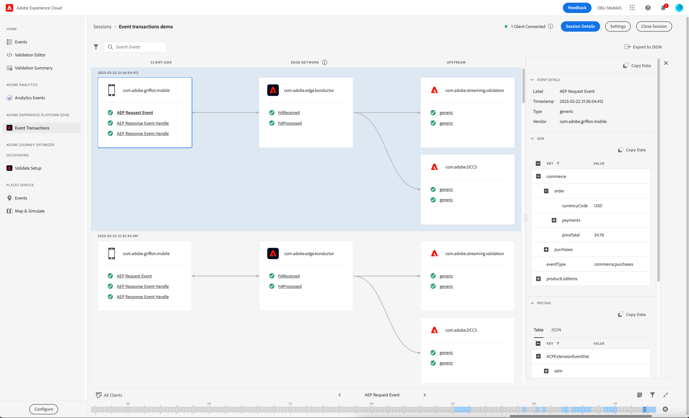
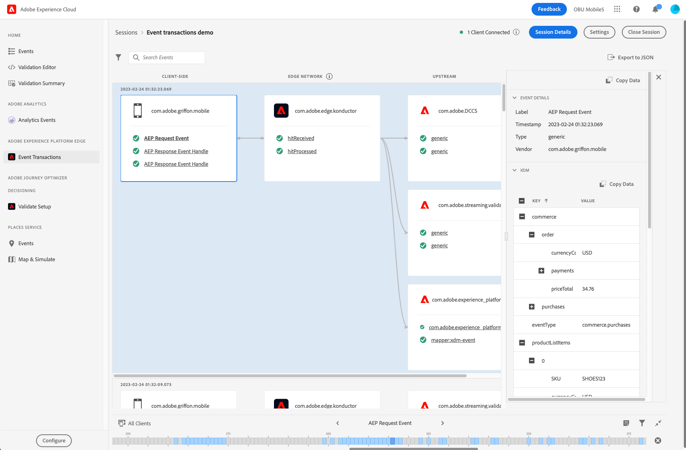

# Event Transactions view

The Event Transactions view in Adobe Experience Platform Assurance allows you to validate and debug your Edge Network client implementation, and see the upstream validation results in near real time.

## Set up Assurance for the Edge Network workflow

To get started, complete the following steps:

1. [Set up Assurance](../tutorials/implement-assurance.md).
2. Ensure that you have implemented the latest versions of the Assurance and Edge Network extensions in your app.
3. To view your events, from the left side menu select **Event Transactions** under the **Adobe Experience Platform Edge** section.
  If you do not see this option, select **Configure** in the bottom left of the window, add the **Event Transactions** view, and select **Save**.

## Get started using the Event Transactions view

In this section, get familiar with the Event Transaction view and learn how to use it efficiently for end to end validation on Edge Network workflows.

### Event processing flow

The Event Transactions view displays three columns in the order of the event processing flow:

- **Client-side**: This column displays the events processed or received client-side, accessible to the Mobile SDK. This includes the events that were created using an API call, such as `Edge.sendEvent`, and the response event handles received by the client from the Edge Network server, if any. Examples of client-side events:
  - AEP Request Event is the event sent through the Edge extension and contains the XDM and optional free-form data.
  - AEP Response Event Handle is the event handle received from Edge Network in response to an AEP Request Event. A request event may receive none, one, or multiple response event handles.
  - AEP Error Response may be seen in case of an error, for example if the XDM payload could not be processed or if one of the upstream services returned an error or warning.
- **Edge Network**: This column displays the event received server-side by the Edge Network through a network request and what data and metadata the event contained.
- **Upstream**: This column displays the events received by the configured upstream services, including detailed information about the processing and/or validation results for the incoming event.
Please note that this column is dynamic and may display different types of information depending on two main factors:
  - The datastream configuration and the services enabled on it.
  - The type of event sent to the Edge Network.

### Inspect events

The events displayed in the Event Transactions view provide information about the format and content of the data being processed at each state, as well as insightful details about any warnings or errors encountered when the data is processed upstream. The view helps narrowing down the debugging information at the event/request level and identifying errors early on in the development cycle.

#### Expand the event details

To inspect an event, select the desired one from the view. This action expands the **Event Details** view on the right side of the screen.
Nested data is displayed in a tree format. You can inspect nested key-values by selecting the **+** (plus) button to the left of the key name.

#### Inspect warnings or errors

Each event name is prefixed with an icon which indicates the high-level status of the processing for that event:

- If the event was processed successfully, a green check mark is displayed.
- If warnings or errors have been detected, a warning sign is displayed. Select the related event to learn more about the cause of the warning or error in the **Event Details** view.

### Configuration settings

You can check the currently used datastream identifier by selecting the info tooltip next to the **Edge Network** column header.

>[!INFO]
>
>When multiple clients connect to the same Assurance session and different datastream IDs are used, you will see all of them displayed here. However, this doesn't mean that your current implementation is using multiple datastreams. Only the current datastream ID set in the tag (mobile property) used by the app is used for processing new events from that client. When testing more complicated use-cases with different configuration settings and multiple clients connected, it may be helpful to use separate Assurance sessions to simplify the validation process.
