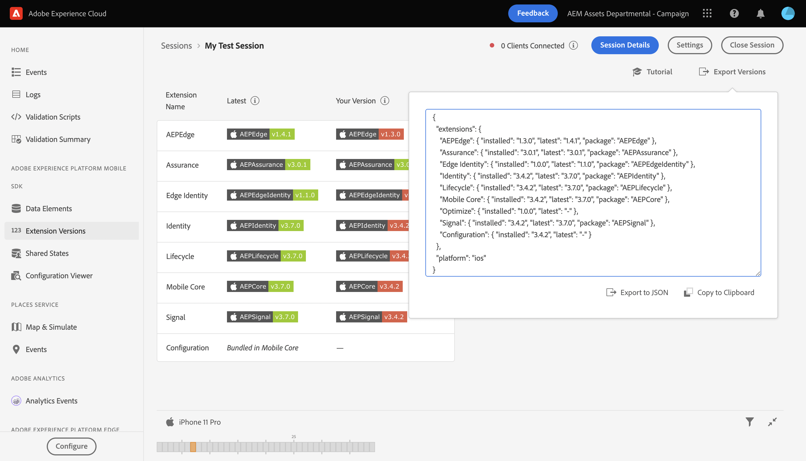

# Extension Versions view

The Extensions Version view allows you to quickly order and view which Adobe Experience Platform mobile extensions you have installed and if they are up to date in a client connected to an Assurance session.

## Get started with Extension Versions views

To use this view, complete the following steps:

1. [Set up Assurance](../tutorials/implement-assurance.md).
2. In the **Home** view, select **Extension Versions**

## Check if your version is up to date

Inside this view, a table displays both the latest version of each Mobile SDK, as well as the current version you have installed, if applicable. When a version is in sync with the latest version, the installed version will display a green badge. Otherwise, the badge will be displayed in red.

## Export versions

On the top right of the view, you can select **Export Versions** which gives you a JSON payload with all the extensions information, as well as the platform used by the client. You may choose to export this data to a JSON file, or copy it to your clipboard.

