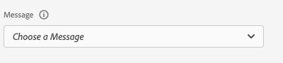
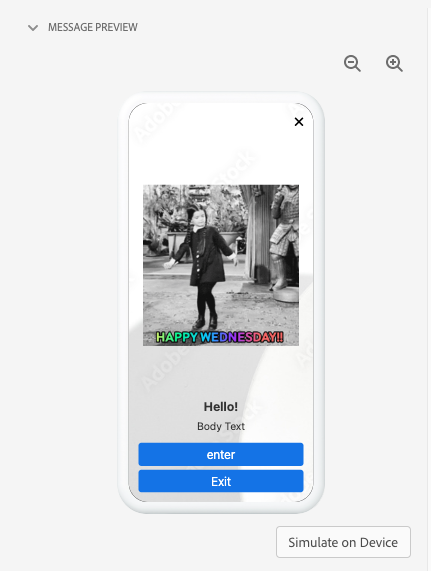
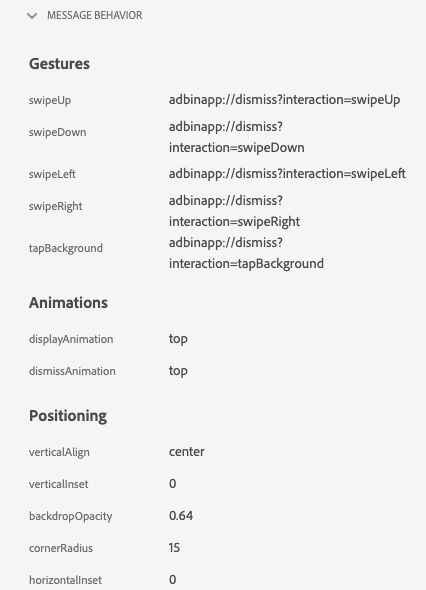
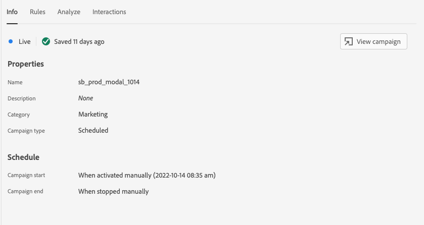
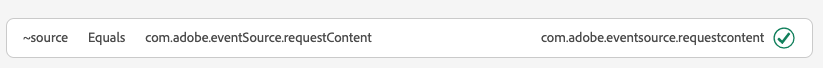
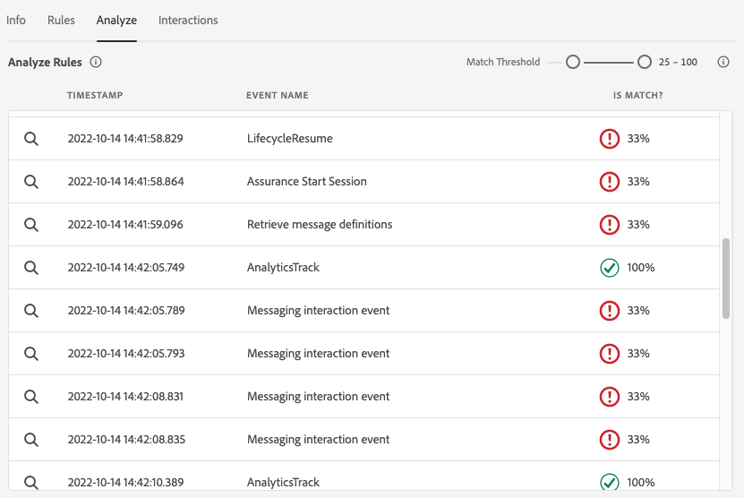
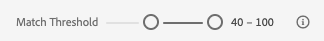
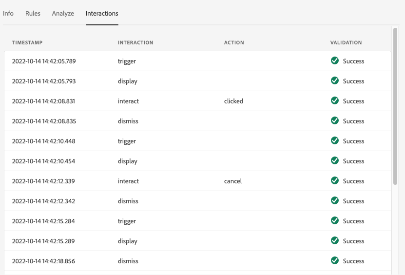
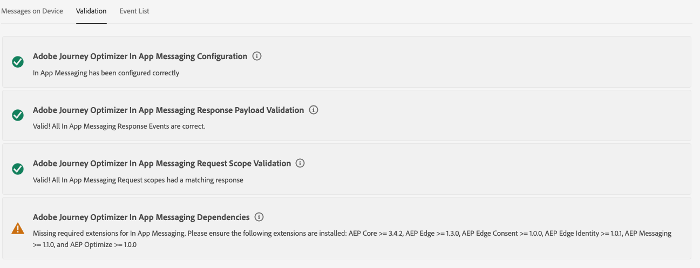
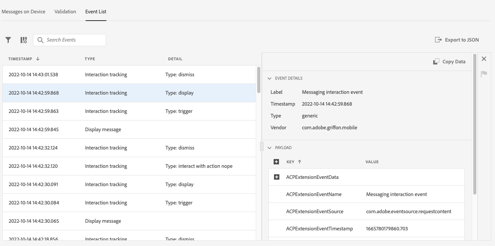

# In-App Messaging view in Assurance

The In-App Messaging view inside Adobe Experience Platform Assurance provides the ability to validate your app, monitor in-app messages that are delivered to your device, and simulate messages to your device.

## Messages on Device

At the top of the **[!UICONTROL Messages on Device]** tab is a **[!UICONTROL Message]** dropdown. This will include all the messages that have been received in the Assurance session. If a message is not in this list, it means the app never received it.



Selecting a message will show a lot of information about that message as described in the sections below.

### Message Preview

In the right panel is a **[!UICONTROL Message Preview]** pane, which shows a preview of the message. Selecting **[!UICONTROL Simulate on Device]** will send that message to any devices that are currently connected to the session.



### Message Behavior

Below the **[!UICONTROL Message Preview]** pane is the **[!UICONTROL Message Behavior]** tab. This has all the details around how the message is displayed. This information includes positioning information, animations, swipe gestures, and appearance settings.



### Info Tab

In the left section, there are four tabs that show details about the message. The **[!UICONTROL Info]** tab shows information loaded from Adobe Journey Optimizer (AJO) about the message campaign.

You can also select **[!UICONTROL View campaign]** to open the message in AJO for inspection or editing.



### Rules Tab

The **[!UICONTROL Rules]** tab shows what needs to happen for this message to be displayed. This gives insight into exactly what will trigger a message to be displayed. Looking at this example:


The example shows three different conditions for the rule. If you select an event (from an events list, the Analyze tab, or in the timeline), that event will be evaluated against these rules. If the event matches a condition, it will show a green checkmark:



If the event does not match, it will show a red icon:


If all three conditions match the current event, the message will be displayed.

### Analyze Tab

The **[!UICONTROL Analyze]** tab provides additional insights into the rules. Here, we filter every event in the session based on how close our message rule matches the event.



In the example in the **[!UICONTROL Rules Tab]** section, there are three conditions in the rule. This tab shows what percentage of the rule each event matches. The majority of events match at 33% (one of three conditions) and the rest match at 100%.

As a result, you can find events that are close to matching but not fully matching the rule.



The **[!UICONTROL Match Threshold]** slider lets you filter which events should be displayed. For example, this could be set to 50% - 90% to get a list of events that match exact two of the three conditions.

### Interactions Tab

The **[!UICONTROL Interactions]** tab shows a list of interaction events that were sent to the Edge for tracking purposes.



There are usually four interaction events whenever a message is displayed:

```
trigger > display > interact > dismiss
```

The "interact" interaction has an additional "action" value associated with it. Possible values include "clicked" or "cancel".

The validation column shows if the interaction event was properly recieved and processed by the Edge.

## Validation

The **[!UICONTROL Validation]** tab runs validations against your current session, checking to see if the app has been configured for In-App Messaging correctly:



If any errors were found, details on how to fix those errors will be provided.

## Event List



The **[!UICONTROL Event List]** tab provides a quick look at all the events in the Assurance session that are related to In-App Messaging. Some of the events you may see here are:

* Requests and responses to retrieve messages
* Display message events
* Interaction tracking events

In this view, you can use many of the standard event list features including applying searches, applying filters, adding or removing columns, and exporting data.

Select an event to view the raw details of the event in the right panel.

From the right details panel, the selected event can be flagged, which is helpful to mark something that should be reviewed by another person.
