# Live Activities view

The Live Activities view in Adobe Experience Platform Assurance helps you validate and debug iOS Live Activities during an Assurance session. Use it to verify that the device, profile, and Live Activities channel configuration are set up correctly, and to remotely start, update, and end Live Activities without interacting with the device.

Live Activities rely on a valid push notification setup. Before debugging Live Activities, use the [push debug view](./push-debug-view.md) to validate the device’s push configuration and troubleshoot any push-related issues.

For implementation guidance, see the [Adobe Journey Optimizer Live Activities implementation tutorial](https://developer.adobe.com/client-sdks/edge/adobe-journey-optimizer/live-activities/tutorial/), which describes how to register and manage Live Activities using the Adobe Journey Optimizer extension.

## Prerequisites

Before you use the Live Activities view, confirm the following:

| Requirement | Detail |
|---|---|
| Assurance session | An active Assurance session with a connected compatible iOS client. The app must include and initialize the Experience Platform Assurance extension. |
| iOS 16.1+ | Required to support Live Activities on the device. |
| iOS 17.2+ | Required to start a Live Activity remotely from Assurance through a push-to-start token. |
| Experience Platform Messaging SDK | Must be installed in your app and configured in the Data Collection UI. |
| Push-to-start token | Must be present in the user profile to enable remote start. |
| Channel configuration | Apple Push Notification service (APNs) credentials must be uploaded to the Live Activities channel (push) configuration in Adobe Journey Optimizer. |

## Key concepts

The following terms apply across the Live Activities view:

* **Unitary activity** - A Live Activity tied to a single device.
* **Broadcast activity** - A Live Activity identified by a Broadcast Channel ID that can reach multiple devices at once. Your backend or APNs assigns this ID. Reuse the same ID when you start the activity and when you send later updates to it.
* **Local start** - Starting a Live Activity from code running on the device.
* **Remote start** - Starting a Live Activity from Assurance instead of the device. Remote start becomes available once the client meets the iOS 17.2+ and setup requirements listed under Prerequisites.

## Clients

The **[!UICONTROL Client]** dropdown at the top of the view lists the unique clients connected to the current Assurance session. A client represents a unique device or app installation. For example, an iOS device and an Android device are treated as two separate clients.

If you reinstall the app on a device and reconnect it to the Assurance session, it appears as a new client.

The Live Activities view displays information for one client at a time. When you select a different client from the **[!UICONTROL Client]** dropdown, Assurance updates the **[!UICONTROL Client Info]**, **[!UICONTROL Messages on Device]**, and **[!UICONTROL Events]** tabs for that client.

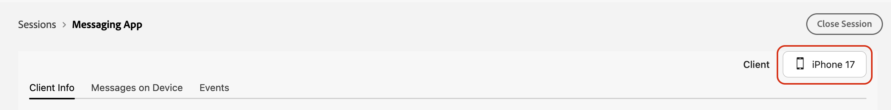

## Client Info tab

The **[!UICONTROL Client Info]** tab validates that the app is correctly set up for Live Activities and that push and profile data are in place. Use this tab to confirm the device, profile, and channel configuration before you start or update an activity.

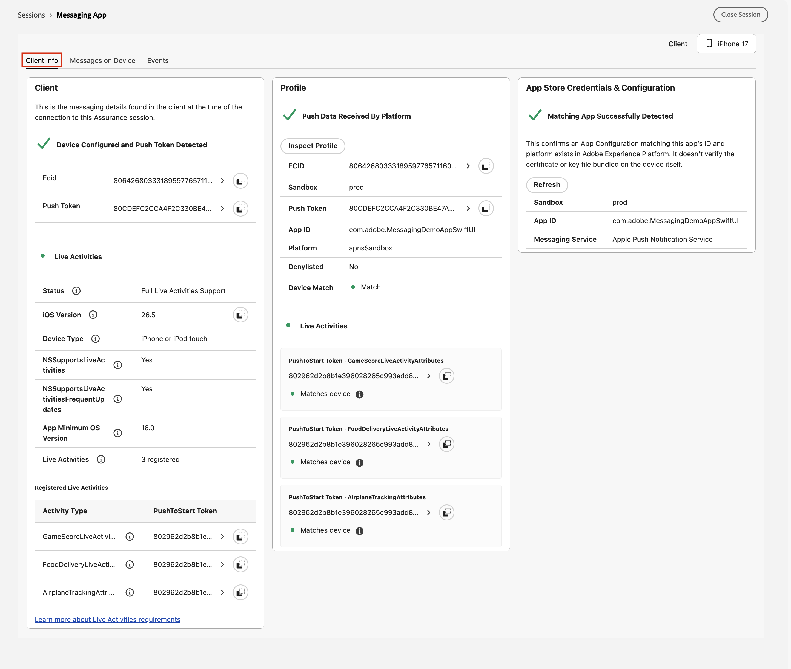

The tab organizes validation into three sections. Each section displays a green check mark when it is correctly configured. If a section fails validation, an alert explains how to fix it.

### Client

Use this section to verify that the selected client is configured for Live Activities. It shows whether the required extensions are configured in the Data Collection UI, the extension and its dependencies are initialized in the app, and the client is reporting the expected data.

When available, this section can display:

* **[!UICONTROL ECID]** - The Experience Cloud ID (ECID) associated with the device.
* **[!UICONTROL Push token]** - The device's push notification token.
* **[!UICONTROL iOS version]** - The device's iOS version.
* **[!UICONTROL Device type]** - For example, iPhone or iPad.
* **Live Activities support** - Whether the app reports support for Live Activities and for frequent updates.

If the selected client is not an iOS device or does not meet the minimum iOS version requirement, this section indicates that Live Activities are unsupported or only partially supported.

### Profile

Use this section to verify that the app has registered its push notification and Live Activity push-to-start data through the Experience Platform Messaging SDK, and that the data has been ingested into the user profile. Select **[!UICONTROL Inspect Profile]** to view the full profile.

>[!NOTE]
>
>The push-to-start token and Live Activity details, such as `liveActivityPushNotificationDetails`, are retrieved from the profile rather than directly from the device. If **[!UICONTROL Start Live Activity]** is unavailable or the tokens do not match, verify that the profile contains the expected push-to-start token.

When valid, this section displays:

* **[!UICONTROL ECID]** - The identity for the profile.
* **[!UICONTROL Sandbox]** - The sandbox associated with the profile.
* **[!UICONTROL Push Token]** - The push notification token stored in the profile.
* **[!UICONTROL App ID]** - The application ID associated with the profile.
* **[!UICONTROL Platform]** - For example, `apns` or `apnsSandbox`.
* **[!UICONTROL Denylisted]** - Indicates whether the push token is denylisted, for example, because the user disabled push notifications or uninstalled the app.
* **[!UICONTROL Device Match]** - Indicates whether the profile's push token matches the token reported by the device.
* **[!UICONTROL Live Activities]** - For each registered attribute type, the push-to-start token and whether it **[!UICONTROL Matches device]**.

### App Store credentials and configuration

Use this section to verify that the app ID and platform associated with the profile match a channel configuration that has valid push credentials, such as APNs.

When available, this section displays:

* **[!UICONTROL Sandbox]**
* **[!UICONTROL App ID]** - The application ID associated with the channel configuration.
* **[!UICONTROL Messaging Service]** - The messaging service configured for the app, such as Apple Push Notification service.

## Messages on Device tab

Use the **[!UICONTROL Messages on Device]** tab to view Live Activities for the selected client. Depending on the client's capabilities, you can start a Live Activity remotely or update and end an existing Live Activity.

### No activities state

If the selected client has no Live Activities, the tab displays an empty state with guidance based on the client's support level:

* **Non-iOS device** - Live Activities are supported only on iOS.
* **iOS earlier than 16.1** -  Live Activities require iOS 16.1 or later.
* **iOS 16.1 or later, remote start unavailable** - Start a Live Activity on the device to view it in Assurance.
* **iOS 17.2 or later, remote start available** - Start a Live Activity on the device or use **[!UICONTROL Start Live Activity]** to start one remotely.

When remote start is available, **[!UICONTROL Start Live Activity]** appears in the tab so you can start a Live Activity without using the device UI.

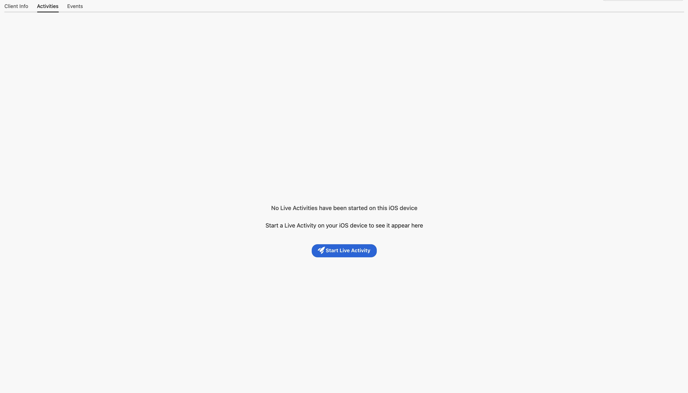

### Activity list and detail panels

When at least one Live Activity exists, the tab displays a list panel and a detail panel:

* **List panel** - Lists the Live Activities for the selected client. Each entry shows:

   * The activity's name (the **[!UICONTROL Live Activity ID]** or **[!UICONTROL Broadcast Channel ID]**), attribute set, and how long ago it was last updated.
   * The event count.
   * Badges for the message type (**[!UICONTROL Live Activity]**) and the activity type (**[!UICONTROL Unitary]** or **[!UICONTROL Broadcast]**).

   You can search the list by title or token. To narrow the list further, select the filter icon to open **[!UICONTROL Filter outbound]**, then filter by:

   * **[!UICONTROL Channel]** - **[!UICONTROL Live Activity]** or **[!UICONTROL Push]**.
   * **[!UICONTROL Type]** - **[!UICONTROL Unitary]** or **[!UICONTROL Broadcast]**.

   Select **[!UICONTROL Clear filters]** to reset.
* **Detail panel** - Displays information about the selected Live Activity in three tabs: **[!UICONTROL Overview]**, **[!UICONTROL Activity Flow]**, and **[!UICONTROL Event Details]**. If no Live Activity is selected, this panel prompts you to choose one from the list.

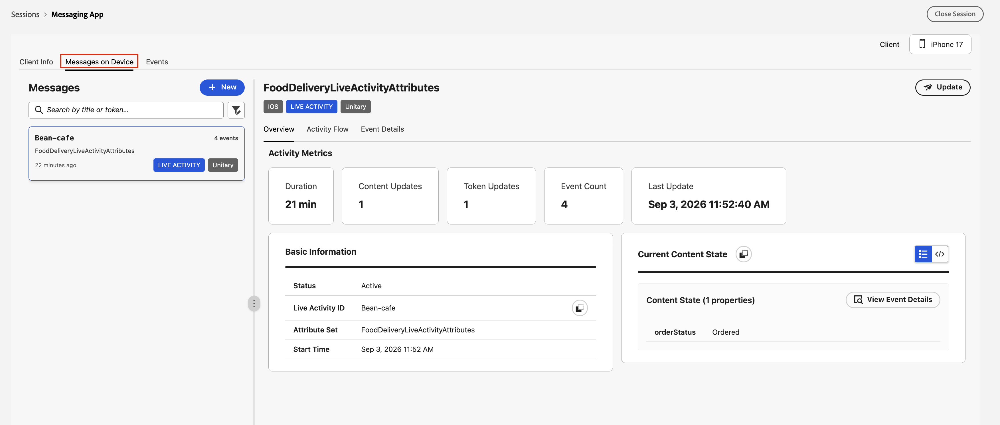

### Start a Live Activity

Use the **[!UICONTROL Start Live Activity]** dialog to start a new Live Activity remotely. To open it, select **[!UICONTROL Start Live Activity]** in the empty state, or **[!UICONTROL New]** in the **[!UICONTROL Messages]** panel header.

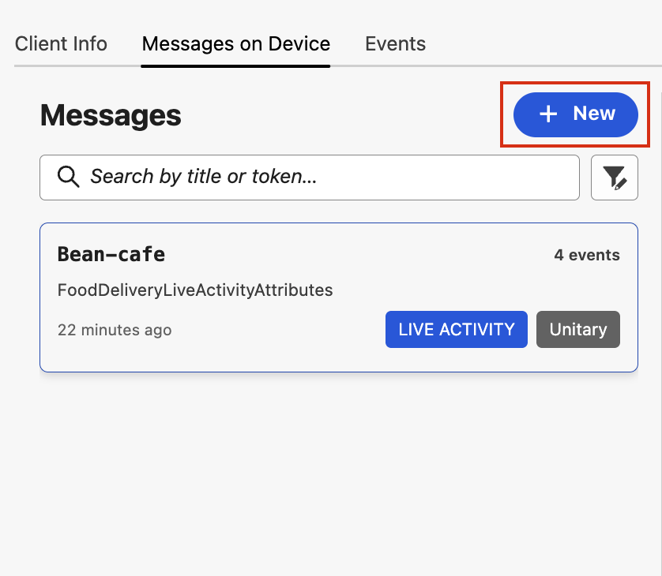

Selecting **[!UICONTROL New]** opens the **[!UICONTROL Start something new]** dialog, where you choose **[!UICONTROL Live Activity]** to continue to the **[!UICONTROL Start Live Activity]** dialog described below. Select **[!UICONTROL Push]** to send a standard test push notification to the device through the regular iOS push configuration. This option does not start or update a Live Activity.

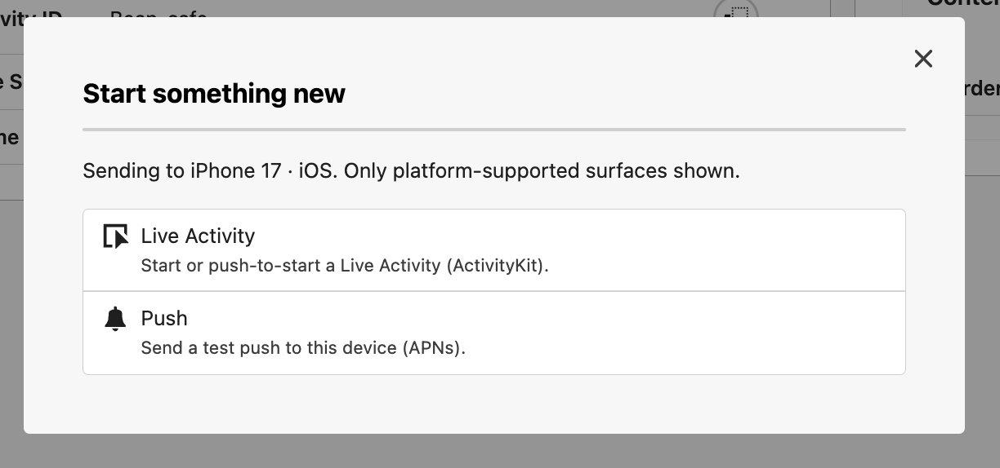

In the dialog, choose a registered Live Activity attribute type that has a push-to-start token from **[!UICONTROL Select Attribute Type]**, then select **[!UICONTROL View Schema]** to review the attribute schema. Next, choose an **[!UICONTROL Activity Type]** of **[!UICONTROL Unitary]** or **[!UICONTROL Broadcast]**. You can edit the payload content in the JSON editor, which Assurance prefills from the captured schema. The payload must be valid JSON and must match the activity's attribute schema, or Assurance rejects the request.

For a Unitary activity, the dialog shows the fields for a single target device.

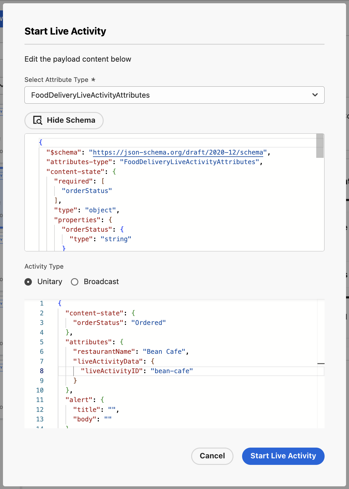

For **[!UICONTROL Broadcast]** activity, also enter a **[!UICONTROL Broadcast Channel ID]**.

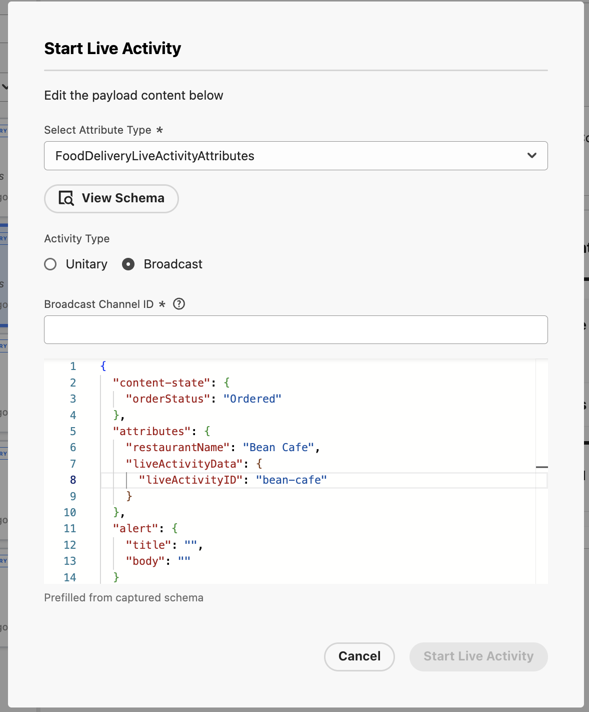

When the activity is configured, select **[!UICONTROL Start Live Activity]** to send the request. If the setup is invalid, for example, no push-to-start token exists for the selected attribute type, or a **[!UICONTROL Broadcast Channel ID]** is missing, Assurance disables **[!UICONTROL Start Live Activity]** in the dialog.

### Activity Overview

For the selected activity, the **[!UICONTROL Overview]** sub-tab shows the attribute set name and status (for example, Active or Completed) next to **[!UICONTROL Send Update]**, which opens the update or end dialog.

* **[!UICONTROL Activity Metrics]** - The duration, content update count, token update count, event count, and the time of the last update.
* **[!UICONTROL Basic Information]** - The **[!UICONTROL Live Activity ID]** or **[!UICONTROL Broadcast Channel ID]**, **[!UICONTROL Attribute Set]**, **[!UICONTROL Start Time]**, and **[!UICONTROL End Time]**.
* **[!UICONTROL Current Content State]** - The properties of the latest content state, and when Assurance last updated it. Select **[!UICONTROL View Event Details]** to see the event that produced this state.

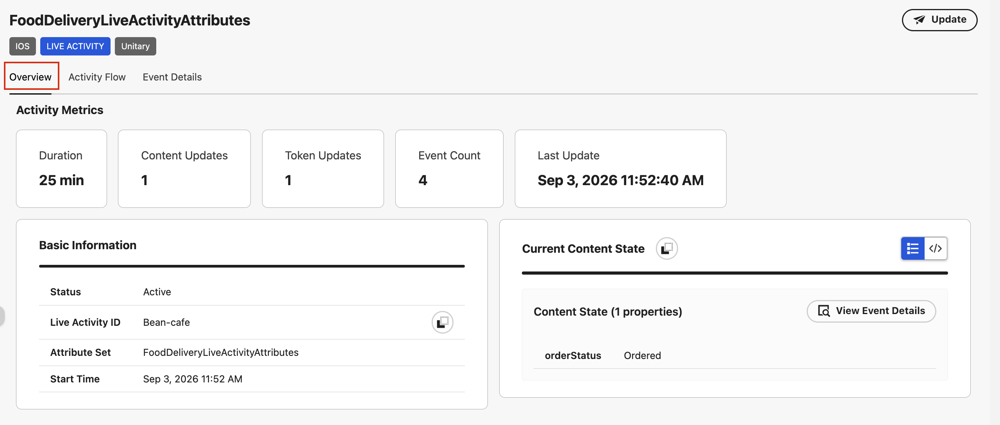

### Send an update or end a Live Activity

1. From the **[!UICONTROL Overview]** sub-tab, select **[!UICONTROL Send Update]**. The **[!UICONTROL Update Live Activity]** dialog opens for the selected activity.

2. Under **[!UICONTROL Event Type]**, select one of the following options:

   * **[!UICONTROL Update]**: Send new content to the activity.
   * **[!UICONTROL End]**: End the activity.

3. Review the **[!UICONTROL Activity Type]** field. It indicates whether the activity is:

   * **[!UICONTROL Unitary]**
   * **[!UICONTROL Broadcast]**

    The activity type is set when the activity starts and cannot be changed in this dialog.

4. Use the appropriate update token:

   * For **[!UICONTROL Unitary]** activities, Assurance uses the activity's update token.
   * For **[!UICONTROL Broadcast]** activities, Assurance does not use a token.

5. Edit the payload in the JSON editor. Assurance prepopulates the editor with the activity's current content state and attributes.

    The payload must:

   * Be valid JSON.
   * Match the activity's attribute schema.

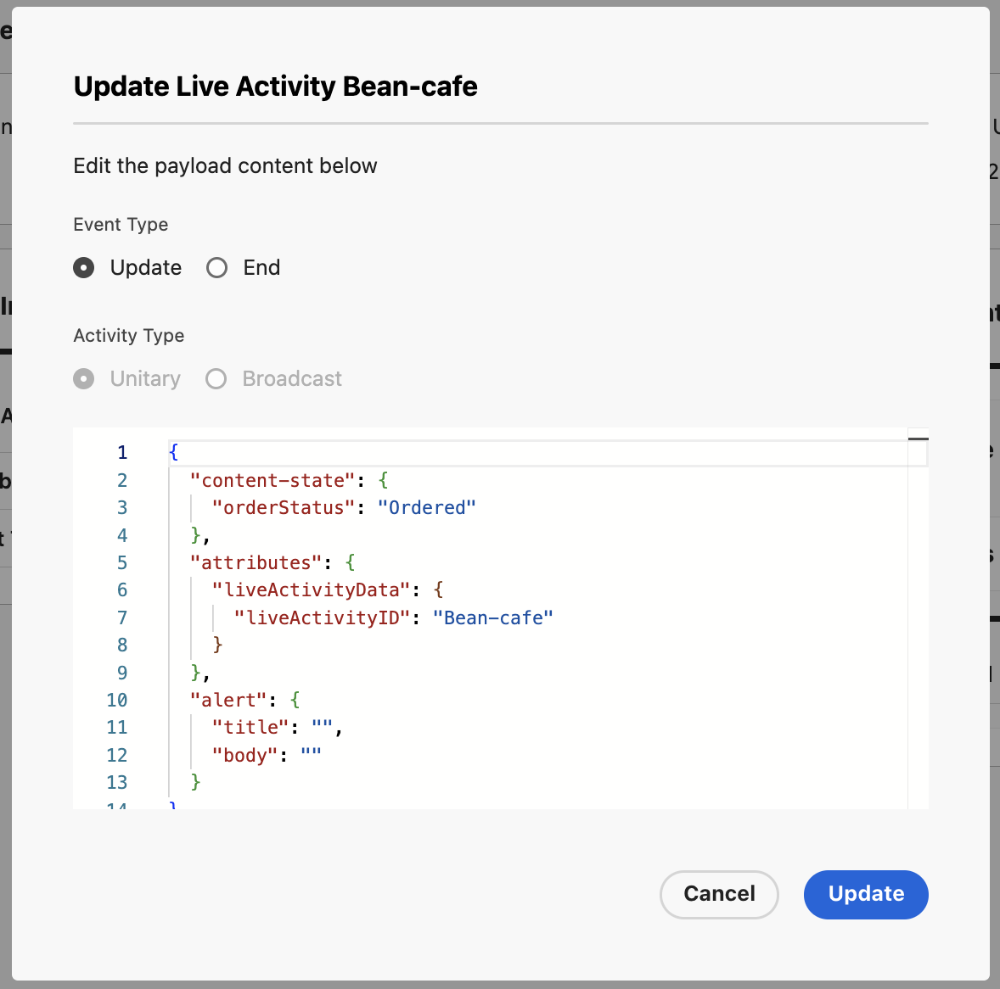

Select **[!UICONTROL Update]** to send the request. Assurance shows the success or failure of the request. If the request fails, see the [Live Activity issues](#live-activity-issues) troubleshooting guide.

### Activity Flow

The **[!UICONTROL Activity Flow]** sub-tab shows the lifecycle of the selected activity as a timeline or as cards. Events include:

* **Start** - The Live Activity started, either locally or through remote start.
* **Content update** - The activity content changed.
* **Token update** - The update token refreshed.
* **Ended** - The activity ended.
* **Dismissed** - The user dismissed the activity from the device.

Each entry shows the event type, timestamp, and, optionally, a short description or payload summary. You can switch between timeline and card layout when both are available.

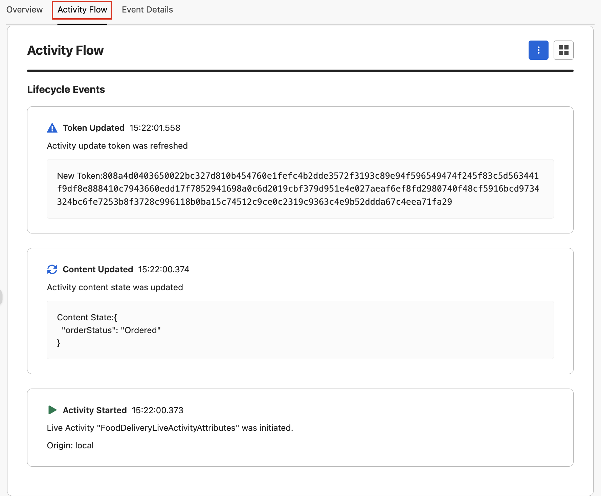

### Event Details

The **[!UICONTROL Event Details]** sub-tab lists captured Assurance events associated with the selected Live Activity. The table includes **[!UICONTROL Timestamp]**, **[!UICONTROL Vendor]**, **[!UICONTROL Event Name]**, and **[!UICONTROL Type]** columns. You can search the events, or filter them by **[!UICONTROL All Events]**, **[!UICONTROL Start Events]**, **[!UICONTROL Content Updates]**, **[!UICONTROL Token Updates]**, **[!UICONTROL Token Updates to Edge]**, **[!UICONTROL End Events]**, or **[!UICONTROL Dismissed Events]**.

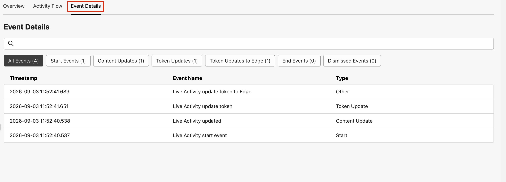

Select an event to open its details in a side panel. The panel displays information such as the timestamp, event name, event type, vendor, client ID, and UUID, along with the event payload. Select **[!UICONTROL Copy Payload]** to copy the payload for troubleshooting or further analysis.

For events generated by the **[!UICONTROL Start Live Activity]** and **[!UICONTROL Send Update]** actions, Assurance sends the payload you provide directly to the service. As a result, the payload displayed in the event details reflects the payload received by the service.

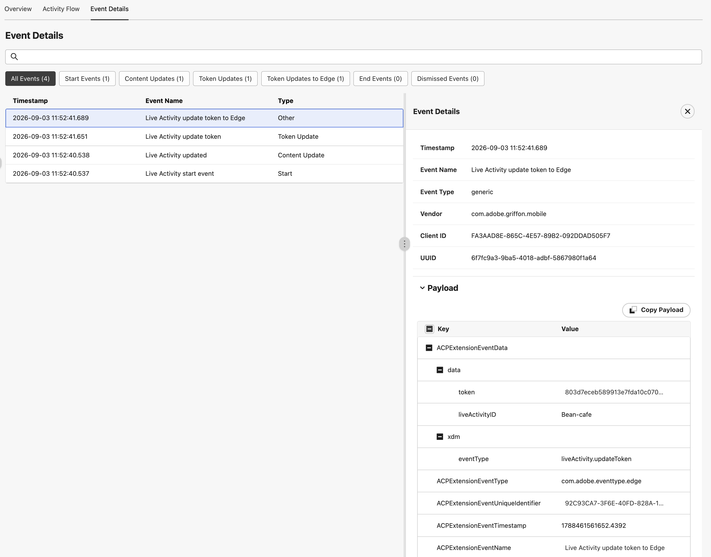

## Events tab

The **[!UICONTROL Events]** tab shows the stream of Assurance events for the selected client, with **[!UICONTROL Timestamp]**, **[!UICONTROL Vendor]**, **[!UICONTROL Event Name]**, **[!UICONTROL Validation]**, and **[!UICONTROL Flagged]** columns. The table includes events from all extensions installed on the client, not only Live Activities events. Use the **[!UICONTROL Event Name]** column or inspect an event payload to identify Live Activities-specific events, such as **Live Activity start**, **Live Activity updated**, and **Live Activity dismissed** events.

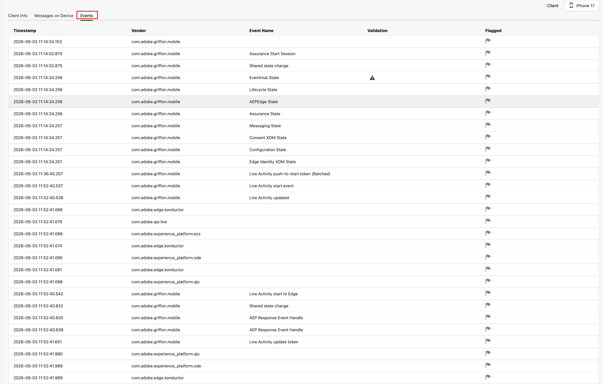

## Troubleshooting

Use the following tables when a validation fails or an action does not behave as expected. For issues specific to the Live Activities channel in Adobe Journey Optimizer, see the [troubleshoot the mobile Live Activity channel](https://experienceleague.adobe.com/en/docs/journey-optimizer/using/channels/live-activity/troubleshoot-mobile-live) guide.

### Client validation errors

| Error | Resolution |
|---|---|
| No ECID detected | Initialize the Experience Platform SDK and Assurance, and confirm that ECID events appear in the session. |
| Messaging extension not initialized | Add the Experience Platform Messaging SDK, register the extension for your platform, and verify it in your Launch environment. |
| Push token not captured | Request notification permission, then call `MobileCore.setPushIdentifier` with the APNs or FCM token. |
| Edge not configured | Install the Edge Network extension, publish a datastream, and don't override `edge.configId` in the app. |
| Messaging not configured | Set `messaging.eventDataset` using the [!DNL Messaging] extension shared state, and don't override `messaging.*` in code. |
| Device configured and push token detected | No action needed. Continue to push credentials and datastream validation. |

### App Store credentials validation errors

| Error | Resolution |
|---|---|
| App configuration error | Retry the fetch, and check network connectivity and org provisioning for the Push Services API. |
| Property not found | Verify the Launch property and IMS org, and confirm the user can load the property in Tags. |
| No app configurations | In the Data Collection UI, create a Push app configuration for the bundle ID or package. |
| No matching app detected | Align the app ID and messaging service (`apns` or `fcm`) with the client detected in the session. |
| Loading... | Wait for the property and push-credentials queries to finish, and use **[!UICONTROL Refresh]** if shown. |
| Client must be configured correctly | Fix the client validation errors (ECID, token, Edge, messaging) before matching push apps. |
| Matching app successfully detected | No action needed. |

For example, a **[!UICONTROL Property not found]** error looks like this:

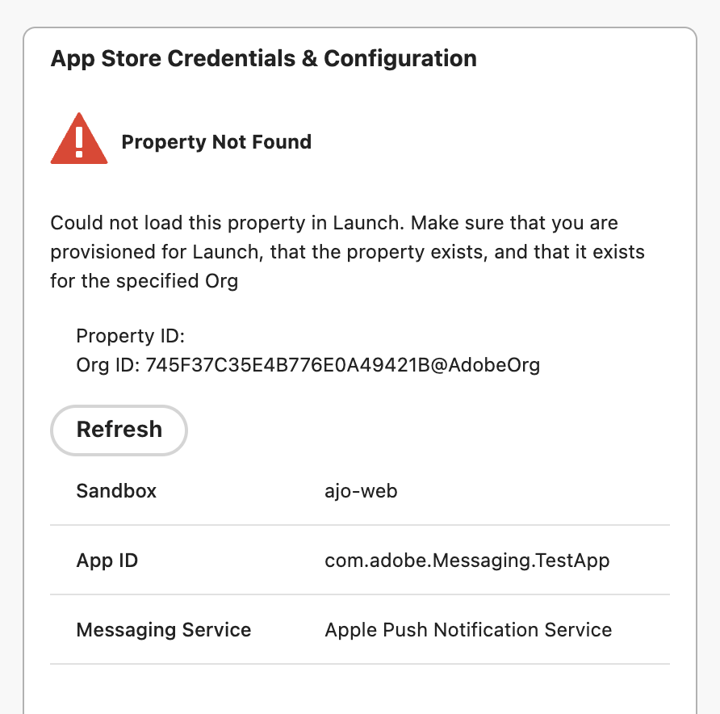

### Datastream and profile validation errors

| Error | Resolution |
|---|---|
| Client must be configured correctly | Confirm that the ECID and push token appear in the messaging shared state, as in client validation. |
| Couldn't detect sandbox | Confirm that the Assurance session has sandbox context for Platform API calls. |
| Messaging not configured | Set `messaging.eventDataset` in the client configuration. See **Messaging not configured** under client validation. |
| Loading... | Wait for the Platform and Edge queries to finish. |
| Invalid Edge configuration | Fix `edge.configId` or the datastream in the Edge extension, and republish. Don't hard-code an override in the app. |
| Missing profile dataset | In Adobe Journey Optimizer or the Data Collection UI, assign a Profile dataset to the Edge configuration. |
| Missing message tracking dataset | Ensure `messaging.eventDataset` points to an existing catalog dataset. |
| Invalid message tracking dataset | Extend the tracking dataset schema with the required Experience Event and Customer Journey Management mixins. Use **[!UICONTROL View Tracking Schema]** in the UI. |
| Credentials not found | Check for a profile matching the ECID in Adobe Journey Optimizer or Platform Profile. Ingest identity and events if missing. |
| Permissions error | Grant the IMS user access to the sandbox and datasets used by the datastream. |
| Invalid dataset | Fix or re-point the profile dataset in the Edge configuration, and verify the dataset ID in the catalog. |
| Invalid dataset schema | Add `identityMap` and `pushNotificationDetails` mixins to the profile XDM schema. |
| Push token mismatch | Refresh the push registration on the device, and confirm that the profile's `pushNotificationDetails` token matches the device token. |
| Push credentials on deny list | Remove the token from the deny list, or obtain a new token after the user re-enables push. |
| Push data received by Platform | No action needed. Optionally inspect the profile in Platform to verify. |

For example, an **[!UICONTROL Invalid Edge configuration]** error looks like this:

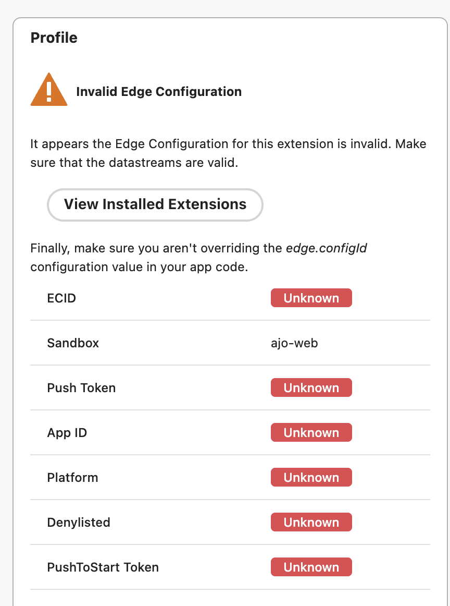

### Live Activity issues

| Error | Resolution |
|---|---|
| No activities in the list | Start a Live Activity on the device first, or use **[!UICONTROL Start Live Activity]** from Assurance if the client is on iOS 17.2+ and setup is valid. |
| Start Live Activity is greyed out or missing | Requires iOS 17.2+. The push-to-start token must be in the profile, and the channel configuration must be in place. Confirm that **[!UICONTROL Client Info]** shows all green check marks. |
| Update or end fails | Check that the payload is valid JSON and matches the activity's attribute schema. Also check the **[!UICONTROL Client Info]** tab for token, profile, and channel issues. |

## Next steps

If you're also debugging push notifications, see the [push debug view](./push-debug-view.md).
