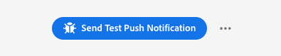
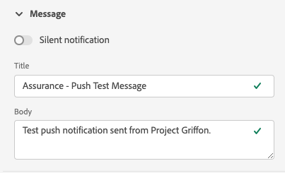
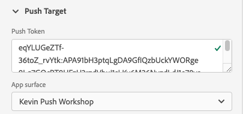
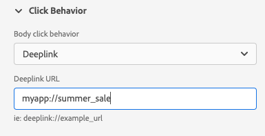
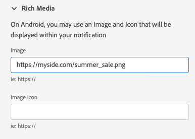
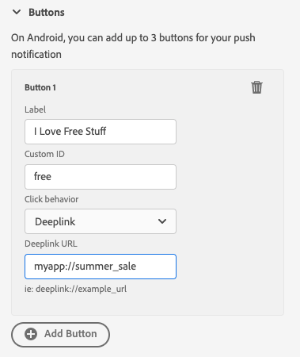
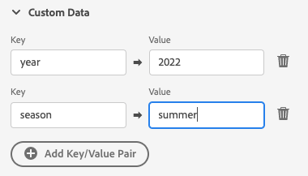
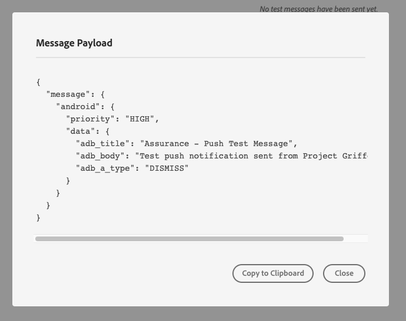

# Push Debug view

The Push Debug View inside Adobe Experience Platform Assurance provides the ability to validate the Push setup for your app and send a test message to your device.

## Clients

The client dropdown has a list of each unique client that has connected to this Assurance session. A client is either a unique device or a unique app install for a device. For example, if an Android device and an iOS device have been connected to the session, those clients would appear in the Clients dropdown.

After reinstalling and reconnecting the app on a device, another client will appear. If a device with that name already existed, the new dropdown will append a #2 to the name.

This view is only enabled for a single client, so selecting a different client will change the details on the screen.

## Validate setup

The "Validate Setup" tab will validate and provide additional details about the app's push setup. There are three panels that perform validations. They will display a green check mark if the validations all succeed. If there are three green check marks, the app has been correctly configured for push messaging, is writing push tokens to the user profile, and has an associated app surface configured.

If something is not working as expected, there will be an alert with details on how to fix that problem:

### Client details

This panel checks to see if the device is configured correctly. This includes configuring the extension in the Data Collection UI, initializing the extension and its prerequisites in your application, and capturing the push token from the device.

If valid, the panel will display the ECID for the device, the push token, and the Edge Sandbox name and type.

### Profile details

Once your client is set up correctly, this panel will check to see if the device is writing to profile. It also validates that the push token in the profile matches the one on the device.

If valid, the panel will show the ECID for the device, the push token, the app ID of your application, the messaging platform, and whether the push token has been deny listed. The token can be deny listed for various reasons like the user has uninstalled the app or the user has disabled push messaging for the app.

Finally, at the bottom of the panel is a link that will open this specific profile in a new tab.

### AppStore credentials and configuration

This panel validates that the app ID and the messaging platform that was saved in the profile has a matching app surface created. An app surface is where push credentials for the application are uploaded.

If valid, the profile will display the name of the app surface, the app ID, and the name of the messaging service.

Finally, at the bottom of the panel is a link that will open this specific app surface in a new tab.

## Send test push

The "Send Test Push" tab can be used to send a test message to your device.

There are several panes that can be configured to test different iOS and Android push features. Once configured, select **Send Test Push Notification** to send your message.

### Message

In the **Message** pane, you can provide a title and body for the message. The silent notification feature can be enabled here as well.

### Push target

The **Push Target** pane allows you to customize which push token and app surface to use when sending the push message.

This information is provided by default if the **Validate Setup** tab is showing three green checkmarks. However, you can provide provide your own push token and app surface, even if your app isn't fully configured.

### Click behavior

From the **Click Behavior** pane, you can choose what the behavior should be when the push notification is clicked on the device. By default, it will open the app, but it can open a deeplink or a webpage.

If you choose to use a deeplink, the app developer must create one for you.

### Rich media

The **Rich Media** pane allows you to add extra media to your message like an image, video, or GIF. The app developer must add code to the app to enable this feature.

### Buttons

The **Buttons** pane allows you to add extra buttons to the push notification. Each button can open the app, open a deeplink into the app, or open a webpage.

The app developer must add code to the app to enable this feature.

### Custom data

The **Custom Data** pane allows you to add custom data to the push notification. Each key/value pair is sent as metadata along with the message and can be used by developers to create powerful experiences and add additional tracking.

## Test results

Once you have sent a message, the **Test Results** section receives data from the push services for the message. Here you can see if the message made it out to the Google/iOS messaging services:

If any issues occurred, they are displayed here:

## Advanced

### View message payload

Next to the **Send Test Push Notification** button is a set of ellipsis with a popup menu. From here, you are able to view the message payload. This lets you see the exact message that will be send to the remote messaging service. You can review this payload or even copy and paste it into a desktop push testing tool.

