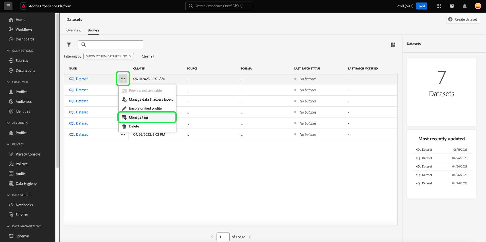
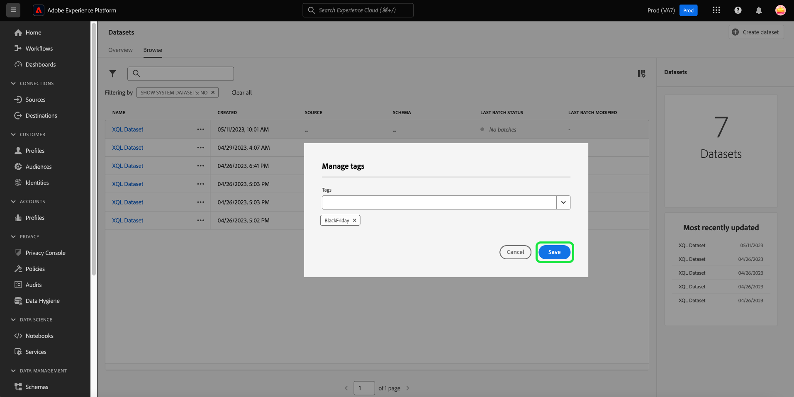
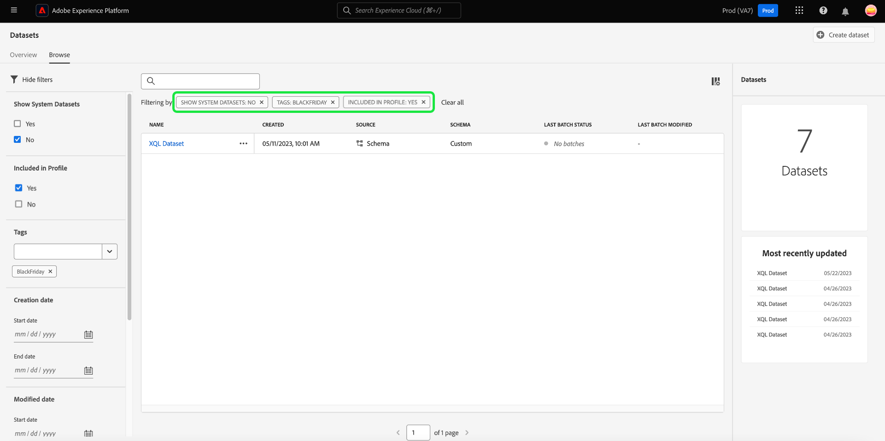
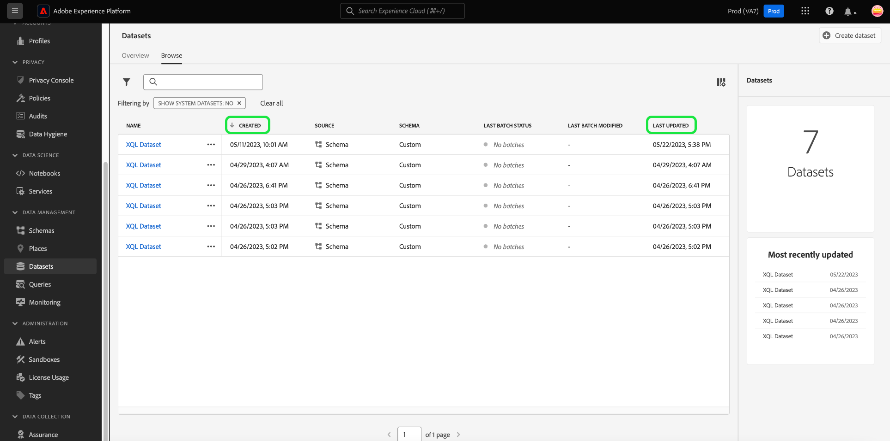
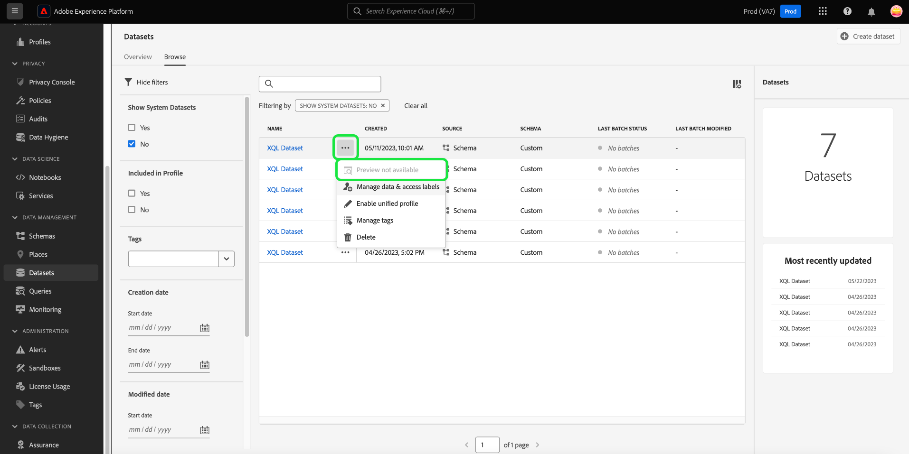
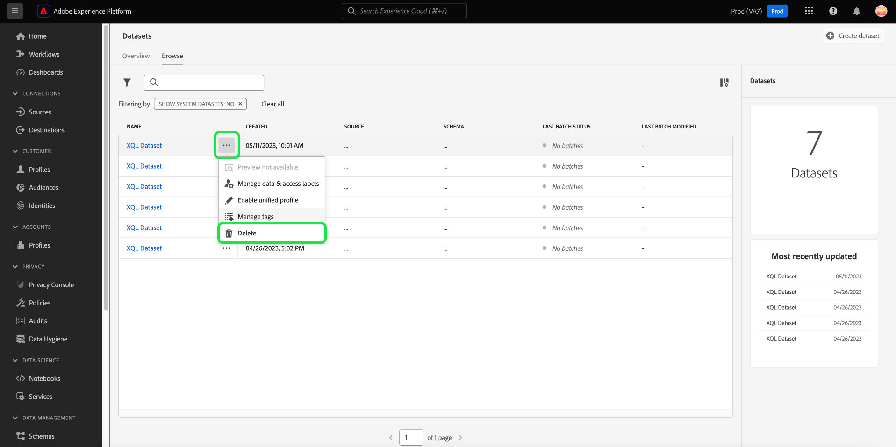

# Datasets UI guide

This user guide provides instructions on performing common actions when working with datasets within Adobe Experience Platform user interface.

## Getting started

This user guide requires a working understanding of the following components of Adobe Experience Platform:

*   [Datasets](overview.md): The storage and management construct for data persistence in [!DNL Experience Platform].
*   [[!DNL Experience Data Model (XDM) System]](../../xdm/home.md): The standardized framework by which [!DNL Experience Platform] organizes customer experience data.
    *   [Basics of schema composition](../../xdm/schema/composition.md): Learn about the basic building blocks of XDM schemas, including key principles and best practices in schema composition.
    *   [Schema Editor](../../xdm/tutorials/create-schema-ui.md): Learn how to build your own custom XDM schemas using the [!DNL Schema Editor] within the [!DNL Platform] user interface.
*   [[!DNL Real-Time Customer Profile]](../../profile/home.md): Provides a unified, real-time consumer profile based on aggregated data from multiple sources.
*   [[!DNL Adobe Experience Platform Data Governance]](../../data-governance/home.md): Ensure compliancy with regulations, restrictions, and policies regarding the usage of customer data.

## View datasets {#view-datasets}

>[!CONTEXTUALHELP]
>id="platform_datasets_negative_numbers"
>title="Negative numbers in dataset activity"
>abstract="Negative numbers in ingested records means that a user has deleted certain batches in a selected time range."
>text="Learn more in documentation"

In the [!DNL Experience Platform] UI, select **[!UICONTROL Datasets]** in the left-navigation to open the **[!UICONTROL Datasets]** dashboard. The dashboard lists all available datasets for your organization. Details are displayed for each listed dataset, including its name, the schema the dataset adheres to, and status of the most recent ingestion run.

Select the name of a dataset from the [!UICONTROL Browse] tab to access its **[!UICONTROL Dataset activity]** screen and see details of the dataset you selected. The activity tab includes a graph visualizing the rate of messages being consumed as well as a list of successful and failed batches.

## Inline dataset actions {#inline-actions}

The datasets UI now offers a collections of inline actions for each available dataset. Select the ellipsis of a dataset that you want to manage to see the available options in a pop-up menu. The available actions include; [[!UICONTROL Preview dataset]](#preview), [[!UICONTROL Manage data and access labels]](#manage-and-enforce-data-governance), [[!UICONTROL Enable unified profile]](#enable-profile), [[!UICONTROL Manage tags]](#add-tags), and [[!UICONTROL Delete]](#delete). More information on these available actions can be found in their respective sections.

### Add dataset tags {#add-tags}

Add custom created tags to organize datasets and improve search, filtering, and sorting capabilities. From the [!UICONTROL Browse] tab of the [!UICONTROL Datasets] workspace, select the ellipsis of a dataset that you want to manage followed by **[!UICONTROL Manage tags]** from the dropdown menu.

The [!UICONTROL Manage tags] dialog appears. Enter a short description to create a custom tag, or choose from a pre-existing tag to label your dataset. Select **[!UICONTROL Save]** to confirm your settings.

The [!UICONTROL Manage tags] dialog can also remove existing tags from a dataset. Simply select the 'x' next to the tag you wish to remove and select **[!UICONTROL Save]**.

Once a tag has been aded to a dataset, the datasets can be filtered based on the corresponding tag. See the section on how to [filter datasets by tags](#enable-profile) for more information.

## Search and filter datasets {#search-and-filter}

To search or filter the list of available datasets, select the filter icon () at the top left of the workspace. A set of filter options in the left rail appears. There are several methods to filter your available datasets. These include: [[!UICONTROL Show System Datasets]](#show-system-datasets), [[!UICONTROL Included in profile]](#filter-profile-enabled-datasets), [[!UICONTROL Tags]](#filter-by-tag), [[!UICONTROL Creation date]](#filter-by-creation-date), [[!UICONTROL Modified date], [!UICONTROL Created by]](#filter-by-creation-date), and [[!UICONTROL Schema]](#filter-by-schema).

The list of applied filters is displayed above the filtered results.

### Show system datasets {#show-system-datasets}

By default, only datasets that you have ingested data into are shown. If you want to see the system-generated datasets, select the **[!UICONTROL Yes]** checkbox in the [!UICONTROL Show system datasets] section. System-generated datasets are only used to process other components. For example, the system-generated profile export dataset is used to process the profile dashboard.

![The filter options of the Datasets workspace with the [!UICONTROL Show system datasets] section highlighted.](../images/datasets/user-guide/show-system-datasets.png)

### Filter Profile enabled datasets {#filter-profile-enabled-datasets}

The datasets that have been enabled for Profile data are used to populate customer profiles after data has been ingested. See the section  on [enabling datasets for Profile](#enable-profile) to learn more. 

To filter your dataset based on whether they have been enabled for Profile, select the [!UICONTROL Yes] check box from the filter options.

![The filter options of the Datasets workspace with the [!UICONTROL Included in Profile] section highlighted.](../images/datasets/user-guide/included-in-profile.png)

### Filter datasets by tag {#filter-by-tag}

Enter your custom tag name in the [!UICONTROL Tags] input, then select your tag from the list of available options to search and filter datasets that correspond to that tag.

![The filter options of the Datasets workspace with the [!UICONTROL Tags] input and filter icon highlighted.](../images/datasets/user-guide/filter-tags.png) 

### Filter datasets by creation date {#filter-by-creation-date}

Datasets can be filtered by creation date over a custom time period. This can be used to exclude historic data or to generate specific chronological data insights and reporting. Choose a [!UICONTROL Start date] and an [!UICONTROL End date] by selecting the calendar icon for each field. After which, only datasets that conform to that criteria will appear in the Browse tab.

### Filter datasets by modified date {#filter-by-modified-date}

Similar to the filter for creation date, you can filter your datasets based on the date they were last modified. In the [!UICONTROL Modified date] section, Choose a [!UICONTROL Start date] and an [!UICONTROL End date] by selecting the calendar icon for each field. After which, only datasets that were modified during that period will appear in the Browse tab.

### Filter by schema {#filter-by-schema}

You can filter datasets based on the schema that defines their structure. Either select the dropdown icon or input the schema name into the text field. A list of potential matches appears. Select the appropriate schema from the list.  

## Sort datasets by created date {#sort}

Datasets in the [!UICONTROL Browse] tab can be sorted by either ascending or descending dates. Select the [!UICONTROL Created] or [!UICONTROL Last updated] column headings to alternate between ascending and descending. Once selected, the column indicates this with either an up or down arrow to the side of the column header.

## Preview a dataset {#preview}

You can preview dataset sample data from both the inline options of the [!UICONTROL Browse] tab and also the [!UICONTROL Dataset activity] view. From the [!UICONTROL Browse] tab, select the ellipses next to the dataset name you wish to preview. A menu list of options appears. Next, select **[!UICONTROL Preview dataset]** from the list of available options. If the dataset is empty, the preview link will be deactivated and will instead say that the preview is not available.

This opens the preview window, where the hierarchical view of the schema for the dataset is shown on the right.

Alternatively, from the **[!UICONTROL Dataset activity]** screen, select **[!UICONTROL Preview dataset]** near the top-right corner of your screen to preview up to 100 rows of data. 

For more robust methods to access your data, [!DNL Experience Platform] provides downstream services such as [!DNL Query Service] and [!DNL JupyterLab] to explore and analyze data. See the following documents for more information:

*   [Query Service overview](../../query-service/home.md)
*   [JupyterLab user guide](../../data-science-workspace/jupyterlab/overview.md)

## Create a dataset {#create}

To create a new dataset, start by selecting **[!UICONTROL Create dataset]** in the **[!UICONTROL Datasets]** dashboard.

In the next screen, you are presented with the following two options for creating a new dataset:

*   [Create dataset from schema](#schema)
*   [Create dataset from CSV file](#csv)

### Create a dataset with an existing schema {#schema}

In the **[!UICONTROL Create dataset]** screen, select **[!UICONTROL Create dataset from schema]** to create a new empty dataset.

The **[!UICONTROL Select schema]** step appears. Browse the schema listing and select the schema that the dataset will adhere to before selecting **[!UICONTROL Next]**.

The **[!UICONTROL Configure dataset]** step appears. Provide the dataset with a name and optional description, then select **[!UICONTROL Finish]** to create the dataset.

Datasets can be filtered from the list of available datasets in the UI with the schema filter. See the section on how to [filter datasets by schema](#filter-by-schema) for more information.

### Create a dataset with a CSV file {#csv}

When a dataset is created using a CSV file, an ad hoc schema is created to provide the dataset with a structure that matches the provided CSV file. In the **[!UICONTROL Create dataset]** screen, select **[!UICONTROL Create dataset from CSV file]**.

The **[!UICONTROL Configure]** step appears. Provide the dataset with a name and optional description, then select **[!UICONTROL Next]**.

The **[!UICONTROL Add data]** step appears. Upload the CSV file by either dragging and dropping it onto the center of your screen, or select **[!UICONTROL Browse]** to explore your file directory. The file can be up to ten gigabytes in size. Once the CSV file is uploaded, select **[!UICONTROL Save]** to create the dataset.

>[!NOTE]
>
>CSV column names must start with alphanumeric characters, and can contain only letters, numbers, and underscores.

## Enable a dataset for Real-Time Customer Profile {#enable-profile}

Every dataset has the ability to enrich customer profiles with its ingested data. To do so, the schema that the dataset adheres to must be compatible for use in [!DNL Real-Time Customer Profile]. A compatible schema satisfies the following requirements:

*   The schema has at least one attribute specified as an identity property.
*   The schema has an identity property defined as the primary identity.

For more information on enabling a schema for [!DNL Profile], see the [Schema Editor user guide](../../xdm/tutorials/create-schema-ui.md).

You can enable a dataset for Profile from both the inline options of the [!UICONTROL Browse] tab and also the [!UICONTROL Dataset activity] view. From the [!UICONTROL Browse] tab of the [!UICONTROL Datasets] workspace, select the ellipsis of a dataset that you want to enable for Profile. A menu list of options appears. Next, select **[!UICONTROL Enable unified profile]** from the list of available options.

Alternatively, from the dataset's **[!UICONTROL Dataset activity]** screen, select the **[!UICONTROL Profile]** toggle within the **[!UICONTROL Properties]** column. Once enabled, data that is ingested into the dataset will also be used to populate customer profiles.

>[!NOTE]
>
>If a dataset already contains data and is then enabled for [!DNL Profile], the existing data is not automatically consumed by [!DNL Profile]. After a dataset is enabled for [!DNL Profile], it is recommended that you re-ingest any existing data to have it contribute to customer profiles.

Datasets that have been enabled for Profile can also be filtered on this criteria. See the section on how to [filter Profile enabled datasets](#filter-profile-enabled-datasets) for more information.

## Manage and enforce data governance on a dataset {#manage-and-enforce-data-governance}

You can manage the data governance labels for a dataset by selecting the inline options of the [!UICONTROL Browse] tab. Select the ellipses next to the dataset name you wish to manage, followed by **[!UICONTROL Manage data and access labels]** from the dropdown menu.

Data usage labels allow you to categorize datasets and fields according to usage policies that apply to that data. See the [Data Governance overview](../../data-governance/home.md) to learn more about labels, or refer to the [data usage labels user guide](../../data-governance/labels/overview.md) for instructions on how to apply labels to datasets.

## Delete a dataset {#delete}

You can delete a dataset from either the dataset inline actions in the [!UICONTROL Browse] tab or the top right of the [!UICONTROL Dataset activity] view. From the [!UICONTROL Browse] view, select the ellipses next to the dataset name you wish to delete. A menu list of options appears. Next, select **[!UICONTROL Delete]** from the dropdown menu.

A confirmation dialog appears. Select **[!UICONTROL Delete]** to confirm.

Alternatively, select **[!UICONTROL Delete dataset]** from the **[!UICONTROL Dataset activity]** screen. 

>[!NOTE]
>
>Datasets created and utilized by Adobe applications and services (such as Adobe Analytics, Adobe Audience Manager, or [!DNL Offer Decisioning]) cannot be deleted.

A confirmation box appears. Select **[!UICONTROL Delete]** to confirm the deletion of the dataset.

## Delete a Profile-enabled dataset

If a dataset is enabled for Profile, deleting that dataset through the UI will delete it from data lake, Identity Service, and the Profile store within Platform.

You can delete a dataset from the [!DNL Profile] store only (leaving the data in the Data Lake) using the Real-Time Customer Profile API. For more information, see the [profile system jobs API endpoint guide](../../profile/api/profile-system-jobs.md).

## Monitor data ingestion

In the [!DNL Experience Platform] UI, select **[!UICONTROL Monitoring]** in the left-navigation. The **[!UICONTROL Monitoring]** dashboard lets you view the statuses of inbound data from either batch or streaming ingestion. To view the statuses of individual batches, select either **[!UICONTROL Batch end-to-end]** or **[!UICONTROL Streaming end-to-end]**. The dashboards list all batch or streaming ingestion runs, including those that are successful, failed, or still in progress. Each listing provides details of the batch, including the batch ID, the name of the target dataset, and the number of records ingested. If the target dataset is enabled for [!DNL Profile], the number of ingested identity and profile records is also displayed.

You can select on an individual **[!UICONTROL Batch ID]** to access the **[!UICONTROL Batch overview]** dashboard and see details for the batch, including error logs should the batch fail to ingest.

If you wish to delete the batch, you can do so by selecting **[!UICONTROL Delete batch]** found near the top right of the dashboard. Doing so will also remove its records from the dataset the batch was originally ingested to.

## Next steps

This user guide provided instructions for performing common actions when working with datasets in the [!DNL Experience Platform] user interface. For steps on performing common [!DNL Platform] workflows involving datasets, please refer to the following tutorials:

*   [Create a dataset using APIs](create.md)
*   [Query dataset data using the Data Access API](../../data-access/home.md)
*   [Configure a dataset for Real-Time Customer Profile and Identity Service using APIs](../../profile/tutorials/dataset-configuration.md)
