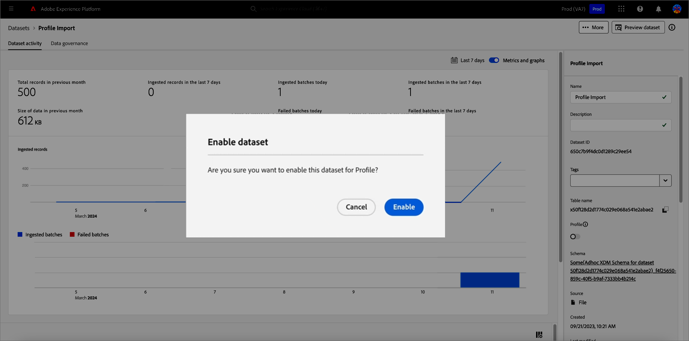
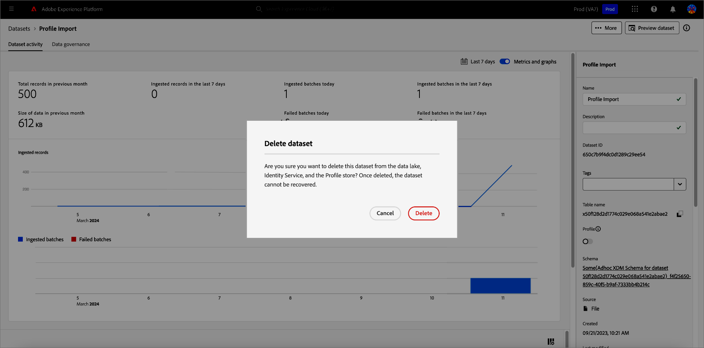
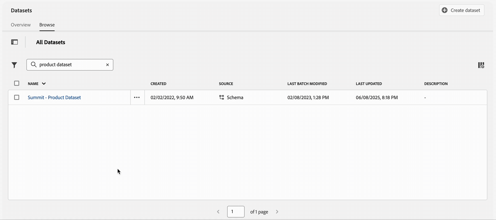
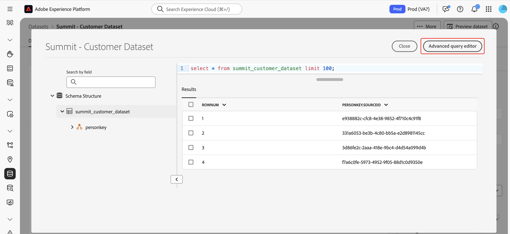
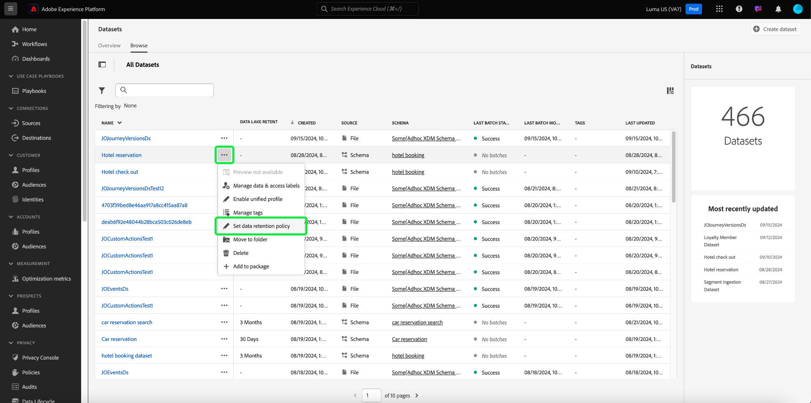
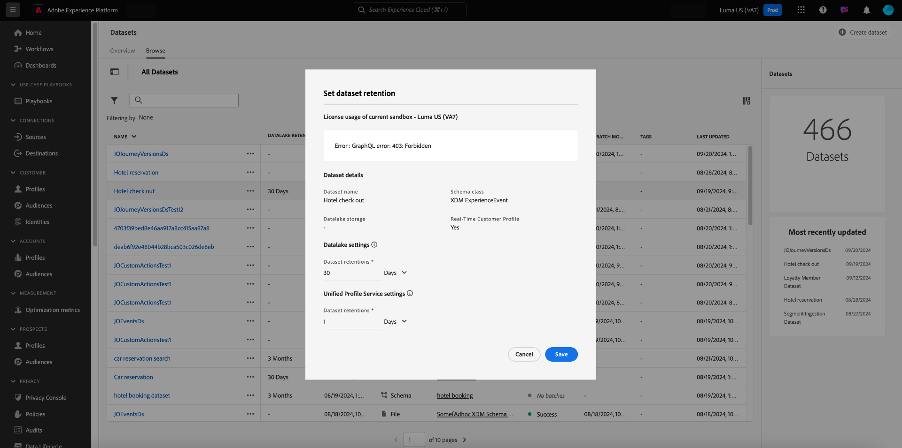
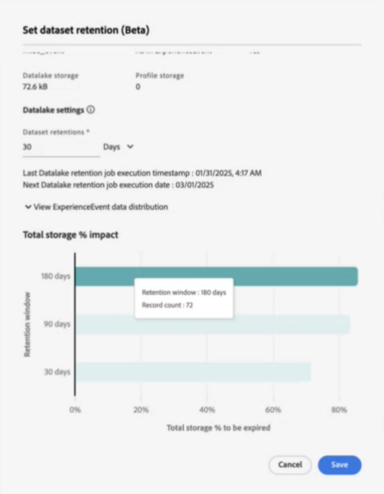
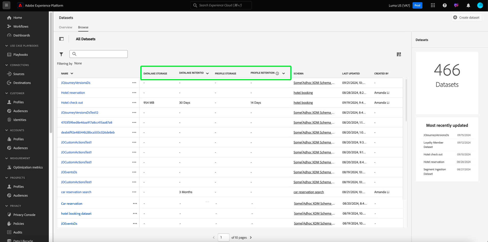
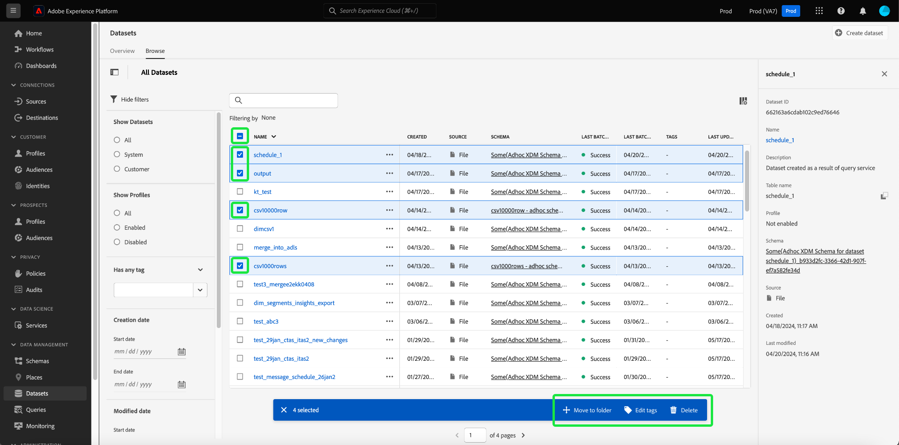

# Datasets UI guide

This user guide provides instructions on performing common actions when working with datasets within Adobe Experience Platform user interface.

## Getting started

This user guide requires a working understanding of the following components of Adobe Experience Platform:

* [Datasets](overview.md): The storage and management construct for data persistence in [!DNL Experience Platform].
* [[!DNL Experience Data Model (XDM) System]](../../xdm/home.md): The standardized framework by which [!DNL Experience Platform] organizes customer experience data.
    * [Basics of schema composition](../../xdm/schema/composition.md): Learn about the basic building blocks of XDM schemas, including key principles and best practices in schema composition.
    * [Schema Editor](../../xdm/tutorials/create-schema-ui.md): Learn how to build your own custom XDM schemas using the [!DNL Schema Editor] within the [!DNL Experience Platform] user interface.
* [[!DNL Real-Time Customer Profile]](../../profile/home.md): Provides a unified, real-time consumer profile based on aggregated data from multiple sources.
* [[!DNL Adobe Experience Platform Data Governance]](../../data-governance/home.md): Ensure compliancy with regulations, restrictions, and policies regarding the usage of customer data.

## View datasets {#view-datasets}

>[!CONTEXTUALHELP]
>id="platform_datasets_negative_numbers"
>title="Negative numbers in dataset activity"
>abstract="Negative numbers in ingested records means that a user has deleted certain batches in a selected time range."
>text="Learn more in documentation"

>[!CONTEXTUALHELP]
>id="platform_datasets_browse_daysRemaining"
>title="Dataset expiration"
>abstract="This column indicates the number of days that the target dataset has left before it automatically expires."

>[!CONTEXTUALHELP]
>id="platform_datasets_browse_datalakeretention"
>title="Datalake retention"
>abstract="Shows the current retention policy for each dataset. This value can be modified in each dataset's retention settings. You can only set retention time for ExperienceEvent dataset."

>[!CONTEXTUALHELP]
>id="platform_datasets_browse_profileretention"
>title="Profile retention"
>abstract="Shows the current retention policy for each dataset. This value can be modified in each dataset's retention settings. You can only set retention time for an ExperienceEvent dataset."

>[!CONTEXTUALHELP]
>id="platform_datasets_datalakesettings_datasetretention"
>title="Dataset retention"
>abstract="Datalake retention sets rules for how long data is stored and when it should be deleted in different services. This ensures compliance with regulations, managing storage costs, and maintaining data quality."

>[!CONTEXTUALHELP]
>id="platform_datasets_orchestratedCampaigns_toggle"
>title="Orchestrated campaigns"
>abstract="Enable this toggle to allow the selected dataset to be used in Adobe Journey Optimizer Orchestrated campaigns. The dataset must use a relational schema and only one dataset can be created per schema."
>additional-url="https://experienceleague.adobe.com/en/docs/journey-optimizer/using/campaigns/orchestrated-campaigns/data-configuration/schemas-datasets/manual-schema#enable" text="Enable Dataset for Orchestrated Campaigns"

>[!CONTEXTUALHELP]
>id="platform_datasets_enableforlookup_toggle"
>title="Enable for lookup"
>abstract="Enable this dataset for lookup to use its data in Journey Optimizer for personalization, Decisioning, and journey orchestration."
>additional-url="https://experienceleague.adobe.com/en/docs/journey-optimizer/using/data-management/lookup-aep-data" text="Use Adobe Experience Platform data in Journey Optimizer"

In the [!DNL Experience Platform] UI, select **[!UICONTROL Datasets]** in the left-navigation to open the **[!UICONTROL Datasets]** dashboard. The dashboard lists all available datasets for your organization. Details are displayed for each listed dataset, including its name, the schema the dataset adheres to, and the status of the most recent ingestion run.

Select the name of a dataset from the [!UICONTROL Browse] tab to access its **[!UICONTROL Dataset activity]** screen and see details of the dataset you selected. The activity tab includes a graph visualizing the rate of messages being consumed as well as a list of successful and failed batches.

## More actions {#more-actions}

You can [!UICONTROL Delete] or [!UICONTROL Enable a dataset for Profile] from the [!UICONTROL Dataset] details view. To see the available actions, select **[!UICONTROL ... More]** in the top right of the UI. The drop-down menu appears. 

![The Datasets workspace with the [!UICONTROL ... More] dropdown menu highlighted.](../images/datasets/user-guide/more-actions.png)

If you select **[!UICONTROL Enable a dataset for Profile]**, a confirmation dialog appears. Select **[!UICONTROL Enable]** to confirm your choice.

>[!NOTE]
>
>To enable a dataset for Profile, the schema that the dataset adheres to must be compatible for use in Real-Time Customer Profile. See the [Enable a dataset for profile](#enable-profile) section for more information.

If you select **[!UICONTROL Delete]**, the [!UICONTROL Delete dataset] confirmation dialog appears. Select **[!UICONTROL Delete]** to confirm your choice.

>[!NOTE]
>
>You cannot delete system datasets.

You can also delete a dataset or add a dataset for use with Real-Time Customer Profile from the inline actions found on the [!UICONTROL Browse] tab. See the [inline actions section](#inline-actions) for more information.

## Inline dataset actions {#inline-actions}

The datasets UI now offers a collections of inline actions for each available dataset. Select the ellipsis (...) of a dataset that you want to manage to see the available options in a pop-up menu. The available actions include; 

* [[!UICONTROL Preview dataset]](#preview)
* [[!UICONTROL Manage data and access labels]](#manage-and-enforce-data-governance)
* [[!UICONTROL Enable unified profile]](#enable-profile)
* [[!UICONTROL Manage tags]](#manage-tags)
* [[!UICONTROL Set data retention policy]](#data-retention-policy)
* [[!UICONTROL Move to folders]](#move-to-folders)
* [[!UICONTROL Delete]](#delete). 

More information on these available actions can be found in their respective sections. To learn how to manage large numbers of datasets simultaneously, refer to the [bulk actions](#bulk-actions) section.

### Preview a dataset {#preview}

You can preview up to 100 rows of sample data for any dataset, either from the inline options in the [!UICONTROL Browse] tab or from the [!UICONTROL Dataset activity] view.

From the [!UICONTROL Browse] tab, select the ellipsis (...) next to the dataset name and choose [!UICONTROL Preview dataset]. If the dataset is empty, the preview option is deactivated. Alternatively, from the **[!UICONTROL Dataset activity]** screen, select **[!UICONTROL Preview dataset]** near the top-right corner of your screen.

This opens the preview window, where the hierarchical schema view for the dataset appears on the left.

>[!NOTE]
>
>The schema diagram on the left only displays fields that contain data. Fields without data are automatically hidden to streamline the UI and focus on relevant information.

Alternatively, from the **[!UICONTROL Dataset activity]** screen, select **[!UICONTROL Preview dataset]** to open the preview window and review a sample of your dataset's structure and values.

The dataset preview window provides a quick way to explore and validate your dataset's structure and data.

#### Dataset preview window {#dataset-preview-window}

The following animation shows the dataset preview window with its navigation and data exploration features:

The dataset preview window includes:

* An object browser sidebar on the left for navigating and filtering dataset fields.
* Data type indicators next to each column name for insight into the structure of the dataset.
* A SQL query display at the top of the window, showing the query used to generate the dataset.
* A formatted table view of up to 100 rows for efficient data review.

These features help you navigate, understand schema details, and validate sample data efficiently.

#### Advanced Query Editor shortcut {#query-editor-shortcut}

If your organization has a Data Distiller license, you can access the [!UICONTROL Advanced Query Editor] directly from the dataset preview window. Use this shortcut to move seamlessly from previewing sample data to running and refining queries in Query Service.

>[!AVAILABILITY]
>
>Access to the [!UICONTROL Advanced Query Editor] is limited to organizations with a Data Distiller SKU license. If your organization does not have the required license, this option does not appear in the dataset preview window.

Select [!UICONTROL Advanced Query Editor] in the upper right of the preview window to open Query Service with your current SQL query pre-loaded and executed. You can continue analyzing or modify the SQL without re-entering the query.

For additional analysis, use downstream services such as [!DNL Query Service] and [!DNL JupyterLab]. See the following documents for more information:

* [Query Service overview](../../query-service/home.md)
* [JupyterLab user guide](../../data-science-workspace/jupyterlab/overview.md)

### Manage and enforce data governance on a dataset {#manage-and-enforce-data-governance}

You can manage the data governance labels for a dataset by selecting the inline options of the [!UICONTROL Browse] tab. Select the ellipses (...) next to the dataset name that you wish to manage, followed by **[!UICONTROL Manage data and access labels]** from the dropdown menu.

Data usage labels, applied at the schema level, allow you to categorize datasets and fields according to usage policies that apply to that data. See the [Data Governance overview](../../data-governance/home.md) to learn more about labels, or refer to the [data usage labels user guide](../../data-governance/labels/overview.md) for instructions on how to apply labels to schemas for propagation to datasets.

## Enable a dataset for Real-Time Customer Profile {#enable-profile}

Every dataset has the ability to enrich customer profiles with its ingested data. To do so, the schema that the dataset adheres to must be compatible for use in [!DNL Real-Time Customer Profile]. A compatible schema satisfies the following requirements:

* The schema has at least one attribute specified as an identity property.
* The schema has an identity property defined as the primary identity.

For more information on enabling a schema for [!DNL Profile], see the [Schema Editor user guide](../../xdm/tutorials/create-schema-ui.md).

You can enable a dataset for Profile from both the inline options of the [!UICONTROL Browse] tab and also the [!UICONTROL Dataset activity] view. From the [!UICONTROL Browse] tab of the [!UICONTROL Datasets] workspace, select the ellipsis of a dataset that you want to enable for Profile. A menu list of options appears. Next, select **[!UICONTROL Enable unified profile]** from the list of available options.

Alternatively, from the dataset's **[!UICONTROL Dataset activity]** screen, select the **[!UICONTROL Profile]** toggle within the **[!UICONTROL Properties]** column. Once enabled, data that is ingested into the dataset will also be used to populate customer profiles.

>[!NOTE]
>
>If a dataset already contains data and is then enabled for [!DNL Profile], the existing data is not automatically consumed by [!DNL Profile]. After a dataset is enabled for [!DNL Profile], it is recommended that you re-ingest any existing data to have it contribute to customer profiles.

Datasets that have been enabled for Profile can also be filtered on this criteria. See the section on how to [filter Profile enabled datasets](#filter-profile-enabled-datasets) for more information.

### Manage dataset tags {#manage-tags}

Add custom created tags to organize datasets and improve search, filtering, and sorting capabilities. From the [!UICONTROL Browse] tab of the [!UICONTROL Datasets] workspace, select the ellipsis of a dataset that you want to manage followed by **[!UICONTROL Manage tags]** from the dropdown menu.

The [!UICONTROL Manage tags] dialog appears. Enter a short description to create a custom tag, or choose from a pre-existing tag to label your dataset. Select **[!UICONTROL Save]** to confirm your settings.

The [!UICONTROL Manage tags] dialog can also remove existing tags from a dataset. Simply select the 'x' next to the tag that you wish to remove and select **[!UICONTROL Save]**. 

Once a tag has been added to a dataset, the datasets can be filtered based on the corresponding tag. See the section on how to [filter datasets by tags](#enable-profile) for more information.

For more information on how to classify business objects for easier discovery and categorization, see the guide on [managing metadata taxonomies](../../administrative-tags/ui/managing-tags.md). This guide explains how users with the right permissions can create pre-defined tags, assign them to categories, and manage all related CRUD operations in the Experience Platform UI.

### Set data retention policy {#data-retention-policy}

Manage dataset expiration and retention settings using the inline action menu from the [!UICONTROL Browse] tab of the [!UICONTROL Datasets] workspace. You can use this feature to configure how long data is retained in the data lake and Profile store. The expiration date is based on when data was ingested into Experience Platform and your configured retention period.

>[!IMPORTANT]
>
>To apply or update retention rules for an ExperienceEvent dataset, your user role must include the **[!UICONTROL Manage datasets]** permission. This role-based access control ensures that only authorized users can modify dataset retention settings.
>
>See the [Access control overview](../../access-control/home.md#platform-permissions) for more information on assigning permissions in Adobe Experience Platform.

>[!TIP]
>
>The data lake stores raw, unprocessed data, such as event logs, clickstream data, and bulk-ingested records, for analytics and processing. The Profile store contains customer-identifiable data, including identity-stitched events and attribute information, to support real-time personalization and activation.

To configure your retention period, select the ellipsis next to the dataset followed by **[!UICONTROL Set data retention policy]** from the dropdown menu.

The [!UICONTROL Set dataset retention] dialog appears. The dialog displays sandbox-level license usage metrics, dataset-level details, and current data retention settings. These metrics show your usage compared to your entitlements and help you assess dataset-specific storage and retention configurations. The metrics include dataset name, type, Profile enablement status, and data lake and Profile store usage.

>[!NOTE]
>
>Sandbox-level licensed data lake storage metrics are still in development and may not appear. A full breakdown of your license usage metrics can be found on the License Usage dashboard. See the documentation for descriptions of these metrics.
<!-- replace this screenshot with a dataset that enabled unified profile so user can see the Profile TTL settings -->

Configure your preferred retention period in the data retention settings dialog. Enter a number and select a time unit (days, months, or years) from the dropdown menu. You can configure separate retention settings for the data lake and Profile Service.

>[!NOTE] 
> 
>The minimum retention period for the data lake is 30 days. The minimum retention period for Profile Service is one day.
>
>Additionally, you can only update the retention period for Profile Service once every 30 days.

To support transparency and monitoring, timestamps are provided for the **last** and **next** data retention job executions. The timestamps help you understand when the last data cleanup occurred and when the next one is scheduled.

#### Storage impact insights {#storage-impact-insights}

To open a visual forecast of the storage impact of different retention policies, select **[!UICONTROL View Experience Event Data distribution]**.

The chart displays the distribution of experience events across various retention periods for the currently selected dataset. Hover over each bar to see the precise number of records that will be removed if the selected retention period is applied.

You can use the visual forecast to evaluate the impact of different retention periods and make informed business decisions. For example, if you select a 30-day retention period and the chart shows that 60% of your data will be deleted, you may choose to extend retention to preserve more data for analysis.

>[!NOTE]
>
>The Experience Event distribution chart is specific to the selected dataset and reflects only its data. It applies exclusively to data stored in the data lake.

When you are satisfied with your configuration, select **[!UICONTROL Save]** to confirm your settings.

>[!IMPORTANT]
>
>Once data retention rules are applied, any data older than the number of days defined by the expiration value is permanently deleted and cannot be recovered.

After configuring your retention settings, use the Monitoring UI to confirm that your changes were executed by the system. The Monitoring UI provides a centralized view of data retention activity across all datasets. From there, you can track job execution, review how much data was deleted, and ensure that your retention policies are functioning as expected. 

To explore how retention policies apply across different services, see the dedicated guides on [Experience Event Dataset Retention in Profile](../../profile/event-expirations.md) and [Experience Event Dataset Retention in the Data Lake](./experience-event-dataset-retention-ttl-guide.md). This visibility supports governance, compliance, and efficient data lifecycle management.

To learn how to use the monitoring dashboard to track source dataflows in the Experience Platform UI, see the [Monitor dataflows for sources in the UI](../../dataflows/ui/monitor-sources.md) documentation.

<!-- Improve the link above. I cannot link to a 100% appropriate document yet. -->

For more information on the rules that define dataset expirations date ranges and best practices for configuring your data retention policy, see the [frequently asked questions page](../catalog-faq.md).

#### Enhanced visibility of retention periods and storage metrics {#retention-and-storage-metrics}

Four new columns provide greater visibility into your data management: **[!UICONTROL Data Lake Storage]**, **[!UICONTROL Data Lake Retention]**, **[!UICONTROL Profile Storage]**, and **[!UICONTROL Profile Retention]**. These metrics show how much storage your data consumes and its retention period in both data lake and Profile Service.

This increased visibility empowers you to make informed decisions and manage storage costs more effectively. Sort datasets by storage size to identify the largest ones in your current sandbox. These insights support data management best practices and help ensure compliance with your licensed entitlements.

The following table provides an overview of the new retention and storage metrics. It details each column's purpose and how it supports managing data retention and storage.

| Column title  | Description |
|---|---|
| [!UICONTROL Data Lake Retention] | The current retention period for each dataset in the data lake. This value is configurable and determines how long data is retained before deletion. |
| [!UICONTROL Data Lake Storage] | The current storage usage for each dataset in the data lake. Use this metric to manage storage limits and optimize usage. |
| [!UICONTROL Profile Storage] | The current storage usage for each dataset within the Profile Service. Helps monitor storage consumption and support data management decisions. |
| [!UICONTROL Profile Retention] | The current retention period for Profile datasets. You can update this value to control how long Profile data is retained. |

{style="table-layout:auto"}

To act on the insights from storage and retention metrics, refer to the [data management license entitlement best practices guide](../../landing/license-usage-and-guardrails/data-management-best-practices.md). Use it to manage what data you ingest and retain, apply filters and expiration rules, and control data growth to stay within your licensed usage limits.

### Move to folders {#move-to-folders}

You can place datasets within folders for better dataset management. To move a dataset into a folder, select the ellipses (...) next to the dataset name you wish to manage, followed by **[!UICONTROL Move to folder]** from the dropdown menu.

![The [!UICONTROL Datasets] dashboard with the ellipses and [!UICONTROL Move to folder] highlighted.](../images/datasets/user-guide/move-to-folder.png)

The [!UICONTROL Move] dataset to folder dialog appears. Select the folder you want to move the audience to, then select **[!UICONTROL Move]**. A popup notification informs you that the dataset move has been successful.

![The [!UICONTROL Move] dataset dialog with [!UICONTROL Move] highlighted.](../images/datasets/user-guide/move-dialog.png)

>[!TIP]
>
>You can also create folders directly from the Move dataset dialog. To create a folder, select the create folder icon () in the top right of the dialog.
>
>![The [!UICONTROL Move] dataset dialog with the create folder icon highlighted.](/help/catalog/images/datasets/user-guide/create-folder.png)

Once the dataset is in a folder, you can choose to only display datasets that belong to a specific folder. To open your folder structure, select the show folders icon (). Next, select your chosen folder to see all associated datasets.

![The [!UICONTROL Datasets] dashboards with the datasets folder structure displayed, the show folders icon, and a selected folder highlighted.](../images/datasets/user-guide/folder-structure.png)

### Delete a dataset {#delete}

You can delete a dataset from either the dataset inline actions in the [!UICONTROL Browse] tab or the top right of the [!UICONTROL Dataset activity] view. From the [!UICONTROL Browse] view, select the ellipses (...) next to the dataset name you wish to delete. A menu list of options appears. Next, select **[!UICONTROL Delete]** from the dropdown menu.

A confirmation dialog appears. Select **[!UICONTROL Delete]** to confirm.

Alternatively, select **[!UICONTROL Delete dataset]** from the **[!UICONTROL Dataset activity]** screen. 

>[!NOTE]
>
>Datasets created and utilized by Adobe applications and services (such as Adobe Analytics, Adobe Audience Manager, or [!DNL Offer Decisioning]) cannot be deleted.

A confirmation box appears. Select **[!UICONTROL Delete]** to confirm the deletion of the dataset.

### Delete a Profile-enabled dataset

If a dataset is enabled for Profile, deleting that dataset through the UI will delete it from the data lake, Identity Service, and also any profile data associated with that dataset in the Profile store.

You can delete profile data associated with a dataset from the [!DNL Profile] store (leaving the data in the data lake) using the Real-Time Customer Profile API. For more information, see the [profile system jobs API endpoint guide](../../profile/api/profile-system-jobs.md).

## Search and filter datasets {#search-and-filter}

To search or filter the list of available datasets, select the filter icon () at the top left of the workspace. A set of filter options in the left rail appears. There are several methods to filter your available datasets. These include: [[!UICONTROL Show System Datasets]](#show-system-datasets), [[!UICONTROL Included in profile]](#filter-profile-enabled-datasets), [[!UICONTROL Tags]](#filter-by-tag), [[!UICONTROL Creation date]](#filter-by-creation-date), [[!UICONTROL Modified date], [!UICONTROL Created by]](#filter-by-creation-date), and [[!UICONTROL Schema]](#filter-by-schema).

The list of applied filters is displayed above the filtered results.

### Show system datasets {#show-system-datasets}

By default, only datasets that you have ingested data into are shown. If you want to see the system-generated datasets, select the **[!UICONTROL Yes]** checkbox in the [!UICONTROL Show system datasets] section. System-generated datasets are only used to process other components. For example, the system-generated profile export dataset is used to process the profile dashboard.

![The filter options of the Datasets workspace with the [!UICONTROL Show system datasets] section highlighted.](../images/datasets/user-guide/show-system-datasets.png)

### Filter Profile enabled datasets {#filter-profile-enabled-datasets}

The datasets that have been enabled for Profile data are used to populate customer profiles after data has been ingested. See the section on [enabling datasets for Profile](#enable-profile) to learn more. 

To filter your dataset based on whether they have been enabled for Profile, select the [!UICONTROL Yes] checkbox from the filter options.

![The filter options of the Datasets workspace with the [!UICONTROL Included in Profile] section highlighted.](../images/datasets/user-guide/included-in-profile.png)

### Filter datasets by tag {#filter-by-tag}

Enter your custom tag name in the [!UICONTROL Tags] input, then select your tag from the list of available options to search and filter datasets that correspond to that tag.

![The filter options of the Datasets workspace with the [!UICONTROL Tags] input and filter icon highlighted.](../images/datasets/user-guide/filter-tags.png) 

### Filter datasets by creation date {#filter-by-creation-date}

Datasets can be filtered by creation date over a custom time period. This can be used to exclude historic data or to generate specific chronological data insights and reporting. Choose a [!UICONTROL Start date] and an [!UICONTROL End date] by selecting the calendar icon for each field. After which, only datasets that conform to that criteria will appear in the Browse tab.

### Filter datasets by modified date {#filter-by-modified-date}

Similar to the filter for creation date, you can filter your datasets based on the date they were last modified. In the [!UICONTROL Modified date] section, Choose a [!UICONTROL Start date] and an [!UICONTROL End date] by selecting the calendar icon for each field. After which, only datasets that were modified during that period will appear in the Browse tab.

### Filter by schema {#filter-by-schema}

You can filter datasets based on the schema that defines their structure. Either select the dropdown icon or input the schema name into the text field. A list of potential matches appears. Select the appropriate schema from the list.

## Bulk actions {#bulk-actions}

Use bulk actions to enhance your operational efficiency and perform multiple actions on numerous datasets simultaneously. You can save time and maintain an organized data structure with bulk actions such as [Move to folder](#move-to-folders), [Edit tags](#manage-tags), and [Delete](#delete) datasets. 

To act on more than one dataset at a time, select individual datasets with the checkbox on each row, or select an entire page with the column header checkbox. Once selected, the bulk action bar appears. 

When you apply bulk actions to datasets, the following conditions apply:

* You can select datasets from different pages of the UI.
* If you select a filter, the selected datasets will reset.

## Sort datasets by created date {#sort}

Datasets in the [!UICONTROL Browse] tab can be sorted by either ascending or descending dates. Select the [!UICONTROL Created] or [!UICONTROL Last updated] column headings to alternate between ascending and descending. Once selected, the column indicates this with either an up or down arrow to the side of the column header.

## Create a dataset {#create}

To create a new dataset, start by selecting **[!UICONTROL Create dataset]** in the **[!UICONTROL Datasets]** dashboard.

In the next screen, you are presented with the following two options for creating a new dataset:

* [Create dataset from schema](#schema)
* [Create dataset from CSV file](#csv)

### Create a dataset with an existing schema {#schema}

In the **[!UICONTROL Create dataset]** screen, select **[!UICONTROL Create dataset from schema]** to create a new empty dataset.

The **[!UICONTROL Select schema]** step appears. Browse the schema listing and select the schema that the dataset will adhere to before selecting **[!UICONTROL Next]**.

The **[!UICONTROL Configure dataset]** step appears. Provide the dataset with a name and optional description, then select **[!UICONTROL Finish]** to create the dataset.

Datasets can be filtered from the list of available datasets in the UI with the schema filter. See the section on how to [filter datasets by schema](#filter-by-schema) for more information.

### Create a dataset with a CSV file {#csv}

When a dataset is created using a CSV file, an ad hoc schema is created to provide the dataset with a structure that matches the provided CSV file. In the **[!UICONTROL Create dataset]** screen, select **[!UICONTROL Create dataset from CSV file]**.

The **[!UICONTROL Configure]** step appears. Provide the dataset with a name and optional description, then select **[!UICONTROL Next]**.

The **[!UICONTROL Add data]** step appears. Upload the CSV file by either dragging and dropping it onto the center of your screen, or select **[!UICONTROL Browse]** to explore your file directory. The file can be up to ten gigabytes in size. Once the CSV file is uploaded, select **[!UICONTROL Save]** to create the dataset.

>[!NOTE]
>
>CSV column names must start with alphanumeric characters, and can contain only letters, numbers, and underscores.

## Monitor data ingestion

In the [!DNL Experience Platform] UI, select **[!UICONTROL Monitoring]** in the left-navigation. The **[!UICONTROL Monitoring]** dashboard lets you view the statuses of inbound data from either batch or streaming ingestion. To view the statuses of individual batches, select either **[!UICONTROL Batch end-to-end]** or **[!UICONTROL Streaming end-to-end]**. The dashboards list all batch or streaming ingestion runs, including those that are successful, failed, or still in progress. Each listing provides details of the batch, including the batch ID, the name of the target dataset, and the number of records ingested. If the target dataset is enabled for [!DNL Profile], the number of ingested identity and profile records is also displayed.

You can select on an individual **[!UICONTROL Batch ID]** to access the **[!UICONTROL Batch overview]** dashboard and see details for the batch, including error logs should the batch fail to ingest.

If you wish to delete the batch, select **[!UICONTROL Delete batch]** near the top right of the dashboard. Deleting a batch also removes its records from the dataset that the batch was originally ingested to.

>[!NOTE]
>
>If the ingested data has been enabled for Profile and processed, then deleting a batch does not delete that data from the Profile store.

## Next steps

This user guide provided instructions for performing common actions when working with datasets in the [!DNL Experience Platform] user interface. For steps on performing common [!DNL Experience Platform] workflows involving datasets, please refer to the following tutorials:

* [Create a dataset using APIs](create.md)
* [Query dataset data using the Data Access API](../../data-access/home.md)
* [Configure a dataset for Real-Time Customer Profile and Identity Service using APIs](../../profile/tutorials/dataset-configuration.md)

