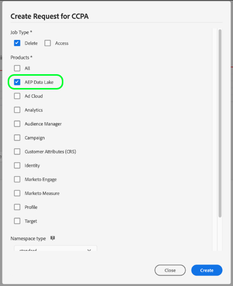

# Privacy request processing in the data lake

Adobe Experience Platform [!DNL Privacy Service] processes customer requests to access, opt out of sale, or delete their personal data as delineated by legal and organizational privacy regulations.

This document covers essential concepts related to processing privacy requests for customer data stored in the data lake.

>[!NOTE]
>
>This guide only covers how to make privacy requests for the data lake in Experience Platform. If you also plan to make privacy requests for the Real-time Customer Profile data store, refer to the guide on [privacy request processing for Profile](../profile/privacy.md) in addition to this tutorial.
>
>For steps on how to make privacy requests for other Adobe Experience Cloud applications, refer to the [Privacy Service documentation](../privacy-service/experience-cloud-apps.md).

## Getting started

It is recommended that you have a working understanding of the following [!DNL Experience Platform] services before reading this guide:

* [[!DNL Privacy Service]](../privacy-service/home.md): Manages customer requests for accessing, opting out of sale, or deleting their personal data across Adobe Experience Cloud applications.
* [[!DNL Catalog Service]](home.md): The system of record for data location and lineage within [!DNL Experience Platform]. Provides an API that can be used to update dataset metadata.
* [[!DNL Experience Data Model (XDM) System]](../xdm/home.md): The standardized framework by which [!DNL Experience Platform] organizes customer experience data.
* [[!DNL Identity Service]](../identity-service/home.md): Solves the fundamental challenge posed by the fragmentation of customer experience data by bridging identities across devices and systems.

## Understanding identity namespaces {#namespaces}

Adobe Experience Platform [!DNL Identity Service] bridges customer identity data across systems and devices. [!DNL Identity Service] uses identity namespaces to provide context to identity values by relating them to their system of origin. A namespace can represent a generic concept such as an email address ("Email") or associate the identity with a specific application, such as an Adobe Advertising Cloud ID ("AdCloud") or Adobe Target ID ("TNTID").

[!DNL Identity Service] maintains a store of globally defined (standard) and user-defined (custom) identity namespaces. Standard namespaces are available for all organizations (for example, "Email" and "ECID"), while your organization can also create custom namespaces to suit its particular needs.

For more information about identity namespaces in [!DNL Experience Platform], see the [identity namespace overview](../identity-service/namespaces.md).

## Adding identity data to datasets

When creating privacy requests for the data lake, valid identity values (and their associated namespaces) must be provided for each individual customer in order to locate their data and process it accordingly. Therefore, all datasets that are subject to privacy requests must contain an identity descriptor in their associated XDM schema.

>[!NOTE]
>
>Any datasets based on schemas that do not support identity descriptor metadata (such as ad-hoc datasets) currently cannot be processed in privacy requests.

This section walks through the steps of adding an identity descriptor to an existing dataset's XDM schema. If you already have a dataset with an identity descriptor, you can skip ahead to the [next section](#nested-maps).

>[!IMPORTANT]
>
>When deciding which schema fields to set as identities, keep in mind the [limitations of using nested map-type fields](#nested-maps).

There are two methods of adding an identity descriptor to a dataset schema:

* [Using the UI](#identity-ui)
* [Using the API](#identity-api)

### Using the UI {#identity-ui}

In the [!DNL Experience Platform ]user interface, the **[!UICONTROL Schemas]** workspace allows you to edit your existing XDM schemas. To add an identity descriptor to a schema, select the schema from the list and follow the steps for [setting a schema field as an identity field](../xdm/tutorials/create-schema-ui.md#identity-field) in the [!DNL Schema Editor] tutorial.

Once you have set the appropriate fields within the schema as identity fields, you can proceed to the next section on [submitting privacy requests](#submit).

### Using the API {#identity-api}

>[!NOTE]
>
>This section assumes you know the unique URI ID value of your dataset's XDM schema. If you do not know this value, you can retrieve it by using the [!DNL Catalog Service] API. After reading the [getting started](./api/getting-started.md) section of the developer guide, follow the steps outlined in for [listing](./api/list-objects.md) or [looking up](./api/look-up-object.md) [!DNL Catalog] objects to find your dataset. The schema ID can be found under `schemaRef.id`
>
>This section also assumes that you know how to make calls to the Schema Registry API. For important information related to using the API, including knowing your `{TENANT_ID}` and the concept of containers, see the [getting started](../xdm/api/getting-started.md) section of the API guide.

You can add an identity descriptor to a dataset's XDM schema by making a POST request to the `/descriptors` endpoint in the [!DNL Schema Registry] API.

**API format**

```http
POST /descriptors
```

**Request**

The following request defines an identity descriptor on an "email address" field in a sample schema.

```shell
curl -X POST \
  https://platform.adobe.io/data/foundation/schemaregistry/tenant/descriptors \
  -H 'Authorization: Bearer {ACCESS_TOKEN}' \
  -H 'x-api-key: {API_KEY}' \
  -H 'x-gw-ims-org-id: {ORG_ID}' \
  -H 'x-sandbox-name: {SANDBOX_NAME}' \
  -H 'Content-Type: application/json' \
  -d '
      {
        "@type": "xdm:descriptorIdentity",
        "xdm:sourceSchema": "https://ns.adobe.com/{TENANT_ID}/schemas/fbc52b243d04b5d4f41eaa72a8ba58be",
        "xdm:sourceVersion": 1,
        "xdm:sourceProperty": "/personalEmail/address",
        "xdm:namespace": "Email",
        "xdm:property": "xdm:code",
        "xdm:isPrimary": false
      }'
```

| Property | Description |
| --- | --- |
| `@type` | The type of descriptor being created. For identity descriptors, the value must be "xdm:descriptorIdentity". |
| `xdm:sourceSchema` | The unique URI ID of your dataset's XDM schema. |
| `xdm:sourceVersion` | The version of the XDM schema specified in `xdm:sourceSchema`. |
| `xdm:sourceProperty` | The path to the schema field that the descriptor is being applied to. |
| `xdm:namespace` | One of the [standard identity namespaces](../privacy-service/api/appendix.md#standard-namespaces) recognized by [!DNL Privacy Service], or a custom namespace defined by your organization. |
| `xdm:property` | Either "xdm:id" or "xdm:code", depending on the namespace being used under `xdm:namespace`. |
| `xdm:isPrimary` | An optional boolean value. When true, this indicates that the field  is a primary identity. Schemas may contain only one primary identity. Defaults to false if not included. |

**Response**

A successful response returns HTTP status 201 (Created) and the details of the newly created descriptor.

```json
{
  "@type": "xdm:descriptorIdentity",
  "xdm:sourceSchema": "https://ns.adobe.com/{TENANT_ID}/schemas/fbc52b243d04b5d4f41eaa72a8ba58be",
  "xdm:sourceVersion": 1,
  "xdm:sourceProperty": "/personalEmail/address",
  "xdm:namespace": "Email",
  "xdm:property": "xdm:code",
  "xdm:isPrimary": false,
  "meta:containerId": "tenant",
  "@id": "f3a1dfa38a4871cf4442a33074c1f9406a593407"
}
```

## Submitting requests {#submit}

>[!NOTE]
>
>This section covers how to format privacy requests for the data lake. It is strongly recommended that you review the [[!DNL Privacy Service] UI](../privacy-service/ui/overview.md) or [[!DNL Privacy Service] API](../privacy-service/api/getting-started.md) documentation for complete steps on how to submit a privacy job, including how to properly format submitted user identity data in request payloads.

The following section outlines how to make privacy requests for the data lake using the [!DNL Privacy Service] UI or API.

>[!IMPORTANT]
>
>The amount of time a privacy request can take to complete cannot be guaranteed. If changes occur within the data lake while a request is still processing, whether or not those records are processed also cannot be guaranteed.

### Using the UI

When creating job requests in the UI, be sure to select **[!UICONTROL AEP Data Lake]** under **[!UICONTROL Products]** in order to process jobs for data stored in the data lake.



### Using the API

When creating job requests in the API, any `userIDs` that are provided must use a specific `namespace` and `type` depending on the data store they apply to. IDs for the data lake must use `unregistered` for their `type` value, and a `namespace` value that matches one the [privacy labels](#privacy-labels) that have been added to applicable datasets.

In addition, the `include` array of the request payload must include the product values for the different data stores the request is being made to. When making requests to the data lake, the array must include the value `aepDataLake`.

The following request creates a new privacy job for the data lake, using the unregistered `email_label` namespace. It also includes the product value for the data lake in the `include` array:

```shell
curl -X POST \
  https://platform.adobe.io/data/core/privacy/jobs \
  -H 'Authorization: Bearer {ACCESS_TOKEN}' \
  -H 'x-api-key: {API_KEY}' \
  -H 'x-gw-ims-org-id: {ORG_ID}' \
  -H 'Content-Type: application/json' \
  -d '{
    "companyContexts": [
      {
        "namespace": "imsOrgID",
        "value": "{ORG_ID}"
      }
    ],
    "users": [
      {
        "key": "user12345",
        "action": ["access","delete"],
        "userIDs": [
          {
            "namespace": "email_label",
            "value": "ajones@acme.com",
            "type": "unregistered"
          },
          {
            "namespace": "email_label",
            "value": "jdoe@example.com",
            "type": "unregistered"
          }
        ]
      }
    ],
    "include": ["aepDataLake"],
    "expandIds": false,
    "priority": "normal",
    "regulation": "ccpa"
}'
```

>[!IMPORTANT]
>
>Platform processes privacy requests across all [sandboxes](../sandboxes/home.md) belonging to your organization. As a result, any `x-sandbox-name` header included in the request is ignored by the system.

## Delete request processing

When [!DNL Experience Platform] receives a delete request from [!DNL Privacy Service], [!DNL Platform] sends confirmation to [!DNL Privacy Service] that the request has been received and affected data has been marked for deletion. The records are then removed from the data lake within seven days. During that seven-day window, the data is soft-deleted and is therefore not accessible by any [!DNL Platform] service.

If you also included `ProfileService` or `identity` in the privacy request, their associated data is handled separately. See the section on [delete request processing for Profile](../profile/privacy.md#delete) for more information.

## Next steps

By reading this document, you have been introduced to the important concepts involved with processing privacy requests for the data lake. It is recommended that you continue reading the documentation provided throughout this guide in order to deepen your understanding of how to manage identity data and create privacy jobs.

See the document on [privacy request processing for Real-time Customer Profile](../profile/privacy.md) for steps on processing privacy requests for the [!DNL Profile] store.

## Appendix

The following section contains additional information for processing privacy requests in the data lake.

### Labeling nested map-type fields {#nested-maps}

It is important to note that there are two kinds of nested map-type fields that do not support privacy labeling:

* A map-type field within an array-type field
* A map-type field within another map-type field

Privacy job processing for either of the two examples above will eventually fail. For this reason, it is recommended that you avoid using nested map-type fields to store private customer data. Relevant consumer IDs should be stored as a non-map datatype within the `identityMap` field (itself a map-type field) for record-based datasets, or the `endUserID` field for time-series-based datasets.
