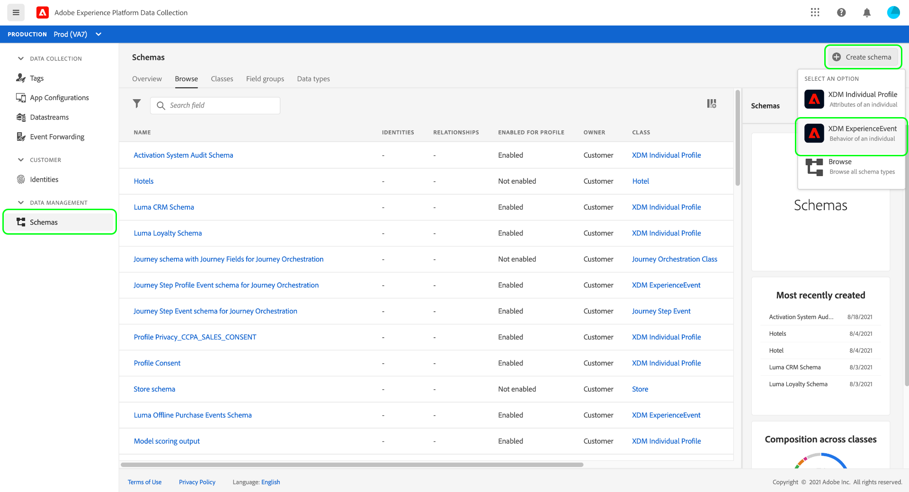
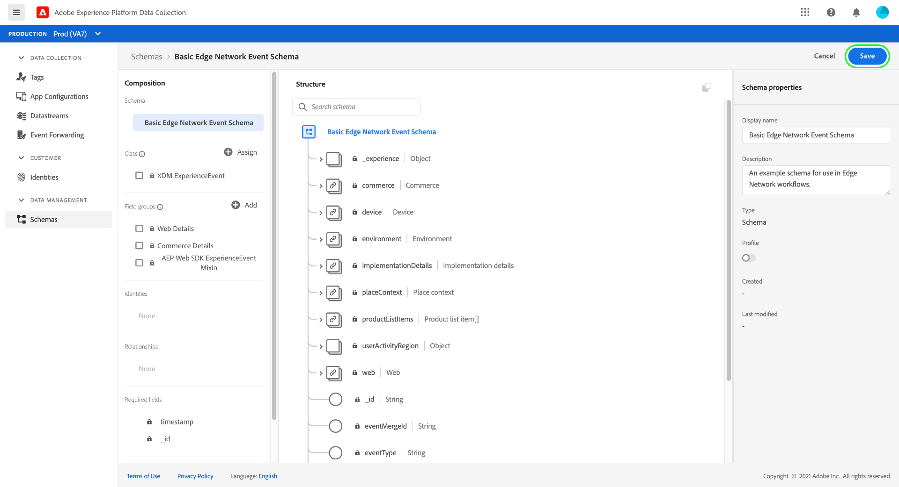
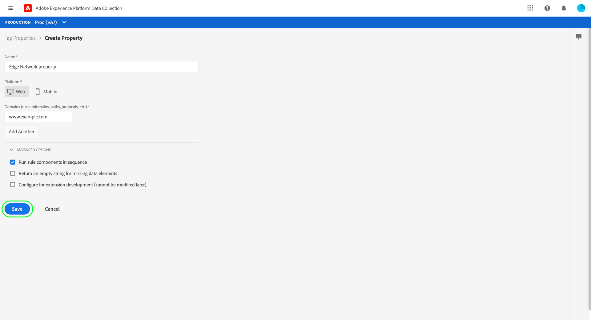
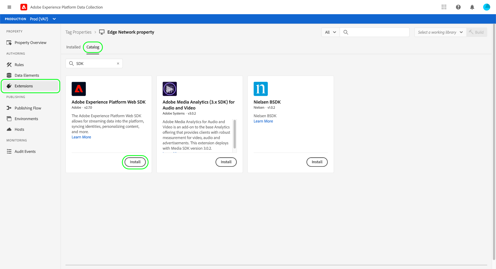
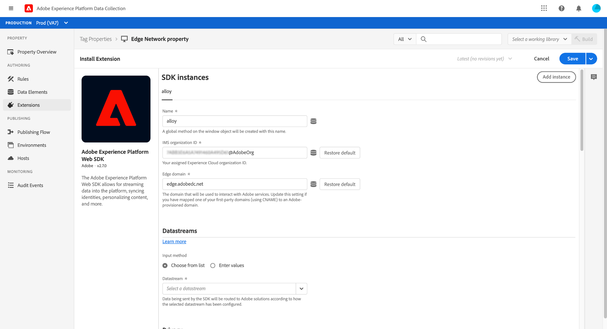
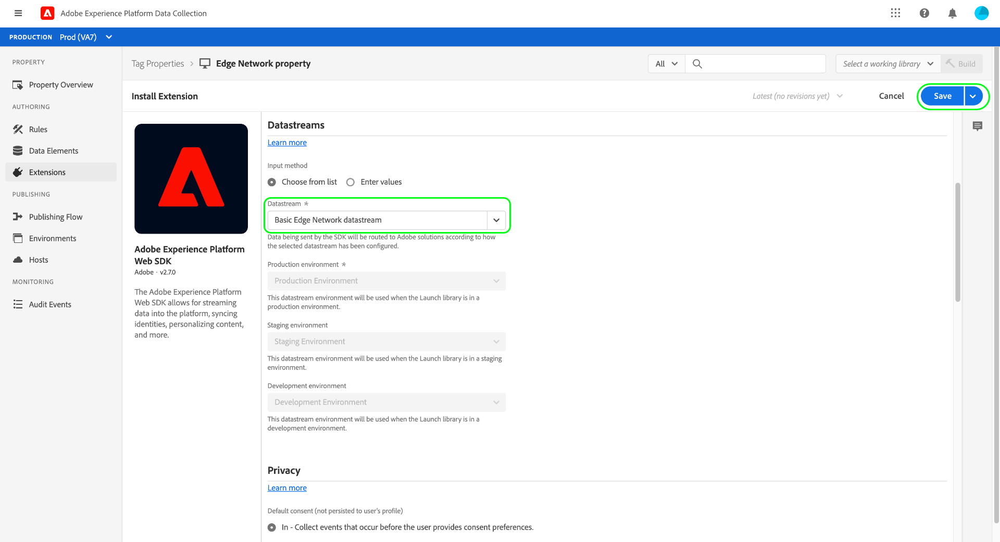
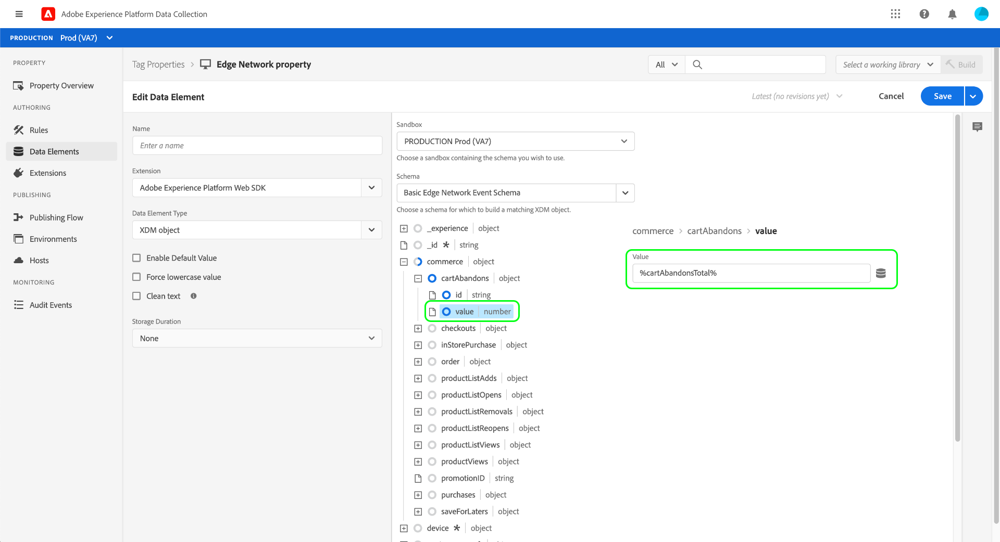
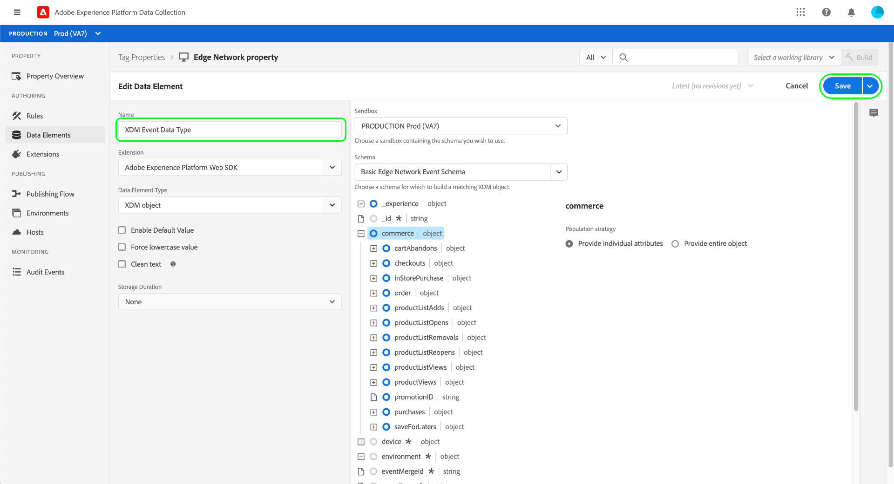
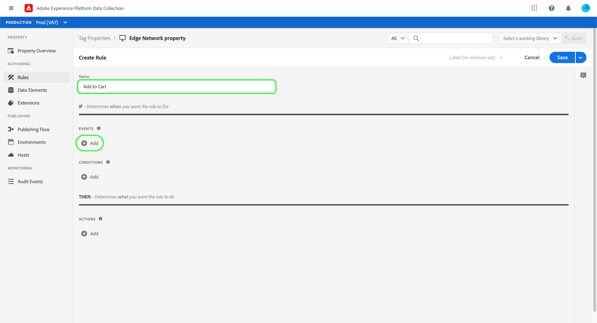
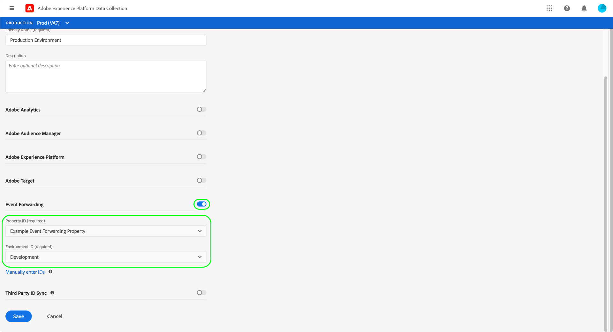

# Data collection end-to-end overview

Adobe Experience Platform collects and transfers your data to other Adobe products and third-party destinations. In order to send event data from your application to the Experience Platform Edge Network, it is important to understand these core technologies and how to configure them to deliver your data to the destinations you require, when you require it.

This guide provides a high-level tutorial of how to send an event through the Edge Network using Platform's data collection capabilities. Specifically, the tutorial walks through the steps of installing and configuring the Adobe Experience Platform Web SDK tag extension within the Data Collection UI (formerly Adobe Experience Platform Launch).

>[!NOTE]
>
>You can also opt to install and configure the SDK manually if you don't want to use tags, but the surrounding steps must still be completed as outlined below.
>
>All steps involving the Data Collection UI can also be performed in the Experience Platform UI.

## Prerequisites

This tutorial uses the Data Collection UI to create a schema, configure a datastream, and install the Web SDK. In order to perform these actions in the UI, you must be granted access to at least one web property along with the following [property rights](../tags/ui/administration/user-permissions.md#property-rights):

* Develop
* Manage Extensions

See the guide on [managing permissions for data collection](./permissions.md) to learn how to grant access to properties and property rights.

To use the various Data Collection products mentioned in this guide, you must also have access to datastreams and the ability to create and manage schemas. If you need access to either of these features, please contact your CSM to help you get the necessary access. Please note that if you have not purchased Adobe Experience Platform, Adobe will provision you with the necessary access to use the SDK at no extra charge.

If you already have access to Platform, you must ensure that you have the all [permissions](../access-control/home.md#permissions) under the following categories enabled:

* Data Modeling
* Identities

See the [access control UI overview](../access-control/ui/overview.md) to learn how to grant permissions for Platform capabilities to users.

## Process summary

The process of configuring data collection for your website can be summarized as follows:

1. [Create a schema](#schema) to determine how your data will be structured when being sent to the Edge Network.
1. [Create a datastream](#datastream) to configure which destinations you want your data to be sent to.
1. [Install and configure the Web SDK](#sdk) to send data to the datastream when certain events occur on your website.

Once you are able to send data to the Edge Network, you can also optionally [configure event forwarding](#event-forwarding) if your organization has a license for it.

## Create a schema {#schema}

[Experience Data Model (XDM)](../xdm/home.md) is an open-source specification that provides common structures and definitions for data in the form of schemas. In other words, XDM is a way of structuring and formatting your data in a way that is actionable by the Edge Network and other Adobe Experience Cloud applications.

The first step in setting up your data collection operations is to create an XDM schema to represent your data. At a later step in this tutorial, you will map the data you want to send to the structure of this schema.

>[!NOTE]
>
>XDM schemas are very customizable. Rather than being overly prescriptive, the steps outlined below focus specifically on the schema requirements for the Web SDK. Outside of these parameters, you are free to define the remaining structure your data however you wish.

In the UI, select **[!UICONTROL Schemas]** in the left navigation. From here, you can see a list of previously created schemas belonging to your organization. To continue, select **[!UICONTROL Create schema]**, then select **[!UICONTROL XDM ExperienceEvent]** from the dropdown menu.



A dialog appears that prompts you to start adding field groups to the schema. In order to send events using the Web SDK, you must add the field group **[!UICONTROL AEP Web SDK ExperienceEvent Mixin]**. This field group contains definitions for data attributes that are automatically collected by the Web SDK library.

Use the search bar to narrow down the list to help find this field group easier. Once you have found it, select it from the list before selecting **[!UICONTROL Add field groups]**.


The schema canvas appears, showing a tree structure of your XDM schema including the fields provided by the Web SDK field group.


Select the root field in the tree to open **[!UICONTROL Schema properties]** in the right rail, where you can provide a name and optional description for the schema.


If you want to add more fields to the schema, you can do so by selecting **[!UICONTROL Add]** under the **[!UICONTROL Field groups]** section in the left rail.


>[!NOTE]
>
>See the guide on [adding field groups](../xdm/ui/resources/schemas.md#add-field-groups) in the XDM documentation for detailed steps on how to search for different field groups to suit your use cases.
>
>Best practice is to only add fields for data you plan on sending through the Edge Network. Once you have added fields to a schema and saved it, only additive changes can be made to the schema thereafter. See the section on the [rules of schema evolution](../xdm/schema/composition.md#evolution) for more information.

Once you have added the fields you need, select **[!UICONTROL Save]** to save the schema.



## Create a datastream {#datastream}

A datastream is a configuration that tells the Edge Network where you want your data to be sent. Specifically, a datastream specifies which Experience Cloud products you want to send the data to, and how you want the data to be handled and stored in each product.

>[!NOTE]
>
>If you want to use [event forwarding](../tags/ui/event-forwarding/overview.md) (assuming your organization is licensed for the functionality), you must enable it for a datastream in the same way that you enable Adobe products. Details on this process are covered in a [later section](#event-forwarding).

Select **[!UICONTROL Datastreams]** in the left navigation. From here, you can select an existing datastream from the list to edit, or you can create a new configuration by selecting **[!UICONTROL New Datastream]**.


The configuration requirements for a datastream depend on which products and capabilities you are sending data to. For detailed information on the configuration options for each product, refer to the [datastreams overview](../edge/datastreams/overview.md).

## Install and configure the Web SDK {#install}

Once you have created a schema and a datastream, the next step is to install and configure the Platform Web SDK to start sending data to the Edge Network.

>[!NOTE]
>
>This section uses the Data Collection UI to configure the Web SDK tag extension, but you can also install and configure it using raw code instead. Refer to the following guides for more information:
>
>* [Install the SDK](../edge/fundamentals/installing-the-sdk.md)
>* [Configure the SDK](../edge/fundamentals/configuring-the-sdk.md)
>
>Also note that even if you only want to use event forwarding, you must still install and configure the SDK as described before configuring event forwarding at a [later step](#event-forwarding).

The process can be summarized as follows:

1. [Install the Adobe Experience Platform Web SDK on a tag property](#install-sdk) to gain access to its capabilities.
1. [Create an XDM Object data element](#data-element) to map variables on your website to the structure of the XDM schema you created previously.
1. [Create a rule](#rule) to tell the SDK when it should send data to the Edge Network.
1. [Build and install a library](#library) to implement the rule on your website.

### Install the SDK on a tag property {#install-sdk}

Select **[!UICONTROL Tags]** in the left navigation to show a list of tag properties. You can choose an existing property to edit if you wish, or you can select **[!UICONTROL New Property]** instead.


If creating a new property, provide a descriptive name and set the [!UICONTROL Platform] to **[!UICONTROL Web]**. Provide the full domain for the web property, and then select **[!UICONTROL Save]**.



The overview page for the property appears. From here, select **[!UICONTROL Extensions]** in the left navigation, then select **[!UICONTROL Catalog]**. Find the listing for the Platform Web SDK (optionally using the search bar to narrow results) and select **[!UICONTROL Install]**.



The configuration page for the SDK appears. Most required values are auto-populated with defaults that you can choose to change if you wish.



Before you can install the SDK, however, you must select a datastream so it knows where to send your data to. Under **[!UICONTROL Datastreams]**, use the dropdown menu to select the datastream that you configured at an [earlier step](#datastream). Once you've set the datastream, select **[!UICONTROL Save]** to finish installing the SDK to the property.



### Create an XDM data element {#data-element}

In order for the SDK to send data to the Edge Network, that data must be mapped to the XDM schema you created in a [previous step](#schema). This mapping is accomplished through the use of a data element.

In the UI, select **[!UICONTROL Data Elements]**, then select **[!UICONTROL Create New Data Element]**.


On the next screen, select **[!UICONTROL Adobe Experience Platform Web SDK]** under the [!UICONTROL Extension] dropdown, then select **[!UICONTROL XDM object]** for the data element type.


The configuration dialog appears for the XDM object type. The dialog automatically selects your Platform sandbox, and from here you can see all the schemas that have been created in that sandbox. Select the XDM schema you created earlier from the list.


The structure of the schema appears. All fields with an asterisk (**\***) indicate fields that will automatically populate when events fire. For all other fields, you can explore the structure of the schema and fill out the rest of the data.



>[!NOTE]
>
>The screenshot above demonstrates how to map a globally accessible variable from the client side of your website (`cartAbandonsTotal`) to an XDM field by referencing its name in the [!UICONTROL Value] field, surrounded by percent signs (`%`).
>
>You can also use other previously created data elements to populate these fields. See the reference on [data elements](../tags/ui/managing-resources/data-elements.md) in the tags documentation for more information.

Once you have finished mapping your data to the schema, provide a name for the data element before selecting **[!UICONTROL Save]**.



### Create a rule

After you've saved the data element, the next step is to create a rule that will send it to the Edge Network whenever a certain event occurs on your website (such as when a customer adds a product to a cart).

You can set up rules for virtually any event that can occur on your website. As an example, this section shows how to create a rule that will trigger when a customer submits a form. The following HTML represents a simple webpage with an "Add to Cart" form, which will be the subject of the rule:

```html
<!DOCTYPE html>
<html>
<body>

  <form id="add-to-cart-form">
    <label for="item">Product:</label><br>
    <input type="text" id="item" name="item"><br>
    <label for="amount">Amount:</label><br>
    <input type="number" id="amount" name="amount" value="1"><br><br>
    <input type="submit" value="Add to Cart">
  </form> 

</body>
</html>
```

In the Data Collection UI, select **[!UICONTROL Rules]** in the left navigation, then select **[!UICONTROL Create New Rule]**.


On the next screen, provide a name for the rule. From here, the next step is to determine the event for the rule (in other words, when the rule will fire). Select **[!UICONTROL Add]** under [!UICONTROL Events].



The event configuration page appears. To configure an event, you must first select the event type. Event types are provided by extensions. To set up a "form submit" event, for example, select the **[!UICONTROL Core]** extension, then select the **[!UICONTROL Submit]** event type under the **[!UICONTROL Form]** category.

>[!NOTE]
>
>For more information on the different event types provided by Adobe web extensions, including how to configure them, see the [Adobe extensions reference](../tags/extensions/web/overview.md) in the tags documentation.

The form submit event allows you to use a [CSS selector](https://www.w3schools.com/css/css_selectors.asp) to reference a specific element for the rule to fire on. In the example below, the ID `add-to-cart-form` is used so that this rule only fires for the "Add to Cart" form. Select **[!UICONTROL Keep Changes]** to add the event to the rule.


The rule configuration page reappears, showing that the event has been added. You can narrow down the "[!UICONTROL If]" by adding further conditions to the rule.

Otherwise, the next step is to add an action for the rule to perform when it fires. Select **[!UICONTROL Add]** under **[!UICONTROL Actions]** to continue.


The action configuration page appears. To get the rule to send data to the Edge Network, select **[!UICONTROL Adobe Experience Platform Web SDK]** for the extension, and **[!UICONTROL Send event]** for the action type.


The screen updates to show additional options to configure the send event action. Under **[!UICONTROL Type]**, you can provide a custom type value to populate the `eventType` XDM field. Under **[!UICONTROL XDM data]**, provide the name of the XDM data type you created earlier (surrounded by percent signs), or select the database icon () to select it from a list. This is the data that will ultimately be sent to the Edge Network.

Select **[!UICONTROL Keep Changes]** when finished.


Once you are done configuring the rule, select **[!UICONTROL Save]** to finish the process.


### Build and install a library {#library}

After the rule has been configured, you are ready to add it to a tag library, build that library to an environment, and install that build on your website.

>[!NOTE]
>
>If you have not set up an environment in the Data Collection UI yet, you must do so before you can create a build. See the section on [configuring an environment for a web property](../tags/ui/publishing/environments.md#web-configuration) in the tags documentation for more information.

To learn how to create a library, add extensions and rules to the library, and build that library to an environment, see the guide on [managing libraries](../tags/ui/publishing/libraries.md) in the tags documentation. When you create the library, ensure that you include the Platform Web SDK extension and the data collection rules you created previously.

Once you have created the library and its build has been assigned to an environment, you can install that environment on the client side of your website. See the section on [installing environments](../tags/ui/publishing/environments.md#installation) for more information.

After you have installed the environment on your website, you can [test your implementation](../tags/ui/publishing/embed-code-testing.md) using Adobe Experience Platform Debugger.

## Configure event forwarding (optional) {#event-forwarding}

>[!NOTE]
>
>Event forwarding is only available for organizations that have been licensed for it.

Once you have configured the SDK to send data to the Edge Network, you can set up event forwarding to tell the Edge Network where you want that data to be delivered.

To use event forwarding, you must first create an event forwarding property. Select **[!UICONTROL Event Forwarding]** in the left nav, then select **[!UICONTROL New Property]**. Provide a name for the property before selecting **[!UICONTROL Save]**.

Once you create an event forwarding property, the next step is to create a rule that determines where the data should be sent. Rules for event forwarding properties are constructed in much the same way as tag properties, with the exception that no events can be specified (since event forwarding only deals with events it receives directly from the datastream). For the rule's action, you can make use of one of the available event forwarding extensions, or use custom code to deliver the event instead.


Similar to before, once you have configured the rule, you must add it to a library and build that library to an environment.

After the build is complete, the final step is to update the datastream you [previously configured](#datastream) and enable event forwarding. To start, navigate to **[!UICONTROL Datastreams]** and select the datastream in question from the list. From here, enable the toggle for event forwarding, and provide the names of the property and environment that you just configured.



## Next steps

This guide provided a high-level end-to-end overview of how to send data to the Edge Network using the Platform Web SDK. Please refer to the documentation linked to throughout this guide for more information on the various components and services involved.
