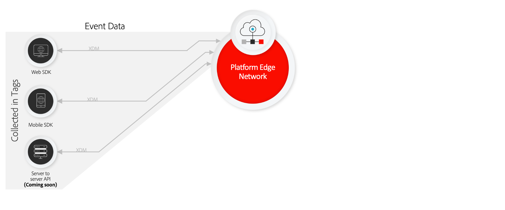
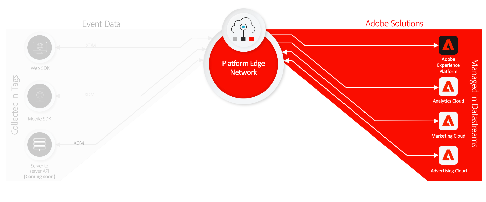
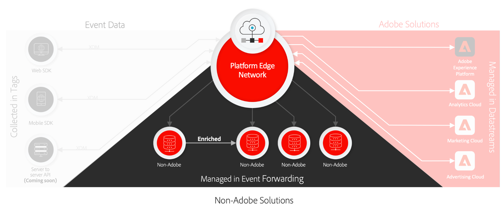

# Data collection overview

Adobe Experience Platform provides a suite of technologies that allow you to collect customer experience data from client-side sources, and send it to the Adobe Experience Platform Edge Network where it can be enriched, transformed, and distributed to Adobe or non-Adobe destinations in seconds.

Data collection is supported for the following client-side sources:

* Web-based applications
* Native mobile applications
* Over-the-top (OTT) applications

Data collection focuses on the discoverability and accessibility of ingested datasets, encompassing the following:

* [Adobe Experience Platform Edge Network](https://experienceleague.adobe.com/docs/web-sdk-learn/tutorials/introduction-to-web-sdk-and-edge-network.html)
* [Tags](../tags/home.md)
* [Datastreams](../edge/datastreams/overview.md)
* [Event forwarding](../tags/ui/event-forwarding/overview.md)
* [Adobe Experience Platform Web SDK](../edge/home.md)
* [Adobe Experience Platform Mobile SDK](https://aep-sdks.gitbook.io/docs/)
* [Adobe Experience Platform Debugger](https://chrome.google.com/webstore/detail/adobe-experience-platform/bfnnokhpnncpkdmbokanobigaccjkpob?hl=en)
* [Experience Data Model (XDM)](../xdm/home.md)
* [Adobe Experience Platform Identity Service](../identity-service/home.md)

This guide provides a high-level introduction to data collection and how it works to send data to Adobe Experience Cloud products and non-Adobe applications through the Platform Edge Network.

## Tags, Web SDK, and Mobile SDK

The Platform Web SDK and Platform Mobile SDK collapse and compress all Adobe product libraries into a single development kit for web and mobile platforms respectively. These can be implemented using raw code or using [tags](../tags/home.md) through the Data Collection UI or Adobe Experience Platform UI.

Compressing these libraries speeds up data collection and consolidates operations into a single stream from client-side devices to the Platform Edge Network.

## Platform Edge Network and datastreams {#edge}

Platform Edge Network is a globally distributed, fast, and reliable network of servers capable of receiving and processing data at tremendous scale. Using tags, you can set up [datastreams](../edge/datastreams/overview.md) for products like Adobe Target, Adobe Audience Manager, and Adobe Analytics, which allow you to activate these products on the server side without changing client-side code.

In addition, datastreams are integrated with several Platform capabilities that help ensure that any sensitive data you are sending is handled appropriately with respect to organizational policies and legal regulations. See the section on [handling sensitive data](../edge/datastreams/overview.md#sensitive) in the datastreams documentation for more information.

>[!NOTE]
>
>For a high-level introduction to the Platform Edge Network, refer to the following [interactive product tour](https://adobe-ideacloud.forgedx.com/adobe-adobe-edge-collection/adobe-experience-edge/public/mx?SUID=hgb1a48ICSCpbM6MzBYHbxnsh9DgjUy1).

## Event forwarding

[Event forwarding](../tags/ui/event-forwarding/overview.md) can tap into any Experience Platform datastream, allowing you to transform, enrich, and send data to any non-Adobe destination with extreme low latency and without adding any third-party code to the client device.

>[!NOTE]
>
>Event forwarding is a paid feature that is only included as part of the Adobe Real-Time Customer Data Platform Connections offering.

## Next steps

This document provided a high-level overview of how data collection works to automate the process of sending your collected customer experience data to Adobe products and third-party destinations.

For more information on the general workflow involved in sending event data through the Edge Network, refer to the [end-to-end overview](./e2e.md).
