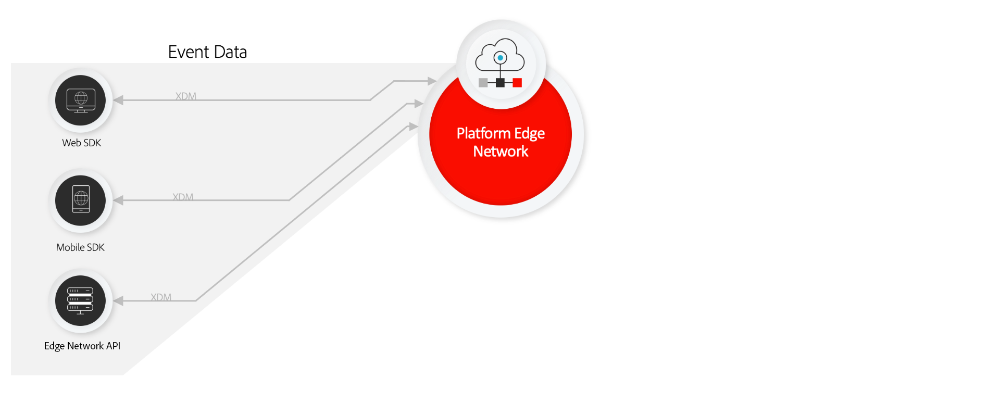

# Data collection overview

Adobe Experience Platform provides a suite of technologies that allow you to collect customer experience data from various sources and send it to the Adobe Experience Platform Edge Network. That data can then be enriched, transformed, and distributed to Adobe or non-Adobe destinations.

Adobe supports the following code languages with dedicated libraries for data collection:

* **JavaScript**: For websites and web-based applications
* **Kotlin**: For Android devices
* **Swift**: For iOS devices
* **Brightscript**: For Roku devices
* **Flutter**: For Android + iOS applications using Flutter
* **React Native**: For Android + iOS applications using React Native

The tags UI in Adobe Experience Platform Data Collection include a Web SDK and Mobile SDK extension.

If none of the above SDKs accommodate your project's needs, you can use the [Adobe Experience Platform Edge Network API](https://developer.adobe.com/data-collection-apis/docs/) to send data directly to Adobe.

## Data collection process

Instead of installing and implementing separate individual libraries for each Adobe product, you can implement one of the above SDKs or tag extensions to aggregate all desired data into a single payload. That payload is sent to a [datastream](/help/datastreams/overview.md) in the Adobe Experience Platform Edge Network.

The Adobe Experience Platform Edge Network is a globally distributed, fast, and reliable network of servers capable of receiving and processing data at a tremendous scale. When a datastream receives data, it distributes that data to each respective solution that you have configured. The data is passed along in a format that each individual product understands.

You can also use [event forwarding](/help/tags/ui/event-forwarding/overview.md) to transform, enrich, and send data to any non-Adobe destination with low latency and without any client-side implementation code.

