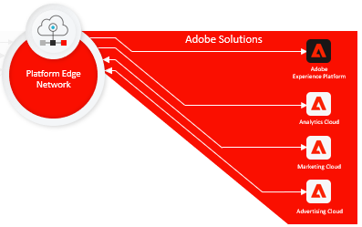
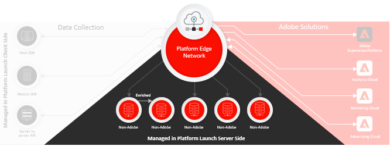

# [!DNL Collection] overview

Adobe Experience Platform Collection is a suite of technologies that enable client-side data collection for Adobe Experience Platform Edge Network from: 

* Websites
* Native mobile applications
* OTT
* Servers 

Data can be enriched, transformed, and sent to Adobe or non-Adobe destinations in seconds. 

[!DNL Data Collection] supports Adobe Experience Platform by providing users tools focused on the discoverability and accessibility of ingested datasets within [!DNL Experience Platform].

Adobe Experience Platform Collection Developer includes the following technologies: 

* [Adobe Experience Platform](https://experienceleague.adobe.com/docs/experience-platform.html) 
* Adobe Experience Platform Data Streams
* [Adobe Experience Platform Edge Network](https://experienceleague.adobe.com/docs/web-sdk-learn/tutorials/introduction-to-web-sdk-and-edge-network.html)
* [Adobe Experience Platform Launch Client Side](https://experienceleague.adobe.com/docs/launch.html)
* [Adobe Experience Platform Web SDK](https://experienceleague.adobe.com/docs/experience-platform/edge/home.html)

## Simpler implementations, faster client-side performance

Adobe Experience Platform Web and Mobile SDKs collapse and compress all Adobe product libraries into a single web or mobile SDK. Compressing the libraries speeds up and simplifies data collection into a single stream from these devices to Adobe Experience Platform Edge Network.

Adobe Experience Platform Server SDK streams data from any server to Adobe Experience Platform Edge Network.

## Flip-the-switch process to deploy Adobe technology

Adobe Experience Platform Edge Network is a globally distributed, fast, and reliable network of servers capable of receiving and processing data at tremendous scale. Using Adobe Experience Platform Data Streams you can turn on Adobe products server-side without changing client-side code. 

## Transform, enrich, and send data Fast and secure

Adobe Experience Platform Launch Server Side can tap into any Adobe Experience Platform Data Stream. You can transform, enrich, and send data to any non-Adobe destination with extreme low latency without adding any third-party code to the client device providing faster and more secure data collection and distribution.   

