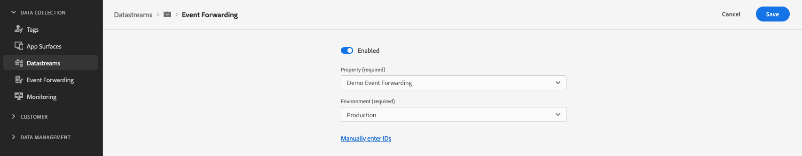

# Interacting with third-party solutions

## Overview {#overview}

Use the event forwarding capabilities of the Edge Network Server API to send collected data to non-Adobe solutions.

## Configure datastream event forwarding {#event-forwarding}

To enable third-party solutions to receive data from Server API, you need to [configure your datastream](../edge/fundamentals/datastreams.md#event-forwarding-settings) for event forwarding.

