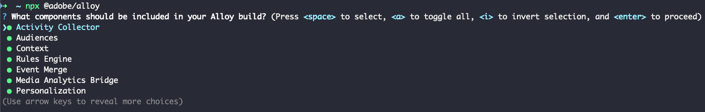
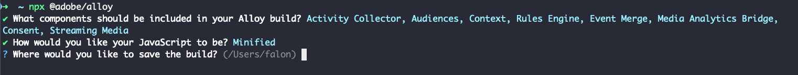
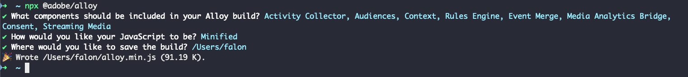

# Create a custom Web SDK build

The Experience Platform Web SDK library includes multiple modules for various features like personalization, identity, link tracking, and more. Depending on your use cases, you might only need specific features instead of the entire library. Creating a custom Web SDK build allows you to select only the modules you need, reducing the library size and improving performance.

## Use cases {#use-case}

Creating a custom Web SDK build helps reduce the library size and increase performance. Here are some examples:

### Media Analytics removal {#media-analytics-removal}

If your website doesn't have media content, you can exclude the [!DNL Media Analytics] and the [!DNL Streaming Media] modules from the build. This can reduce the Web SDK build size by up to 50% and improve loading speed.

### Personalization removal {#personalization}

If you only need to collect user metrics and don't plan to use Adobe Target or Journey Optimizer for personalization, you can exclude the [!DNL Personalization] module. This reduces the library size while still allowing you to collect the necessary metrics.

## Prerequisites {#prerequisites}

To create a custom Web SDK build, you need the Web SDK NPM package. Make sure you have [Node.js](https://nodejs.org/en/download/package-manager/all) installed on your machine. See the documentation on how to [install the Web SDK using the NPM package](npm.md) for more details.

## Components and dependencies {#components-dependencies}

Before creating a custom Web SDK build, define the Web SDK components and commands you plan to use. Some commands depend on specific modules being included in the build.

The table below shows the relationship between Web SDK modules and the commands they include:

| Module dependency | Configuration parameters | Commands | Size category |
|---------|----------|---------|---------|
| Activity Collector | [`clickCollectionEnabled`](../commands/configure/clickcollectionenabled.md) | N/A | Medium |
| Audiences | N/A | N/A | Small |
| Context | [`context`](../commands/configure/context.md) | N/A | Small |
| Rules Engine | `personalizationStorageEnabled` | <ul><li>`evaluateRulesets`</li><li>[`subscribeRulesetItems`](../commands/subscriberulesetitems.md)</li></ul> | Medium |
| Event Merge | N/A | `createEventMergeId` | Small |
| Media Analytics Bridge | N/A | [`getMediaAnalyticsTracker`](../commands/getmediaanalyticstracker.md) | Large |
| Personalization | <ul><li>[`prehidingStyle`](../commands/configure/prehidingstyle.md)</li><li>[`targetMigrationEnabled`](../commands/configure/targetmigrationenabled.md)</li><li>[`autoCollectPropositionInteractions`](../commands/configure/autocollectpropositioninteractions.md)</li></ul>  | N/A | Large |
| Consent | [`defaultConsent`](../commands/configure/defaultconsent.md) | [`setConsent`](../commands/setconsent.md) | Small |
| Streaming Media | [`streamingMedia`](../commands/configure/streamingmedia.md) | <ul><li>[`createMediaSession`](../commands/createmediasession.md)</li><li>[`sendMediaEvent`](../commands/sendmediaevent.md)</li></ul> | Large |

## Create a custom Web SDK build using the NPM package {#create-custom-build}

1. Open your terminal and run `npx @adobe/alloy`. You are asked to select the Web SDK components that you would like your custom build to include.

    

    Use your arrow keys to move up and down in the modules list.

    * Press **Space** to enable or disable the selected module.
    * Press `A` to enable or disable all modules.
    * Press `I` to invert your selection.
    * Press `Enter` to confirm your selection and go to the next step.

1. After you have selected the modules to include in your custom build, you can choose between saving a minified or unminified version of your custom Web SDK library build. Select your desired option and press `Enter`.

    

1. Next, you are asked where you want to save the build on your local machine. Press `Enter` to confirm the preselected location or enter a new location.

    

1. Once you confirm the location, your custom build is generated and saved.

    
