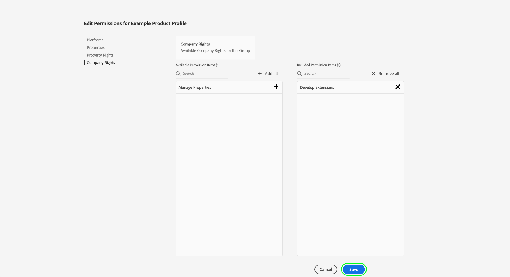
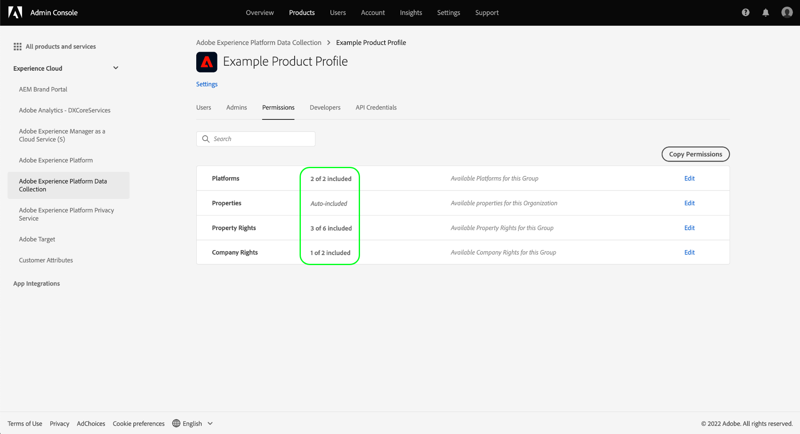
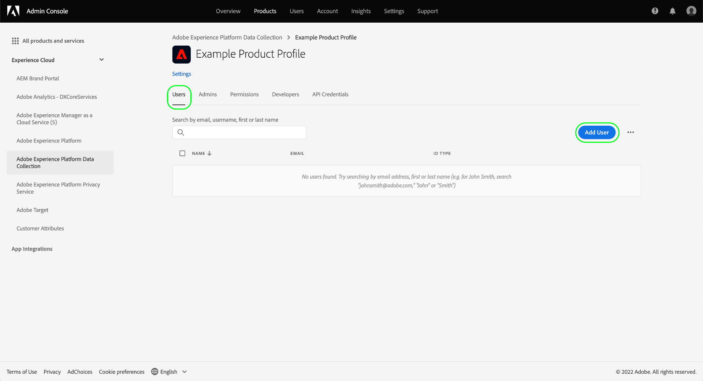

# Permission management for data collection in Experience Platform

[Data collection in Adobe Experience Platform](./home.md) is comprised of several different technologies which work together to collect and transfer your data. Access to these technologies is controlled through granular role-based permissions in Adobe Admin Console.

This guide shows you how to manage permissions for data collection features.

## Getting started

In order to configure access control for data collection, you must have administrator privileges for an organization that has a product integration with Adobe Experience Platform Data Collection. The minimum role that can grant or withdraw permissions is a **product profile administrator**. Other administrator roles that can manage permissions are **product administrators** (can manage all profiles within a product) and **system administrators** (no restrictions). See the article on [administrative roles](https://helpx.adobe.com/enterprise/using/admin-roles.html) in the Adobe Enterprise administration guide for more information.

This guide assumes you are familiar with basic Admin Console concepts like product profiles and how they grant product permissions to individual users and groups. For more information, see the [Admin Console user guide](https://helpx.adobe.com/enterprise/using/admin-console.html).

## Available permissions

The relevant permissions for Data Collection are provided through two product designations in Admin Console: **Adobe Experience Platform** and **Adobe Experience Platform Data Collection**. The sections below outline the permissions provided under each product along with descriptions of the specific capabilities that they grant access to.

### Adobe Experience Platform permissions

Permissions under Adobe Experience Platform include access to datastreams, identities, schemas, and sandboxes. For steps on how to configure Adobe Experience Platform permissions, see the [access control user guide](../access-control/ui/overview.md).

| Category | Permission | Description |
| --- | --- | --- |
| Sandboxes | (N/A) | Depending on the [sandboxes](../sandboxes/home.md) that have been created under your organization, you can control access to each of them through this permission category in Admin Console. |
| Data Modeling | Manage Schemas | Grants the ability to view, create, and edit [Experience Data Model (XDM) schemas](../xdm/home.md). |
| Data Modeling | View Schemas | Grants read-only access to schemas. |
| Identity Management | Manage Identity Namespaces | Grants the ability to view, create, and edit [identity namespaces](../identity-service/namespaces.md). |
| Identity Management | View Identity Namespaces | Grants read-only access to identity namespaces. |
| Data Collection | Manage Datastreams | Grants the ability to view, create, and edit [datastreams](../edge/datastreams/overview.md). |
| Data Collection | View Datastreams | Grants read-only access to datastreams. |

{style="table-layout:auto"}

### Adobe Experience Platform Data Collection permissions

Permissions under Adobe Experience Platform Data Collection control access to tags and event forwarding capabilities, including properties, extensions, and environments. For steps on how to configure Adobe Experience Platform Data Collection permissions, see the [section below](#manage).

| Category | Permission | Description |
| --- | --- | --- |
| Platforms | Web | Grants access to [web properties](../tags/ui/administration/companies-and-properties.md) when combined with other property rights. |
| Platforms | Mobile | Grants access to [mobile properties](../tags/ui/administration/companies-and-properties.md) when combined with other property rights. |
| Platforms | Edge | Grants access to [Event Forwarding Edge properties](../tags/ui/event-forwarding/getting-started.md) when combined with other property rights. |
| Properties | (N/A) | Depending on the properties that have been created under your organization, you can control access to each of them through this permission category in Admin Console.  A user's assigned property rights only apply to the properties they have been granted access to through this permission category. |
| Property Rights | Approve | Grants the ability to approve a library build as part of the [publishing flow](../tags/ui/publishing/publishing-flow.md). |
| Property Rights | Develop | Grants the ability to develop a library build as part of the [publishing flow](../tags/ui/publishing/publishing-flow.md). |
| Property Rights | Edit Property | Grants the ability to edit the basic configuration for the properties a user has access to. |
| Property Rights | Manage Environments | Grants the ability to manage the [environments](../tags/ui/publishing/environments.md) for the properties a user has access to. |
| Property Rights | Manage Extensions | Grants the ability to manage the [extensions](../tags/ui/managing-resources/extensions/overview.md) for the properties a user has access to. |
| Property Rights | Publish | Grants the ability to publish a library build as part of the [publishing flow](../tags/ui/publishing/publishing-flow.md). |
| Company Rights | Develop Extensions | Grants the ability to create and modify extension packages that are owned by your organization, including private releases and requests for public release. |
| Company Rights | Manage Extensions | This permission is only applicable if you have a license for Adobe Journey Optimizer or another solution that grants access to mobile in-app and push messaging. This allows you to manage the apps that Adobe Experience Cloud knows about along with the necessary push credentials needed to communicate with the Firebase Cloud Messaging service and the Apple Push Notification service. |

{style="table-layout:auto"}

>[!NOTE]
>
>For more information on how these permissions affect capabilities in tags, including administration strategies for common scenarios, see the tags documentation on [user permissions](../tags/ui/administration/user-permissions.md).
## Manage permissions {#manage}

Permissions for data collection are managed through two product designations: **Adobe Experience Platform** and **Adobe Experience Platform Data Collection**.

Refer to the subsections below for steps on how to manage the relevant permissions under each product in Admin Console:

* [Adobe Experience Platform permissions](#manage-platform)
* [Adobe Experience Platform Data Collection permissions](#manage-collection)

### Manage permissions under Adobe Experience Platform {#manage-platform}

From the **[!UICONTROL Permissions]** area in Adobe Experience Platform select the role that you want to edit.

In order to access data collection features, you must enable all permissions in the **[!UICONTROL Sandboxes]**, **[!UICONTROL Data Modeling]**, **[!UICONTROL Identity Management]**, and **[!UICONTROL Data Collection]** categories.

See the [access control UI guide](../access-control/ui/overview.md) for detailed instructions on managing Platform permissions.

>[!NOTE]
>
>Depending on the product SKUs your organization has access to, you may not have every Platform permission available to you.

### Manage permissions under Adobe Experience Platform Data Collection {#manage-collection}

To manage these permissions, log in to Admin Console and select **[!UICONTROL Products]** from the top navigation, then select **[!UICONTROL Adobe Experience Platform Data Collection]**.

#### Select or create a product profile

The next screen shows a list of available product profiles for Data Collection under your organization, the default profile being **[!DNL Default Data Collection All Access]**. You can choose to edit the default product profile if you wish, or you can select **[!UICONTROL New Profile]** to create one. If you have multiple roles or user groups in your organization that require different levels of access, you should create a separate product profile for each of them.

After selecting or creating a product profile, you can use the **[!UICONTROL Edit]** icons to start [editing permissions](#edit-permissions) for the profile, or select the **[!UICONTROL Users]** tab to start [assigning users](#assign-users) to the profile.

#### Edit permissions for the product profile {#edit-permissions}

When editing permissions for a profile, available permissions are listed in the left column while those that are included in the profile are listed in the right column. Select the listed permissions to move them between either column.

Permissions are organized into categories. To switch between categories, select the desired category from the left navigation.

Select **[!UICONTROL Save]** once you have finished configuring permissions.

The product profile view reappears with the added permissions reflected.

#### Assign users to the product profile {#assign-users}

To assign users to the product profile (and grant them the profile's configured permissions), select the **[!UICONTROL Users]** tab, followed by **[!UICONTROL Add user]**.

For more information on managing users for a product profile, see the [Admin Console documentation](https://helpx.adobe.com/enterprise/using/manage-product-profiles.html).

## Next steps

This guide covered the available permissions for Data Collection and how to manage them through Admin Console. For more information on managing permissions for other Adobe Experience Platform capabilities, refer to the [access control documentation](../access-control/home.md).
