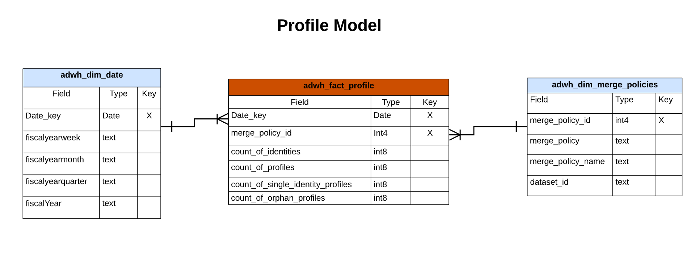
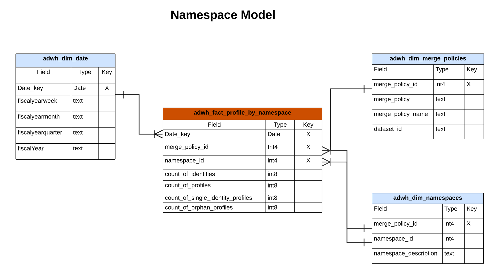
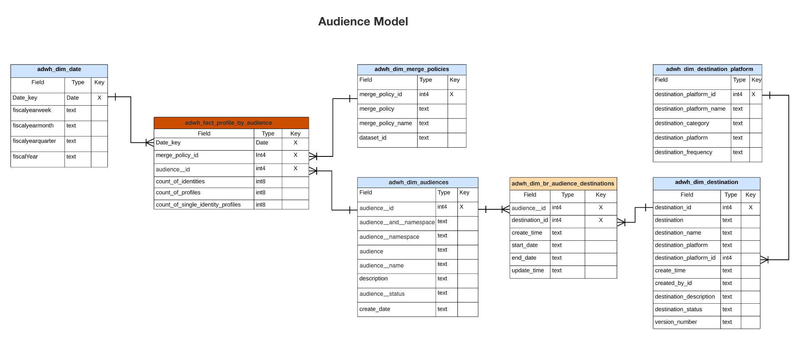
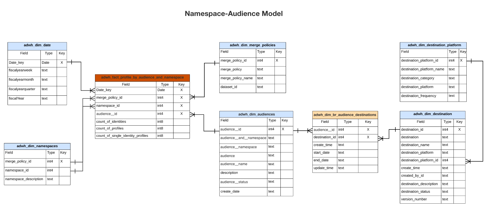
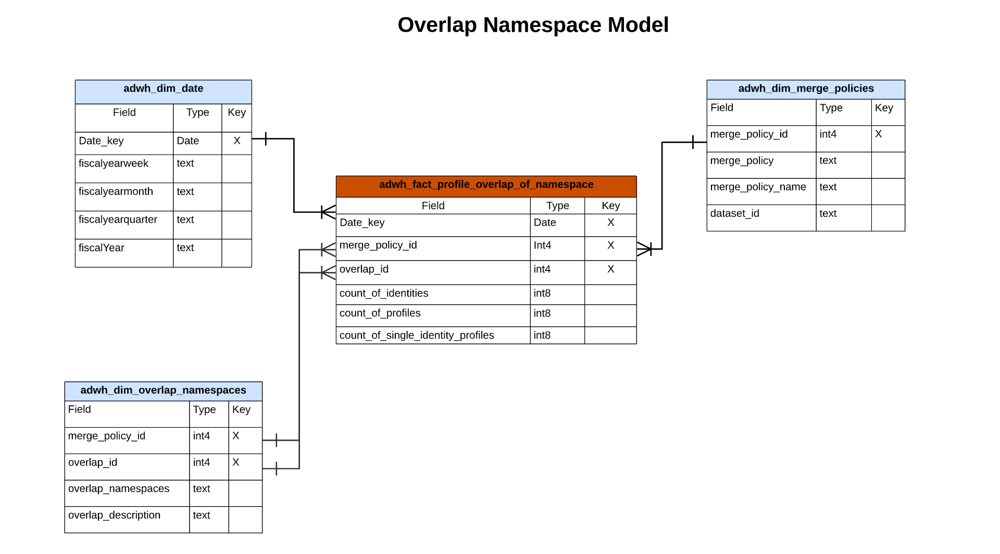
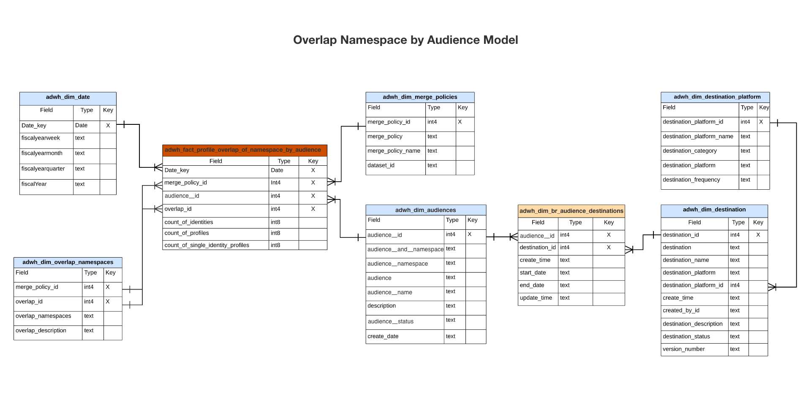

# Real-Time Customer Data Platform Insights Data Model

The Real-Time Customer Data Platform Insights Data Model feature exposes the data models and SQL that power the insights for various profile, destination, and segmentation widgets. You can customize these SQL query templates to create Real-Time CDP reports for your marketing and key performance indicator (KPI) use cases. These insights can then be used as custom widgets for your user-defined dashboards. See the query accelerated store reporting insights documentation to learn [how to build a reporting insights data model through Query Service for use with accelerated store data and user-defined dashboards](../query-service/data-distiller/query-accelerated-store/reporting-insights-data-model.md).

## Prerequisites

This guide requires a working understanding of the [user-defined dashboards feature](./user-defined-dashboards.md). Please read the documentation before continuing with this guide.

## Real-Time CDP insight reports and use cases

Real-Time CDP reporting provides insights into your profile data and its relationship with audiences and destinations. Various star schema models were developed to answer a variety of common marketing use cases and each data model can support several use cases.

>[!IMPORTANT]
>
>The data used for Real-Time CDP reporting is accurate for a chosen merge policy and from the most recent daily snapshot.

### Profile model {#profile-model}

The profile model is comprised of three datasets: 

- `adwh_dim_date`
- `adwh_fact_profile`
- `adwh_dim_merge_policies`

The image below contains the relevant data fields in each dataset.



#### The profile count use case

The logic used for the profile count widget returns the total number of merged profiles within the Profile Store at the time the snapshot was taken. See the [[!UICONTROL Profile count] widget documentation](./guides/profiles.md#profile-count) for more information. 

The SQL that generates the [!UICONTROL Profile count] widget is seen in the collapsible section below.

+++SQL query

```sql
SELECT adwh_dim_merge_policies.merge_policy_name,
  sum(adwh_fact_profile.count_of_profiles) CNT
FROM qsaccel.profile_agg.adwh_fact_profile
LEFT OUTER JOIN qsaccel.profile_agg.adwh_dim_merge_policies ON adwh_dim_merge_policies.merge_policy_id=adwh_fact_profile.merge_policy_id
WHERE adwh_fact_profile.date_key='${lastProcessDate}'
AND adwh_fact_profile.merge_policy_id=${mergePolicyId}
GROUP BY adwh_dim_merge_policies.merge_policy_name;
```

+++

#### The Single identity profiles use case

The logic used for the [!UICONTROL Single identity profiles] widget provides a count of your organization's profiles that only have one type of ID type that creates their identity. See the[[!UICONTROL Single identity profiles] widget documentation](./guides/profiles.md#single-identity-profiles) for more information.

The SQL that generates the [!UICONTROL Single identity profiles] widget is seen in the collapsible section below.

+++SQL query

```sql
SELECT adwh_dim_merge_policies.merge_policy_name,
  sum(adwh_fact_profile.count_of_Single_Identity_profiles) CNT
FROM QSAccel.profile_agg.adwh_fact_profile
LEFT OUTER JOIN QSAccel.profile_agg.adwh_dim_merge_policies ON adwh_dim_merge_policies.merge_policy_id=adwh_fact_profile.merge_policy_id
WHERE adwh_fact_profile.date_key='${lastProcessDate}'
  AND adwh_fact_profile.merge_policy_id =${mergePolicyId}
GROUP BY adwh_dim_merge_policies.merge_policy_name;
```

+++

### Namespace model {#namespace-model}

The namespace model is comprised of the following datasets: 

- `adwh_dim_date`
- `adwh_fact_profile_by_namespace`
- `adwh_dim_merge_policies`
- `adwh_dim_namespaces`

The image below contains the relevant data fields in each dataset.



#### Profiles by identity use case

The [!UICONTROL Profiles by identity] widget displays the breakdown of identities across all of the merged profiles in your Profile Store. See the [[!UICONTROL Profiles by identity] widget documentation](./guides/profiles.md#profiles-by-identity) for more information.

The SQL that generates the [!UICONTROL Profiles by identity] widget is seen in the collapsible section below.

+++SQL query

```sql
SELECT adwh_dim_namespaces.namespace_description,
    sum(adwh_fact_profile_by_namespace.count_of_profiles) count_of_profiles
FROM qsaccel.profile_agg.adwh_fact_profile_by_namespace
JOIN qsaccel.profile_agg.adwh_dim_namespaces ON adwh_fact_profile_by_namespace.namespace_id = adwh_dim_namespaces.namespace_id
AND adwh_fact_profile_by_namespace.merge_policy_id = adwh_dim_namespaces.merge_policy_id
WHERE adwh_fact_profile_by_namespace.merge_policy_id =${mergePolicyId}
AND adwh_fact_profile_by_namespace.date_key = '${lastProcessDate}'
GROUP BY adwh_fact_profile_by_namespace.date_key,
        adwh_fact_profile_by_namespace.merge_policy_id,
        adwh_dim_namespaces.namespace_description
ORDER BY count_of_profiles DESC
LIMIT 5;
```

+++

#### Single identity profiles by identity use case

The logic used for the [!UICONTROL Single identity profiles by identity] widget illustrates the total number of profiles that are identified with only a single unique identifier. See the [Single identity profiles by identity widget documentation](./guides/profiles.md#single-identity-profiles-by-identity) for more information.

The SQL that generates the [!UICONTROL Single identity profiles by identity] widget is seen in the collapsible section below.

+++SQL query

```sql
SELECT
  adwh_dim_namespaces.namespace_description,
  sum(adwh_fact_profile_by_namespace.count_of_Single_Identity_profiles) count_of_Single_Identity_profiles
FROM
  qsaccel.profile_agg.adwh_fact_profile_by_namespace
  LEFT OUTER JOIN
    qsaccel.profile_agg.adwh_dim_namespaces
    ON adwh_fact_profile_by_namespace.namespace_id = adwh_dim_namespaces.namespace_id
AND adwh_fact_profile_by_namespace.merge_policy_id = adwh_dim_namespaces.merge_policy_id
WHERE
  adwh_fact_profile_by_namespace.merge_policy_id=${mergePolicyId}
  AND adwh_fact_profile_by_namespace.date_key='${lastProcessDate}'
GROUP BY
  adwh_fact_profile_by_namespace.date_key,
  adwh_fact_profile_by_namespace.merge_policy_id,
  adwh_dim_namespaces.namespace_description;
```

+++

### Audience model {#audience-model}

The audience model is comprised of the following datasets: 

- `adwh_dim_date`
- `adwh_fact_profile_by_segment`
- `adwh_dim_merge_policies`
- `adwh_dim_segments`
- `adwh_dim_br_segment_destinations`
- `adwh_dim_destination`
- `adwh_dim_destination_platform` 

The image below contains the relevant data fields in each dataset.



#### Audience size use case

The logic used for the [!UICONTROL Audience size] widget returns the total number of merged profiles within the selected audience at the time of the most recent snapshot. See the [[!UICONTROL Audience size] widget documentation](./guides/audiences.md#audience-size) for more information.

The SQL that generates the [!UICONTROL Audience size] widget is seen in the collapsible section below.

+++SQL query

```sql
SELECT adwh_fact_profile_by_segment.date_key,
       adwh_dim_merge_policies.merge_policy_name,
       adwh_dim_segments.segment,
       adwh_dim_segments.segment_name,
       sum(adwh_fact_profile_by_segment.count_of_profiles)count_of_profiles
FROM qsaccel.profile_agg.adwh_fact_profile_by_segment
LEFT OUTER JOIN qsaccel.profile_agg.adwh_dim_segments ON adwh_fact_profile_by_segment.segment_id = adwh_dim_segments.segment_id
LEFT OUTER JOIN qsaccel.profile_agg.adwh_dim_merge_policies ON adwh_fact_profile_by_segment.merge_policy_id=adwh_dim_merge_policies.merge_policy_id
WHERE adwh_fact_profile_by_segment.date_key ='${lastProcessDate}'
  AND adwh_fact_profile_by_segment.merge_policy_id=${mergePolicyId}
GROUP BY adwh_fact_profile_by_segment.date_key,
         adwh_dim_merge_policies.merge_policy_name,
         adwh_dim_segments.segment,
         adwh_dim_segments.segment_name
ORDER BY count_of_profiles DESC
LIMIT 20;
```

+++

#### Audience size change trend use case

The logic used for the [!UICONTROL Audience size change trend] widget provides a line graph illustration of the difference in the total number of profiles that qualified for a given audience between the most recent daily snapshots. See the [[!UICONTROL Audience size change trend] widget documentation](./guides/audiences.md#audience-size-change-trend) for more information.

The SQL that generates the [!UICONTROL Audience size change trend] widget is seen in the collapsible section below.

+++SQL query

```sql
SELECT DISTINCT cast(adwh_dim_segments.create_date AS Date) Date_key, adwh_dim_merge_policies.merge_policy_name,
  count(DISTINCT adwh_dim_segments.segment_id)Segments_Added
FROM qsaccel.profile_agg.adwh_fact_profile_by_segment
JOIN qsaccel.profile_agg.adwh_dim_segments ON adwh_fact_profile_by_segment.segment_id = adwh_dim_segments.segment_id
JOIN qsaccel.profile_agg.adwh_dim_merge_policies ON adwh_fact_profile_by_segment.merge_policy_id=adwh_dim_merge_policies.merge_policy_id
WHERE Cast(adwh_dim_segments.create_date AS date) >= dateadd(DAY, - ${dayRange}, '${lastProcessDate}')
AND adwh_fact_profile_by_segment.merge_policy_id=${mergePolicyId}
GROUP BY cast(adwh_dim_segments.create_date AS date), adwh_dim_merge_policies.merge_policy_name ;
```

+++

#### Most used destinations use case

The logic used in the [!UICONTROL Most used destinations] widget lists your organization's most used destinations according to the number of audiences mapped to them. This ranking provides insight into which destinations are being utilized while also potentially showing those that may be underutilized. See the documentation on the [[!UICONTROL Most used destinations] widget](./guides/destinations.md#most-used-destinations) for more information.

The SQL that generates the [!UICONTROL Most used destinations] widget is seen in the collapsible section below.

+++SQL query

```sql
SELECT
   adwh_dim_destination.destination_name, adwh_dim_destination.destination_id,
   count( distinct adwh_dim_br_segment_destinations.segment_id ) segment_count
FROM
   qsaccel.profile_agg.adwh_dim_destination
   join qsaccel.profile_agg.adwh_dim_br_segment_destinations
 ON
   adwh_dim_destination.destination_id = adwh_dim_br_segment_destinations.destination_id
 WHERE
   adwh_dim_destination.destination_name is not null
 group by
   adwh_dim_destination.destination_name,
   adwh_dim_destination.destination_id
   order by segment_count desc limit 5;
```

+++

#### Recently activated audiences use case

The logic for the [!UICONTROL Recently activated audiences] widget provides a list of the audiences most recently mapped to a destination. This list provides a snapshot of the audiences and destinations that are actively in use in the system and can help in troubleshooting any erroneous mappings. See the [[!UICONTROL Recently activated audiences] widget documentation](./guides/destinations.md#recently-activated-audiences) for more information.

The SQL that generates the [!UICONTROL Recently activated audiences] widget is seen in the collapsible section below.

+++SQL query

```sql
SELECT segment_name, segment, destination_name, a.create_time create_time
FROM qsaccel.profile_agg.adwh_dim_br_segment_destinations a
INNER JOIN qsaccel.profile_agg.adwh_dim_segments b ON a.segment_id = b.segment_id
INNER JOIN qsaccel.profile_agg.adwh_dim_destination c ON a.destination_id = c.destination_id
ORDER BY create_time desc, segment LIMIT 5;
```

+++

### Namespace-audience model 

The namespace-audience model is comprised of the following datasets:

- `adwh_dim_date`
- `adwh_dim_namespaces`
- `adwh_fact_profile_by_segment_and_namespace`
- `adwh_dim_merge_policies`
- `adwh_dim_segments`
- `adwh_dim_br_segment_destinations`
- `adwh_dim_destination`
- `adwh_dim_destination_platform`

The image below contains the relevant data fields in each dataset.



#### Profiles by identity for an audience use case

The logic used in the [!UICONTROL Profiles by identity] widget provides a breakdown of identities across all of the merged profiles in your Profile Store for a given audience. See the [[!UICONTROL Profiles by identity] widget documentation](./guides/audiences.md#profiles-by-identity) for more information.

The SQL that generates the [!UICONTROL Profiles by identity] widget is seen in the collapsible section below.

+++SQL query

```sql
SELECT adwh_dim_namespaces.namespace_description,
  sum( adwh_fact_profile_by_segment_and_namespace.count_of_profiles) count_of_profiles
FROM qsaccel.profile_agg.adwh_fact_profile_by_segment_and_namespace
LEFT OUTER JOIN qsaccel.profile_agg.adwh_dim_namespaces
ON adwh_fact_profile_by_segment_and_namespace.namespace_id = adwh_dim_namespaces.namespace_id
AND adwh_fact_profile_by_segment_and_namespace.merge_policy_id = adwh_dim_namespaces.merge_policy_id
WHERE adwh_fact_profile_by_segment_and_namespace.segment_id = {segment_id}
AND adwh_fact_profile_by_segment_and_namespace.merge_policy_id = {merge_policy_id}
AND adwh_fact_profile_by_segment_and_namespace.date_key = '{date}'
GROUP BY adwh_dim_namespaces.namespace_description;
```

+++

### Overlap namespace model 

The overlap namespace model is comprised of the following datasets: 

- `adwh_dim_date`
- `adwh_dim_overlap_namespaces`
- `adwh_fact_profile_overlap_of_namespace`
- `adwh_dim_merge_policies`

The image below contains the relevant data fields in each dataset.



#### Identity overlap (profiles) use case

The logic used in the [!UICONTROL Identity overlap] widget displays the overlap of profiles in your **Profile Store** that contain the two selected identities. For more information, see the [[!UICONTROL Identity overlap] widget section of the [!UICONTROL Profiles] dashboard documentation](./guides/profiles.md#identity-overlap).

The SQL that generates the [!UICONTROL Identity overlap] widget is seen in the collapsible section below.

+++SQL query

```sql
SELECT Sum(overlap_col1) overlap_col1,
       Sum(overlap_col2) overlap_col2,
       coalesce(Sum(overlap_count), 0) overlap_count
  FROM
    (SELECT 0 overlap_col1,
            0 overlap_col2,
            Sum(count_of_profiles) overlap_count
     FROM qsaccel.profile_agg.adwh_fact_profile_overlap_of_namespace
     WHERE adwh_fact_profile_overlap_of_namespace.merge_policy_id = ${mergePolicyId}
       AND adwh_fact_profile_overlap_of_namespace.date_key = '${lastProcessDate}'
       AND adwh_fact_profile_overlap_of_namespace.overlap_id IN
         (SELECT adwh_dim_overlap_namespaces.overlap_id
          FROM qsaccel.profile_agg.adwh_dim_overlap_namespaces
          WHERE adwh_dim_overlap_namespaces.merge_policy_id=${mergePolicyId}
            AND adwh_dim_overlap_namespaces.overlap_namespaces IN ('${namespace1}',
                                                                   '${namespace2}')
          GROUP BY adwh_dim_overlap_namespaces.overlap_id
          HAVING Count(*) > 1)
     UNION ALL SELECT count_of_profiles overlap_col1,
                      0 overlap_col2,
                      0 overlap_count
     FROM qsaccel.profile_agg.adwh_fact_profile_by_namespace
     JOIN qsaccel.profile_agg.adwh_dim_namespaces ON
     adwh_fact_profile_by_namespace.namespace_id = adwh_dim_namespaces.namespace_id
     AND adwh_fact_profile_by_namespace.merge_policy_id = adwh_dim_namespaces.merge_policy_id
     WHERE adwh_fact_profile_by_namespace.merge_policy_id = ${mergePolicyId}
       AND adwh_fact_profile_by_namespace.date_key = '${lastProcessDate}'
       AND adwh_dim_namespaces.namespace_description = '${namespace1}'
     UNION ALL SELECT 0 overlap_col1,
                      count_of_profiles overlap_col2,
                      0 Overlap_count
     FROM qsaccel.profile_agg.adwh_fact_profile_by_namespace
     JOIN qsaccel.profile_agg.adwh_dim_namespaces ON
     adwh_fact_profile_by_namespace.namespace_id = adwh_dim_namespaces.namespace_id
     AND adwh_fact_profile_by_namespace.merge_policy_id = adwh_dim_namespaces.merge_policy_id
     WHERE adwh_fact_profile_by_namespace.merge_policy_id = ${mergePolicyId}
       AND adwh_fact_profile_by_namespace.date_key = '${lastProcessDate}'
       AND adwh_dim_namespaces.namespace_description = '${namespace2}' ) a;
```

+++

### Overlap Namespace by audience model 

The overlap namespace by audience model is comprised of the following datasets: 

- `adwh_dim_date`
- `adwh_dim_overlap_namespaces`
- `adwh_fact_profile_overlap_of_namespace_by_segment`
- `adwh_dim_merge_policies`
- `adwh_dim_segments`
- `adwh_dim_br_segment_destinations`
- `adwh_dim_destination`
- `adwh_dim_destination_platform`

The image below contains the relevant data fields in each dataset.



#### Identity overlap (audiences) use case

The logic used in the [!UICONTROL Audiences] dashboard [!UICONTROL Identity overlap] widget illustrates the overlap of profiles that contain the two selected identities for a particular audience. For more information, see the [[!UICONTROL Identity overlap] widget section of the [!UICONTROL Audiences] dashboard documentation](./guides/audiences.md#identity-overlap).

The SQL that generates the [!UICONTROL Identity overlap] widget is seen in the collapsible section below.

+++SQL query

```sql
SELECT
   Sum(overlap_col1) overlap_col1,
   Sum( overlap_col2) overlap_col2,
   Sum(overlap_count) Overlap_count
FROM
   (
      SELECT
         0 overlap_col1,
         0 overlap_col2,
         Sum(count_of_profiles) Overlap_count
      FROM
         qsaccel.profile_agg.adwh_fact_profile_overlap_of_namespace_by_segment
      WHERE
         adwh_fact_profile_overlap_of_namespace_by_segment.segment_id = $ {segmentId}
         and adwh_fact_profile_overlap_of_namespace_by_segment.merge_policy_id =$ {mergePolicyId}
         and adwh_fact_profile_overlap_of_namespace_by_segment.date_key = '${lastProcessDate}'
         and adwh_fact_profile_overlap_of_namespace_by_segment.overlap_id IN
         (
            SELECT
               adwh_dim_overlap_namespaces.overlap_id
            FROM
               qsaccel.profile_agg.adwh_dim_overlap_namespaces
            WHERE
               adwh_dim_overlap_namespaces.merge_policy_id =$ {mergePolicyId}
               AND adwh_dim_overlap_namespaces.overlap_namespaces IN
               (
                  '${namespace1}',
                  '${namespace2}'
               )
            GROUP BY
               adwh_dim_overlap_namespaces.overlap_id
            HAVING
               Count(*) > 1
         )
      UNION ALL
      SELECT
         count_of_profiles overlap_col1,
         0 overlap_col2,
         0 Overlap_count
      FROM
         qsaccel.profile_agg.adwh_fact_profile_by_segment_and_namespace
         LEFT OUTER JOIN
            qsaccel.profile_agg.adwh_dim_namespaces
            ON adwh_fact_profile_by_segment_and_namespace.namespace_id = adwh_dim_namespaces.namespace_id
            and adwh_fact_profile_by_segment_and_namespace.merge_policy_id = adwh_dim_namespaces.merge_policy_id
      WHERE
         adwh_dim_namespaces.namespace_description = '${namespace1}'
         and adwh_fact_profile_by_segment_and_namespace.segment_id = $ {segmentId}
         and adwh_fact_profile_by_segment_and_namespace.merge_policy_id =$ {mergePolicyId}
         and adwh_fact_profile_by_segment_and_namespace.date_key = '${lastProcessDate}'
      UNION ALL
      SELECT
         0 overlap_col1,
         count_of_profiles overlap_col2,
         0 Overlap_count
      FROM
         qsaccel.profile_agg.adwh_fact_profile_by_segment_and_namespace
         LEFT OUTER JOIN
            qsaccel.profile_agg.adwh_dim_namespaces
            ON adwh_fact_profile_by_segment_and_namespace.namespace_id = adwh_dim_namespaces.namespace_id
            and adwh_fact_profile_by_segment_and_namespace.merge_policy_id = adwh_dim_namespaces.merge_policy_id
      WHERE
         adwh_dim_namespaces.namespace_description = '${namespace2}'
         and adwh_fact_profile_by_segment_and_namespace.segment_id = $ {segmentId}
         and adwh_fact_profile_by_segment_and_namespace.merge_policy_id =$ {mergePolicyId}
         and adwh_fact_profile_by_segment_and_namespace.date_key = '${lastProcessDate}'
   )
   a;
```

+++
