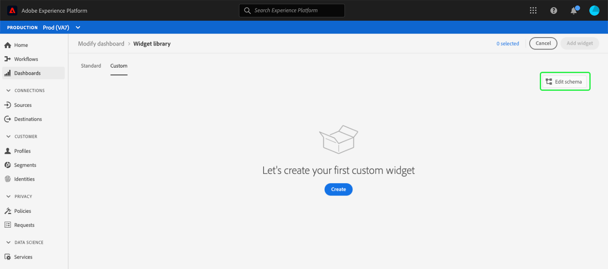
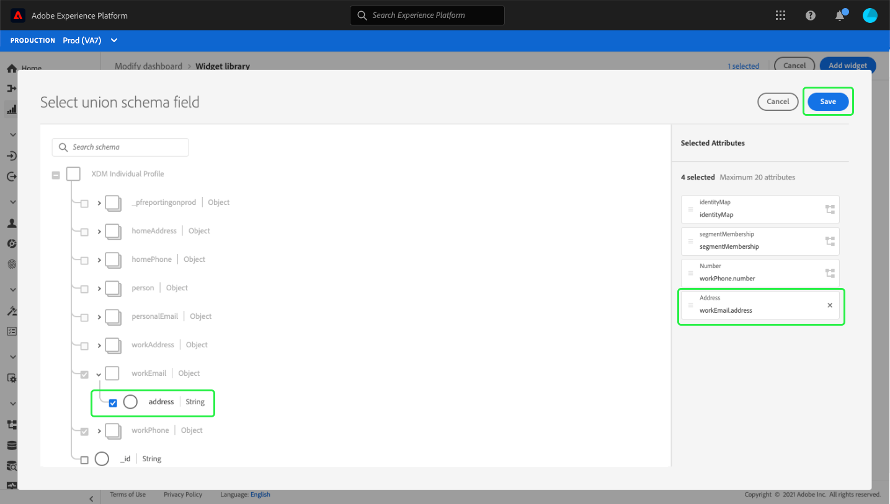

# Edit schema to create custom widgets

In order to create custom widgets for Adobe Experience Platform dashboards, you must first identify the Real-time Customer Profile attributes upon which the widgets will be based.

This guide provides step-by-step instructions for editing your organization's schema by selecting attributes in order to create custom dashboard widgets.

Once attributes have been selected and the schema has been configured, you can proceed with the steps for [creating custom widgets for your dashboards](custom-widgets.md).

>[!NOTE]
>
>Users must be granted "Manage Standard Dashboards" permission in order to be able to edit the schema. For steps on granting access permissions for dashboards, please refer to the [dashboard permissions guide](../permissions.md).

## Widget library {#widget-library}

This guide requires access to the [!UICONTROL Widget library] within Experience Platform. To learn more about the widget library, and how to access it within the UI, please begin by reading the [widget library overview](widget-library.md).

## Edit schema

Within the widget library, the **[!UICONTROL Custom]** tab enables you to create widgets and share them with other users in your organization in order to customize the look of your dashboards. 

Before you can create custom widgets, Real-time Customer Profile attributes must be selected to ensure that the data is included as part of the daily snapshot. 

>[!IMPORTANT]
>
>Your organization can select a maximum of 20 attributes. 

If your organization has not selected any Profile attributes, begin by selecting **[!UICONTROL Configure]** in the center of the screen.

When at least one custom attribute has been created, select **[!UICONTROL Edit schema]** to view the selected attributes and add more.

## Select an attribute

To select an attribute in the **[!UICONTROL Select union schema field]** dialog, navigate to the attribute in the union schema (or use search) and select the checkbox next to the attribute. Selecting the checkbox also adds the attribute to the **[!UICONTROL Selected Attributes]** list on the right-hand side of the dialog. 

>[!NOTE]
>
>In order for an attribute to be visible for selection, it must be one of the following: String, Date, Date-Time, Boolean, Short, Long, Integer, or Byte. Map and Double data types are not supported and are grayed out so that they cannot be selected.

After choosing the attributes that you wish to add, select **[!UICONTROL Save]** to save your attributes and return to the custom widgets tab.

>[!WARNING]
>Newly selected attributes become available following the next daily snapshot when the data is refreshed.

## Next steps

After reading this guide you are able to navigate to the widget library and select Real-time Customer Profile attributes to configure your schema. With Profile attributes selected, you can begin [creating custom widgets for your dashboards](custom-widgets.md).
