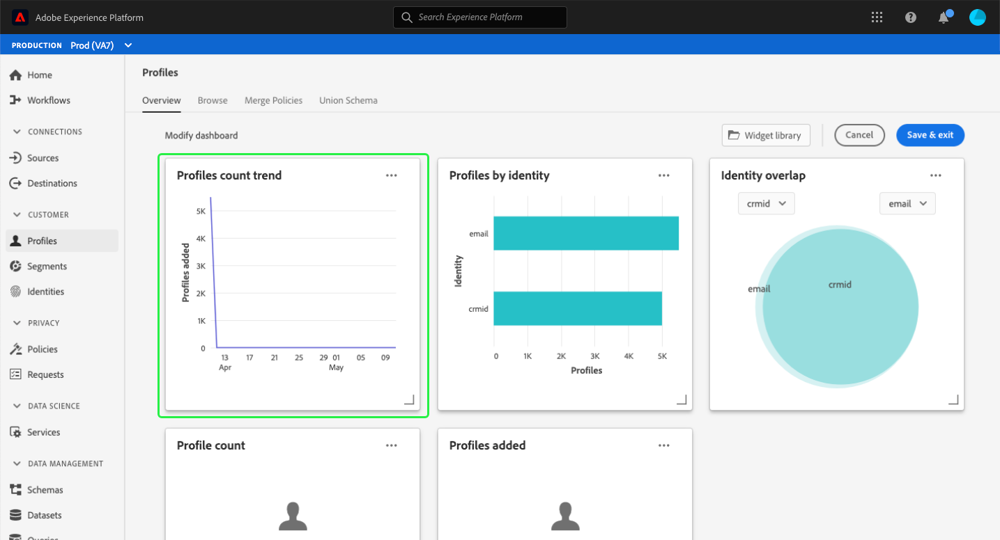
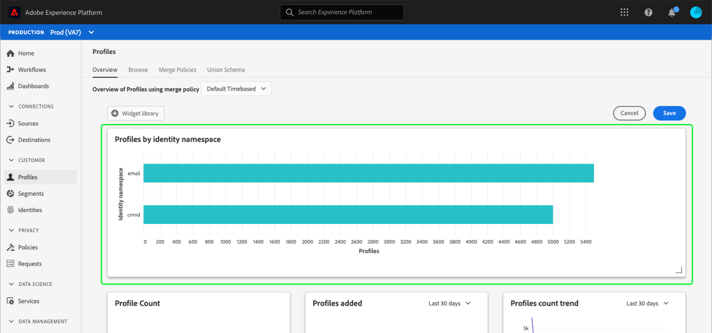

# Modify dashboards {#modify-dashboards}

Within the Adobe Experience Platform user interface (UI), you can view and interact with your organization's data using multiple dashboards. The default widgets and metrics shown in the dashboards can be adjusted at an individual user level to display preferred data, and widgets can be created and shared between users in the same organization. 

This guide provides step-by-step instructions for customizing how dashboard data is displayed within the [!UICONTROL Profiles], [!UICONTROL Segments], and [!UICONTROL Destinations] dashboards in the Platform UI.

>[!NOTE]
>
>The widgets shown in the license usage dashboard cannot be customized. Please refer to the [license usage dashboard documentation](../guides/license-usage.md) to learn more about this unique dashboard.

## Getting started

From any dashboard (for example, the [!UICONTROL Profiles] dashboard), you can select **[!UICONTROL Modify dashboard]** in order to resize and reorder existing widgets.

## Reorder widgets

After choosing to modify the dashboard, you can reorder the widgets by selecting the widget title and dragging and dropping the widgets into the desired order. In this example, the **[!UICONTROL Profiles count trend]** widget is moved to the top row and the **[!UICONTROL Profile count]** widget now appears in the second row.

## Resize widgets

You can also resize a widget by selecting the angle symbol in the bottom-right corner of the widget (`⌟`) and dragging the widget to the desired size. In this example, the **[!UICONTROL Profiles by identity]** widget is resized to fill the entire top row, automatically moving the other widgets to the second row. Note how the horizontal axis adjusts to provide more detailed increments as the widget gets larger.

>[!NOTE]
>
>As widgets are adjusted in size, surrounding widgets are repositioned dynamically. This could cause some widgets to be moved to additional rows, requiring you to scroll in order to see all widgets.

## Save dashboard updates

After you have finished moving and resizing widgets, select **[!UICONTROL Save & exit]** to save your changes and return to the main dashboard view. If you do not wish to keep your changes, select **[!UICONTROL Cancel]** to reset the dashboard and return to the main dashboard view.

## Widget library

In addition to resizing and reordering widgets, selecting **[!UICONTROL Modify dashboard]** in the [!UICONTROL Profiles], [!UICONTROL Segments], and [!UICONTROL Destinations] dashboards enables you to access the **[!UICONTROL Widget library]** where you can find more widgets to display or create custom widgets for your organization. 

For step-by-step instructions on how to access and work with the [!UICONTROL Widget library], refer to the [widget library guide](widget-library.md).

## Next steps

After reading this document, you have learned how to use the modify dashboard functionality to reorder and resize widgets to customize your dashboard view. To learn how to create and add widgets to your dashboards, read the [widget library guide](widget-library.md).
