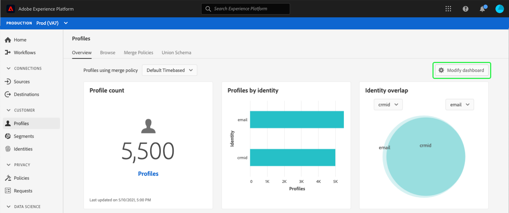
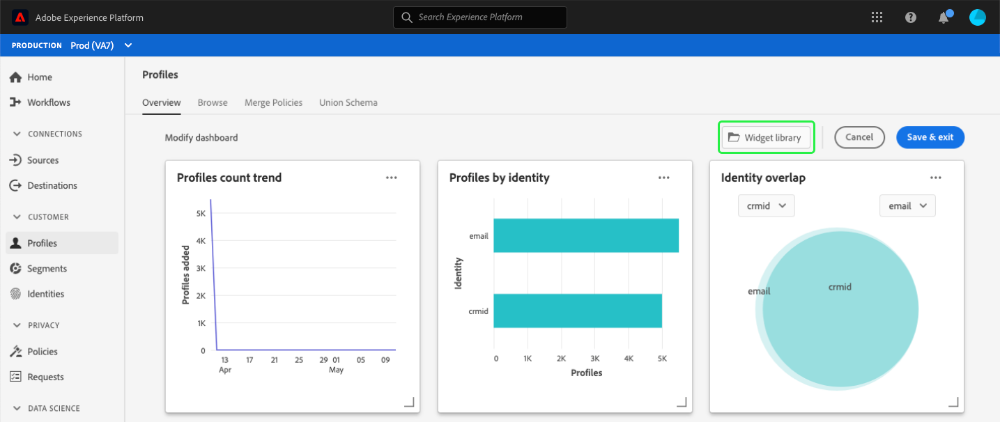
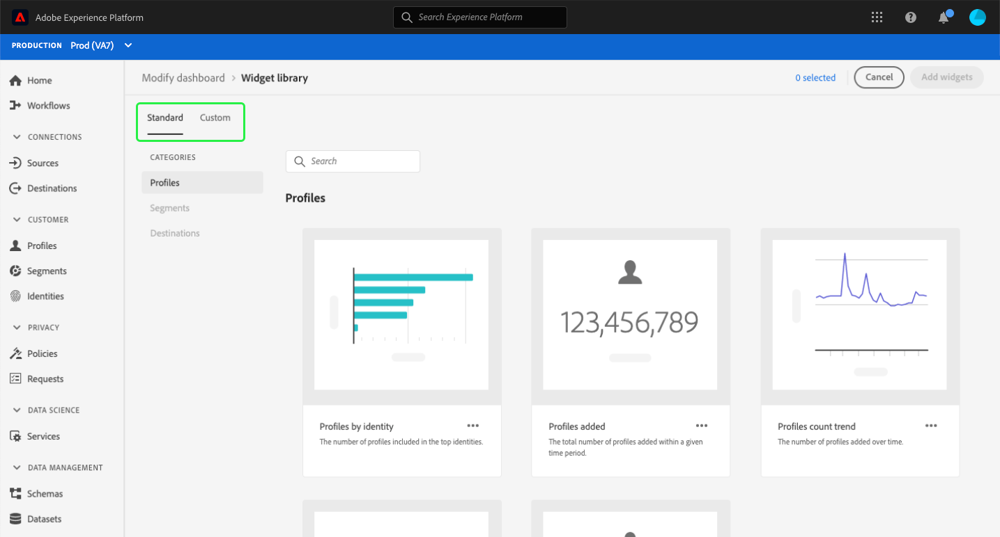

# Dashboard customization overview

The profiles, segments, and destinations dashboards available within Adobe Experience Platform can be customized in a number of different ways. This guide provides an overview of available customizations, with links to step-by-step instructions guiding your through how to personalize which widgets are displayed in your dashboards as well as the size, shape, and location of those widgets.

>[!NOTE]
>
>The widgets shown in the [!UICONTROL License usage] dashboard cannot be customized. To learn more about this unique dashboard, read the [license usage dashboard documentation](../guides/license-usage.md).

## Modify dashboard

Selecting **[!UICONTROL Modify dashboard]** from the profiles, segments, or destinations dashboards enables you to adjust the size, order, and location of the widgets that are currently visible in your dashboard. For information on how to modify the look of widgets in your dashboards, please refer to the [modifying dashboards guide](modify.md).

## The widget library

The widget library within Experience Platform is where you can view all of the [standard](#standard-widgets) and [custom](#custom-widgets) widgets available to your organization. From your dashboards (for example, the profiles dashboard), you can select **[!UICONTROL Modify dashboard]** in order to display the **[!UICONTROL Widget library]** button.

Select **[!UICONTROL Widget library]** to open the widget library and view all available standard metrics or begin creating custom widgets.

### Standard widgets {#standard-widgets}

Standard widgets refer to the widgets that Adobe provides for use within your dashboards. These widgets are read-only and cannot be edited by your organization.

Within the widget library, the **[!UICONTROL Standard]** tab contains all available standard widgets provided by Adobe. You can update your dashboards using any of these standard metrics. To learn more about adding standard widgets to your dashboard, refer to the guide for [using standard widgets in dashboards](standard-widgets.md).

### Custom widgets {#custom-widgets}

Custom widgets refer to widgets that are created and shared by members of your organization. These widgets are created through the **[!UICONTROL Custom]** tab of the widget library, and require your organization to specify available metrics through the use of a [schema](#edit-schema)

For complete steps to creating your own widgets, refer to the [custom widgets for dashboards guide](custom-widgets.md).

#### Edit schema {#edit-schema}

In order to create a [custom widget](#custom-widgets) for your dashboards, you must first identify the Real-Time Customer Profile attribute upon which the widget will be based.

For step-by-step instructions for editing your organization's schema in order to create custom dashboard widgets, please visit the guide for [editing your dashboard schema](edit-schema.md).

## Next steps

After reading this document, you are ready to begin customizing your Experience Platform dashboards by modifying the size, shape, and order of existing widgets, adding standard widgets provided by Adobe, or creating and sharing custom widgets with your organization.
