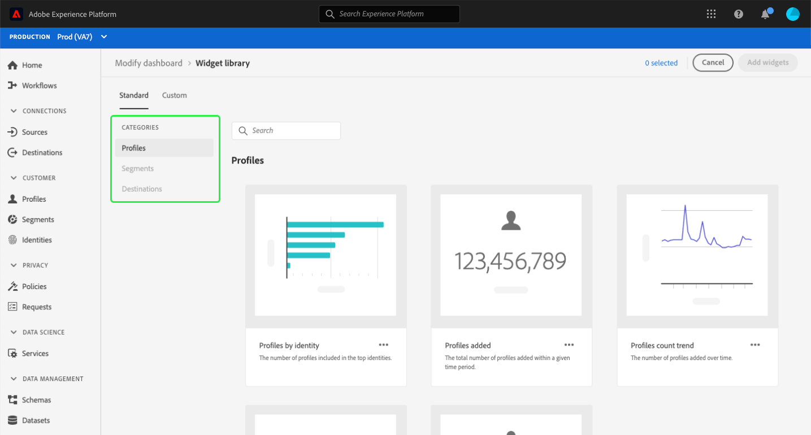
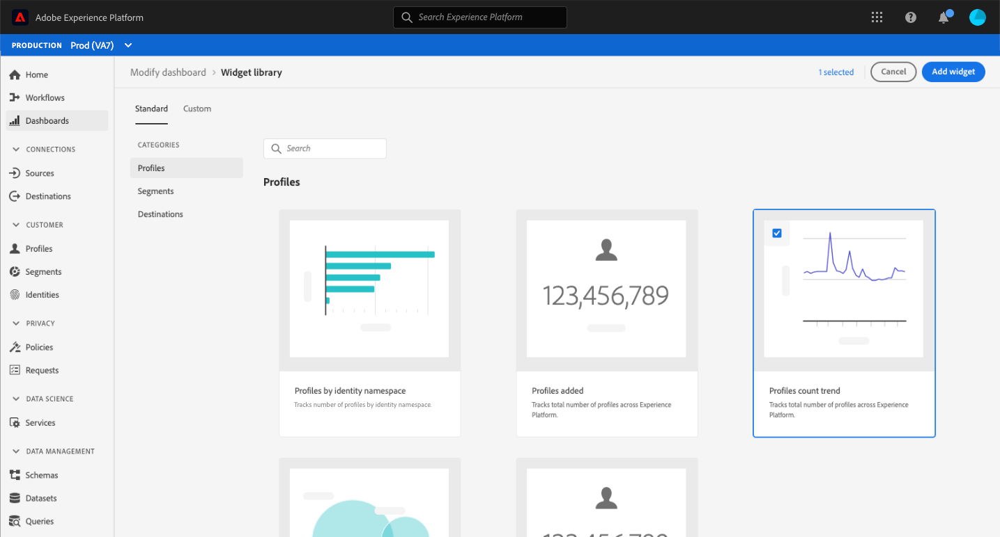

# Add standard widgets to dashboards

In Adobe Experience Platform you can view and interact with your organization's data using multiple dashboards. You can also update certain dashboards by adding new widgets to your dashboard view. Adobe provides a selection of standard widgets that you can choose to add to your dashboards.

The [!UICONTROL Profiles], [!UICONTROL Segments], and [!UICONTROL Destinations] dashboards each have a default widget load-out when a new Platform instance is created. This guide provides step-by-step instructions for adding standard widgets to customize the [!UICONTROL Profiles], [!UICONTROL Segments], and [!UICONTROL Destinations] dashboards in the Platform UI.

>[!NOTE]
>
>As of July 26th 2023, the [!UICONTROL Profiles], [!UICONTROL Segments], and [!UICONTROL Destinations] Overview dashboards have been reset to a new default widget load-out for all users who did not modify their views in the previous 6 months.
>Please see the documentation in the [Profiles](../guides/profiles.md#default-widgets), [Segments](../guides/segments.md#default-widgets), and [Destinations](../guides/destinations.md#default-widgets) default widget sections for details on which widgets are included as part of the default widget load-outs.

To learn more about custom widgets, please refer to the guide for [creating custom widgets](custom-widgets.md).

>[!NOTE]
>
>The widgets shown in the [!UICONTROL License usage] dashboard cannot be customized. To learn more about this unique dashboard, read the [license usage dashboard documentation](../guides/license-usage.md).

## Widget library {#widget-library}

This guide requires access to the [!UICONTROL Widget library] within Experience Platform. To learn more about the widget library, and how to access it within the UI, please begin by reading the [widget library overview](widget-library.md).

## Getting started with standard widgets {#standard-widgets}

Within the widget library, the **[!UICONTROL Standard]** tab contains widgets created by Adobe, broken down into categories based on the available dashboards. 

The category selected matches the dashboard from which you entered the widget library. In other words, if you selected the widget library from within the [!UICONTROL Profiles] dashboard, the [!UICONTROL Profiles] category is selected and the other categories appear grayed out.

The standard widgets for the selected category are displayed. Each widget appears as a card, providing the title, description, and a sample visualization of the metric.

>[!NOTE]
>
>Widgets may only be added to the dashboard that matches the selected category. For example, only widgets from the [!UICONTROL Profiles] category may be added to the [!UICONTROL Profiles] dashboard.

## Add standard widget to dashboard

To choose a standard widget to add to your dashboard, highlight the widget and select the checkbox. With at least one widget selected, the **[!UICONTROL Add widget]** button becomes available.

>[!NOTE]
>
>The counter in the top-right corner of the widget library shows the total number of widgets selected.

Select **[!UICONTROL Add widget]** to add the selected widgets to your dashboard.

## Next steps

After reading this document, you are able to access the widget library and use it to add standard widgets to a dashboard. To modify the size and location of the widgets that appear in the dashboard, please refer to the [modify dashboards guide](modify.md).
