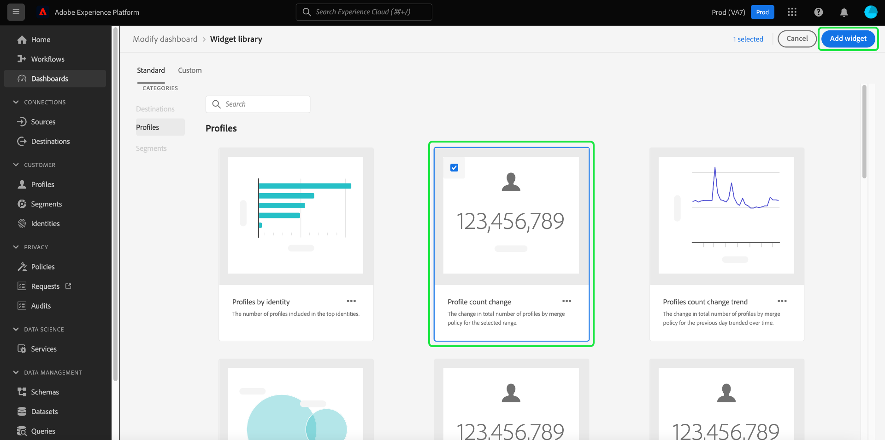
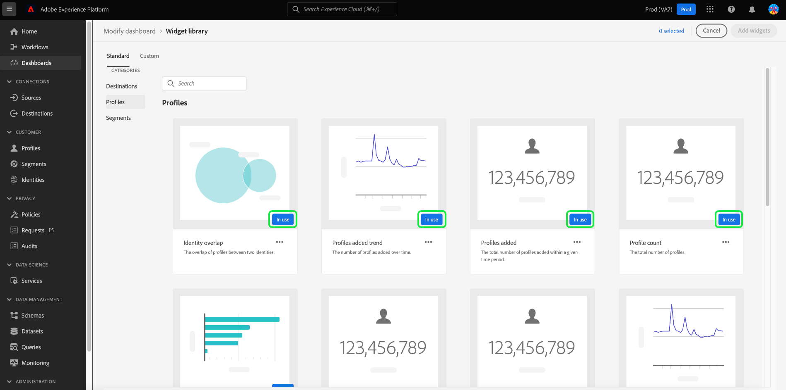

# Widget library overview

Within the Adobe Experience Platform user interface, you can view and interact with your organization's data using multiple dashboards. You can also update certain dashboards by adding widgets to your dashboard view. 

This guide provides step-by-step instructions for accessing the [!UICONTROL Widget library] within Experience Platform, where you can select standard widgets and create custom widgets to customize the information that is displayed within your dashboards.

>[!NOTE]
>
>Any updates made to the dashboards are per organization and by sandbox.

For information on how to modify the location and size of the widgets already displayed in your dashboards, please refer to the [modify dashboards guide](modify.md).

## Access the widget library {#access}

From any dashboard (for example, the Profiles dashboard), select **[!UICONTROL Add widget]** to navigate directly to the widget library where you can [add widgets](#add-widgets) to your dashboard.

Select **[!UICONTROL Modify dashboard]** to move, resize, or remove widgets from your dashboard. From this display you can also select **[!UICONTROL Widget library]** to browse and [add widgets](#add-widgets). To learn how to edit widget sizes and layout, see the [Modify dashboards documentation](./modify.md).

Select **[!UICONTROL Widget library]** to open the widget library and view all available standard metrics or begin creating custom widgets.

## Add widgets {#add-widgets}

From the [!UICONTROL Widget library], select any widget from the list of available standard or custom widgets. A check mark in the corner of the widget indicates your selection.

### In-use label {#in-use-label}

Widgets already added to a dashboard have an [!UICONTROL In-use] label attached to them when viewed in the widget library. This label highlights widgets that have already been added to your dashboard to avoid duplication. Although, you can still add the same widget more than once should you wish.

Once you have selected all the required widgets, select **[!UICONTROL Add widgets]** to confirm your choice and add the widgets to your dashboard.

## Standard and custom widgets {#standard-and-custom}

The [!UICONTROL Widget library] contains two tabs:

* **[!UICONTROL Standard]:** The standard tab contains widgets provided by Adobe. You can update your dashboards using any of these standard metrics. To learn more about adding standard widgets to your dashboard, refer to the guide for [using standard widgets in dashboards](standard-widgets.md).
* **[!UICONTROL Custom]:** The custom tab allows you to create and share widgets within your organization. For complete steps to creating your own widgets, refer to the [custom widgets for dashboards guide](custom-widgets.md).

## Next steps

After reading this document, you now are able to access the widget library within the Experience Platform UI. To modify the size and location of widgets that appear in the dashboard, please refer to the [modify dashboards guide](modify.md).
