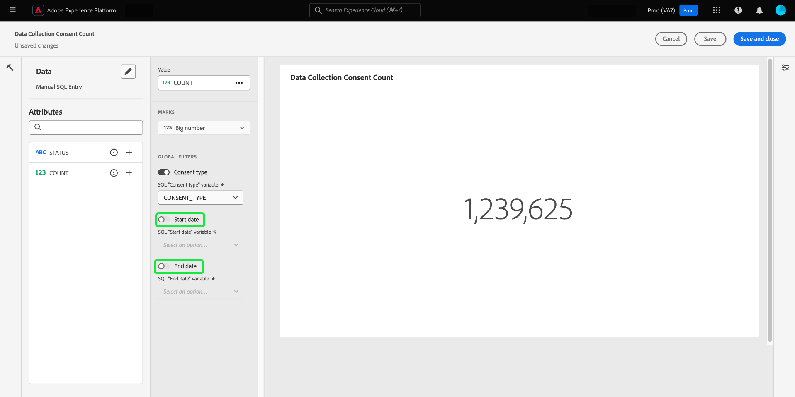
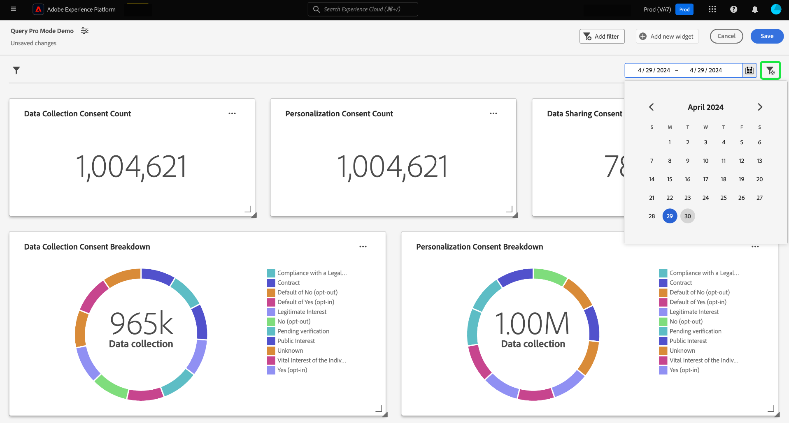

# Create a date filter {#create-date-filter}

To filter your insights by date, you must add parameters to your SQL queries that can accept date constraints. This is done as part of the query pro mode insight creation workflow. See the [query pro mode documentation](#query-pro-mode) to learn how to enter SQL for your insights.

Query parameters allow you to work with dynamic data as they act as placeholders for the values you add at execution time. These placeholder values can be updated through the UI and enable less technical users to update the insights based on date ranges.   

If you are unfamiliar with query parameters, see the documentation for [guidance on how to implement parameterized queries](../query-service/ui/parameterized-queries.md).

## Apply a date filter to your dashboard {#apply-date-filter}

To apply a date filter, select **[!UICONTROL Add filter]**, then **[!UICONTROL Date Filter]** from the dropdown menu of your dashboard view. 


## Edit your SQL to include date query parameters {#include-date-parameters} 

Next, ensure your SQL includes query parameters to allow for a date range. If you have not yet incorporated query parameters in your SQL, edit you insights to include these parameters. See the documentation for instructions on how to [edit an insight](../query-pro-mode.md#edit).

>[!TIP]
>
>You are reccommended to add `$START_DATE` and `$END_DATE` parameters to your SQL statement in each of the charts that you want to enable date filters.

>[!NOTE]
>
>Date filters do not support time constraints. The filter only applies to date ranges. This means that if you have multiple reports within a 24-hour period, you cannot distinguish between different hours within the same day. For this reason, you are reccommended to cast the time component as a date. 

If the data model or tables you are analyzing have a time component, you can group your data by date and then apply these date filters.

The example SQL statement below demonstrates how to incorporate `$START_DATE` and `$END_DATE` parameters and uses `cast` to frame the time component as a date.

```sql
SELECT Sum(personalization_consent_count) AS Personalization,
       Sum(datacollection_consent_count)  AS Datacollection,
       Sum(datasharing_consent_count)     AS Datasharing
FROM   fact_daily_consent_aggregates f
       INNER JOIN dim_consent_valued
               ON f.consent_value_id = d.consent_value_id
WHERE  f.date BETWEEN Upper(Coalesce(Cast('$START_DATE' AS date), '')) AND Upper
                      (
                             Coalesce(Cast('$END_DATE' AS date), ''))
       AND ( ( Upper(Coalesce($consent_value_filter, '')) IN ( '', 'NULL' ) )
              OR ( f.consent_value_id IN ( $consent_value_filter ) ) )
LIMIT  0; 
```

The screenshot below highlights the date constraints incorporated in the SQL statement and the query parameter key value pairs.

>[!NOTE]
>
>When composing your statement in query pro mode, you must provide sample values for each parameter in order to execute the SQL statement and build the chart. The sample values you provide when composing your statement are replaced by the actual values you select for the date (or global) filter at runtime.

![The [!UICONTROL Enter SQL] dialog with the date parameters highlighted in the SQL.](../../../images/customizable-insights/sql-date-parameters.png)

## Enable date parameters in each insight {#enable-date-parameters}

Once you have incorporated the appropriate parameters to your insights' SQL, the `Start_date` and `End_date` variables are now available as a toggles in the widget composer. See the [query pro mode widget population section](#populate-widget) for info on how to edit an insight. 

From the widget composer, select toggles to enable the `Start_date` and `End_date` parameters.



Next, select the appropriate query parameters from the dropdown menus.


Finally, select **[!UICONTROL Save and close]** to return to your dashboard. Date filters are now enabled for all insights that have start and end date parameters.

## Use the date filter

To use a custom date filter, select the calendar icon and choose a start and end from the calender view.

>[!IMPORTANT]
>
>Simply adding a date filter will not make the charts change. You must edit each of your insights to include your chosen start and end date.


Once you have selected a date range from your dashboard, insights that have date parameters in their SQL will see the date filter options in the widget composer. 

>[!NOTE]
>
>Selecting a date range on your dashboard displays the toggles for date filters as part of the insight creation workflow. 

## Delete a date filter {#delete-date-filter}

To remove your date filter select the delete filter icon (). 


