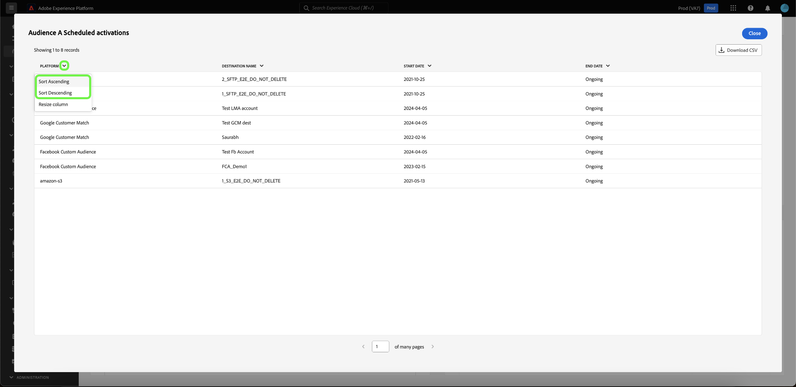
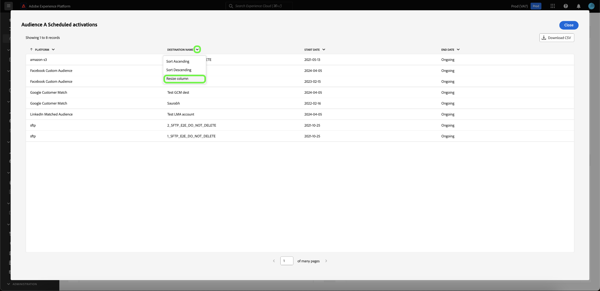
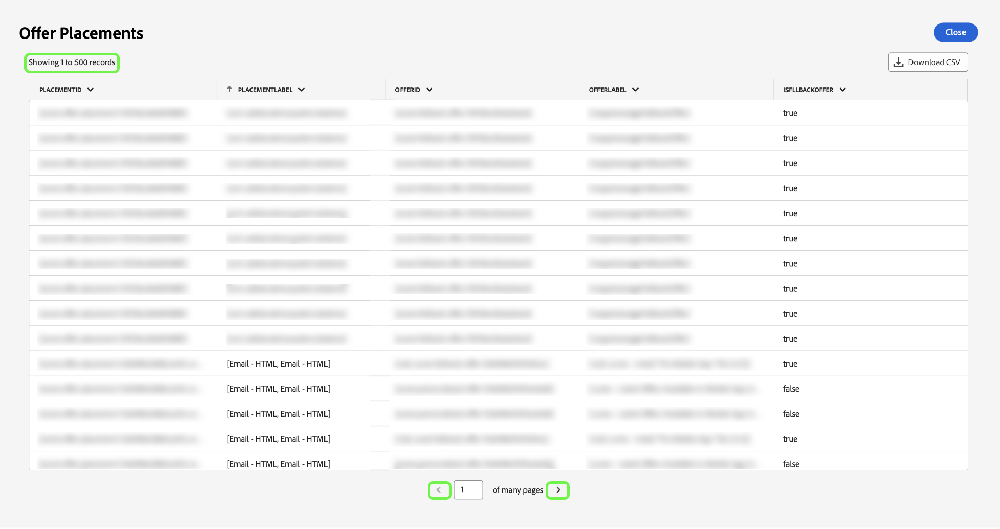

# View more {#view-more}

Once you have created a [custom insight](../sql-insights/overview.md) with [query pro mode](./overview.md), you can view your chart data in different formats. You can view either a tabulated form of the results, or download the data as a CSV file to view in a spreadsheet. 

## Tabulated results {#tabulated-results}

For every chart authored using the query pro mode through SQL, you can view the tabulated results of your analysis within the Experience Platform UI. 

From your custom dashboard, select the ellipses (`...`) on any widget to access the [!UICONTROL View more] and [!UICONTROL View SQL] options.

## Download CSV {#download-csv}

The [!UICONTROL View more] feature displays the specific data points for the chart in tabular form. To simplify the process of data sharing and manipulation, you can download the processed data in CSV format from this dialog. Select **[!UICONTROL Download CSV]** to download your data.

>[!NOTE]
>
>The CSV download is limited ot the first 500 records.

## Sort by column {#sort-column}

When viewing tabulated results, you can use the sort functionality to sort by column in ascending or descending order. From your custom dashboard, select the ellipses (`...`) on any table to access the [!UICONTROL View more] option.

You can sort columns by selecting the drop down menu beside the column name and then selecting **[!UICONTROL Sort Ascending]** or **[!UICONTROL Sort Descending]**.

>[!NOTE]
>
>The [!UICONTROL Sort Ascending] and [!UICONTROL Sort Descending] options will only appear for columns that have been configured with [sorting functionality](../overview.md/#advanced-attributes).

## Resize a column {#resize-column}

You can resize columns in tabulated results to improve data readability. From your custom dashboard, select the ellipses (`...`) for your table to access the [!UICONTROL View more] option. Use the drop down menu beside the column name to resize it, then select **[!UICONTROL Resize column]**.

Select the sllider and drag to the left or right to adjust the column size as required.

## Table pagination {#table-pagination}

Pagination is automatically applied to your tables in the [!UICONTROL View more] feature, eliminating the need for you to manually modify your SQL queries. This feature ensures that your data is presented in a more manageable format, which facilitates the process of navigating through large datasets.

You can see up to 500 records per page. To navigate through the records, use the **[!UIONTROL >]** located at the bottom of the page.

## Next steps

After reading this document, you now know how to view the tabulated results of your custom chart's SQL analysis and download the data as a CSV file. See the view SQL document to learn how to [view the SQL behind your custom insights](./view-more.md). 

You can also learn how to generate charts from existing data models in the Adobe Experience Platform UI with the [guided design mode guide](../../user-defined-dashboards.md).
