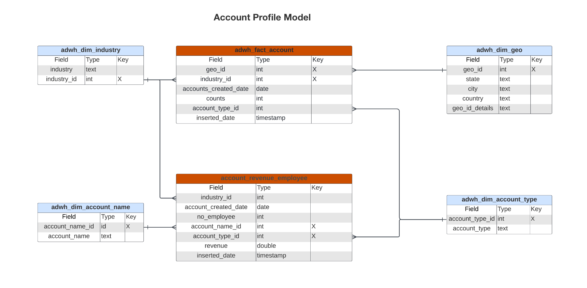
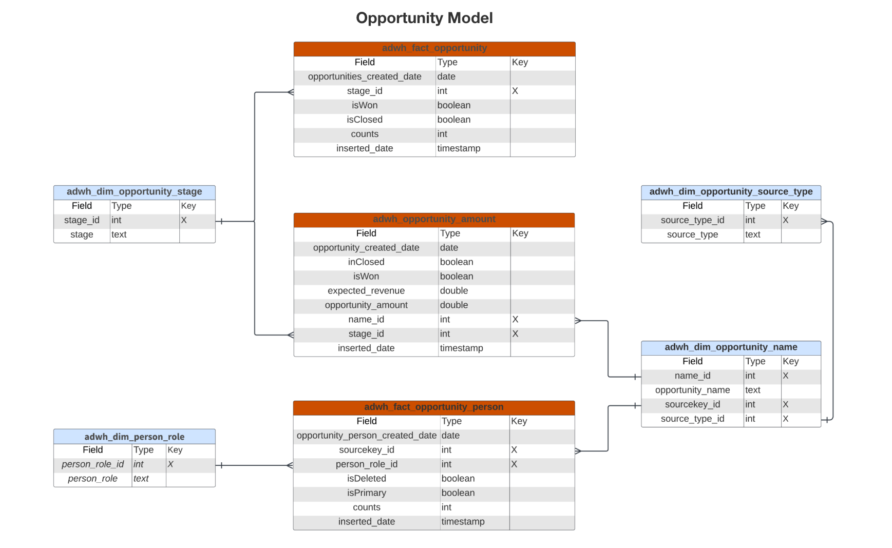

# Real-Time CDP Insights data model B2B Edition

The Real-Time CDP Insights data model for the B2B Edition exposes the data models and SQL that power the insights for [account profiles](https://experienceleague.adobe.com/en/docs/experience-platform/rtcdp/account/account-profile-overview). You can customize these SQL query templates to create Real-Time CDP reports for your B2B marketing and key performance indicator (KPI) use cases. These insights can then be used as custom widgets for your dashboards. 

>[!AVAILABILITY]
>
>This functionality is available to customers who have purchased the Real-Time CDP Prime and Ultimate package. See the documentation on available [Real-Time CDP editions](../../rtcdp/overview.md#rtcdp-editions) for more information, or contact your Adobe representative. 

<!-- 
See the query accelerated store reporting insights documentation to learn [how to build a reporting insights data model through Query Service for use with accelerated store data and user-defined dashboards](../../query-service/data-distiller/sql-insights/reporting-insights-data-model.md).
 -->

## Prerequisites

This guide requires a working understanding of custom dashboards. Read the documentation on [how to create a custom dashboard](../standard-dashboards.md) before continuing with this guide.

## Real-Time CDP B2B insight reports and use cases {#B2B-insight-reports-and-use-cases}

Real-Time CDP B2B reporting provides insights into your account profiles data and the relationship between accounts and opportunities. The following star schema models were developed to answer a variety of common marketing use cases and each data model can support several use cases.

>[!IMPORTANT]
>
>The data used for Real-Time CDP B2B reporting is accurate for a chosen merge policy and from the most recent daily snapshot.

### Account Profile model {#account-profile-model}

The Account Profile model is comprised of eight datasets:

- `adwh_dim_industry`
- `adwh_dim_account_name`
- `adwh_dim_geo`
- `adwh_dim_account_type`
- `adwh_fact_account`
- `account_revenue_employee`

The diagram below displays the relevant data fields in each dataset, their data type, and the foreign keys linking the datasets together.



#### The new accounts by industry use case {#accounts-by-industry}

The logic used for the [!UICONTROL New accounts by industry] insight returns the top five industries according to their number of account profiles and their relative size to each other. See the [[!UICONTROL New accounts By Industry] widget documentation](../guides/account-profiles.md#accounts-by-industry) for more information. 

>[!TIP]
>
>You can customize this SQL query to return more or less than the top five industries.

The SQL that generates the [!UICONTROL New accounts by industry] insight is seen in the collapsible section below.

+++SQL query

```sql
WITH RankedIndustries AS (
    SELECT
        i.industry,
        SUM(f.counts) AS total_accounts,
        ROW_NUMBER() OVER (ORDER BY SUM(f.counts) DESC) AS industry_rank
    FROM
        adwh_fact_account f
    INNER JOIN adwh_dim_industry i ON f.industry_id = i.industry_id
    WHERE f.accounts_created_date between UPPER(COALESCE('$START_DATE', '')) and UPPER(COALESCE('$END_DATE', ''))
    GROUP BY
        i.industry
)
SELECT
    CASE
        WHEN industry_rank <= 5 THEN industry
        ELSE 'Others'
    END AS industry_group,
    SUM(total_accounts) AS total_accounts
FROM
    RankedIndustries
GROUP BY
    CASE
        WHEN industry_rank <= 5 THEN industry
        ELSE 'Others'
    END
ORDER BY
    total_accounts DESC
LIMIT 5000;
```

+++

#### The New accounts by type use case {#accounts-by-type}

The logic used for the [!UICONTROL New accounts by type] insight returns the numerical breakdown of accounts by their type. This insight can help to guide business strategy and operations, including resource allocation or marketing strategies. See the [[!UICONTROL New accounts by type] widget documentation](../guides/account-profiles.md#accounts-by-type) for more information. 

The SQL that generates the [!UICONTROL New accounts by type] insight is seen in the collapsible section below.

+++SQL query

```sql
SELECT t.account_type,
       Sum(f.counts) AS account_count
FROM   adwh_fact_account f
       JOIN adwh_dim_account_type t
         ON f.account_type_id = t.account_type_id
WHERE  accounts_created_date BETWEEN Upper(Coalesce('$START_DATE', '')) AND
                                     Upper(
                                     Coalesce('$END_DATE', ''))
GROUP  BY t.account_type
LIMIT  5000; 
```

+++

### Opportunity model {#opportunity-model}

The Opportunity model is comprised of seven datasets:

- `adwh_dim_opportunity_stage`
- `adwh_dim_person_role`
- `adwh_dim_opportunity_source_type`
- `adwh_dim_opportunity_name`
- `adwh_fact_opportunity`
- `adwh_opportunity_amount`
- `adwh_fact_opportunity_person`

The diagram below displays the relevant data fields in each dataset.


