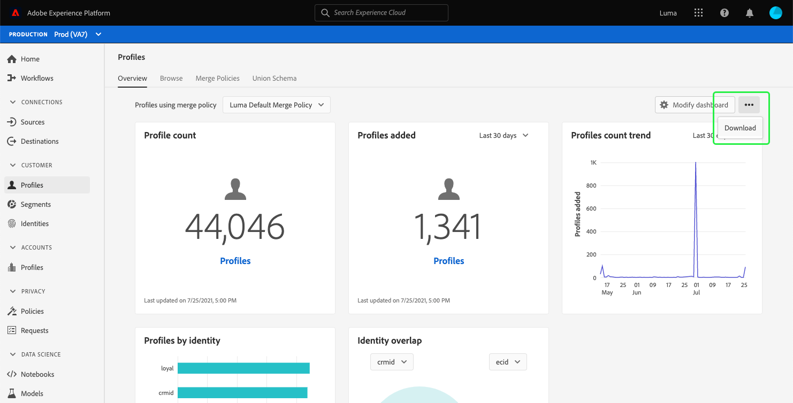
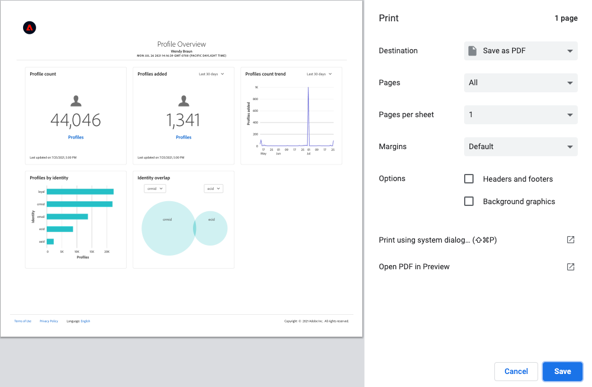
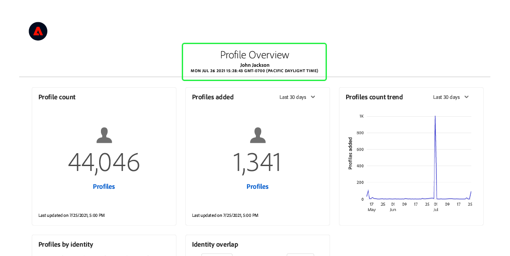
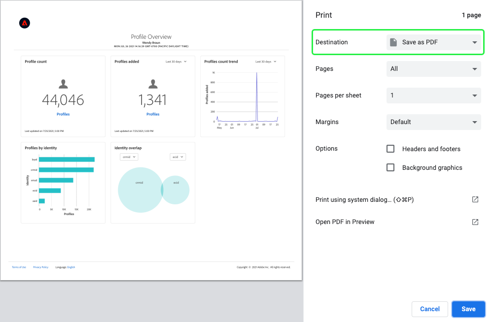
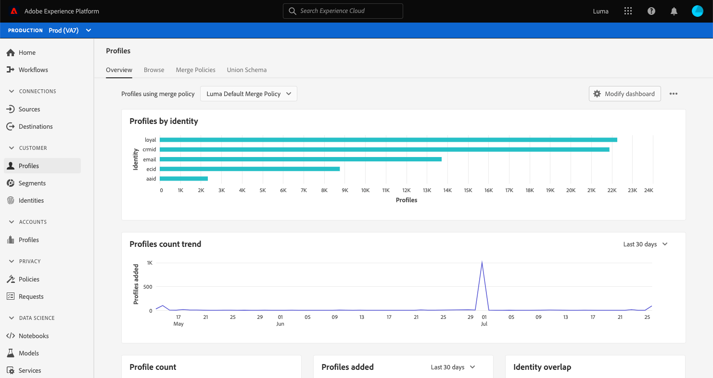
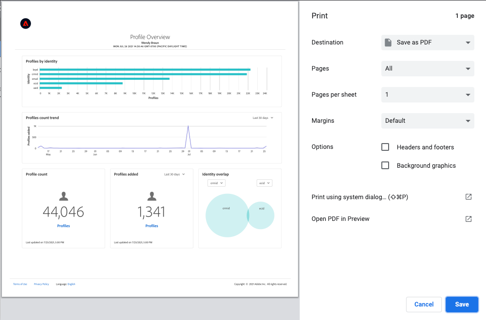

# Download dashboards to PDF

Dashboards within Adobe Experience Platform can be downloaded to PDF from within the Platform user interface to facilitate the sharing of information with members of your organization. 

This document provides a summary of how to download dashboards using the Platform UI and save the dashboard to PDF using the default browser print menu. 

>[!WARNING]
>
>The data contained within your dashboards may include personally identifiable information (PII) about your customers or sensitive data related to your organization. Any dashboard data saved to PDF should be handled appropriately according to your organization's data privacy guidelines.

## Download dashboard

To begin downloading a dashboard, navigate to the dashboard that you want to download (for example, the [!UICONTROL Profiles] dashboard) and then select the more options menu (**`...`**) from the top-right corner of the dashboard. Next, select **[!UICONTROL Download]**.

## Preview PDF

After selecting **[!UICONTROL Download]**, the default print menu for your browser opens. In this example, the Google Chrome print menu is shown.

The print menu allows you to preview the PDF that will be saved. The PDF is a true representation of the dashboard widgets as they appear in the Platform UI and the size of the PDF is automatically adjusted to display all of the currently visible dashboard widgets on a single page. 

The PDF includes an automatically generated header containing the Experience Platform logo, the name of the dashboard, your name, and the date and time that the dashboard was downloaded. This information is read-only and cannot be edited in the PDF.

## Save as PDF

After previewing the PDF, select **Save** to choose the location to which you want to save your PDF.

>[!NOTE]
>
>If necessary, you can use the **Destination** dropdown to select **Save as PDF** if that option is not automatically selected for you. 

## Customize dashboard PDFs

The PDF that is generated matches the dashboard that you can see in the UI and includes only the widgets that are currently visible on your dashboard. Certain dashboards can be customized to change the size and location of widgets or to add and remove widgets from view. Customizing the look of your dashboard in the Platform UI also changes the look of the PDF that is generated.

For example, you could modify the look of your profiles dashboard to include several full-width widgets stacked above three standard widgets.

Selecting to download the updated dashboard results in a new PDF preview that matches the look of the customized profiles dashboard. It also automatically adjusts the size of the PDF to ensure that all of the visible widgets are included in a one-page PDF.

To learn more about customizing dashboards, begin by reading the [dashboard customization overview](customize/overview.md).

## Next steps

Now that you have downloaded your dashboard and saved it as a PDF, you can repeat these steps to download additional dashboards or share the PDF with members of your organization.
