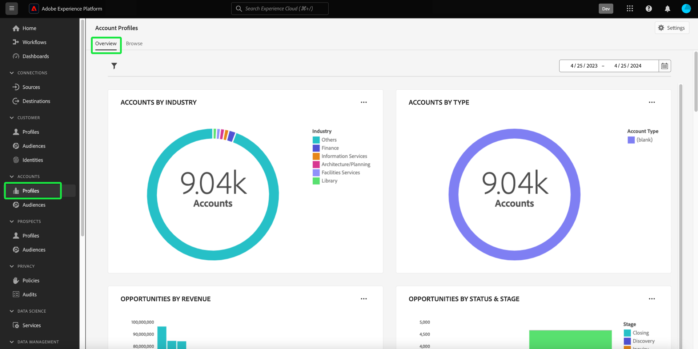

# [!UICONTROL Account Profiles] dashboard

The Adobe Experience Platform user interface (UI) provides a dashboard through which you can view important information about your account profiles, as captured during a daily snapshot. This guide outlines how to access and work with the [!UICONTROL Account Profiles] dashboard in the UI and provides more information regarding the visualizations displayed in the dashboard.

For an overview of all of the features within the account profile user interface, please visit the [account profile UI guide](../../rtcdp/accounts/account-profile-ui-guide.md).

## Getting started

You must be entitled to [Real-time Customer Data Platform B2B Edition](../../rtcdp/b2b-overview.md) in order to access the B2B account profiles dashboard. 

## Account profiles data

The [!UICONTROL Account Profiles] dashboard displays a snapshot of unified account information from the multiple sources across your many marketing channels and the diverse systems that your organization is currently using to store customer account information.

The profile data in the snapshot shows the data exactly as it appears at the specific point in time when the snapshot was taken. In other words, the snapshot is not an approximation or sample of the data, and the [!UICONTROL Account Profiles] dashboard is not updating in real-time.

>[!NOTE]
>
>Any changes or updates made to the data since the snapshot was taken will not be reflected in the dashboard until the next snapshot is taken.

## Explore the [!UICONTROL Account Profiles] dashboard

To navigate to the [!UICONTROL Account Profiles] dashboard within the Platform UI, select **[!UICONTROL Profiles]** under [!UICONTROL Accounts] in the left rail. 

From the [!UICONTROL Account Profiles] dashboard you can either [browse the account profiles ingested into your organization](#browse-account-profiles), or [view the entirety of your account profile data at a glance through widgets](#standard-widgets) that visualize aspects of the data.  

## Browse account profiles {#browse-account-profiles}

The [!UICONTROL Browse] tab allows you to search and view the read-only account profiles ingested into your organization using an account ID from a connected enterprise source or by entering source details directly. From here you can see important information belonging to the account profile including, their name, industry, revenue, and segment among others.

Selecting the [!UICONTROL Profile ID] from the [!UICONTROL Browse] tab provides access to more profile information merged together from multiple profile fragments that form a single view of the individual account. To learn more about the account profile viewing capabilities provided in the Platform UI please see the documentation on [browsing account profiles in Real-time Customer Data Platform](../../rtcdp/accounts/account-profile-ui-guide.md#browse-account-profiles). 

## Widgets and metrics

The [!UICONTROL Overview] tab is composed of widgets that provide read-only metrics to convey important information about your account profiles. The account used to generate visualizations of your account profiles data is dependant on the sandbox in use. See the documentation for [instructions on how to change your sandbox](../../sandboxes/ui/user-guide.md#switch-between-sandboxes).

<!-- Q) I have reservations about the above sentence. I have not seen this in practice and i am unsure how that works when configuring a sandbox. -->

### Modifying the [!UICONTROL Account Profiles] dashboard

You can modify the appearance of the [!UICONTROL Account Profiles] dashboard by selecting [!UICONTROL Modify dashboard]. This enables you to move and resize widgets. Please refer to the [modifying dashboards](../customize/modify.md) and [Widget library overview](../customize/widget-library.md) documentation to learn more.

## Standard widgets {#standard-widgets}

Adobe provides standard widgets that you can use to visualize different metrics related to your account profiles.

To learn more about each of the available standard widgets, select the name of a widget from the following list:

* [Total accounts by industry](#total-accounts-by-industry)
* [Account profiles added](#account-profiles-added)

### Total accounts by industry {#total-accounts-by-industry}

This widget displays the total number of accounts in a single metric and uses a doughnut chart to illustrate the proportional sizes of counts for the industries that make up the overall number. The key provides colour coding information for the different industries that make up the donut chart. 

Individual counts for the different industries are displayed in a dialog when the cursor hovers over the respective section of the donut chart.

### [Account profiles added](#account-profiles-added)

This widget uses a bar chart to illustrate the count of profiles added to an account over a given time period as well as the proportion of different industries that constitute these added profiles. The different industries are colour coded, and a key provides the colour coding information for the different industries that make up the bar chart. The time period of analysis is selected from the widget dropdown menus. The bar chart can be visualized over 30 days, 90 days, and 12 month periods.

>[!NOTE]
>
>As profiles are only added to an account and never removed, the lowest possible number of profiles added over a period of time is zero. 

## Next steps

By following this document you should now be able to locate the account profiles dashboard. You should also understand the metrics displayed in the available widgets. To learn more about working with account profiles as part of your B2B data in the Experience Platform UI, please refer to the [account profiles overview](../../rtcdp/accounts/account-profile-overview.md) for Adobe Real-Time CDP, B2B Edition.
