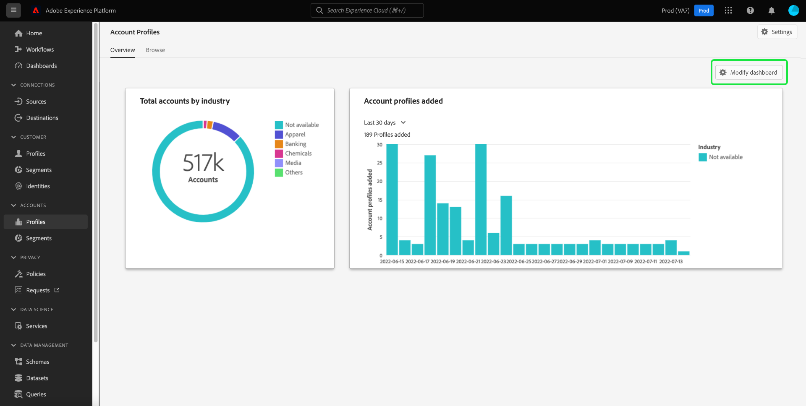
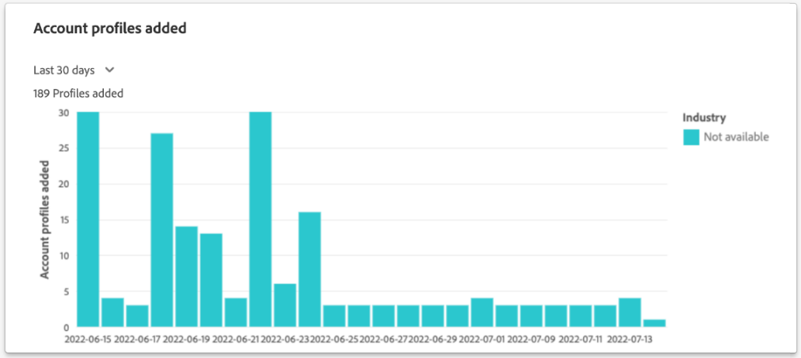
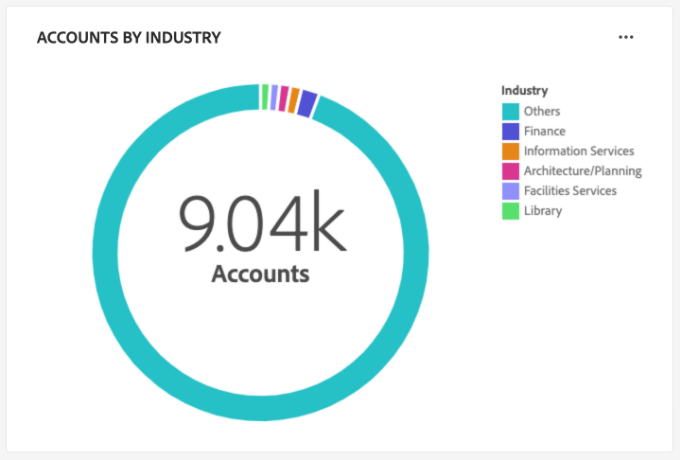
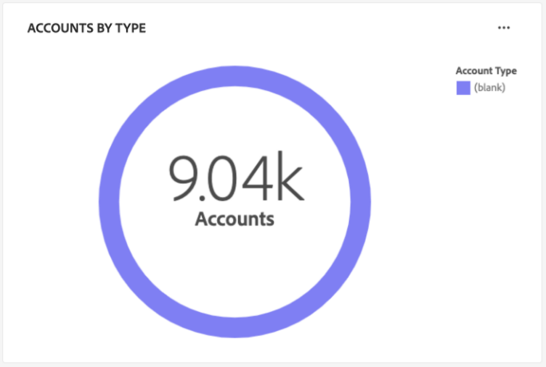
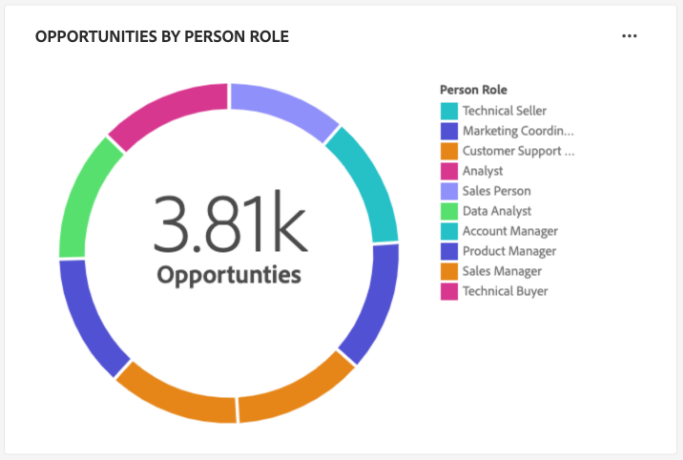
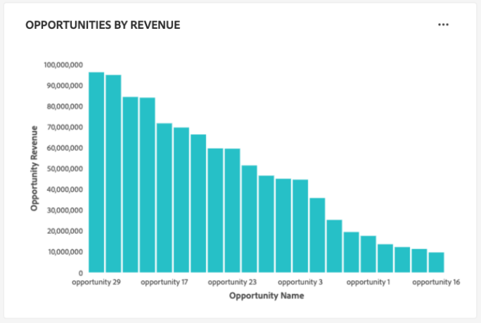
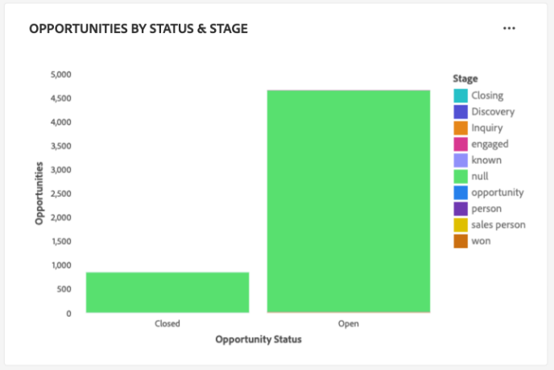
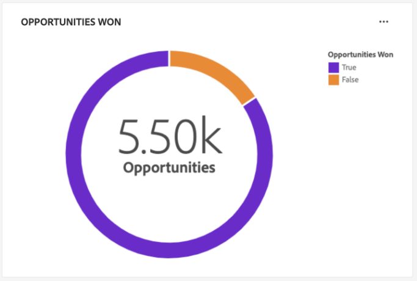
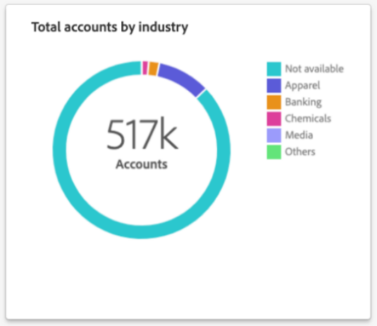

# [!UICONTROL Account Profiles] dashboard

The Adobe Experience Platform user interface (UI) provides a dashboard through which you can view important information about your account profiles, as captured during a daily snapshot. This guide outlines how to access and work with the [!UICONTROL Account Profiles] dashboard in the UI and provides more information regarding the visualizations displayed in the dashboard.

For an overview of the features within the account profile user interface, please visit the [account profile UI guide](../../rtcdp/accounts/account-profile-ui-guide.md).

## Getting started

You must be entitled to [Adobe Real-Time Customer Data Platform B2B Edition](../../rtcdp/b2b-overview.md) in order to access the B2B [!UICONTROL Account Profiles] dashboard. 

## Account profiles data

The [!UICONTROL Account Profiles] dashboard displays a snapshot of your unified account information. This account information comes from the multiple sources across your marketing channels and the diverse systems that your organization currently uses to store customer account information.

The profile data in the snapshot shows the data exactly as it appears at the specific point in time when the snapshot was taken. In other words, the snapshot is not an approximation or sample of the data, and the [!UICONTROL Account Profiles] dashboard does not update in real-time.

>[!NOTE]
>
>Any changes or updates made to the data since the snapshot was taken will not be reflected in the dashboard until the next snapshot is taken.

## Explore the [!UICONTROL Account Profiles] dashboard

To navigate to the [!UICONTROL Account Profiles] dashboard within the Platform UI, select **[!UICONTROL Profiles]** under [!UICONTROL Accounts] in the left navigation panel. 

From the [!UICONTROL Account Profiles] dashboard, you can either [browse the account profiles ingested into your organization](#browse-account-profiles), or [view the entirety of your account profile data at a glance using widgets](#standard-widgets).

## Browse account profiles {#browse-account-profiles}

From the [!UICONTROL Browse] tab you can search and view the read-only account profiles ingested into your organization. Use an account ID from a connected enterprise source or enter source details directly. From this workspace, you can see important information belonging to the account profile including, their name, industry, revenue, and audience among others.

Select the [!UICONTROL Profile ID] from the results displayed on the [!UICONTROL Browse] tab to open the [!UICONTROL Details] tab for the account profile.

The account profile information displayed on the [!UICONTROL Details] tab has been merged together from multiple profile fragments to form a single view of the individual account. See the documentation on [browsing account profiles in Adobe Real-Time Customer Data Platform](../../rtcdp/accounts/account-profile-ui-guide.md#browse-account-profiles) to learn more about account profile viewing capabilities in the Platform UI. 

## The [!UICONTROL Account Profiles] [!UICONTROL Overview] {#overview}

The [!UICONTROL Overview] tab is composed of widgets that provide read-only metrics to convey important information about your account profiles. Select **[!UICONTROL Modify dashboard]** to change the appearance of the [!UICONTROL Overview] tab by moving and resizing widgets. 

Please refer to the document on [modifying dashboards](../customize/modify.md) and the [Widget library overview](../customize/widget-library.md) to learn more.

## Standard widgets {#standard-widgets}

Adobe provides standard widgets that you can use to visualize different metrics related to your account profiles.

To learn more about each of the available standard widgets, select the name of a widget from the following list:

* [Account profiles added](#account-profiles-added)
* [Accounts by industry](#accounts-by-industry)
* [Accounts by type](#accounts-by-type)
* [Opportunities added](#opportunities-added)
* [Opportunities by person role](#opportunities-by-person-role)
* [Opportunities by revenue](#opportunities-by-revenue)
* [Opportunities by status & stage](#opportunities-by-status-&-stage)
* [Opportunities won](#opportunities-won)
* [Predictive scoring distribution](#predictive-scoring-distribution)
* [Predictive scoring top influential factors](#predictive-scoring-top-influential-factors)
* [Total accounts by industry](#total-accounts-by-industry)

### Account profiles added {#account-profiles-added}

This widget uses a colour-coded bar chart to illustrate the count of profiles added to an account over a given period of time, and the proportion of different industries that constitute these added profiles. The industries are colour-coded, and a key provides the color coding information for the different industries that make up the bar chart. The period of analysis is selected from the widget dropdown menu. The bar chart can be visualized over a 30 day, 90 day, and a 12 month period.

>[!NOTE]
>
>As profiles are only added to an account and never removed, the lowest possible number of profiles added over a period of time is zero. 

### Accounts by industry {#accounts-by-industry}

The [!UICONTROL Accounts by industry] widget displays the total number of accounts in a single metric inside a donut chart. The donut chart illustrates the relative makeup of different industries that comprise this total. A color-coded key provides a breakdown of all the included industries. Individual counts for each industry are displayed in a dialog when the cursor hovers over the respective section of the donut chart.

### Accounts by type {#accounts-by-type}

The [!UICONTROL Accounts by type] widget displays the total number of accounts in a single metric inside a donut chart. The donut chart illustrates the relative makeup of different account types that comprise this total. A color-coded key provides a breakdown of all the included account types. Individual counts for each type of account are displayed in a dialog when the cursor hovers over the respective section of the donut chart.

### Opportunities added {#opportunities-added}

The [!UICONTROL Opportunities added] widget uses a line graph to display the number of opportunities added each day over a period of time. Use the global date filter located at the top of your dashboard to determine the period of analysis. If no date filter is provided, the default behavior lists the opportunities added for the year prior to today. The results can be used to infer a trend in the number of opportunities added.

<!-- Q) What is the default behavior if no filter is provided? -->

<!-- Link to date filter documentation from Annamalai -->

### Opportunities by person role {#opportunities-by-person-role}

The [!UICONTROL Opportunities by person role] widget displays the total number of your opportunities in a single metric inside a donut chart. The donut chart illustrates the relative makeup of roles that comprise this total number of opportunities. A color-coded key provides a breakdown of all the included roles. Individual counts for each role are displayed in a dialog when the cursor hovers over the respective section of the donut chart.

>[!NOTE]
>
>The [!UICONTROL No data found] or [!UICONTROL Unable to load] error is caused when the 'Opportunity-Person' bridge-table is not used in your schema. If your insight displays one of these errors, check your union schema and ensure that the 'Opportunity-Person' field group is ingesting data.   

<!-- Q) The above note needs serious work. Rishabh will provide some more input /clarification -->

### Opportunities by revenue {#opportunities-by-revenue}

The [!UICONTROL Opportunities by revenue] widget uses a bar chart to illustrate the total amount of revenue generated by your opportunities. The widget supports up to six opportunities.

<!-- Q) how many opportunities does this widget support? -->

To see a dialog that contains the specific revenue total for an opportunity, use the cursor to hover over individual bars.

### Opportunities by status & stage {#opportunities-by-status-&-stage}

This widget uses a bar chart to illustrate the number of opportunities that are either open or closed at all stages of the marketing/sales funnel. The widget uses colors to differentiate the stage of the opportunities. A color-coded key indicates the available stages for opportunities. 

### Opportunities won {#opportunities-won}

The [!UICONTROL Opportunities won] widget displays the total number of your opportunities that have been successfully finalized in a single metric inside a donut chart. The donut chart illustrates the relative makeup of opportunities that are either won or not. A color-coded key distinguishes between won and not-won opportunities. Individual counts for each role are displayed in a dialog when the cursor hovers over the respective section of the donut chart.

### Predictive scoring distribution {#predictive-scoring-distribution}

The [!UICONTROL Predictive scoring distribution] widget shows the score distribution of all account profiles to help you understand the health of your sales pipeline at a glance. The scoring data is conveyed through a donut chart and a column chart.

The donut chart illustrates the proportion of your total account profiles in each of the high, medium, and low propensity to buy buckets. The key provides more details on the color-coded sections including the scoring bucket ranges and the number of account profiles in that range.

The column chart provides a more granular scoring breakdown. Each column shows the number of account profiles in each of the 20 five-point-increment buckets.

The dropdown menu within the widget allows you to select the account scoring model.

>[!NOTE]
>
>Global date range filters do not apply to predictive scoring insights. Predictive scoring widgets analyze data based on the account scoring model selected in the dropdown.

### Predictive scoring top influential factors {#predictive-scoring-top-influential-factors}

The [!UICONTROL Predictive scoring top influential factors] widget helps you to understand the most significant factors that drive the scores for each propensity bucket.

This widget shows the top influential factors for each of the high, medium, and low propensity buckets. A bar for each influential factor indicates the percentage of the account profiles in that propensity bucket that contains the specific influential factor.

The dropdown menu within the widget allows you to select the account scoring model.

>[!NOTE]
>
>Global date range filters do not apply to predictive scoring insights. Predictive scoring widgets analyze data based on the account scoring model selected in the dropdown.

### Total accounts by industry {#total-accounts-by-industry}

This widget displays the total number of accounts in a single metric and uses a donut chart to illustrate the proportional sizes of counts for the industries that make up the overall number. The key provides color coding information for the different industries that make up the donut chart. 

Individual counts for the different industries are displayed in a dialog when the cursor hovers over the respective section of the donut chart.

## Next steps

By following this document, you should now know how to locate the [!UICONTROL Account Profiles] dashboard and also understand the metrics displayed in the available widgets. To learn more about working with account profiles as part of your B2B data in the Experience Platform UI, please refer to the [account profiles overview](../../rtcdp/accounts/account-profile-overview.md) for Adobe Real-Time CDP, B2B Edition.
