# Account Profiles dashboard

The Adobe Experience Platform user interface (UI) provides a dashboard through which you can view important information about your account profiles, as captured during a daily snapshot. This guide outlines how to access and work with the [!UICONTROL Account Profiles] dashboard in the UI and provides more information regarding the visualizations displayed in the dashboard.

This document provides an overview of the features within the [!UICONTROL Account Profiles] dashboard and details the available standard insights. See the [[!UICONTROL Account Profiles] UI guide](../../rtcdp/accounts/account-profile-ui-guide.md) for comprehensive details on its available features. 

## Getting started

You must be entitled to [Adobe Real-Time Customer Data Platform B2B Edition](../../rtcdp/b2b-overview.md) to access the B2B [!UICONTROL Account Profiles] dashboard. 

## Account profiles data {#data}

The [!UICONTROL Account Profiles] dashboard displays a snapshot of your unified account information. This account information comes from the multiple sources across your marketing channels and the diverse systems that your organization currently uses to store customer account information.

The profile data in the snapshot shows the data exactly as it appears at the specific point in time when the snapshot was taken. In other words, the snapshot is not an approximation or sample of the data, and the [!UICONTROL Account Profiles] dashboard does not update in real-time.

>[!NOTE]
>
>Any changes or updates made to the data since the snapshot was taken will not be reflected in the dashboard until the next snapshot is taken.

## Explore the [!UICONTROL Account Profiles] dashboard {#explore}

To navigate to the [!UICONTROL Account Profiles] dashboard within the Platform UI, select **[!UICONTROL Profiles]** under [!UICONTROL Accounts] in the left navigation panel. 

From the [!UICONTROL Account Profiles] dashboard, you can either [browse the account profiles ingested into your organization](#browse-account-profiles), or [view the entirety of your account profile data at a glance using widgets](#standard-widgets).

### Date filter {#date-filter}

The [!UICONTROL Overview] tab is composed of widgets that provide read-only metrics to convey important information about your account profiles. Select the calendar icon or dates to change the global date filter for your widgets. 

>[!IMPORTANT]
>
>The date range that you select in the dropdown calendar affects all insights except the two predictive scoring widgets ([distribution](#predictive-scoring-distribution) and [top influential factors](#predictive-scoring-top-influential-factors)).

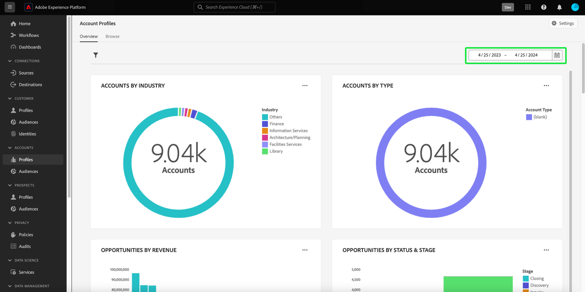

### Configure the lead to account matching service {#lead-to-account-matching-service}

Select **[!UICONTROL Settings]** to configure the lead to account matching service from the [!UICONTROL Account settings] dialog. For full details on how to configure your lead to account matching, see the [UI guide](../../rtcdp/accounts/account-profile-ui-guide.md#configure-lead-to-account-matching). To learn more about lead to account matching, refer to the [lead to account matching in Real-Time CDP B2B documentation](../../rtcdp/b2b-ai-ml-services/lead-to-account-matching.md).

## Browse account profiles {#browse-account-profiles}

From the [!UICONTROL Browse] tab, you can search and view the read-only account profiles ingested into your organization. Use an account ID from a connected enterprise source or enter source details directly. From this workspace, you can see important information belonging to the account profile including, their name, industry, revenue, and audience among others.

Select the [!UICONTROL Profile ID] from the results displayed on the [!UICONTROL Browse] tab to open the [!UICONTROL Details] tab for the account profile.

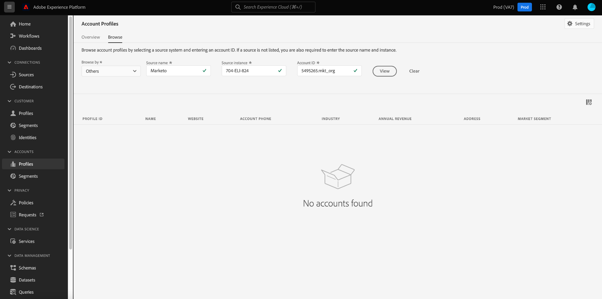

The account profile information displayed on the [!UICONTROL Details] tab has been merged together from multiple profile fragments to form a single view of the individual account. See the documentation on [browsing account profiles in Adobe Real-Time Customer Data Platform](../../rtcdp/accounts/account-profile-ui-guide.md#browse-account-profiles) to learn more about account profile viewing capabilities in the Platform UI. 

## Standard widgets {#standard-widgets}

>[!CONTEXTUALHELP]
>id="platform_dashboards_accountprofiles_customersperaccountoverview"
>title="Customers per account overview"
>abstract="This drill-through widget provides insights into the structure of your B2B data. It helps you identify how many Account profiles have no Customer profiles linked or have one or more Customer profiles associated with them.<ul><li>Direct Customers: are customer profiles directly linked to an Account through the `personComponents` route.</li><li>Indirect Customers: are customer profiles linked to an Account via the `Account-Person` route.</li></ul>"

Adobe provides standard widgets that you can use to visualize different metrics related to your account profiles.

>[!IMPORTANT]
>
>If you do not provide a date filter, the default behavior of insights analyzes data added from the previous year up to today.

To learn more about each of the available standard widgets, select the name of a widget from the following list:

* [Account profiles added](#account-profiles-added)
* [Customers per account overview](#customers-per-account-overview)
  * [Opportunities per account overview](#opportunities-per-account-overview)
  * [Opportunities per account detail](#opportunities-per-account-detail)
  * [Customers per account detail](#customers-per-account-detail)
* [New accounts by industry](#accounts-by-industry)
* [New accounts by type](#accounts-by-type)
* [New opportunities by person role](#opportunities-by-person-role)
* [New opportunities by revenue](#opportunities-by-revenue)
* [New opportunities by status & stage](#opportunities-by-status-&-stage)
* [New opportunities won](#opportunities-won)
* [Opportunities added](#opportunities-added)
* [Predictive scoring distribution](#predictive-scoring-distribution)
* [Predictive scoring top influential factors](#predictive-scoring-top-influential-factors)

### Account profiles added {#account-profiles-added}

The [!UICONTROL Account profiles added] widget uses a line graph to display the number of account profiles added each day over a period of time. Use the global date filter located at the top of your dashboard to determine the period of analysis. If no date filter is provided, the default behavior lists the account profiles added for the year prior to today. The results can be used to infer a trend in the number of account profiles added.

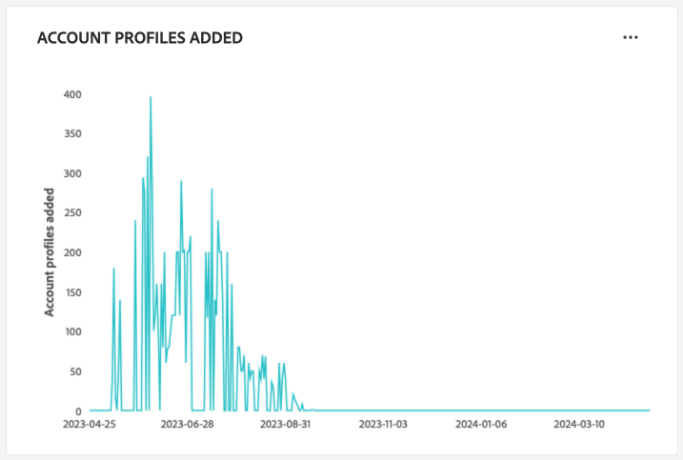

### Customers per account overview {#customers-per-account-overview}

>[!NOTE]
>
>The [!UICONTROL Customers per account overview] insight and it's drill-through charts ([!UICONTROL Customers per account detail], [!UICONTROL Opportunities per account overview], [!UICONTROL Opportunities per account detail]) are not impacted by any global date filters that you might have set.

The [!UICONTROL Customers per account overview] chart provides a summary of accounts based on their customer types. It displays a four-row table that categorizes accounts as having either direct or indirect customers, or those without. It provides the total number of accounts for each category. The chart helps identify the distribution of accounts that have direct versus indirect customers.

Direct customers are customer profiles that are directly linked to an account through the `personComponents` route. This relationship is more straightforward and involves a direct, explicit connection between the customer and the account. 

Indirect customers are customer profiles linked to an account via the `Account-Person` route. This relationship is less straightforward and involves an intermediate entity or a more complex connection between the customer and the account, typically through other accounts or relationships.

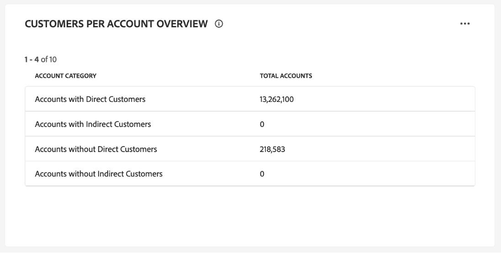

To access more detailed insights, select the ellipse (**...**) on the [!UICONTROL Customers per account overview] chart and choose **[!UICONTROL Drill through]** from the dropdown menu. 

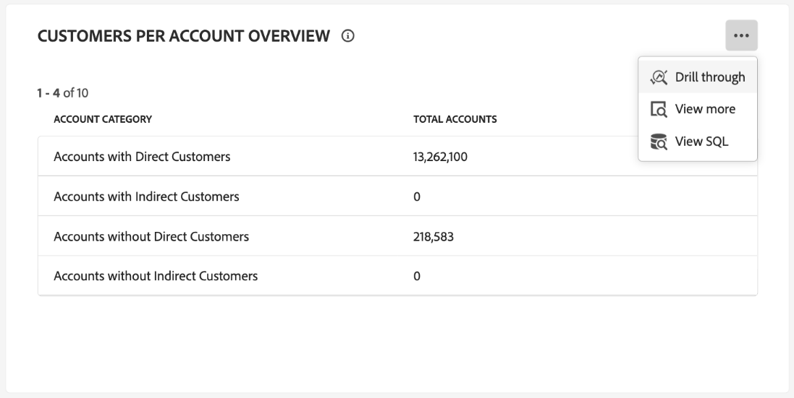

The drill through view appears. Next, explore the available drill-through charts to gain a deeper understanding of the structure of your B2B data. You can use these drill-through charts to identify how many account profiles have no customer profiles linked or have one or more customer profiles associated with them. You can also use them to identify how many direct or indirect customers are associated with your accounts.

* [[!UICONTROL Customers per account detail]](#customers-per-account-detail)
* [[!UICONTROL Accounts per opportunity overview]](#accounts-per-opportunity-overview)
* [[!UICONTROL Opportunities per account detail]](#accounts-per-opportunity-detail)

### [!UICONTROL Navigate between dashboard views] {#dashboard-view-navigation}

To switch between the drill through and the Account Profiles dashboard, select the folder icon () followed by the correct view from the dropdown menu.

To learn more about drill throughs in the Platform UI, see the [Drill Through guide](../sql-insights-query-pro-mode/drill-through.md). 

#### [!UICONTROL Customers per account detail] {#customers-per-account-detail}

The [!UICONTROL Customers per account detail] chart provides more granular details about the number of accounts associated with different customer types. It displays a three-column table detailing the number of accounts by customer type (direct or indirect), and the range of customers associated with them. This chart helps you to understand how the customers are distributed across different customer categories and the total number of accounts associated with each.

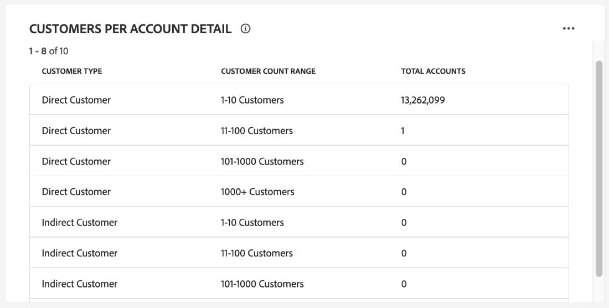

#### [!UICONTROL Opportunities per account overview] {#opportunities-per-account-overview}

The [!UICONTROL Opportunities per account overview] chart presents a summary of accounts that either have or do not have opportunities. This two-row table helps to quickly determine the number of accounts that are associated with opportunities, providing a snapshot of opportunity engagement across accounts.

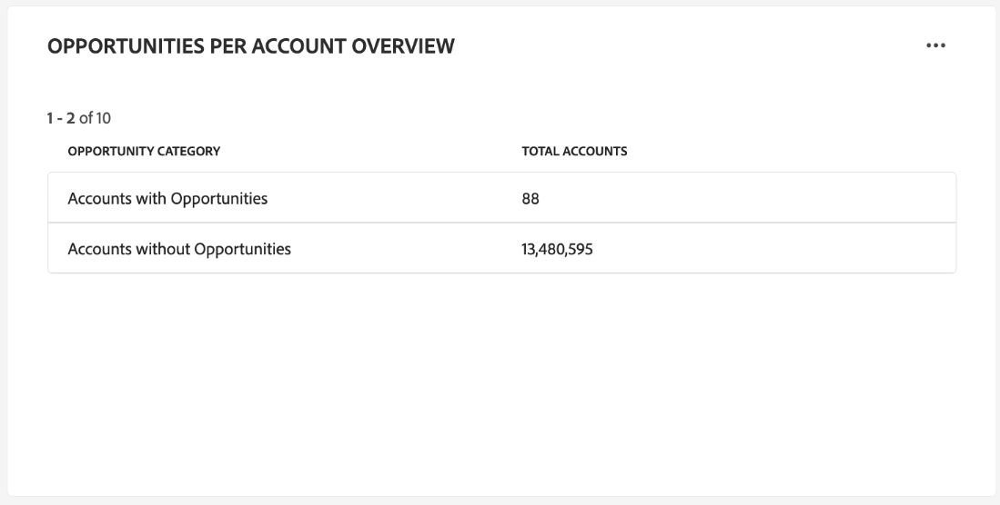

#### [!UICONTROL Opportunities per account detail] {#opportunities-per-account-detail}

The [!UICONTROL Opportunities per account detail] chart offers a more detailed breakdown of accounts based on the number of opportunities that they have. The table displays the number of accounts grouped by opportunity count ranges, such as 1-10 opportunities or 100+ opportunities. This chart helps you to identify how accounts are distributed by the number of opportunities they are managing.

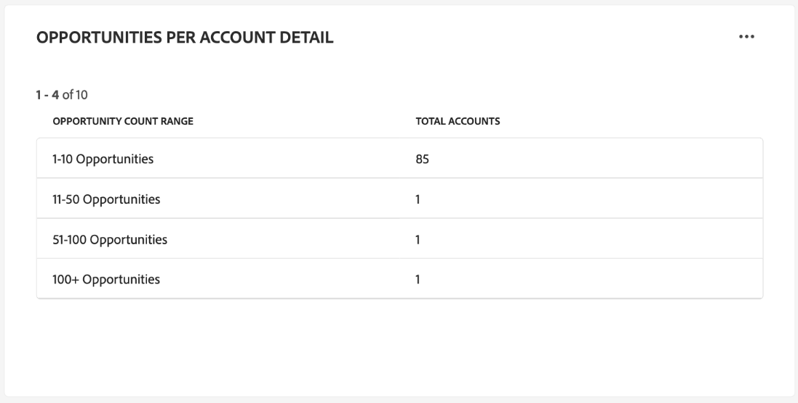

### New accounts by industry {#accounts-by-industry}

The [!UICONTROL New accounts by industry] widget displays the total number of accounts in a single metric inside a donut chart. The donut chart illustrates the relative makeup of different industries that comprise this total. A color-coded key provides a breakdown of all the included industries. Individual counts for each industry are displayed in a dialog when the cursor hovers over the respective section of the donut chart.

### New accounts by type {#accounts-by-type}

The [!UICONTROL New accounts by type] widget displays the total number of accounts in a single metric inside a donut chart. The donut chart illustrates the relative makeup of different account types that comprise this total. A color-coded key provides a breakdown of all the included account types. Individual counts for each type of account are displayed in a dialog when the cursor hovers over the respective section of the donut chart.

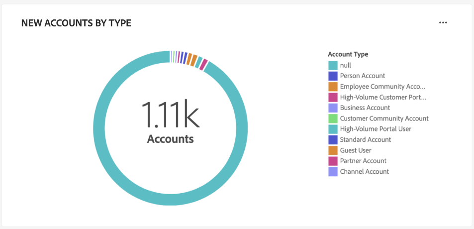

### New opportunities by person role {#opportunities-by-person-role}

The [!UICONTROL New opportunities by person role] widget displays the total number of your opportunities in a single metric inside a donut chart. The donut chart illustrates the relative makeup of roles that comprise this total number of opportunities. A color-coded key provides a breakdown of all the included roles. Individual counts for each role are displayed in a dialog when the cursor hovers over the respective section of the donut chart.

>[!NOTE]
>
>The [!UICONTROL No data found] or [!UICONTROL Unable to load] error is caused when the 'Opportunity-Person' bridge-table is not used in your schema. If your insight displays one of these errors, check your union schema and ensure that the 'Opportunity-Person' field group is ingesting data.   

### New opportunities by revenue {#opportunities-by-revenue}

The [!UICONTROL New opportunities by revenue] widget uses a bar chart to illustrate the total estimated amount of revenue generated by your opportunities. The widget supports up to six opportunities.

To see a dialog that contains the specific revenue total for an opportunity, use the cursor to hover over individual bars.

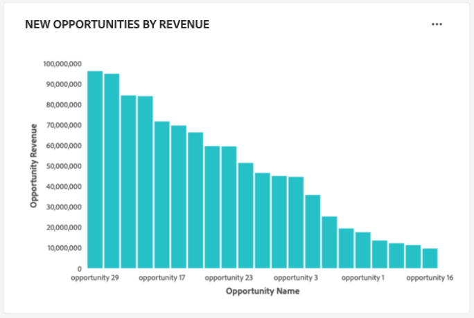

### New opportunities by status & stage {#opportunities-by-status-&-stage}

This widget uses a bar chart to illustrate the number of opportunities that are either open or closed at all stages of the marketing/sales funnel. The widget uses colors to differentiate the stage of the opportunities. A color-coded key indicates the available stages for opportunities. 

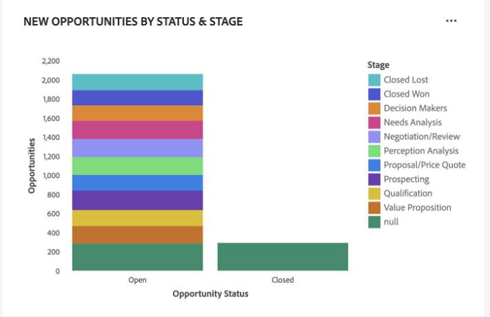

### New opportunities won {#opportunities-won}

The [!UICONTROL New opportunities won] widget displays the total number of your opportunities that have been successfully finalized in a single metric inside a donut chart. The donut chart illustrates the relative makeup of opportunities that are either won or not. A color-coded key distinguishes between won and not-won opportunities. Individual counts for each role are displayed in a dialog when the cursor hovers over the respective section of the donut chart.

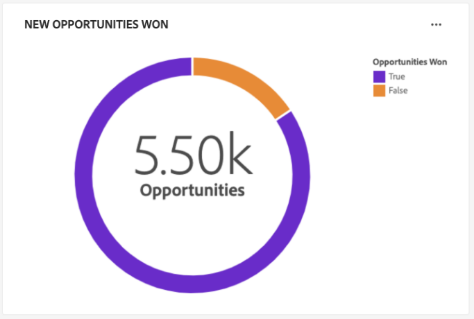

### Opportunities added {#opportunities-added}

The [!UICONTROL Opportunities added] widget uses a line graph to display the number of opportunities added each day over a period of time. Use the global date filter located at the top of your dashboard to determine the period of analysis. If no date filter is provided, the default behavior lists the opportunities added for the year prior to today. The results can be used to infer a trend in the number of opportunities added.

<!-- Link to date filter documentation from Annamalai -->

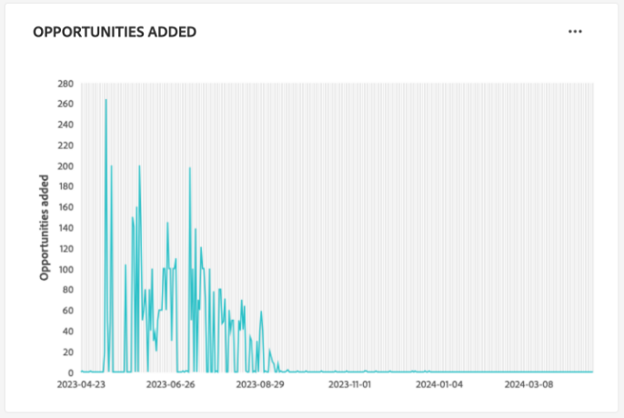

### Predictive scoring distribution {#predictive-scoring-distribution}

The [!UICONTROL Predictive scoring distribution] widget shows the score distribution of all account profiles to help you understand the health of your sales pipeline at a glance. The scoring data is conveyed through a donut chart and a column chart.

The donut chart illustrates the proportion of your total account profiles in each of the high, medium, and low propensity to buy buckets. The key provides more details on the color-coded sections including the scoring bucket ranges and the number of account profiles in that range.

The column chart provides a more granular scoring breakdown. Each column shows the number of account profiles in each of the 20 five-point-increment buckets.

The dropdown menu within the widget allows you to select the account scoring model.

>[!NOTE]
>
>Global date range filters do not apply to predictive scoring insights. Predictive scoring widgets analyze data based on the account scoring model selected in the dropdown.

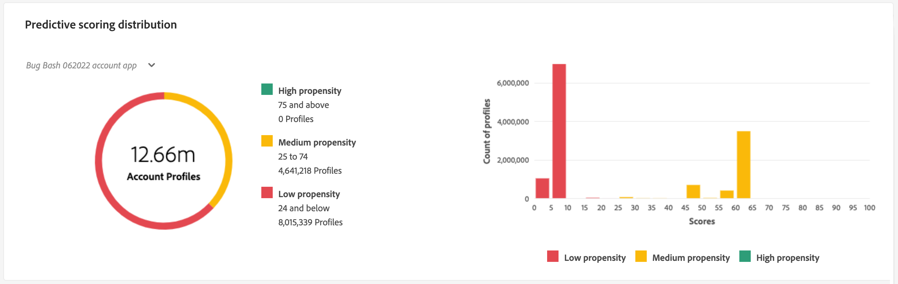

### Predictive scoring top influential factors {#predictive-scoring-top-influential-factors}

The [!UICONTROL Predictive scoring top influential factors] widget helps you to understand the most significant factors that drive the scores for each propensity bucket.

This widget shows the top influential factors for each of the high, medium, and low propensity buckets. A bar for each influential factor indicates the percentage of the account profiles in that propensity bucket that contains the specific influential factor.

The dropdown menu within the widget allows you to select the account scoring model.

>[!NOTE]
>
>Global date range filters do not apply to predictive scoring insights. Predictive scoring widgets analyze data based on the account scoring model selected in the dropdown.

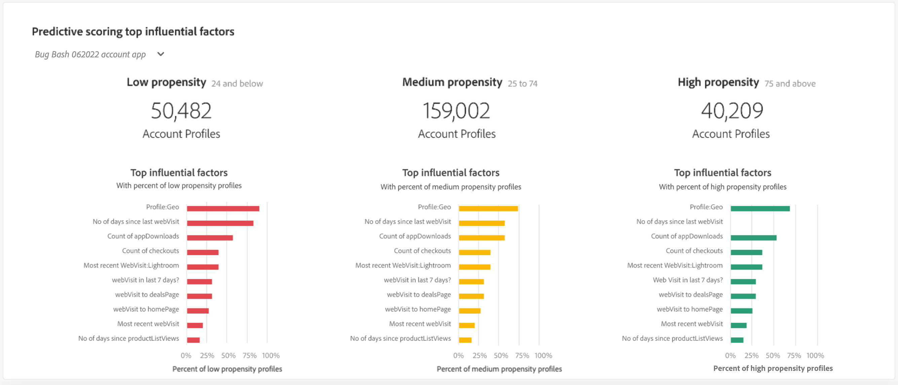

## Unable to load data error {#errors}

If a widget displays *[!UICONTROL Unable to load. Try again.]* this is because there is no available data for the B2B entity. For example, the widget displayed below [!UICONTROL New opportunities by person role], shows the message "[!UICONTROL Unable to load. Try again.]" since this sandbox does not have available opportunity data.

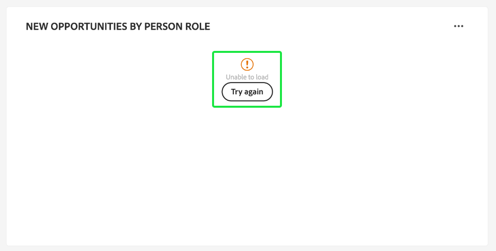

To resolve the issue, you must ingest B2B entity data, such as *opportunity person* data, into the sandbox. After 48 hours, the data is reflected in the widgets.

## Next steps

By following this document, you should now know how to locate the [!UICONTROL Account Profiles] dashboard and also understand the metrics displayed in the available widgets. To learn more about working with account profiles as part of your B2B data in the Experience Platform UI, please refer to the [account profiles overview](../../rtcdp/accounts/account-profile-overview.md) for Adobe Real-Time CDP, B2B Edition.
