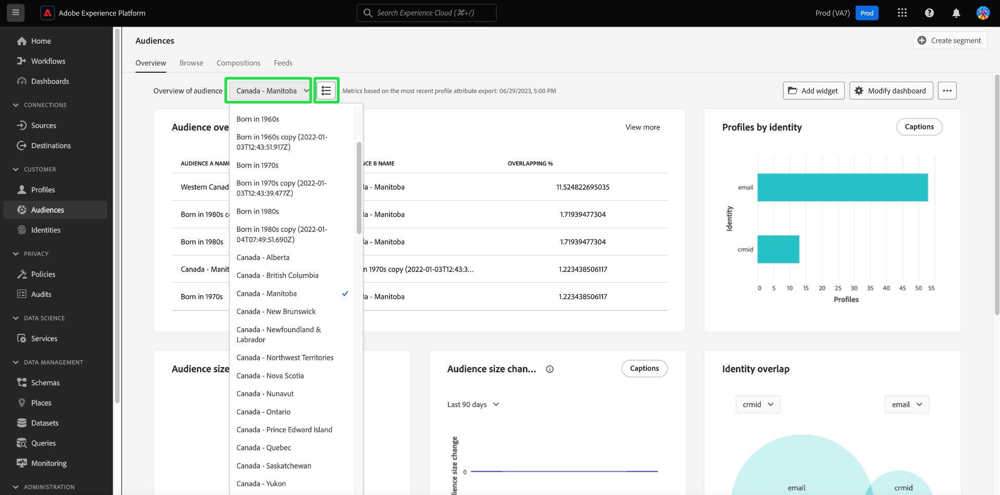
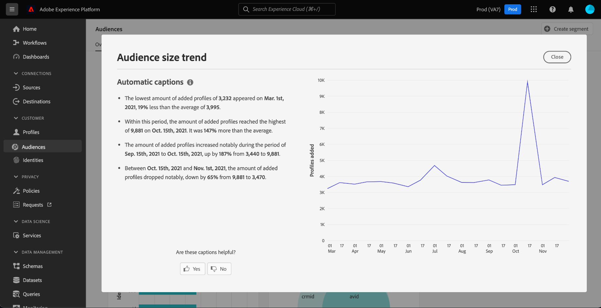
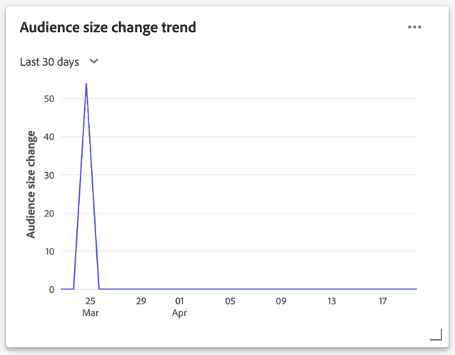
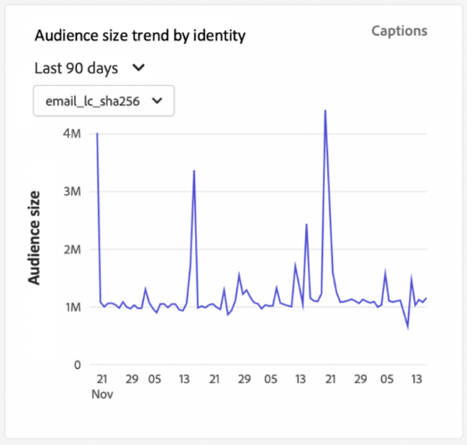
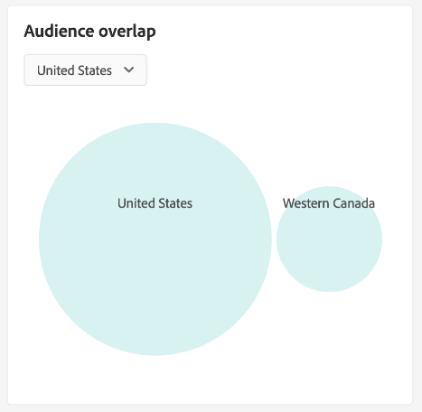
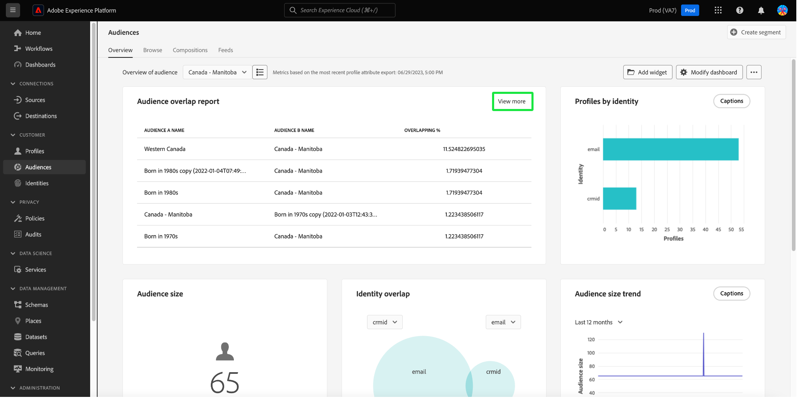
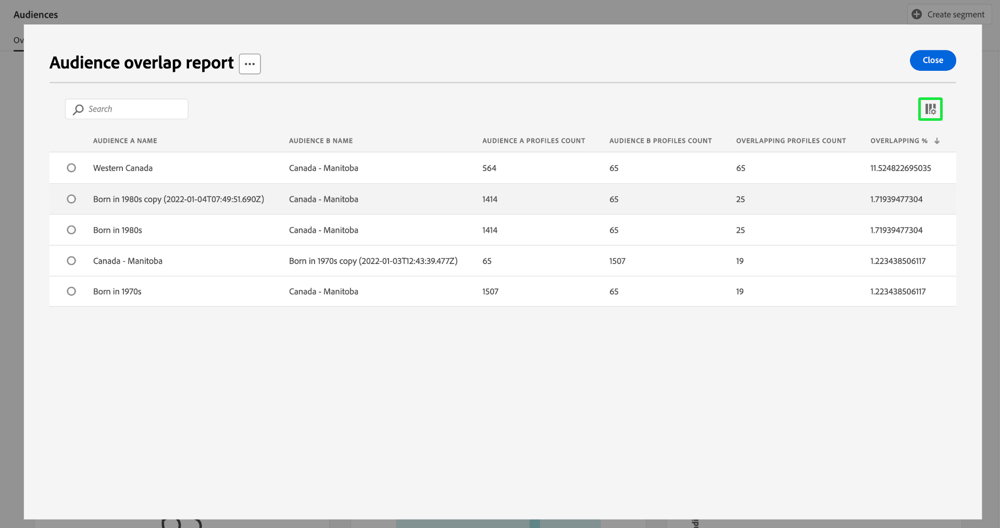
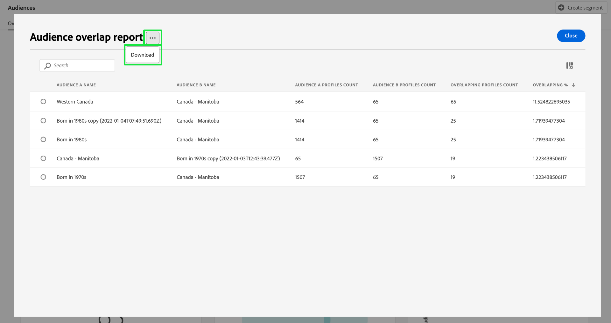
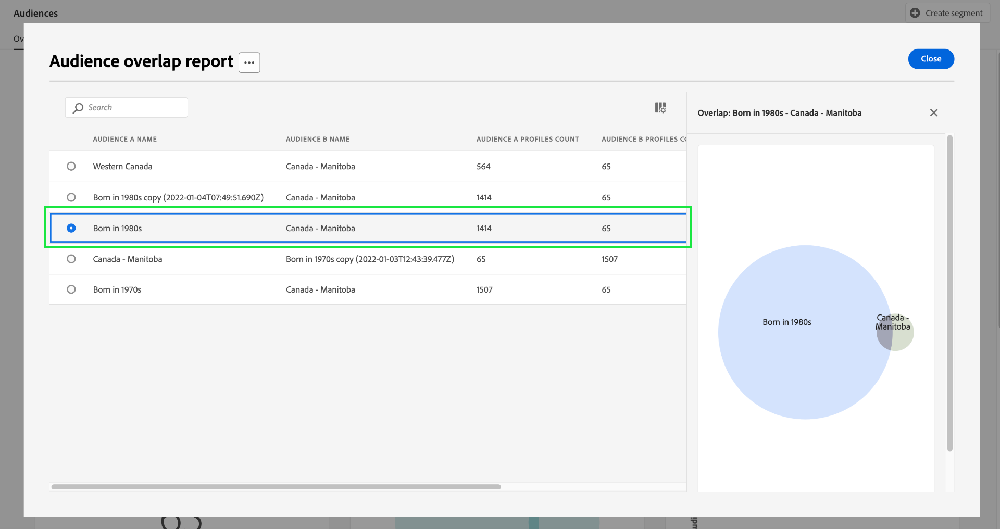
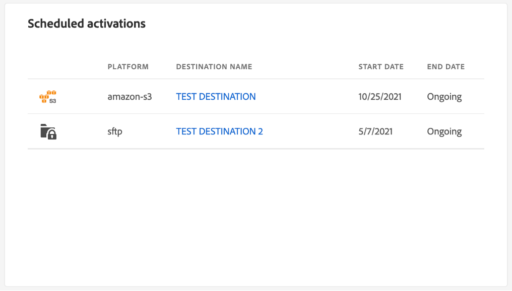

# [!UICONTROL Audiences] dashboard {#audiences-dashboard}

The Adobe Experience Platform user interface (UI) provides a dashboard through which you can view important information about your audiences, as captured during a daily snapshot. This guide outlines how to access and work with the [!UICONTROL Audiences] dashboard in the UI and provides more information regarding the visualizations displayed in the dashboard.  

For an overview of all of the Adobe Experience Platform Segmentation Service features within the Platform user interface, please visit the [Segmentation Service UI guide](../../segmentation/ui/overview.md).

## [!UICONTROL Audiences] dashboard data

The [!UICONTROL Audiences] dashboard displays a snapshot of the attribute (record) data that your organization has within the Profile store in Experience Platform. The snapshot does not include any event (time series) data. 

The attribute data in the snapshot shows the data exactly as it appears at the specific point in time when the snapshot was taken. In other words, the snapshot is not an approximation or sample of the data, and the [!UICONTROL Audiences] dashboard is not updating in real-time.

>[!NOTE]
>
>Any changes or updates made to the data since the snapshot was taken will not be reflected in the dashboard until the next snapshot is taken.

## Explore the [!UICONTROL Audiences] dashboard {#explore}

To navigate to the [!UICONTROL Audiences] dashboard within the Platform UI, select **[!UICONTROL Audiences]** in the left rail, then select the **[!UICONTROL Overview]** tab to display the dashboard.

>[!NOTE]
>
>If your organization is new to Platform and does not yet have active Profile datasets or merge policies created, the [!UICONTROL Audiences] dashboard is not visible. Instead, the [!UICONTROL Overview] tab displays links and documentation to help you get started with segmentation.

![The [!UICONTROL Audiences] dashboard [!UICONTROL Overview] tab with [!UICONTROL Audiences] and [!UICONTROL Overview] highlighted.](../images/audiences/dashboard-overview.png)

### Modify the [!UICONTROL Audiences] dashboard {#modify}

You can modify the appearance of the [!UICONTROL Audiences] dashboard by selecting **[!UICONTROL Modify dashboard]**. This enables you to move, add, and remove widgets from the dashboard as well as to access the **[!UICONTROL Widget library]** to explore available widgets and create custom widgets for your organization. 

Please refer to the [modifying dashboards](../customize/modify.md) and [Widget library overview](../customize/widget-library.md) documentation to learn more.

### Add widgets {#add-widget}

Select **[!UICONTROL Add widget]** to navigate to the widget library and see a list of the available widgets to add to your dashboard.

![The [!UICONTROL Audiences] dashboard overview with [!UICONTROL Add widget] highlighted.](../images/audiences/audiences-overview-add-widget.png)

From the widget library, you can browse the selection of standard and custom audience widgets. For information on how to add widgets, please see the widget library documentation on how to [add a widget](../customize/widget-library.md#add-widgets). 

## Select a audience {#select-audience}

The dashboard automatically selects an audience to display. However, you can change the audience by using the dropdown menu or audience selector. 

To choose a different audience, select the dropdown next to the audience name or use the audience selector to open the audience selection dialog.

>[!IMPORTANT]
>
>Only audiences with a profile count above zero are displayed in the list of selectable audiences.

![The [!UICONTROL Select audience] dialog that displays all available audiences.](../images/audiences/select-audience-dialog.png)

## Widgets and metrics {#widgets-and-metrics}

The [!UICONTROL Audiences] dashboard is composed of widgets, which are read-only metrics providing important information regarding your selected audience. 

The date and time of the most recent snapshot are displayed at the top of the [!UICONTROL Overview] tab next to the audience dropdown. All widget data is accurate as of that date and time. The timestamp of the snapshot is provided in UTC; it is not in the timezone of the individual user or organization.

## Default widgets {#default-widgets}

A default widget load-out is provided for all new instances of Adobe Experience Platform that highlights the latest available insights from your data. The following widgets are pre-configured in your segments view from the outset. Full details on the purpose and function of the widgets can be found in their respective sections.

* [[!UICONTROL Audience size]](#audience-size)
* [[!UICONTROL Audience size change trend]](#audience-size-change-trend)
* [[!UICONTROL Identity overlap]](#identity-overlap)
* [[!UICONTROL Profiles by identity]](#profiles-by-identity)

>[!NOTE]
>
>As of July 26th 2023, [!UICONTROL Profiles], [!UICONTROL Audiences], and [!UICONTROL Destinations] Overview dashboards have been reset to a new default widget load-out for all users who did not modify their views in the previous six months. 
>Refer to the documentation in the [Profiles](./profiles.md#default-widgets) and [Destinations](./destinations.md#default-widgets) default widget sections for details on which widgets are included as part of the default widget load-outs. You can continue to customize your dashboard widgets as before.

## Customer AI widgets {#customer-ai-audiences-widgets}

Customer AI is used to generate custom propensity scores such as churn and conversion for individual profiles at-scale. Customer AI does this by analyzing existing consumer Experience Event data to predict **churn or conversion propensity scores**. These high accuracy customer propensity models allow for more exact segmentation and targeting. The [distribution of scores](#customer-ai-distribution-of-scores) and [scoring summary](#customer-ai-scoring-summary) insights demonstrate the division in your audience. They highlight which profiles are the high/low/medium propensity and how they are distributed across your profile counts.

* [[!UICONTROL Customer AI scoring summary]](#customer-ai-scoring-summary)
* [[!UICONTROL Customer AI distribution of scores]](#customer-ai-distribution-of-scores)

### [!UICONTROL Customer AI distribution of scores] {#customer-ai-distribution-of-scores} 

>[!CONTEXTUALHELP]
>id="platform_dashboards_segments_distributionOfScores"
>title="Distribution of scores"
>abstract="This widget visualizes the distribution of the total number of profiles by their propensity scores in five percent increments. The distribution of the profile count is determined by the AI model and the selected merge policy. You can change the AI model from the dropdown menu under the widget title."

The [!UICONTROL Customer AI distribution of scores] widget categorizes the total number of profiles by their propensity scores. The distribution of the profile count is determined by the AI model and the selected merge policy, then visualized in five percent increments that indicate their propensity. The count of profiles is provided along the Y-axis, and the propensity scores are provided along the X-axis. 

>[!NOTE]
>
>If the visualization is a conversion propensity score, the high scores show in green and the low scores in red. If you are predicting churn propensity this is flipped, the high scores are in red and the low scores are green. The medium bucket remains yellow regardless of what propensity type you choose.

The AI model that determines the propensity scores is chosen from the dropdown selector under the widget title. The dropdown contains a list of all configured Customer AI models. Select the appropriate AI model for your analysis from the list of available models. If no Customer AI model is available, a message within the widget directs you to configure at least one Customer AI model and provides a hyperlink to the Customer AI model configuration page. See the documentation for instructions on [how to configure a Customer AI instance](../../intelligent-services/customer-ai/user-guide/configure.md). 

>[!NOTE]
>
>Select the dropdown immediately below the overview tab to change the merge policy that determines which profiles are included in the analysis. See the section on [merge policies](#merge-policies) for a brief description, or the [merge policy overview](../../profile/merge-policies/overview.md) for more details. 

To navigate to the detailed insights page for the selected Customer AI model, select **[!UICONTROL View model details]**.

![The Experience Platform Audiences dashboard with the [!UICONTROL Customer AI distribution of scores] widget and [!UICONTROL View model details] highlighted.](../images/segments/customer-ai-distribution-of-scores.png)

The detailed model insights page appears.

More information on Customer AI can be found on the [discover insights UI guide](../../intelligent-services/customer-ai/user-guide/discover-insights.md).

### [!UICONTROL Customer AI scoring summary] {#customer-ai-scoring-summary}

>[!CONTEXTUALHELP]
>id="platform_dashboards_segments_scoringSummary"
>title="Scoring summary"
>abstract="This widget displays the total number of scored profiles and categorizes them into buckets containing high, medium, and low propensity. The donut chart illustrates the proportional composition of total profiles across high, medium, and low propensity."

This widget displays the total number of profiles scored, and categorizes them into buckets containing high, medium, and low propensity as green, yellow, and red respectively. A donut chart is used to illustrate the proportional composition of total profiles between high, medium, and low propensities as green, yellow, and red respectively. A profile qualifies for high propensity at over 75, medium propensity between 25 and 74, and low propensity under 24. A legend indicates the colour code and thresholds of propensities. Profile counts for the high, medium, and low propensities are displayed in a dialog when the cursor hovers over the respective section of the donut chart.

>[!NOTE]
>
>If the visualization is a conversion propensity score, the high scores show in green and the low scores in red. If you are predicting churn propensity this is flipped, the high scores are in red and the low scores are green. The medium bucket remains yellow regardless of what propensity type you choose.

The dropdown menu underneath the widget title provides a list of all configured Customer AI models. Select the appropriate AI model for your analysis from the list of available models. If no Customer AI model is available, a message within the widget directs you to configure at least one Customer AI model and provides a hyperlink to the Customer AI model configuration page. See the documentation on [how to configure a Customer AI instance](../../intelligent-services/customer-ai/user-guide/configure.md) for detailed instructions.

>[!NOTE]
>
>The total number of profiles calculated is dependent on the chosen merge policy. To change the merge policy used, select the dropdown immediately below the overview tab. See the section on [merge policies](#merge-policies) for a brief description, or the [merge policy overview](../../profile/merge-policies/overview.md) for more details. 

Select **[!UICONTROL View model details]** to navigate to the detailed insights page for the selected Customer AI model. More information on Customer AI can be found on the [discover insights UI guide](../../intelligent-services/customer-ai/user-guide/discover-insights.md).

## Standard widgets {#standard-widgets}

Adobe provides multiple standard widgets that you can use to visualize different metrics related to your audiences. You can also create custom widgets to be shared with your organization using the [!UICONTROL Widget library]. To learn more about creating custom widgets, please begin by reading the [Widget library overview](../customize/widget-library.md).

To learn more about each of the available standard widgets, select the name of a widget from the following list:

* [[!UICONTROL Audience size]](#audience-size)
* [[!UICONTROL Audience activation order]](#audience-activation-order)
* [[!UICONTROL Audience size trend]](#audience-size-trend)
* [[!UICONTROL Audience size change trend]](#audience-size-change-trend)
* [[!UICONTROL Audience size trend by identity]](#audience-size-trend-by-identity)
* [[!UICONTROL Audience overlap]](#audience-overlap)
* [[!UICONTROL Audience overlap report]](#audience-overlap-report)
* [[!UICONTROL Identity overlap]](#identity-overlap)
* [[!UICONTROL Profiles by identity]](#profiles-by-identity)
* [[!UICONTROL Scheduled activations]](#scheduled-activations)

### [!UICONTROL Audience size] {#audience-size}

>[!CONTEXTUALHELP]
>id="platform_dashboards_segments_audiencesize"
>title="Audience size"
>abstract="This widget displays the total number of merged profiles within the selected audience. This number depends on the merge policy applied to your data and is correct at the time of the most recent snapshot."

The **[!UICONTROL Audience size]** widget displays the total number of merged profiles within the selected audience at the time the snapshot was taken. This number is the result of applying the audience merge policy to your Profile data to merge profile fragments together and form a single profile for each individual in the audience. 

For more information on fragments and merged profiles, refer to the [Real-Time Customer Profile overview](../../profile/home.md).

![The [!UICONTROL Audiences] dashboard overview with the [!UICONTROL Audience size] widget highlighted.](../images/audiences/audience-size.png)

### [!UICONTROL Audience size trend] {#audience-size-trend}

>[!CONTEXTUALHELP]
>id="platform_dashboards_segments_audiencesizetrend"
>title="Audience size trend"
>abstract="This widget provides information regarding the total number of profiles that meet the criteria of **any** segment definition, as captured during the daily snapshot, for the last 30 days, 90 days, or 12 months."

The **[!UICONTROL Audience size trend]** widget provides a line graph illustration for the total number of profiles that qualify for **any** audience over a given period of time. The audience size trend can be visualized over 30 days, 90 days, and 12 month periods. The time period is chosen from a dropdown menu in the widget. The audience size is reflected on the y-axis and time on the x-axis.

This widget also includes the automatic [!UICONTROL Captions] feature where a machine learning model analyzes the chart and audience data and automatically generates captions to describe the key trends and important events. Select **[!UICONTROL Captions]** to open the automatic captions dialog. 

![The [!UICONTROL Audiences] overview displays the Audience size trend widget.](../images/audiences/audience-size-trend-captions.png)

The automatic captions dialog opens providing insights on your data. 

 

To learn more about the evaluation of audiences and how profiles qualify and exit from audiences, please refer to the [Segmentation Service documentation](../../segmentation/home.md).

### [!UICONTROL Audience size change trend] {#audience-size-change-trend}

This widget provides a line graph illustration of the difference in the total number of profiles that qualified for a given audience between the most recent daily snapshots. The audience chosen for analysis is selected from the overview dropdown. The period of trend analysis can be visualized over 30 days, 90 days, and 12 month periods. The time period is chosen from a dropdown menu in the widget. The audience size is reflected on the y-axis and time on the x-axis.

### [!UICONTROL Audience size trend by identity] {#audience-size-trend-by-identity}

This widget illustrates the audience size trend for a particular audience based on the identity type chosen from the widget dropdown menu. The audience used for analysis is selected from the overview dropdown. The period of trend analysis can be visualized over 30 days, 90 days, and 12 month periods. The time period is chosen from a dropdown menu in the widget.

### [!UICONTROL Audience activation order] {#audience-activation-order}

The [!UICONTROL Audience activation order] widget provides a three-column table that lists the destination name, the platform, and the activation date of the audience. The list is ordered from high to low according to recency and can accommodate up to 10 rows.

### [!UICONTROL Audience overlap] {#audience-overlap}

This widget uses a Venn diagram to visualize the number of people that match the criteria for both audiences. The audiences used for comparison are selected from the widget dropdown menus. The total number of profiles contained within the relevant segment definition can be seen by hovering over a circle or the intersection of the Venn diagram.

This widget enables you to optimize your segmentation strategy by visualizing the similarities in the results of your segment definitions.

### [!UICONTROL Audience overlap report] {#audience-overlap-report}

This widget tabularizes the profile overlap data for a specific audience. A list of five audiences ranked from highest to lowest overlap percentages is provided for the audience chosen from the dropdown menu at the top of the screen. For clarity, your chosen audience is listed in the [!UICONTROL AUDIENCE A NAME] column. Audience overlap analysis is provided for the second audience listed in the [!UICONTROL AUDIENCE B NAME] column. The percentage overlap is provided in the third column accurate to twelve decimal places.

The audience overlap report helps you to build new, high-performance audiences. Observing high percentage overlaps enables you to suppress audiences and prevent sending the same audience to different destinations. They also help you identify hidden insights that might help with better segmentation. Low percentage overlap helps to locate unique profiles to pursue.

Select **[!UICONTROL View more]** to open a full-screen dialog that contains more audience overlap data.

The [!UICONTROL Audience overlap report] dialog appears. This dialog can contain up to 50 rows of audience overlap analyses broken down into six columns. Select the settings icon () to remove or add columns from the table.

>[!NOTE]
>
>Select the **[!UICONTROL Overlapping]** column header to change the ranking of results between highest to lowest or lowest to highest.

To download the entire report in PDF format, select the options menu (**`...`**) followed by **[!UICONTROL Download]**.

Select a row from the report to open a Venn diagram of the overlap analysis. Hover over a section of the Venn diagram to see the profile count in a dialog.

Select **[!UICONTROL Close]** to return to the [!UICONTROL Audiences] dashboard.

### [!UICONTROL Identity overlap] {#identity-overlap}

>[!CONTEXTUALHELP]
>id="platform_dashboards_segments_identityoverlap"
>title="Identity overlap"
>abstract="This widget shows the overlap of profiles in your audience containing both chosen identities. The circles display the relative size of each identity. The number of profiles containing both namespaces are represented by the overlap between the circles."

The **[!UICONTROL Identity overlap]** widget displays a Venn diagram, or set diagram, showing the overlap of profiles in your audience containing multiple identities. 

Use the dropdown menus on the widget to select the identities that you wish to compare. The circles display the relative size of each chosen identity, with the number of profiles containing both namespaces being represented by the size of the overlap between the circles.

If a customer interacts with your brand on more than one channel, multiple identities will be associated with that individual customer. This situation makes it likely that your organization will have multiple profiles containing fragments from more than one identity.

To learn more about identities, please visit the [Identity Service documentation](../../identity-service/home.md).

![The [!UICONTROL Audiences] dashboard overview with the Identity overlap widget highlighted.](../images/audiences/identity-overlap.png)

### [!UICONTROL Profiles by identity] {#profiles-by-identity}

>[!CONTEXTUALHELP]
>id="platform_dashboards_segments_profilesbyidentity"
>title="Profiles by identity"
>abstract="This widget displays the breakdown of identities across every merged profile in your selected audience."

The **[!UICONTROL Profiles by identity]** widget displays the breakdown of identities across every merged profile in your selected audience. The total number of profiles by identity may be higher than the total number of profiles in the audience because one profile could have multiple identities associated with it. In other words, adding together the values shown for each identity may total more than the total audience size. This is because if a customer interacts with your brand on more than one channel, multiple identities may be associated with that individual customer.

Select **[!UICONTROL Captions]** to open the automatic captions dialog.

![The [!UICONTROL Audiences] dashboard overview with the Profiles by identity widget and Captions option highlighted.](../images/audiences/profiles-by-identity.png)

A machine learning model automatically generates data insights by analyzing the overall distribution and key dimensions of the data.

To learn more about identities, please visit the [Identity Service documentation](../../identity-service/home.md).

### Scheduled activations {#scheduled-activations}

The [!UICONTROL Scheduled activations] widget provides a tabularized view of the most recently activated destinations. The table includes the destination platform, the name of your activation flow to this destination, and the activation start and end date for the selected audience. If there is no end date provided for the activation then it displays as [!UICONTROL Ongoing]. The audience for analysis is selected from the dropdown at the top of the page. 

The widget allows you to discover at a glance where and when the audience is being activated and makes duplicate or unnecessary activations more transparent. This accumulated information also highlights where any activations have been left out.

## Next steps

By following this document you should now be able to locate the [!UICONTROL Audiences] dashboard and select an audience to view. You should also understand the metrics displayed in the available widgets. To learn more about working with audiences in the Experience Platform UI, please refer to the [Segmentation Service UI guide](../../segmentation/ui/overview.md).
