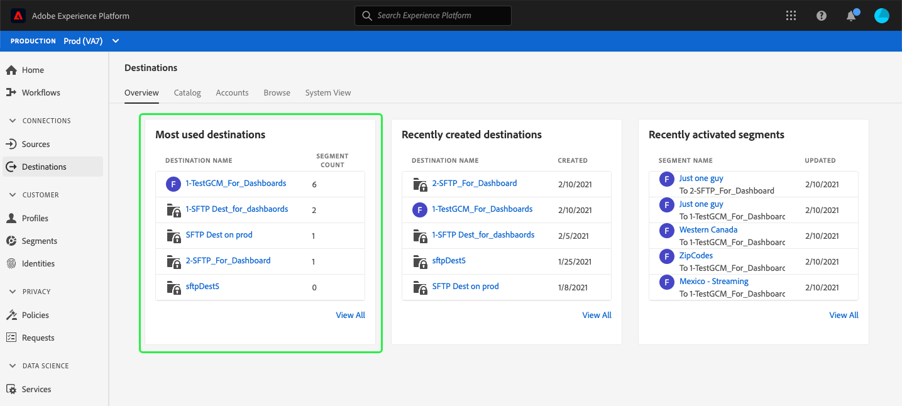
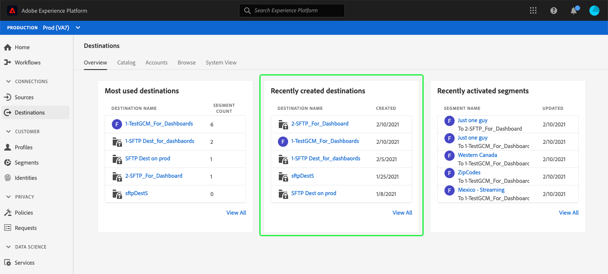
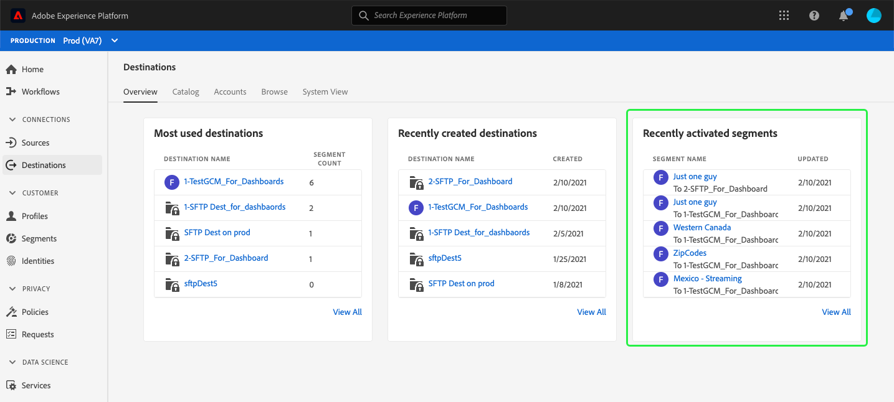

# [!UICONTROL Destinations] dashboard

The Adobe Experience Platform user interface (UI) provides a dashboard through which you can view important information about your organization's active destinations, as captured during a daily snapshot. This guide outlines how to access and work with the destinations dashboard in the UI and provides more information regarding the metrics displayed in the dashboard.  

For an overview of destinations, as well as a catalog of all available destinations within Experience Platform, please visit the [destinations documentation](../../destinations/home.md).

## [!UICONTROL Destinations] dashboard data {#destinations-dashboard-data}

The [!UICONTROL Destinations] dashboard displays a snapshot of the destinations that your organization has enabled within Experience Profile. The data in the snapshot shows the data exactly as it appears at the specific point in time when the snapshot was taken. In other words, the snapshot is not an approximation or sample of the data, and the destinations dashboard is not updating in real time.

>[!NOTE]
>
>Any changes or updates made to the data since the snapshot was taken will not be reflected in the dashboard until the next snapshot is taken.

## Exploring the destinations dashboard

To navigate to the destinations dashboard within the Platform UI, select **[!UICONTROL Destinations]** in the left rail, then select the **[!UICONTROL Overview]** tab to display the dashboard.

## Available widgets

Experience Platform provides multiple widgets that you can use to visualize different metrics related to your destinations. Select the name of a widget below to learn more:

* [[!UICONTROL Most used destinations]](#most-used-destinations)
* [[!UICONTROL Recently created destinations]](#recently-created-destinations)
* [[!UICONTROL Recently activated segments]](#recently-activated-segments)

### [!UICONTROL Most used destinations] {#most-used-destinations}

The **[!UICONTROL Most used destinations]** widget displays your organization's top destinations by number of segments mapped, as of the last snapshot. This ranking provides insight into which destinations are being utilized while also potentially showing those that may be underutilized. 

For example, if you configured a destination yesterday but have not mapped any segments to it, you would be able to see that the destination is currently underutilized.

The number of mapped segments shown in the segment count column is accurate as of the last daily snapshot. Mapping a new segment to the destination will not update the count until the next snapshot is taken.

Selecting the name of a destination from the list shown on the widget will take you to the destination details as linked from the **[!UICONTROL Browse]** tab. You can also select **[!UICONTROL View All]** to navigate to the **[!UICONTROL Browse]** tab and then select the name of a destination to view its details.

### [!UICONTROL Recently created destinations] {#recently-created-destinations}

The **[!UICONTROL Recently created destinations]** widget enables you to see a list of your organization's most recently configured destinations. 

The created date shown is accurate to the last daily snapshot. In other words, if you create a new destination, it will not appear in the list until after the next snapshot is taken.

Selecting the name of a destination from the list shown on the widget will take you to the destination details as linked from the **[!UICONTROL Browse]** tab. You can also select **[!UICONTROL View All]** to navigate to the **[!UICONTROL Browse]** tab and then select the name of a destination to view its details.

To learn more about how to configure specific types of destinations, visit the [destinations documentation](../../destinations/home.md).

### [!UICONTROL Recently activated segments] {#recently-activated-segments}

The **[!UICONTROL Recently activated segments]** widget provides a list of the segments most recently mapped to a destination. This list provides a snapshot of what segments and destinations are actively in use in the system and can help in troubleshooting any erroneous mappings. 

The updated date shown displays the last time the segment was activated to the destination and is accurate to the last daily snapshot. In other words, if you activate a segment to the destination, the updated date will not change until after the next snapshot is taken.

Selecting the name of a segment from the list shown on the widget will take you to the segment details. You can also select **[!UICONTROL View All]** to navigate to the segment browse tab and then select the name of a segment to view its details.

For more information on working with segments in Experience Platform, please begin by reading the [Segmentation Service overview](../../segmentation/home.md).

## Next steps

By following this document you should now be able to locate the destinations dashboard and understand the metrics displayed in the available widgets. To learn more about working with destinations in Experience Platform, please refer to the [destinations documentation](../../destinations/home.md).
