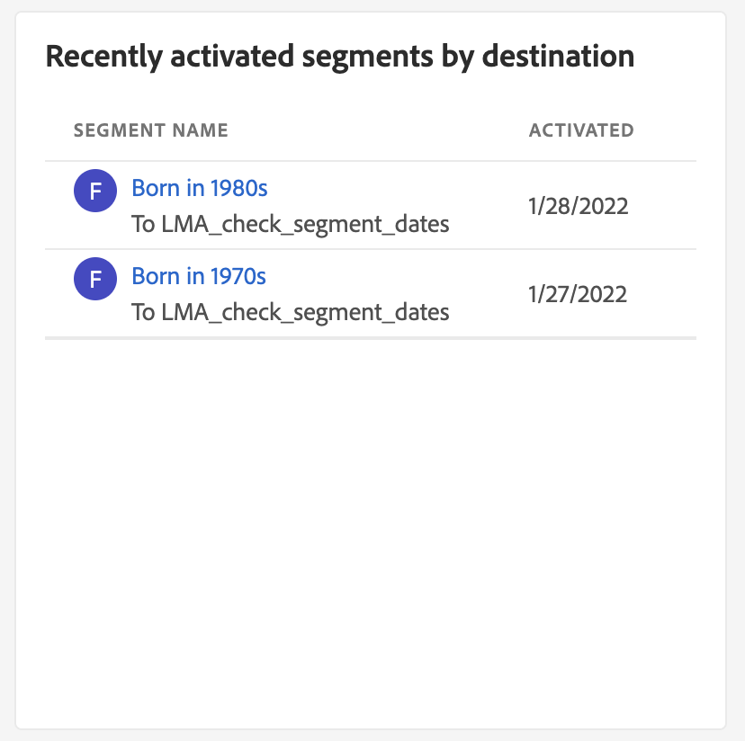
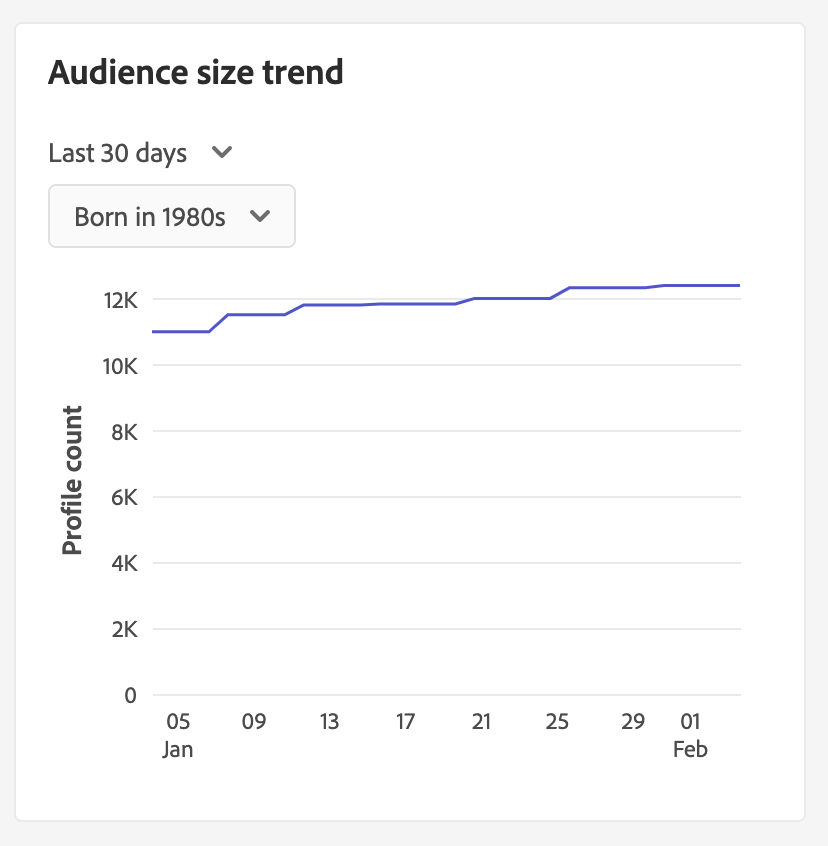
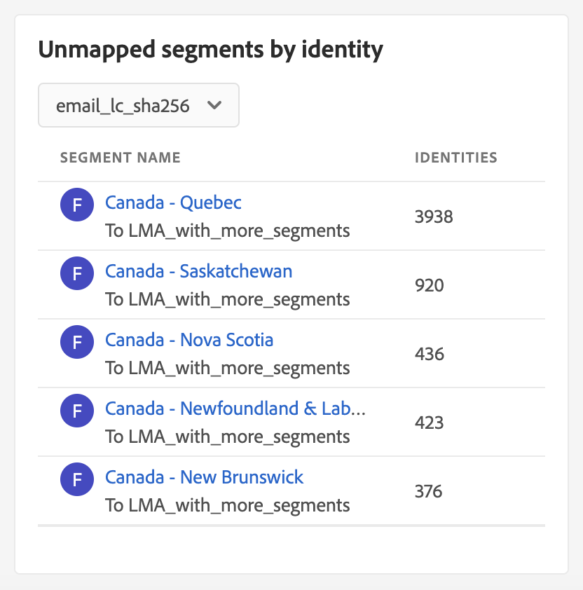
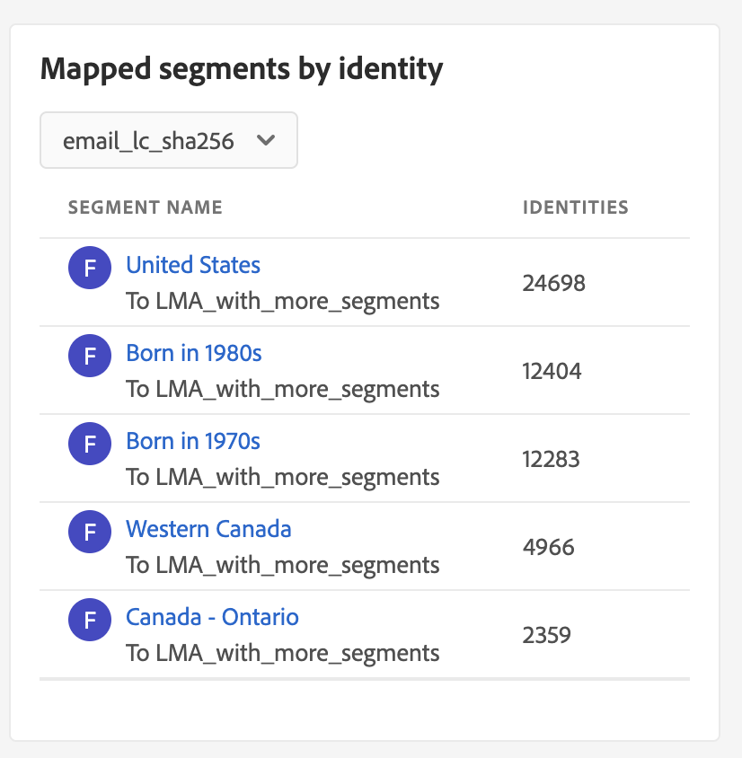
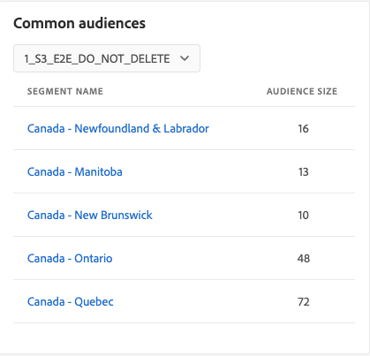
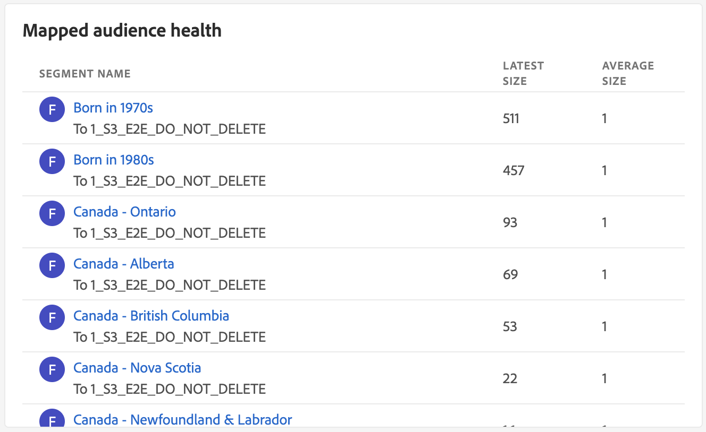
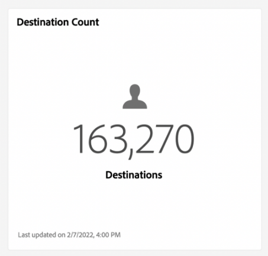

# [!UICONTROL Destinations] dashboard

The Adobe Experience Platform user interface (UI) provides a dashboard through which you can view important information about your organization's active destinations, as captured during a daily snapshot. This guide outlines how to access and work with the destinations dashboard in the UI and provides more information regarding the metrics displayed in the dashboard.  

For an overview of destinations, as well as a catalog of all available destinations within Experience Platform, please visit the [destinations documentation](../../destinations/home.md).

## [!UICONTROL Destinations] dashboard data {#destinations-dashboard-data}

The [!UICONTROL Destinations] dashboard displays a snapshot of the destinations that your organization has enabled within Experience Platform. The data in the snapshot shows the data exactly as it appears at the specific point in time when the snapshot was taken. In other words, the snapshot is not an approximation or sample of the data, and the destinations dashboard is not updating in real-time.

>[!NOTE]
>
>Any changes or updates made to the data since the snapshot was taken will not be reflected in the dashboard until the next snapshot is taken.

## Exploring the destinations dashboard

To navigate to the destinations dashboard within the Platform UI, select **[!UICONTROL Destinations]** in the left rail, then select the **[!UICONTROL Overview]** tab to display the dashboard.

>[!NOTE]
>
>If your organization is new to Experience Platform and does not yet have active destinations, the [!UICONTROL Destinations] dashboard and [!UICONTROL Overview] tab are not visible. Instead, selecting [!UICONTROL Destinations] from the left navigation displays the [!UICONTROL Catalog] tab. To learn more about the [!UICONTROL Catalog] tab, refer to the [[!UICONTROL Destinations] workspace guide](../../destinations/ui/destinations-workspace.md).

### Modifying the destinations dashboard

You can modify the appearance of the destinations dashboard by selecting **[!UICONTROL Modify dashboard]**. This enables you to move, add, and remove widgets from the dashboard as well as to access the **[!UICONTROL Widget library]** to explore available widgets and create custom widgets for your organization. 

Please refer to the [modifying dashboards](../customize/modify.md) and [widget library overview](../customize/widget-library.md) documentation to learn more.

## Standard widgets

Adobe provides multiple standard widgets that you can use to visualize different metrics related to your destinations and assess the completeness of the segments available for your data analysis. You can also create custom widgets to be shared with your organization using the [!UICONTROL Widget library]. To learn more about creating custom widgets, please begin by reading the [widget library overview](../customize/widget-library.md).

To learn more about each of the available standard widgets, select the name of a widget from the following list:

* [[!UICONTROL Most used destinations]](#most-used-destinations)
* [[!UICONTROL Recently created destinations]](#recently-created-destinations)
* [[!UICONTROL Recently activated segments]](#recently-activated-segments)
* [[!UICONTROL Recently activated segments by destination]](#recently-activated-segments-by-destination)
* [[!UICONTROL Audience size trend]](#audience-size-trends)
* [[!UICONTROL Unmapped segments by identity]](#unmapped-segments-by-identity)
* [[!UICONTROL Mapped segments by identity]](#mapped-segments-by-identity)
* [[!UICONTROL Common audiences]](#common-audiences)
* [[!UICONTROL Mapped audience health]](#mapped-audience-health)
* [[!UICONTROL Destinations count]](#destinations-count)

### [!UICONTROL Most used destinations] {#most-used-destinations}

>[!CONTEXTUALHELP]
>id="platform_dashboards_destinations_mostuseddestinations"
>title="Most used destinations"
>abstract="This widget displays your organization's most active destinations by the number of segments mapped. These numbers are accurate at the time of the last snapshot. This ranking provides insight into which destinations are currently most used while highlighting those that may be underutilized."
>additional-url="https://experienceleague.adobe.com/docs/experience-platform/dashboards/guides/destinations.html#most-used-destinations" text="Learn more from documentation"

The **[!UICONTROL Most used destinations]** widget displays your organization's top destinations by the number of segments mapped, as of the last snapshot. This ranking provides insight into which destinations are being utilized while also potentially showing those that may be underutilized. 

For example, if you configured a destination yesterday but have not mapped any segments to it, you would be able to see that the destination is currently underutilized.

The number of mapped segments shown in the segment count column is accurate as of the last daily snapshot. Mapping a new segment to the destination will not update the count until the next snapshot is taken.

Selecting the name of a destination from the list shown on the widget will take you to the destination details as linked from the **[!UICONTROL Browse]** tab. You can also select **[!UICONTROL View All]** to navigate to the **[!UICONTROL Browse]** tab and then select the name of a destination to view its details.

### [!UICONTROL Recently created destinations] {#recently-created-destinations}

>[!CONTEXTUALHELP]
>id="platform_dashboards_destinations_recentlycreateddestinations"
>title="Recently created destinations"
>abstract="This widget displays a list of your organization's most recently configured destinations."
>additional-url="https://experienceleague.adobe.com/docs/experience-platform/dashboards/guides/destinations.html#recently-created-destinations" text="Learn more from documentation"

The **[!UICONTROL Recently created destinations]** widget enables you to see a list of your organization's most recently configured destinations. 

The created date shown is accurate to the last daily snapshot. In other words, if you create a new destination, it will not appear in the list until after the next snapshot is taken.

Selecting the name of a destination from the list shown on the widget will take you to the destination details as linked from the **[!UICONTROL Browse]** tab. You can also select **[!UICONTROL View All]** to navigate to the **[!UICONTROL Browse]** tab and then select the name of a destination to view its details.

To learn more about how to configure specific types of destinations, visit the [destinations documentation](../../destinations/home.md).

### [!UICONTROL Recently activated segments] {#recently-activated-segments}

>[!CONTEXTUALHELP]
>id="platform_dashboards_destinations_recentlyactivatedsegments"
>title="Recently activated segments"
>abstract="This widget provides a list of the segments most recently mapped to a destination. This list provides a snapshot of the segments and destinations that are actively in use in the system and can help in troubleshooting any erroneous mappings."
>additional-url="https://experienceleague.adobe.com/docs/experience-platform/dashboards/guides/destinations.html#recently-activated-segments" text="Learn more from documentation"

The **[!UICONTROL Recently activated segments]** widget provides a list of the segments most recently mapped to a destination. This list provides a snapshot of the segments and destinations that are actively in use in the system and can help in troubleshooting any erroneous mappings. 

The updated date shown displays the last time the segment was activated to the destination and is accurate to the last daily snapshot. In other words, if you activate a segment to the destination, the updated date will not change until after the next snapshot is taken.

Selecting the name of a segment from the list shown on the widget will take you to the segment details. You can also select **[!UICONTROL View All]** to navigate to the segment browse tab and then select the name of a segment to view its details.

For more information on working with segments in Experience Platform, please begin by reading the [Segmentation Service overview](../../segmentation/home.md).

### [!UICONTROL Recently activated segments by destination] {#recently-activated-segments-by-destination}

>[!CONTEXTUALHELP]
>id="platform_dashboards_destinations_recentlyactivatedsegmentsbydestination"
>title="Recently activated segments by destination"
>abstract="This widget displays the top five most recently activated segments in descending order according to the destination chosen in the overview dropdown."
>additional-url="https://experienceleague.adobe.com/docs/experience-platform/dashboards/guides/destinations.html#recently-activated-segments-by-destination" text="Learn more from documentation"

The **[!UICONTROL Recently activated segments by destination]** widget displays the top five most recently activated segments in descending order according to the destination chosen in the overview dropdown. It is similar to the [!UICONTROL Recently activated segments] widget, but the data displayed **only** applies to the selected destination.

This widget contains two metrics: the segment name and the date that the segment was last activated to the destination. The data displayed is correct as of the last daily snapshot. 

You can view a segment's details by selecting the name of a segment from the list shown.

### [!UICONTROL Audience size trend] {#audience-size-trend}

>[!CONTEXTUALHELP]
>id="platform_dashboards_destinations_audiencesizetrend"
>title="Audience size trend"
>abstract="This widget illustrates the number of profiles contained in the segment, that is being sent to the destination account daily. The first dropdown menu adjusts the time period for the audience trend. The second widget dropdown menu selects the segment for analysis. The destination is chosen from the overview dropdown."
>additional-url="https://experienceleague.adobe.com/docs/experience-platform/dashboards/guides/destinations.html#audience-size-trend" text="Learn more from documentation"

The **[!UICONTROL Audience size trend]** widget depicts the relationship of the profile count over a period of time for a segment that has been mapped to that destination account. The widget uses a line graph to illustrate the number of profiles contained in the segment, that are being sent to the destination account daily.

A time period for the audience trend over the past 30 days, 90 days, or 12 months, can be adjusted using the first dropdown menu.

The second dropdown menu lists every available segment that can be sent to the destination account chosen at the top of the dashboard. 

### [!UICONTROL Unmapped segments by identity] {#unmapped-segments-by-identity}

>[!CONTEXTUALHELP]
>id="platform_dashboards_destinations_unmappedsegmentsbyidentity"
>title="Unmapped segments by identity"
>abstract="This widget lists the top five **unmapped** segments ranked by descending identity count for a given destination and identity. The filter IDs listed in the widget dropdown change depending on the destination account selected at the top of the overview page."
>additional-url="https://experienceleague.adobe.com/docs/experience-platform/dashboards/guides/destinations.html#unmapped-segments-by-identity" text="Learn more from documentation"

The **[!UICONTROL Unmapped segments by identity]** widget lists the top five **unmapped** segments ranked by descending identity count for a given destination and identity. It highlights segments that are the most beneficial to map to the chosen destination account based on the chosen ID.

The destination ID dropdown filters your available segments. The filter IDs listed in the dropdown change depending on the destination account selected at the top of the overview page.

The identities column counts the number of source IDs within the segment that could map to the ID chosen in the widget ID dropdown. 

### [!UICONTROL Mapped segments by identity] {#mapped-segments-by-identity}

>[!CONTEXTUALHELP]
>id="platform_dashboards_destinations_mappedsegmentsbyidentity"
>title="Mapped segments by identity"
>abstract="This widget provides a top five list of **mapped** segments. The list is ordered from high to low according to the number of source IDs contained within the segments. The destination ID to be counted is selected from the dropdown menu below the widget title. The destination IDs available from the widget drop-down are dependant on the destination chosen at the top of the overview dashboard."
>additional-url="https://experienceleague.adobe.com/docs/experience-platform/dashboards/guides/destinations.html#mapped-segments-by-identity" text="Learn more from documentation"

This widget provides a top five list of **mapped** segments. The list is ordered from high to low according to the number of source IDs contained within the segments. The destination ID to be counted is selected from the dropdown menu below the widget title. The destination IDs available from the drop-down in the widget will change according to the destination account filter chosen at the top of the overview dashboard.

The **[!UICONTROL Mapped segments by identity]** widget highlights at a glance, the likelihood of successfully targeting profile opportunities for a campaign within the chosen destination. An efficient targeted campaign does not depend on the number of profiles sent to the destination but rather the number of source IDs that are likely to be matched with the destination IDs to provide useful and actionable data.  

### Common audiences {#common-audiences}

>[!CONTEXTUALHELP]
>id="platform_dashboards_destinations_commonaudiences"
>title="Common audiences"
>abstract="This widget provides a list of the top five segments activated across the destination account chosen at the top of the page, and the destination selected in the widget dropdown. The list of segments is ordered according to how recently they were activated. The most recently activated segment is displayed at the top."
>additional-url="https://experienceleague.adobe.com/docs/experience-platform/dashboards/guides/destinations.html?lang=en#common-audiences" text="Learn more from documentation"

The **[!UICONTROL Common audiences]** widget provides a list of the top five segments activated across the destination account chosen at the top of the page, and the destination selected in the widget dropdown. The list of segments is ordered according to how recently they were activated. The most recently activated segment is displayed at the top. 

The [!UICONTROL AUDIENCE SIZE] column provides the total profile count of each listed segment.

### Mapped audience health {#mapped-audience-health}

>[!CONTEXTUALHELP]
>id="platform_dashboards_destinations_mappedaudiencehealth"
>title="Mapped audience health"
>abstract="This widget provides a list of up to 20 mapped segments whose total profile counts deviate by a factor of at least one standard deviation from the 30 days mean audience size mapped to that destination. It provides a calculated metric for the dispersion of audience sizes from the mean over the last 30 days. The audience sizes are sorted from high to low."
>additional-url="https://experienceleague.adobe.com/docs/experience-platform/dashboards/guides/destinations.html#mapped-audience-health" text="Learn more from documentation"

The widget provides a list of up to 20 mapped segments whose total profile counts, as of the last daily snapshot, deviate by a factor of at least one standard deviation from the 30 days mean audience size mapped to that destination.

In brief, it provides a calculated metric for the dispersion of audience sizes from the mean over the last 30 days. It compares whether today's audience size is outside of the historic standard deviation seen in the data over the past 30 days.

All audience sizes in the system are sorted from high to low audience size, as indicated in the [!UICONTROL LATEST SIZE] column. 

If your segment mapped profile count is outside one standard deviation from the average mapped profile size over the past 30 days, this indicates an anomaly in the system and it should be investigated.

If a segment within the [!UICONTROL Mapped audience health] widget is deviating by a wide margin, you should refer to the audience size trend chart and locate the anomalous segment. The trend can provide further insight into your segment's health.   

### [!UICONTROL Destinations count] {#destinations-count}

>[!CONTEXTUALHELP]
>id="platform_dashboards_destinations_destinationscount"
>title="Destinations count"
>abstract="This widget provides the total number of available endpoints where an audience can be activated and delivered within the system. This number includes both active and inactive destinations."
>additional-url="https://experienceleague.adobe.com/docs/experience-platform/dashboards/guides/destinations.html#destinations-count" text="Learn more from documentation"

The [!UICONTROL Destinations count] widget provides the total number of available endpoints where an audience can be activated and delivered within the system. This number includes both active and inactive destinations. 

Below the total count, select **[!UICONTROL Destinations]** to navigate to the destinations browse tab. This page lists all the destinations that you have established a connection with to date.

## Next steps

By following this document you should now be able to locate the destinations dashboard and understand the metrics displayed in the available widgets. To learn more about working with destinations in Experience Platform, please refer to the [destinations documentation](../../destinations/home.md).
