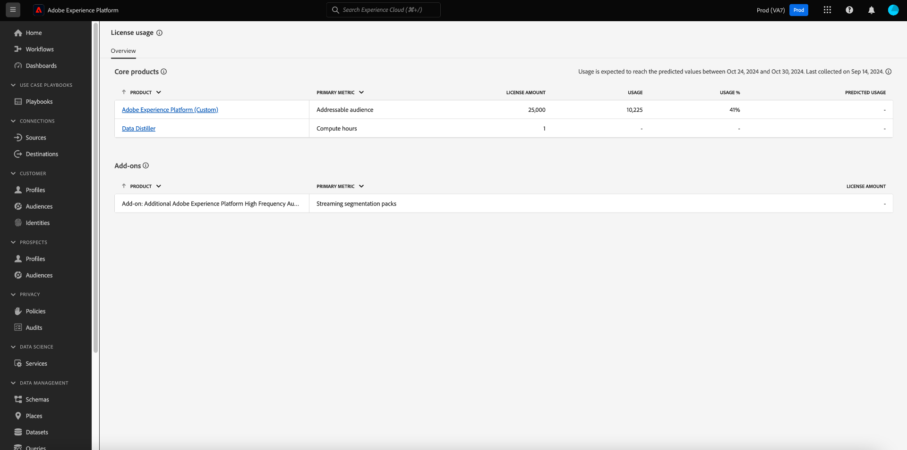
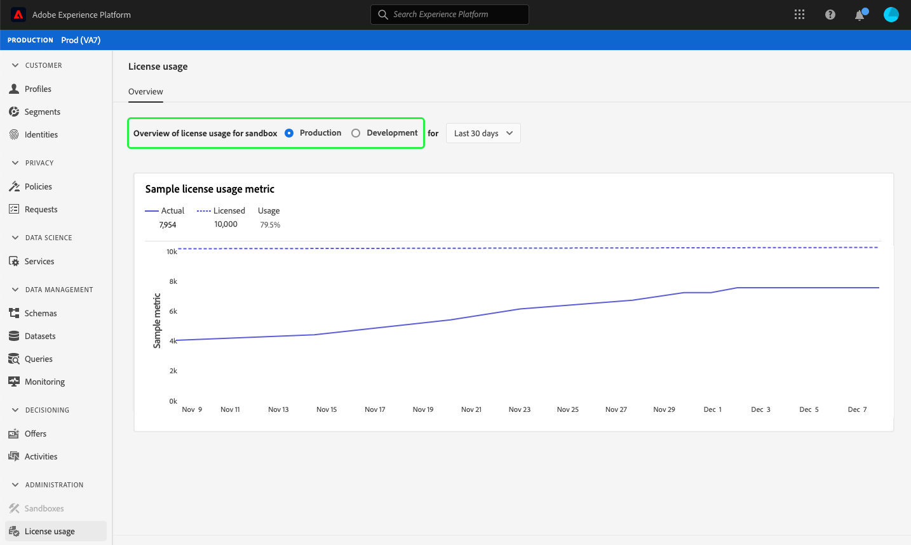
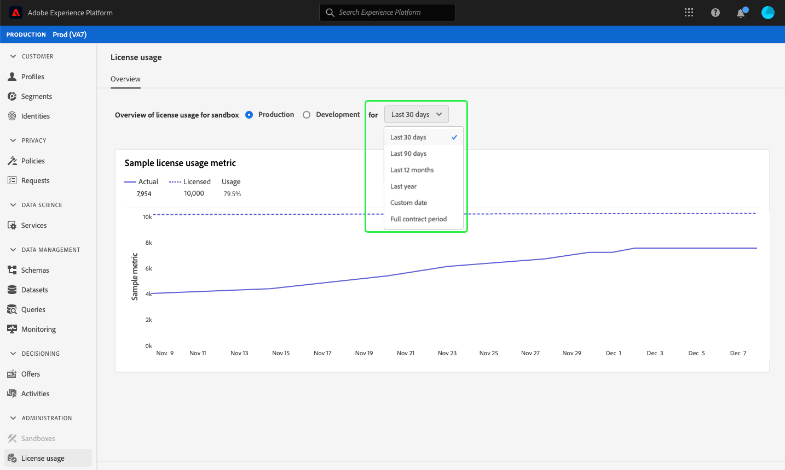
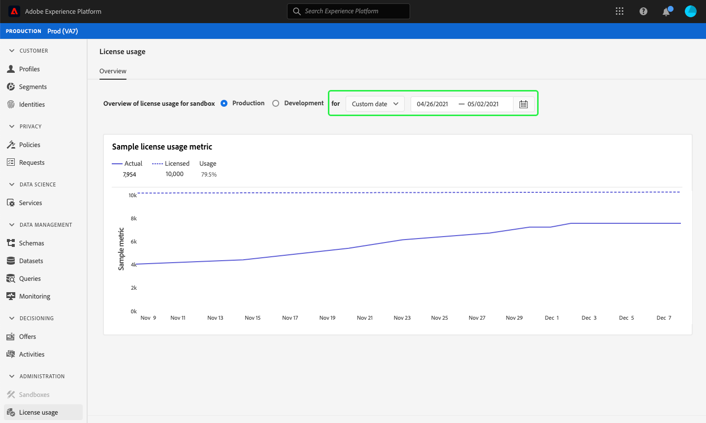
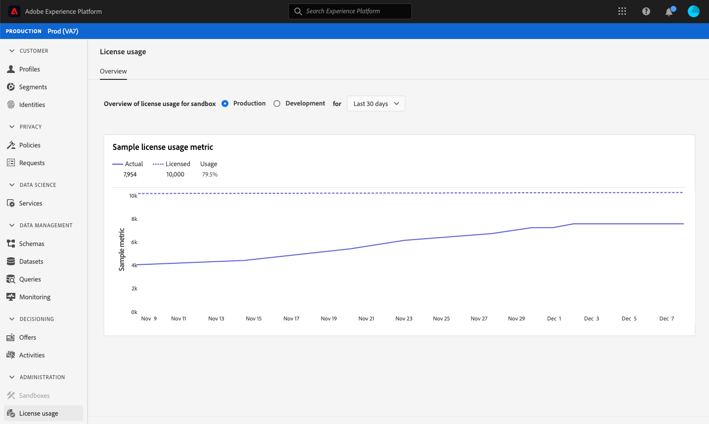

# License usage dashboard {#license-usage-dashboard}

The Adobe Experience Platform user interface (UI) provides a dashboard through which you can view important information about your organization's license usage, as captured during a daily snapshot. This guide outlines how to access and work with the license usage dashboard in the UI and provides more information regarding the visualizations displayed in the dashboard.  

For a general overview of the Platform UI, please visit the [Experience Platform UI guide](../../landing/ui-guide.md).

## License usage dashboard data

The license usage dashboard displays a snapshot of your organization's license-related data for Experience Platform. The data in the dashboard is displayed exactly as it appears at the specific point in time when the snapshot was taken. In other words, the snapshot is not an approximation or sample of the data, and the dashboard is not updating in real time.

>[!NOTE]
>
>Any changes or updates made to the data since the snapshot was taken will not be reflected in the dashboard until the next snapshot is taken.

## Exploring the license usage dashboard

To navigate to the license usage dashboard within the Platform UI, select **[!UICONTROL License usage]** in the left rail. This opens the **[!UICONTROL Overview]** tab displaying the dashboard.

>[!NOTE]
>
>The license usage dashboard is not enabled by default. Users must be granted "View License Usage Dashboard" permission in order to be able to view the dashboard. For steps on granting access permissions for viewing the license usage dashboard, please refer to the [dashboard permissions guide](../permissions.md).

### Select a sandbox

To choose a sandbox to view in the dashboard, select either [!UICONTROL Production] or [!UICONTROL Development]. The selected sandbox is indicated by the radio button next to the sandbox name. 

Consumption reporting for sandboxes is cumulative for all sandboxes of the same type. In other words, selecting [!UICONTROL Production] or [!UICONTROL Development] provides consumption reports for all production or development sandboxes, respectively.

>[!WARNING]
>
>Permission to view the license usage dashboard must be specified at a sandbox level. This means that permission to view the dashboard must be added to each individual sandbox. This limitation will be addressed in a future release. In the meantime, the following workaround is available:
>
>1. Create a product profile in the Adobe Admin Console.
>2. Under Permission in the Sandbox category, add all sandboxes you wish to view in the license usage dashboard.
>3. Under User Dashboard Permission category, add "View License Usage Dashboard" permission.

### Select a date range

After selecting a sandbox, you can use the date range dropdown to select the time period to display in the dashboard. There are multiple options available, including the default value of the last 30 days.

You can also select **[!UICONTROL Custom date]** to choose the time period that is shown.

## Widgets

The license usage dashboard is composed of widgets, which display read-only metrics providing important information regarding your organization's license usage. The visible metrics depend on your organization's specific licensing (see the [available metrics](#available-metrics) section for details).

Each widget displays a line graphs comparing actual numbers for your organization to the total available with your organization's licensing and provide a percentage of total usage.

## Available metrics

The license usage dashboard reports on four key metrics, with more metrics to be added in subsequent releases. The available metrics are:

* [!UICONTROL Addressable Audience]
* [!UICONTROL Average profile richness]
* [!UICONTROL Data scanned per segmentation ratio]
* [!UICONTROL Total consumed storage]

The availability of these metrics and the specific definition of each of these metrics varies depending on the licensing that your organization has purchased. For detailed definitions of each metric, please reference the appropriate Product Description documentation:

|License|Product Description|
|---|---|
|<ul><li>ADOBE EXPERIENCE PLATFORM:OD LITE</li><li>ADOBE EXPERIENCE PLATFORM:OD STANDARD</li><li>ADOBE EXPERIENCE PLATFORM:OD HEAVY</li></ul>|[Adobe Experience Platform](https://helpx.adobe.com/legal/product-descriptions/adobe-experience-platform.html)|
|<ul><li>ADOBE EXPERIENCE PLATFORM:OD</li></ul>|[Experience Platform, App Services and Intelligent Services](https://helpx.adobe.com/legal/product-descriptions/exp-platform-app-svcs.html)|
|<ul><li>RT CUSTOMER DATA PLATFORM:OD</li><li>RT CUSTOMER DATA PLATFORM:OD PRFL TO 10M</li><li>RT CUSTOMER DATA PLATFORM:OD PRFL TO 50M</li></ul>|[Adobe Real-Time Customer Data Platform](https://helpx.adobe.com/legal/product-descriptions/real-time-customer-data-platform.html)|
|<ul><li>AEP:OD ACTIVATION</li><li>AEP:OD ACTIVATION PRFL TO 10M</li><li>AEP:OD ACTIVATION PRFL UP TO 50M</li></ul>|[Adobe Experience Platform Activation](https://helpx.adobe.com/legal/product-descriptions/adobe-experience-platform0.html)|
|<ul><li>AEP:OD INTELLIGENCE</li></ul>|[Adobe Experience Platform Intelligence](https://helpx.adobe.com/legal/product-descriptions/adobe-experience-platform-intelligence---product-description.html)|
|<ul><li>JOURNEY OPTIMIZER SELECT:OD</li><li>JOURNEY OPTIMIZER PRIME:OD</li><li>JOURNEY OPTIMIZER ULTIMATE:OD</li><li>UNP AJO PRIME STARTER:OD</li><li>UNP AJO ULTIMATE STARTER:OD</li><li>UNP Real-Time CDP:OD PROFILE ORCHESTRATION</li></ul>|[Adobe Journey Optimizer](https://helpx.adobe.com/legal/product-descriptions/adobe-journey-optimizer.html)|

>[!WARNING]
>
>The license usage dashboard only reports on the latest license that has been provisioned for your organization. If the latest license provisioned for your organization does not appear in the table above, the license usage dashboard may not display properly. Support for additional licenses and multiple licenses in a single organization is planned for a future release. 

## Next steps

After reading this document, you are able to locate the license usage dashboard and select a sandbox to view. You can also find more information about available metrics for your organization, based on the licensing your organization has purchased. 

To learn more about other features available in the Experience Platform UI, please refer to the [Platform UI guide](../../landing/ui-guide.md).
