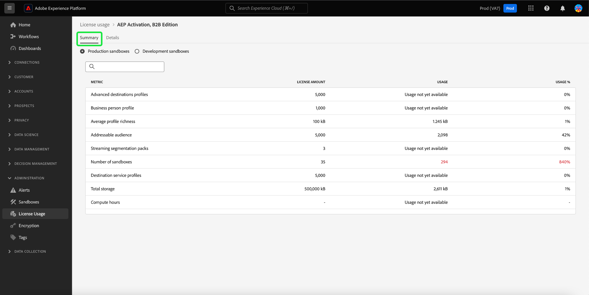
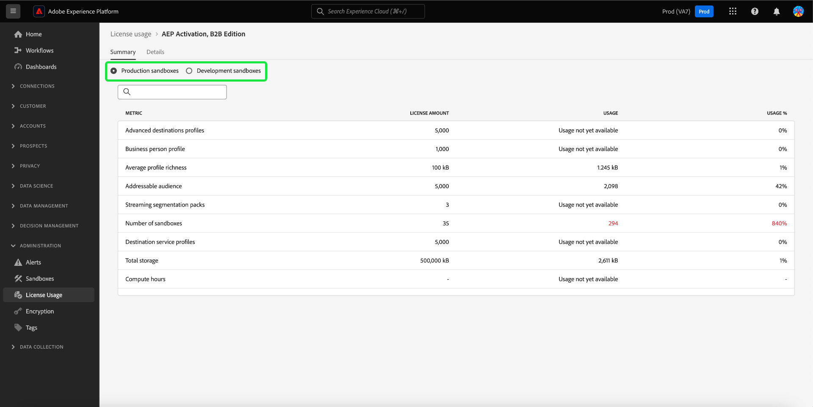
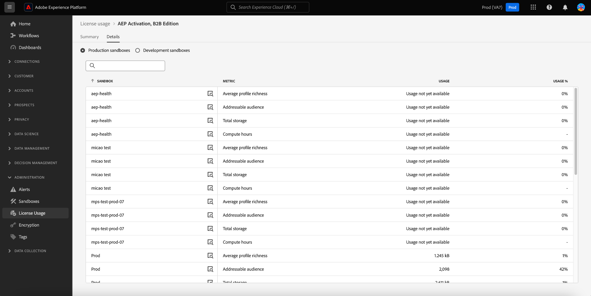
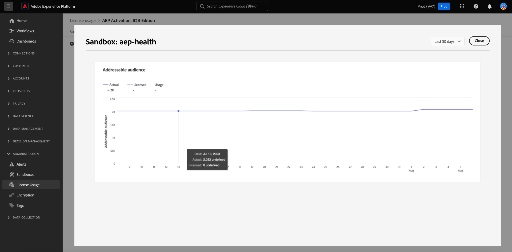
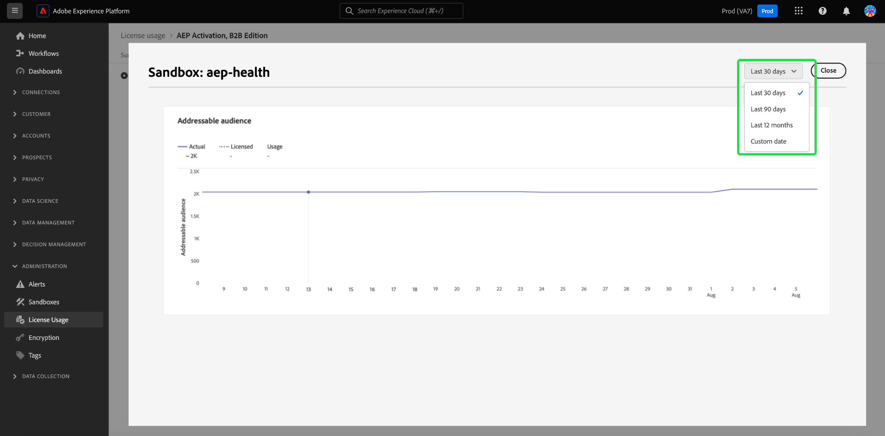
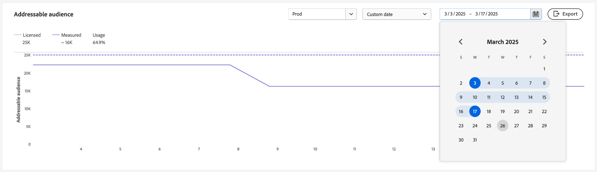

# License usage dashboard {#license-usage-dashboard}

>[!CONTEXTUALHELP]
>id="platform_dashboards_licenseUsage"
>title="License usage dashboard"
>abstract="The License usage dashboard offers insight into the Adobe Experience Platform products that you've purchased. The dashboard overview displays the primary metrics for your products including your usage for each of the primary metrics, and your contracted license amount. The details workspace displays a breakdown of your metrics for each product within specific sandboxes."

You can view important information about your organization's license usage through the Adobe Experience Platform [!UICONTROL License usage] dashboard. Information displayed here is captured during a daily snapshot of your Platform instance. 

License usage reports provide a high degree of granularity over your license usage metrics. The dashboard provides usage metrics for each purchased product, the consolidated usage of metrics in all production or development sandboxes, and the usage metric from a specific sandbox. The following Experience Platform applications can be tracked with usage metrics: Real-Time Customer Data Platform, Adobe Journey Optimizer, and Customer Journey Analytics.

This guide outlines how to access and work with the license usage dashboard in the UI and provides more information regarding the visualizations displayed in the dashboard.  

For a general overview of the Platform UI, refer to the [Experience Platform UI guide](../../landing/ui-guide.md).

## [!UICONTROL License usage] dashboard data

The [!UICONTROL License usage] dashboard displays a list of all the Experience Platform products that you have purchased. From this list, you can find a snapshot of your organization's license-related data for Experience Platform across any associated sandbox. 

The data in this dashboard is displayed exactly as it appears at the specific point in time when the snapshot was taken. In other words, the snapshot is not an approximation or sample of the data, and the dashboard is not updating in real time.

>[!NOTE]
>
>Any changes or updates made to the data since the snapshot was taken will not be reflected in the dashboard until the next snapshot is taken.

## Exploring the license usage dashboard {#explore}

To navigate to the license usage dashboard within the Platform UI, select **[!UICONTROL License usage]** in the left rail. The [!UICONTROL Overview] tab opens, displaying a list of available products.

>[!NOTE]
>
>The license usage dashboard is not enabled by default. Users must be granted "View License Usage Dashboard" permission to be able to view the dashboard. For steps on granting access permissions for viewing the license usage dashboard, refer to the [dashboard permissions guide](../permissions.md).

## [!UICONTROL Overview] tab {#overview-tab}

This dashboard displays all of your licensed Adobe Experience Platform products, including add-ons, in a table format. The table provides key information about your license usage across all your available profiles.

| Column name  | Description |
|---|---|
| **[!UICONTROL Product]**  | The Adobe solution licensed by your organization. |
| **[!UICONTROL Primary Metric]**  | The primary metric used for tracking within for that product.   |
| **[!UICONTROL License Amount]**  | The contracted value for the maximum amount of the Primary Metric as agreed in your product license agreement.  |
| **[!UICONTROL Usage]**  | The amount of your primary metric used. This value provides the total usage of that metric across all sandboxes, either production or development. |
| **[!UICONTROL Usage %]**  | The percentage of your primary metric used according to your license amount. |

>[!NOTE]
>
>Additions to the [!UICONTROL License Amount] as a result of add-ons are added on top of the [!UICONTROL License Amount] for the base products such as Real-Time Customer Data Platform, Adobe Journey Optimizer, and Customer Journey Analytics. The usage of that licensed amount (after the add-ons) is tracked through the base products. For example, if you buy one pack of five sandboxes, the quantity of five is added to that of the base product's. In this case, the add-on shows a [!UICONTROL License Amount] of one, and the usage for that add-on is "blank" as the usage is tracked through the base product.

The table indicates the primary metric for each product, as each product can track numerous metrics.

## [!UICONTROL Summary] tab {#summary-tab}

To view more metrics and detailed insights on your product license usage, select a product name from the list. The [!UICONTROL Summary] view for that product appears. All available metrics are displayed on the [!UICONTROL Summary] tab. The metrics available depend on the licensed product. This view provides **a consolidated view of all metrics across all production or development sandboxes**. The same level of analysis is provided for both production and development sandboxes. 

On the summary tab, the table includes the [!UICONTROL Metric] column. These human-readable descriptions indicate all metrics used for that type of sandbox.

### Select a sandbox {#select-sandbox}

To change the view between production and development sandbox types, select either [!UICONTROL Production sandboxes] or [!UICONTROL Development sandboxes]. The selected sandbox type is indicated by the radio button next to the sandbox name.  

Consumption reporting for sandboxes is cumulative for all sandboxes of the same type. In other words, selecting [!UICONTROL Production] or [!UICONTROL Development] provides consumption reports for all production or development sandboxes, respectively.

>[!WARNING]
>
>Permission to view the license usage dashboard must be specified at a sandbox level. Add permissions to each individual sandbox to view them within the dashboard. This limitation will be addressed in a future release. In the meantime, the following workaround is available:
>
>1. Create a product profile in the Adobe Admin Console.
>2. Under Permission in the Sandbox category, add all sandboxes you wish to view in the license usage dashboard.
>3. Under User Dashboard Permission category, add "View License Usage Dashboard" permission.

## The [!UICONTROL Details] tab {#details-tab}

To see **a particular usage metric from a specific sandbox**, navigate to the [!UICONTROL Details] tab. The [!UICONTROL Details] tab shows all the available sandboxes within either the Production or Development sandboxes. 

From this view, you can select  next to a sandbox name to view the visualization for that metric. A dialog opens with a visualization for that metric. 

### Visualizations {#visualizations}

Each visualization widget includes the following aspects: 

- A line graph tracking the metric change over time
- A key for the line graph
- The sandbox name
- A dropdown menu to adjust the time period for the line graph

The line graphs compare usage numbers for your organization to the total available with your organization's licensing and provide a percentage of total usage.

The lookback period of analysis can be adjusted from the dropdown menu. The default value of the last 30 days

To select a date range, you can use the date range dropdown to select the time period to display in the dashboard. There are multiple options available, including the default value of the last 30 days.

You can also select **[!UICONTROL Custom date]** to choose the time period that is shown.

## Available metrics

The license usage dashboard reports on several unique metrics that are applicable to multiple products in the organization. The available metrics are:

| Metric | Description |
|---|---|
| [!UICONTROL Data Exports] | The total size of datasets that can be exported to any non-Adobe solution (directly or indirectly) in a year. |
| [!UICONTROL Number of AMM Models] | A count of the machine learning model (built in Adobe Mix Modeler) used to measure and/or predict a specified outcome based on your investments.  |
| [!UICONTROL Data lake storage] | The quantity used of the analytical data store within Adobe Experience Platform. |
| [!UICONTROL Computed Attributes] | The total count of aggregated profile behavioral data. Aggregated profile behavioral data is based on experience events that are converted into a profile attribute and can be included in a person profile or business person profile. |
| [!UICONTROL Look-alike Audiences] | The count of audiences that are generated by modeling an existing consumer audience to identify person profiles similar to that existing consumer audience. |
| [!UICONTROL Addressable Audience] | The sum of your business audience entitlement and the consumer audience entitlement. A consumer audience is defined as the number of person profiles identified as a "Consumer Audience" on the sales order. A business audience is defined as the number of business person profiles identified as the "Business Audience" on the sales order. |
| [!UICONTROL Number of sandboxes] | The count of logical separations within your instance of any Adobe On-demand Service that accesses Adobe Experience Platform isolating data and operations. |
| [!UICONTROL Average profile richness] | The sum of all production data stored within the Hub Profile Service at any point in time, divided by five times the number of authorized business person profiles. [!UICONTROL Average profile richness] is a shared feature. |
| [!UICONTROL Streaming Segmentation No of Packs] | The packs update segment membership for a person profile as new data enters the Segmentation Service through a streaming flow. Segment membership is evaluated based on the current person profile attributes and the value of the current event, without taking historical behavior into account. Streaming Segmentation is a shared feature. |
| [!UICONTROL Consumer Audience] | The number of person profiles identified as "Consumer Audience" on the sales order. |
| [!UICONTROL CJA Rows Available] | The daily average rows of data available for analysis within Customer Journey Analytics.  |
| [!UICONTROL Profile Richness No of Packs] | An increase in your authorized Average Profile Richness by 25 KB per profile for each Additional Profile Richness pack. |
| [!UICONTROL Adhoc Query Service Users Packs]  | An add-on to increase your authorized concurrent Query Service Users entitlement by five additional concurrent Query Service users and one additional concurrently running ad hoc query per pack. Multiple additional Ad Hoc Query User packs may be licensed. |
| [!UICONTROL Engageable audience] | This metric refers to the audience of engageable profiles. An engageable profile is a record of information representing an individual and is represented in the Profile Service. These records are profiles that you have attempted to engage with using Journey Optimizer's authoring, decisioning, delivery, experimentation, or orchestration capabilities during the past 12 months. |
| [!UICONTROL Query Service Compute Hours] | A measure of the amount of time taken by the Query Service engines to read, process, and write data back into the data lake when a batch query is executed.  |

<!-- |  [!UICONTROL Sandbox No of Packs] |  A logical separation within your instance of any Adobe On-demand Service that accesses Adobe Experience Platform isolating data and operations | -->

The availability of these metrics and the specific definition of each of these metrics varies depending on the licensing that your organization has purchased. For detailed definitions of each metric, refer to the appropriate Product Description documentation:

|License|Product Description|
|---|---|
|<ul><li>ADOBE EXPERIENCE PLATFORM:OD LITE</li><li>ADOBE EXPERIENCE PLATFORM:OD STANDARD</li><li>ADOBE EXPERIENCE PLATFORM:OD HEAVY</li></ul>|[Adobe Experience Platform](https://helpx.adobe.com/legal/product-descriptions/adobe-experience-platform.html)|
|<ul><li>ADOBE EXPERIENCE PLATFORM:OD</li></ul>|[Experience Platform, App Services, and Intelligent Services](https://helpx.adobe.com/legal/product-descriptions/exp-platform-app-svcs.html)|
|<ul><li>RT CUSTOMER DATA PLATFORM:OD</li><li>RT CUSTOMER DATA PLATFORM:OD PRFL TO 10M</li><li>RT CUSTOMER DATA PLATFORM:OD PRFL TO 50M</li></ul>|[Adobe Real-Time Customer Data Platform](https://helpx.adobe.com/legal/product-descriptions/real-time-customer-data-platform.html)|
|<ul><li>AEP:OD ACTIVATION</li><li>AEP:OD ACTIVATION PRFL TO 10M</li><li>AEP:OD ACTIVATION PRFL UP TO 50M</li></ul>|[Adobe Experience Platform Activation](https://helpx.adobe.com/legal/product-descriptions/adobe-experience-platform0.html)|
|<ul><li>AEP:OD INTELLIGENCE</li></ul>|[Adobe Experience Platform Intelligence](https://helpx.adobe.com/legal/product-descriptions/adobe-experience-platform-intelligence---product-description.html)|
|<ul><li>JOURNEY OPTIMIZER SELECT:OD</li><li>JOURNEY OPTIMIZER PRIME:OD</li><li>JOURNEY OPTIMIZER ULTIMATE:OD</li><li>UNP AJO PRIME STARTER:OD</li><li>UNP AJO ULTIMATE STARTER:OD</li><li>UNP Real-Time CDP:OD PROFILE ORCHESTRATION</li></ul>|[Adobe Journey Optimizer](https://helpx.adobe.com/legal/product-descriptions/adobe-journey-optimizer.html)|

>[!WARNING]
>
>The license usage dashboard only reports on the latest license that has been provisioned for your organization. If the latest license provisioned for your organization does not appear in the table above, the license usage dashboard may not display properly. Support for additional licenses and multiple licenses in a single organization is planned for a future release. 

## Next steps

After reading this document, you are able to locate the license usage dashboard and view usage metrics for each purchased product, for all production or development sandboxes, and for a specific sandbox. You can find more information about available metrics for your organization, based on the licensing your organization has purchased. 

To learn more about other features available in the Experience Platform UI, refer to the [Platform UI guide](../../landing/ui-guide.md).
