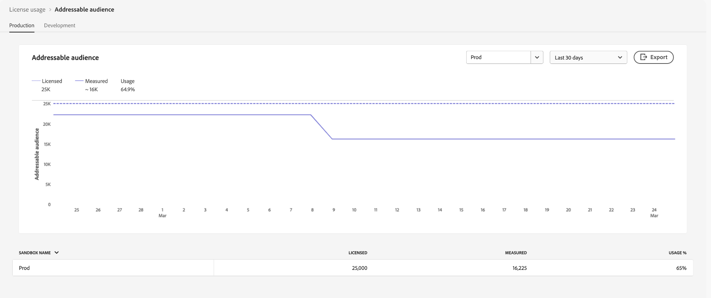
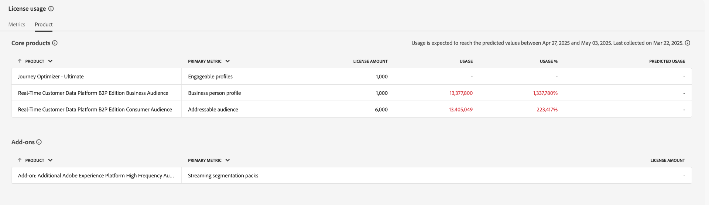

# License usage dashboard {#license-usage-dashboard}

>[!CONTEXTUALHELP]
>id="testy-mctestface"
>title="Test dialog that should not be visible"
>abstract="The object {name} is being viewed on {date}."

>[!CONTEXTUALHELP]
>id="platform_dashboards_licenseusage_core"
>title="Core products table"
>abstract="The core products listed in the table have their own metrics, usage tracking, and drill-through views at the sandbox level. These core products provide the key metrics for tracking, and any add-ons are included in these metrics."

>[!CONTEXTUALHELP]
>id="platform_dashboards_licenseusage_addons"
>title="Add-ons table"
>abstract="The Add-ons table lists products whose license amounts are combined with the metrics supported by core products. These add-ons do not have separate metrics but enhance the usage tracking of the core products they are associated with."

>[!CONTEXTUALHELP]
>id="platform_dashboards_licenseUsage"
>title="License usage dashboard"
>abstract="The license usage dashboard offers insight into the Adobe Experience Platform products that you've purchased. The dashboard overview displays the primary metrics for your products including your usage for each of the primary metrics and your contracted license amount. The details workspace displays a breakdown of your metrics for each product within specific sandboxes."
>additional-url="https://experienceleague.adobe.com/docs/experience-platform/data-lifecycle/ui/dataset-expiration.html" text="Automated dataset expirations"
>additional-url="https://experienceleague.adobe.com/docs/experience-platform/profile/pseudonymous-profiles.html" text="Pseudonymous profiles data expiration"

>[!CONTEXTUALHELP]
>id="platform_licenseusage"
>title="License usage dashboard"
>abstract="The license usage dashboard offers insight into the Adobe Experience Platform products that you've purchased. The dashboard overview displays the primary metrics for your products including your usage for each of the primary metrics and your contracted license amount. The details workspace displays a breakdown of your metrics for each product within specific sandboxes."
>additional-url="https://experienceleague.adobe.com/docs/experience-platform/data-lifecycle/ui/dataset-expiration.html" text="Automated dataset expirations"
>additional-url="https://experienceleague.adobe.com/docs/experience-platform/profile/pseudonymous-profiles.html" text="Pseudonymous profiles data expiration"

>[!CONTEXTUALHELP]
>id="platform_dashboards_licenseusage_predictedusage_computehours"
>title="Predicted Compute Hours"
>abstract="Compute Hours measure the time Query Service engines spend reading, processing, and writing data when running batch queries. Your usage might reach the licensed amount. To assess or reduce usage, go to Queries > Log to review your query history. If you do not have access to the Queries workspace, contact your administrator."
>additional-url="https://experience.adobe.com/#/platform/query/log.html" text="Queries Log workspace"

>[!CONTEXTUALHELP]
>id="platform_dashboards_licenseusage_predictedusage_addressableaudience"
>title="Predicted Addressable Audience"
>abstract="The Addressable Audience is the set of person profiles in Real-Time Customer Profile that your organization is entitled to engage. This metric includes both directly identifiable and Pseudonymous Profiles. Your usage might reach the licensed amount. To reduce usage, configure dataset or Pseudonymous Profile data expirations."
>additional-url="https://experienceleague.adobe.com/docs/experience-platform/profile/event-expirations.html" text="Experience Event expirations"
>additional-url="https://experienceleague.adobe.com/docs/experience-platform/profile/pseudonymous-profiles.html" text="Pseudonymous profiles data expiration"

>[!CONTEXTUALHELP]
>id="platform_dashboards_licenseusage_predictedusage_engageableprofiles"
>title="Predicted Engageable Profiles"
>abstract="Engageable Profiles are person profiles in Real-Time Customer Profile that your organization has attempted to engage using Journey Optimizer within the past 12 months. Your usage might reach the licensed amount. To reduce usage, configure dataset or Pseudonymous Profile data expirations."
>additional-url="https://experienceleague.adobe.com/docs/experience-platform/profile/event-expirations.html" text="Experience Event expirations"
>additional-url="https://experienceleague.adobe.com/docs/experience-platform/profile/pseudonymous-profiles.html" text="Pseudonymous profiles data expiration"

>[!CONTEXTUALHELP]
>id="platform_dashboards_licenseusage_predictedusage_businesspersonprofile"
>title="Predicted Business Person Profile"
>abstract="Business Person Profiles are records in Real-Time Customer Profile representing individuals in a B2B context. Your usage might reach the licensed amount. To reduce usage, configure dataset or Pseudonymous Profile data expirations."
>additional-url="https://experienceleague.adobe.com/docs/experience-platform/profile/event-expirations.html" text="Experience Event expirations"
>additional-url="https://experienceleague.adobe.com/docs/experience-platform/profile/pseudonymous-profiles.html" text="Pseudonymous profiles data expiration"

>[!CONTEXTUALHELP]
>id="platform_dashboards_licenseusage_predictedusage_corehours"
>title="Predicted Core Hours"
>abstract="Core Hours represent processing time consumed across Experience Platform services. Your usage might reach the licensed amount. To reduce usage, configure dataset or Pseudonymous Profile data expirations."
>additional-url="https://experienceleague.adobe.com/docs/experience-platform/profile/event-expirations.html" text="Experience Event expirations"
>additional-url="https://experienceleague.adobe.com/docs/experience-platform/profile/pseudonymous-profiles.html" text="Pseudonymous profiles data expiration"

>[!CONTEXTUALHELP]
>id="platform_dashboards_licenseusage_predictedusage_totaldatavolume"
>title="Predicted Total Data Volume"
>abstract="Total Data Volume is the amount of data available in Real-Time Customer Profile for use in engagement and personalization workflows. Your usage might reach the licensed amount. To reduce usage, configure dataset or Pseudonymous Profile data expirations."
>additional-url="https://experienceleague.adobe.com/docs/experience-platform/profile/event-expirations.html" text="Experience Event expirations"
>additional-url="https://experienceleague.adobe.com/docs/experience-platform/profile/pseudonymous-profiles.html" text="Pseudonymous profiles data expiration"

>[!CONTEXTUALHELP]
>id="platform_dashboards_licenseusage_predictedusage_cjaRowsAvailable"
>title="Predicted CJA Rows Available"
>abstract="CJA Rows Available refers to the daily average rows of data available for analysis in Customer Journey Analytics. Your usage might reach the licensed amount. To reduce usage, configure dataset or Pseudonymous Profile data expirations."
>additional-url="https://experienceleague.adobe.com/docs/experience-platform/profile/event-expirations.html" text="Experience Event expirations"
>additional-url="https://experienceleague.adobe.com/docs/experience-platform/profile/pseudonymous-profiles.html" text="Pseudonymous profiles data expiration"

>[!CONTEXTUALHELP]
>id="platform_dashboards_licenseusage_exceededusage_addressableaudience"
>title="Predicted Addressable Audience"
>abstract="The Addressable Audience is the set of person profiles in Real-Time Customer Profile that your organization is entitled to engage. This includes both directly identifiable and pseudonymous profiles. Your usage has exceeded the licensed amount. To reduce usage, configure dataset or Pseudonymous Profile data expirations."
>additional-url="https://experienceleague.adobe.com/docs/experience-platform/profile/event-expirations.html" text="Experience Event expirations"
>additional-url="https://experienceleague.adobe.com/docs/experience-platform/profile/pseudonymous-profiles.html" text="Pseudonymous profiles data expiration"

>[!CONTEXTUALHELP]
>id="platform_dashboards_licenseusage_exceededusage_engageableprofiles"
>title="Predicted Engageable Profiles"
>abstract="Engageable Profiles are person profiles in Real-Time Customer Profile that your organization has attempted to engage using Journey Optimizer within the past 12 months. Your usage has exceeded the licensed amount. To reduce usage, configure dataset or Pseudonymous Profile data expirations."
>additional-url="https://experienceleague.adobe.com/docs/experience-platform/profile/event-expirations.html" text="Experience Event expirations"
>additional-url="https://experienceleague.adobe.com/docs/experience-platform/profile/pseudonymous-profiles.html" text="Pseudonymous profiles data expiration"

>[!CONTEXTUALHELP]
>id="platform_dashboards_licenseusage_exceededusage_businesspersonprofile"
>title="Predicted Business Person Profile"
>abstract="Business Person Profiles are records in Real-Time Customer Profile representing individuals in a B2B context. Your usage has exceeded the licensed amount. To reduce usage, configure dataset or Pseudonymous Profile data expirations."
>additional-url="https://experienceleague.adobe.com/docs/experience-platform/profile/event-expirations.html" text="Experience Event expirations"
>additional-url="https://experienceleague.adobe.com/docs/experience-platform/profile/pseudonymous-profiles.html" text="Pseudonymous profiles data expiration"

>[!CONTEXTUALHELP]
>id="platform_dashboards_licenseusage_exceededusage_corehours"
>title="Predicted Core Hours"
>abstract="Core Hours represent processing time consumed across Experience Platform services. Your usage has exceeded the licensed amount. To reduce usage, configure dataset or Pseudonymous Profile data expirations."
>additional-url="https://experienceleague.adobe.com/docs/experience-platform/profile/event-expirations.html" text="Experience Event expirations"
>additional-url="https://experienceleague.adobe.com/docs/experience-platform/profile/pseudonymous-profiles.html" text="Pseudonymous profiles data expiration"

>[!CONTEXTUALHELP]
>id="platform_dashboards_licenseusage_exceededusage_totaldatavolume"
>title="Predicted Total Data Volume"
>abstract="Total Data Volume is the amount of data available in Real-Time Customer Profile for use in engagement and personalization workflows. Your usage has exceeded the licensed amount. To reduce usage, configure dataset or Pseudonymous Profile data expirations."
>additional-url="https://experienceleague.adobe.com/docs/experience-platform/profile/event-expirations.html" text="Experience Event expirations"
>additional-url="https://experienceleague.adobe.com/docs/experience-platform/profile/pseudonymous-profiles.html" text="Pseudonymous profiles data expiration"

>[!CONTEXTUALHELP]
>id="platform_dashboards_licenseusage_exceededusage_cjaRowsAvailable"
>title="Predicted CJA Rows Available"
>abstract="CJA Rows Available refers to the daily average rows of data available for analysis in Customer Journey Analytics. Your usage has exceeded the licensed amount. To reduce usage, configure dataset or Pseudonymous Profile data expirations."
>additional-url="https://experienceleague.adobe.com/docs/experience-platform/profile/event-expirations.html" text="Experience Event expirations"
>additional-url="https://experienceleague.adobe.com/docs/experience-platform/profile/pseudonymous-profiles.html" text="Pseudonymous profiles data expiration"

You can view important information about your organization's license usage through the Adobe Experience Platform [!UICONTROL License usage] dashboard. The information displayed here is captured during a daily snapshot of your Platform instance. 

License usage reports provide a high degree of granularity. Most metrics are shared across multiple products and reflect aggregated usage across all products that use them, not per-product totals. The dashboard provides consolidated usage of these metrics in all production or development sandboxes, and the usage metric from a specific sandbox. The following Experience Platform applications can be tracked with usage metrics: Real-Time Customer Data Platform, Adobe Journey Optimizer, and Customer Journey Analytics.

This guide outlines how to access and work with the license usage dashboard in the UI and provides more information regarding the visualizations displayed in the dashboard.

For a general overview of the Platform UI, refer to the [Experience Platform UI guide](../../landing/ui-guide.md).

## [!UICONTROL License usage] dashboard data

The [!UICONTROL License usage] dashboard displays a list of all the Experience Platform products that you have purchased and any add-ons for those products. From this dashboard, you can find a snapshot of your organization's license-related data for Experience Platform across any associated sandbox.

The data in this dashboard is displayed exactly as it appears at the specific point in time when the snapshot was taken. In other words, the snapshot is not an approximation or sample of the data, and the dashboard is not updated in real time.

>[!NOTE]
>
>Any changes or updates made to the data since the snapshot was taken will not be reflected in the dashboard until the next snapshot is taken.

## Exploring the license usage dashboard {#explore}

To navigate to the license usage dashboard within the Platform UI, select **[!UICONTROL License usage]** in the left rail. The dashboard contains two tabs: **[!UICONTROL Metrics]** and **[!UICONTROL Products]**.

>[!NOTE]
>
>The license usage dashboard is not enabled by default. Users must be granted "View License Usage Dashboard" permission to view the dashboard. For steps on granting access permissions, refer to the [dashboard permissions guide](../permissions.md).

## [!UICONTROL Metrics] tab {#metrics-tab}

The **[!UICONTROL Metrics]** tab provides a centralized view of all license usage metrics across your organization. Because most metrics are shared across products, there is no separate per-product breakdown for these metrics.

The metrics table includes the following columns:

| Column name  | Description |
|---|---|
| **[!UICONTROL Metric Name]**  | The name of the license usage metric. Each entry includes an info icon (`ⓘ`) that displays a description and list of associated products. |
| **[!UICONTROL Licensed]**  | The number of units your organization is entitled to use, as defined in your contract. This metric is the same value as the **License Amount** in the Products tab. |
| **[!UICONTROL Measured]**  | The amount of the metric currently used by your organization. |
| **[!UICONTROL Usage %]**  | The percentage of your licensed value currently in use. |
| **[!UICONTROL Predicted Usage %]**  | The forecasted range of metric usage over the next 6 weeks. |

Use the **[!UICONTROL Production]** or **[!UICONTROL Development]** sandbox toggle to filter the metrics displayed by sandboxes.

>[!NOTE]
>
>Consumption reporting is cumulative by sandbox type. Selecting [!UICONTROL Production] or [!UICONTROL Development] shows combined usage across all sandboxes of that type.

>[!WARNING]
>
>Permission to view the license usage dashboard must be specified at a sandbox level. Add permissions to each individual sandbox to view them within the dashboard. This limitation will be addressed in a future release. In the meantime, the following workaround is available:
>
>1. Create a product profile in the Adobe Admin Console.
>2. Under Permission in the Sandbox category, add all sandboxes you wish to view in the license usage dashboard.
>3. Under the User Dashboard Permission category, add "View License Usage Dashboard" permission.

### View metric details {#view-metric-details}

To view usage details for a specific metric, select a metric name in the list. A detailed view of the metric appears, including:

- A historical line graph showing usage over time
- A comparison of licensed and measured values
- Usage by individual sandbox
- A sandbox selector to filter data
- An export option for CSV download

This visualization allows you to track trends, understand how each sandbox contributes to overall usage, and export the data for offline analysis. 

Each chart includes dropdown menus to filter the data. Use the date range dropdown to adjust the lookback period (default: last 30 days) or use the sandbox dropdown to view usage for a specific Production or Development sandbox.

You can also select a **[!UICONTROL Custom date]** to choose the time period that is shown.

### CSV export {#export-metric-usage-data}

You can export historical usage data for the selected metric and sandbox as a CSV file directly from the metric detail view. Select the **[!UICONTROL Export]** icon to download the chart's data in tabular format. The exported CSV makes it easy to analyze trends offline or share usage insights across teams.

## [!UICONTROL Products] tab {#products-tab}

The **[!UICONTROL Products]** tab presents license usage data grouped by purchased products and any associated add-ons. The [!UICONTROL Products] tab contains two tables:

- **[!UICONTROL Core products] table**: This table lists the main Adobe Experience Platform products licensed by your organization. Each product lists its primary metric, usage tracking, and predicted usage.
- **[!UICONTROL Add-ons] table**: Lists supplementary items whose license amounts contribute to core product metrics. Add-ons do not have separate metrics but enhance the usage tracking of the core products they are associated with.

| Column name  | Description |
|---|---|
| **[!UICONTROL Product]**  | The Adobe solution licensed by your organization. |
| **[!UICONTROL Primary Metric]**  | The primary metric used for tracking within that product. |
| **[!UICONTROL License Amount]**  | The contracted value for the maximum amount of the primary metric. |
| **[!UICONTROL Usage]**  | The amount of your primary metric used. |
| **[!UICONTROL Usage %]**  | The percentage of your primary metric used according to your license amount. |
| **[!UICONTROL Predicted Usage]**  | The predicted usage percentage of your primary metric. |

>[!NOTE]
>
>The [!UICONTROL License Amount] for add-ons is included in the total license amount of the core product. Add-ons are not tracked separately but enhance the capabilities of their associated products. For example, if you buy one pack of five sandboxes as an add-on, the amount is added to that of the base product. The add-ons table shows a [!UICONTROL License Amount] specific to the add-on, but the actual usage is tracked through the base product.

### Predicted usage {#predicted-usage}

>[!CONTEXTUALHELP]
>id="platform_dashboards_licenseUsage_prediction"
>title="Predicted usage"
>abstract="Predictions are based on the usage during the past 6-7 months and are generated on a weekly basis every Friday. Please note that license usage predictions are approximations based on past usage. You are responsible for understanding your organization's actual usage and ensuring that usage does not go beyond the scope of your organization's license with Adobe. To reduce usage, you can configure dataset or Pseudonymous Profile data expirations for sandboxes and datasets."
>additional-url="https://experienceleague.adobe.com/docs/experience-platform/data-lifecycle/ui/dataset-expiration.html" text="Automated dataset expirations"
>additional-url="https://experienceleague.adobe.com/docs/experience-platform/profile/pseudonymous-profiles.html" text="Pseudonymous profiles data expiration"

>[!CONTEXTUALHELP]
>id="platform_licenseusage_prediction"
>title="Predicted usage"
>abstract="Predictions are based on the usage during the past 6-7 months and are generated on the 15th of every month. Please note that license usage predictions are approximations based on past usage. You are responsible for understanding your organization's actual usage and ensuring that usage does not go beyond the scope of your organization's license with Adobe. To reduce usage, you can configure dataset or Pseudonymous Profile data expirations for sandboxes and datasets."
>additional-url="https://experienceleague.adobe.com/docs/experience-platform/data-lifecycle/ui/dataset-expiration.html" text="Automated dataset expirations"
>additional-url="https://experienceleague.adobe.com/docs/experience-platform/profile/pseudonymous-profiles.html" text="Pseudonymous profiles data expiration"

Proactively manage and optimize your licensing resources with accurate, up-to-date usage predictions. The [!UICONTROL Predicted Usage] column forecasts future license usage at the sandbox level across all production and development sandboxes for all purchased products. Predictions now update weekly, providing a six-week forecast based on the latest usage data. Each prediction includes both a lower and upper bound to support informed planning.

>[!IMPORTANT]
>
>Predictions are refreshed on a weekly basis every Friday. The date of refresh is included in an info icon () above the column title.

View a summary of a product's entitlement usage from the [!UICONTROL Product] tab under the [!UICONTROL Core products] table.

![The [!UICONTROL License usage] [!UICONTROL Product] tab with a product and the predicted usage column highlighted.](../images/license-usage/product-predicted-usage.png)

>[!NOTE]
>
>Please note that license usage predictions are approximations based on past usage. You are responsible for understanding your organization's actual usage and ensuring that usage does not go beyond the scope of your organization's license with Adobe.

The percentage of predicted usage is determined as follows:

- If the lower and upper bounds are significantly different, they are displayed as a range (for example, 32% - 35%).
- If the lower and upper bounds are nearly identical and not zero, they are displayed as an approximated value (for example, ~34%).
- If the lower and upper bounds are nearly identical and zero, they are displayed as exactly 0%.

>[!NOTE]
>
>"Nearly identical" in this context means that the values are statistically significant to two decimal places (for example, a lower bound of 0.342 and an upper bound of 0.344 are both rounded to 34%).

The predicted usage feature supports the following metrics:

- [!UICONTROL Addressable audience]
- [!UICONTROL Businessperson profiles]
- [!UICONTROL Compute hours]
- [!UICONTROL Customer Journey Audience number of rows]
- [!UICONTROL Engageable profiles]
- [!UICONTROL Total Data Volume]

## Available metrics {#available-metrics}

>[!IMPORTANT]
>
>Starting August 20th, customers with entitlements for '[!UICONTROL Average Profile Richness]' and '[!UICONTROL Total Storage]' instead saw '[!UICONTROL Total Data Volume]' in the License Usage Dashboard. There was no change to customer entitlements, only a simplification of tracking metrics. [!UICONTROL Total Data Volume] represents the data available in Real-Time Customer Profile for engagement and personalization workflows. This simplified metric improved the management and measurement of Real-Time Customer Profile use. Customers were are encouraged to contact their Adobe representative for further clarification on this change.

The license usage dashboard reports on several unique metrics that are applicable to multiple products in the organization. The available metrics are:

| Metric | Description |
|---|---|
| [!UICONTROL Audience Activation Size] | The total size of profiles activated to any file-based destination in a year. Note: This does not include profiles sent through streaming destinations. |
|[!UICONTROL Addressable Audience] | The set of person profiles in Real-Time Customer Profile that your organization is entitled to engage, including both directly identifiable and Pseudonymous Profiles. These profiles may contain attributes, behaviors, and segment membership data. Profile volumes are calculated using Adobe Experience Platform's default deterministic Identity Graph and are considered a shared feature. |
| [!UICONTROL Adhoc Query Service Users Packs]  | An add-on to increase your authorized concurrent Query Service Users entitlement by five additional concurrent Query Service users and one additional concurrently running ad hoc query per pack. Multiple additional Ad Hoc Query User packs may be licensed. |
| [!UICONTROL Average profile richness] | **Deprecated** - The sum of all production data stored within the Hub Profile Service at any point in time, divided by five times the number of authorized business person profiles. [!UICONTROL Average profile richness] is a shared feature. |
| [!UICONTROL CJA Rows Available] | The daily average rows of data available for analysis within Customer Journey Analytics.  |
| [!UICONTROL Computed Attributes] | Aggregated profile behavioral data based on experience events that are converted into a Profile attribute and can be included in a Person Profile. |
| [!UICONTROL Consumer Audience] | The number of person profiles identified as "Consumer Audience" on the sales order. |
| [!UICONTROL Data Export Size] | The amount of data sent through dataset activations in a year. |
| [!UICONTROL Data Exports] | The total size of datasets that can be exported to any non-Adobe solution (directly or indirectly) in a year. |
| [!UICONTROL Data Lake Storage] | The quantity used of the analytical data store within Adobe Experience Platform. |
| [!UICONTROL Engageable Audience] | A group of person profiles in Real-Time Customer Profile that you have attempted to engage within the past 12 months using Journey Optimizer's authoring, decisioning, delivery, experimentation, or orchestration capabilities. |
| [!UICONTROL Look-alike Audiences] | A Consumer Look-Alike Audience is an audience generated by modeling an existing Consumer Audience to identify Person Profiles with similar attributes or behaviors. |
| [!UICONTROL Number of AMM Models] | A count of the machine learning model (built in Adobe Mix Modeler) used to measure and/or predict a specified outcome based on your investments. |
| [!UICONTROL Number of Sandboxes] | The count of logical separations within your instance of any Adobe On-demand Service that accesses Adobe Experience Platform isolating data and operations. |
| [!UICONTROL Profile Richness No of Packs] | An increase in your authorized Total Data Volume by 25 KB per profile for each Additional Profile Richness pack. |
| [!UICONTROL Query Service Compute Hours] | A measure of the amount of time taken by the Query Service engines to read, process, and write data back into the data lake when a batch query is executed. |
| [!UICONTROL Streaming Segmentation No of Packs] | The packs update segment membership for a person profile as new data enters the Segmentation Service through a streaming flow. Segment membership is evaluated based on the current person profile attributes and the value of the current event, without taking historical behavior into account. Streaming Segmentation is a shared feature. |
| [!UICONTROL Total Data Volume] | The total amount of data available for Real-Time Customer Profile to use in engagement workflows. See the [frequently asked questions about Total Data Volume](../../landing/license-usage-and-guardrails/total-data-volume.md) to learn more. |
| [!UICONTROL Total Volume of Data Egress] | The cumulative annual volume of data exported from Adobe Experience Platform to third-party data warehouses. |

<!-- |  [!UICONTROL Sandbox No of Packs] |  A logical separation within your instance of any Adobe On-demand Service that accesses Adobe Experience Platform isolating data and operations | -->

>[!TIP]
>
>You can check your license entitlements in your sales order to calculate metrics such as your 'Storage Allowance'. For example,<ul><li>Storage Allowance = The number of "authorized profiles" in your contract X Average Profile Richness</li></ul>

The availability of these metrics and the specific definition of each of these metrics varies depending on the licensing that your organization has purchased. For detailed definitions of each metric, refer to the appropriate Product Description documentation:

| License | Product Description |
| --- | --- |
| <ul><li>ADOBE EXPERIENCE PLATFORM:OD LITE</li><li>ADOBE EXPERIENCE PLATFORM:OD STANDARD</li><li>ADOBE EXPERIENCE PLATFORM:OD HEAVY</li></ul> | [Adobe Experience Platform](https://helpx.adobe.com/legal/product-descriptions/adobe-experience-platform.html) |
| <ul><li>ADOBE EXPERIENCE PLATFORM:OD</li></ul> | [Experience Platform, App Services, and Intelligent Services](https://helpx.adobe.com/legal/product-descriptions/exp-platform-app-svcs.html) |
| <ul><li>RT CUSTOMER DATA PLATFORM:OD</li><li>RT CUSTOMER DATA PLATFORM:OD PRFL TO 10M</li><li>RT CUSTOMER DATA PLATFORM:OD PRFL TO 50M</li></ul> | [Adobe Real-Time Customer Data Platform](https://helpx.adobe.com/legal/product-descriptions/real-time-customer-data-platform.html) |
| <ul><li>AEP:OD ACTIVATION</li><li>AEP:OD ACTIVATION PRFL TO 10M</li><li>AEP:OD ACTIVATION PRFL UP TO 50M</li></ul> | [Adobe Experience Platform Activation](https://helpx.adobe.com/legal/product-descriptions/adobe-experience-platform0.html) |
| <ul><li>AEP:OD INTELLIGENCE</li></ul> | [Adobe Experience Platform Intelligence](https://helpx.adobe.com/legal/product-descriptions/adobe-experience-platform-intelligence---product-description.html) |
| <ul><li>JOURNEY OPTIMIZER SELECT:OD</li><li>JOURNEY OPTIMIZER PRIME:OD</li><li>JOURNEY OPTIMIZER ULTIMATE:OD</li><li>UNP AJO PRIME STARTER:OD</li><li>UNP AJO ULTIMATE STARTER:OD</li><li>UNP Real-Time CDP:OD PROFILE ORCHESTRATION</li></ul> | [Adobe Journey Optimizer](https://helpx.adobe.com/legal/product-descriptions/adobe-journey-optimizer.html) |

>[!WARNING]
>
>The license usage dashboard only reports on the latest license that has been provisioned for your organization. If the latest license provisioned for your organization does not appear in the table above, the license usage dashboard may not display properly. Support for additional licenses and multiple licenses in a single organization is planned for a future release.

## Next steps

After reading this document, you are able to locate the license usage dashboard and view usage metrics for each purchased product, for all production or development sandboxes, and for a specific sandbox. You can find more information about available metrics for your organization, based on the licensing your organization has purchased.

To learn more about other features available in the Experience Platform UI, refer to the [Platform UI guide](../../landing/ui-guide.md).
