# [!UICONTROL Profiles] dashboard

The Adobe Experience Platform user interface (UI) provides a dashboard through which you can view important information about your [!DNL Real-Time Customer Profile] data, as captured during a daily snapshot. This guide outlines how to access and work with the Profiles dashboard in the UI and provides information regarding the metrics displayed in the dashboard.

Refer to the [Real-Time Customer Profile UI guide](../../profile/ui/user-guide.md) for an overview of the Profile features within the Experience Platform user interface.

## Profile dashboard data

The Profiles dashboard displays a snapshot of the attribute (record) data that your organization has within the Profile Store in Experience Platform. The snapshot does not include any event (time series) data. 

The attribute data in the snapshot shows the data exactly as it appears at the specific point in time when the snapshot was taken. In other words, the snapshot is not an approximation or sample of the data, and the Profile dashboard is not updating in real-time.

>[!NOTE]
>
>Any changes or updates made to the data since the snapshot was taken will not be reflected in the dashboard until the next snapshot is taken.

## Exploring the Profiles dashboard

To navigate to the Profiles dashboard within the Platform UI, select **[!UICONTROL Profiles]** in the left rail, then select the **[!UICONTROL Overview]** tab to display the dashboard.

>[!NOTE]
>
>If your organization is new to Platform and does not yet have active Profile datasets or merge policies created, the Profiles dashboard is not visible. Instead, the [!UICONTROL Overview] tab displays links and documentation to help you get started with Real-Time Customer Profile.

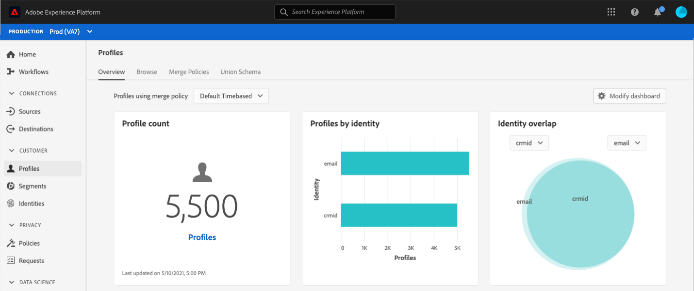

### Modifying the Profiles dashboard

You can modify the appearance of the Profiles dashboard by selecting **[!UICONTROL Modify dashboard]**. You can move, add, resize, and remove widgets from the dashboard, as well as to access the **[!UICONTROL Widget library]** to explore available widgets, and create custom widgets for your organization. 

To learn more, refer to the [modifying dashboards](../customize/modify.md) and [Widget library overview](../customize/widget-library.md) documentation.

### Add widgets {#add-widget}

Select **[!UICONTROL Add widget]** to navigate to the widget library and see a list of the available widgets to add to your dashboard.

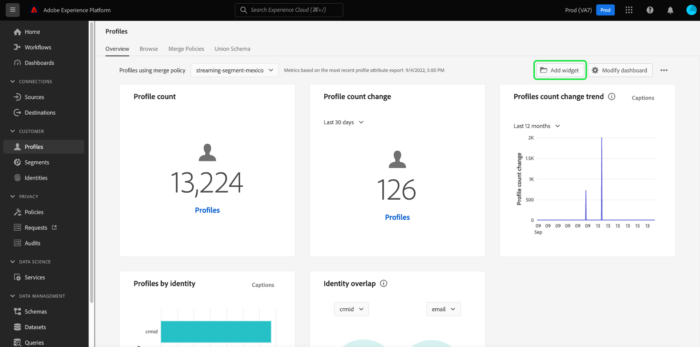

From the widget library you can browse the selection of standard and custom audience widgets. For information on how to add widgets, please see the widget library documentation on how to [add a widget](../customize/widget-library.md#add-widgets).

<!-- ## (Beta) Profile efficacy insights {#profile-efficacy-insights}

>[!IMPORTANT]
>
>The profile efficacy insight functionality is currently in beta and are not available to all users. The documentation and the functionality are subject to change.

The [!UICONTROL Efficacy] tab provides metrics on the quality and completeness of your profile data through the use of profile efficacy widgets. These widgets illustrate at a glance the composition of your profiles, trends in completeness over time, and assessments on the quality of your profile data.

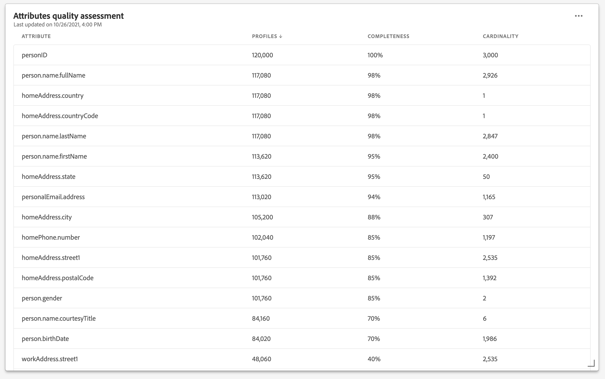

See the [profile efficacy widgets section](#profile-efficacy-widgets) for more information on the widgets currently available.

The layout of this dashboard is also customizable by selecting [**[!UICONTROL Modify dashboard]**](../customize/modify.md) from the [!UICONTROL Overview] tab. -->

## Browse profiles {#browse-profiles}

The [!UICONTROL Browse] tab allows you to search and view the read-only profiles ingested into your organization. From here you can see important information belonging to the profile regarding their preferences, past events, interactions, and audiences. 

To learn more about the profile viewing capabilities provided in the Platform UI, refer to the documentation on [browsing profiles in Adobe Real-Time Customer Data Platform](../../rtcdp/profile/profile-browse.md).

## Merge policies {#merge-policies}

The metrics displayed in the Profiles dashboard are based on merge policies being applied to your Real-Time Customer Profile data. When data is brought together from multiple sources to create the customer profile, the data can contain conflicting values. For example, one dataset may list a customer as "single" while another dataset may list the customer as "married". It is the job of the merge policy to determine which data to prioritize and display as part of the profile.

For more information on merge policies, including how to create, edit, and declare a default merge policy for your organization, refer to the [merge policies overview](../../profile/merge-policies/overview.md).

The dashboard automatically selects a merge policy to use. The applied merge policy can be changed using the dropdown menu next to the merge policy name.

>[!NOTE]
>
>The dropdown menu shows only merge policies that use the `_xdm.context.profile` schema. However, if your organization has created multiple merge policies, it may mean that you need to scroll in order to view the complete list of available merge policies.

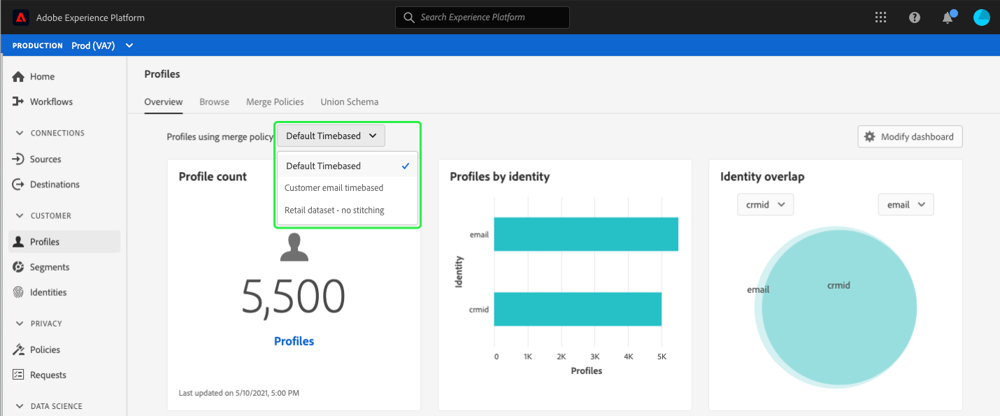

## Union schemas

The [!UICONTROL Union Schema] dashboard displays the union schema for a specific XDM class. By selecting the **[!UICONTROL Class]** dropdown, you can view the union schemas for different XDM classes.

Union schemas are composed of multiple schemas that share the same class and have been enabled for Profile. They enable you to see in a single view, an amalgamation of every field contained within each schema that shares the same class.

To learn more about [viewing union schemas within the Platform UI](../../profile/ui/union-schema.md#view-union-schemas), refer to the union schema UI guide.

## Widgets and metrics

The dashboard is composed of widgets, which are read-only metrics providing important information regarding your Profile data. 

The date and time of the most recent snapshot is displayed at the top of the [!UICONTROL Overview] tab next to the merge policy dropdown. All widget data is accurate as of that date and time. The timestamp of the snapshot is provided in UTC; it is not in the timezone of the individual user or organization.

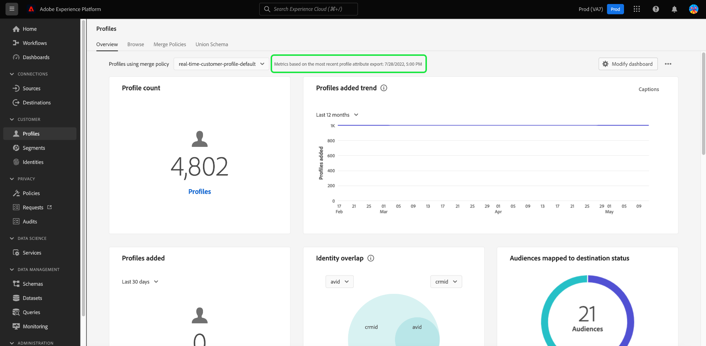

## Default widgets {#default-widgets}

A default widget load-out is provided for all new instances of Adobe Experience Platform that highlights the latest available insights from your data. The following widgets are pre-configured in your segments view from the outset. Full details on the purpose and function of the widgets can be found below.

* [[!UICONTROL Profile count]](#profile-count)
* [[!UICONTROL Profile count change]](#profile-count-change)
* [[!UICONTROL Profiles count change trend]](#profiles-count-change-trend)
* [[!UICONTROL Profiles by identity]](#profiles-by-identity)
* [[!UICONTROL Identity overlap]](#identity-overlap)

>[!NOTE]
>
>As of July 26th 2023, the [!UICONTROL Profiles], [!UICONTROL Audiences], and [!UICONTROL Destinations] Overview dashboards have been reset to a new default widget load-out for all users who did not modify their views in the previous six months. Refer to the documentation in the [Destinations](./destinations.md#default-widgets) and [Audiences](./audiences.md#default-widgets) default widget sections for details on which widgets are included as part of the default widget load-outs. You can continue to customize your dashboard widgets as before.

## Customer AI widgets {#customer-ai-profiles-widgets}

Customer AI is used to generate custom propensity scores such as churn and conversion for individual profiles at-scale. Customer AI does this by analyzing existing consumer Experience Event data to predict **churn or conversion propensity scores**. These high accuracy customer propensity models allow for more exact segmentation and targeting. The [distribution of scores](#customer-ai-distribution-of-scores) and [scoring summary](#customer-ai-scoring-summary) insights demonstrate the division in your audience. They highlight which profiles are the high/low/medium propensity and how they are distributed across your profile counts.

* [[!UICONTROL Customer AI scoring summary]](#customer-ai-scoring-summary)
* [[!UICONTROL Customer AI distribution of scores]](#customer-ai-distribution-of-scores) 

### [!UICONTROL Customer AI distribution of scores] {#customer-ai-distribution-of-scores} 

>[!CONTEXTUALHELP]
>id="platform_dashboards_profiles_distributionOfScores"
>title="Distribution of scores"
>abstract="This widget visualizes the distribution of the total number of profiles by their propensity scores in five percent increments. The distribution of the profile count is determined by the AI model and the selected merge policy. You can change the AI model from the dropdown menu under the widget title."

The [!UICONTROL Customer AI distribution of scores] widget categorizes the total number of profiles by their propensity scores. The distribution of the profile count is determined by the AI model and the selected merge policy, then visualized in five percent increments that indicate their propensity. The count of profiles is provided along the Y-axis, and the propensity scores are provided along the X-axis. 

>[!NOTE]
>
>If the visualization is a conversion propensity score, the high scores show in green and the low scores in red. If you are predicting churn propensity this is flipped, the high scores are in red and the low scores are green. The medium bucket remains yellow regardless of what propensity type you choose.

The AI model that determines the propensity scores is chosen from the dropdown selector under the widget title. The dropdown contains a list of all configured Customer AI models. Select the appropriate AI model for your analysis from the list of available models. If no Customer AI model is available, a message within the widget directs you to configure at least one Customer AI model and provides a hyperlink to the Customer AI model configuration page. See the documentation for instructions on [how to configure a Customer AI instance](../../intelligent-services/customer-ai/user-guide/configure.md). 

>[!NOTE]
>
>Select the dropdown immediately below the overview tab to change the merge policy that determines which profiles are included in the analysis. See the section on [merge policies](#merge-policies) for a brief description, or the [merge policy overview](../../profile/merge-policies/overview.md) for more details. 

To navigate to the detailed insights page for the selected Customer AI model, select **[!UICONTROL View model details]**.

![The Experience Platform Audiences dashboard with the [!UICONTROL Customer AI distribution of scores] widget and [!UICONTROL View model details] highlighted.](../images/segments/customer-ai-distribution-of-scores.png)

The detailed model insights page appears.

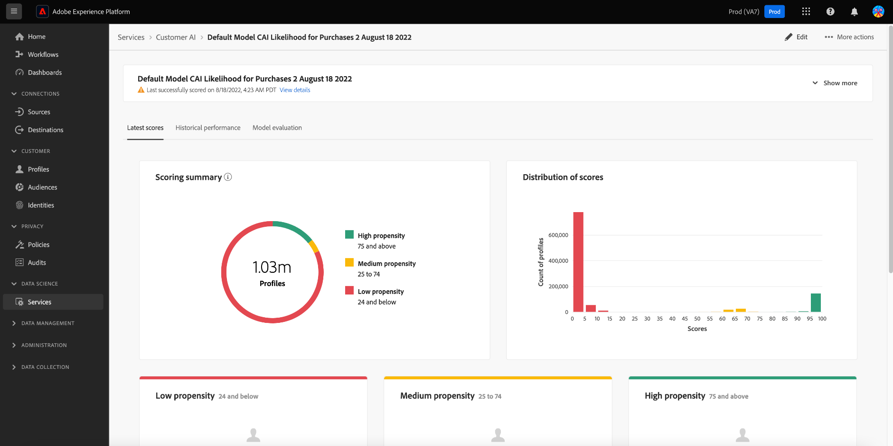

More information on Customer AI can be found on the [discover insights UI guide](../../intelligent-services/customer-ai/user-guide/discover-insights.md).

### [!UICONTROL Customer AI scoring summary] {#customer-ai-scoring-summary}

>[!CONTEXTUALHELP]
>id="platform_dashboards_profiles_scoringSummary"
>title="Scoring summary"
>abstract="This widget displays the total number of scored profiles and categorizes them into buckets containing high, medium, and low propensity. The donut chart illustrates the proportional composition of total profiles across high, medium, and low propensity."

This widget displays the total number of profiles scored, and categorizes them into buckets containing high, medium, and low propensity as green, yellow, and red respectively. A donut chart illustrates the proportional composition of profiles between high, medium, and low propensities. A profile qualifies for high propensity at over 75, medium propensity between 25 and 74, and low propensity under 24. A legend indicates the colour code and thresholds of propensities. Profile counts for the high, medium, and low propensities are displayed in a dialog when the cursor hovers over the respective section of the donut chart.

>[!NOTE]
>
>If the visualization is a conversion propensity score, the high scores show in green and the low scores in red. If you are predicting churn propensity this is flipped, the high scores are in red and the low scores are green. The medium bucket remains yellow regardless of what propensity type you choose.

The dropdown menu underneath the widget title provides a list of all configured Customer AI models. Select the appropriate AI model for your analysis from the list of available models. If no Customer AI model is available, a message within the widget directs you to configure at least one Customer AI model and provides a hyperlink to the Customer AI model configuration page. See the documentation on [how to configure a Customer AI instance](../../intelligent-services/customer-ai/user-guide/configure.md) for detailed instructions.

>[!NOTE]
>
>The total number of profiles calculated is dependent on the chosen merge policy. To change the merge policy used, select the dropdown immediately below the overview tab. See the section on [merge policies](#merge-policies) for a brief description, or the [merge policy overview](../../profile/merge-policies/overview.md) for more details. 

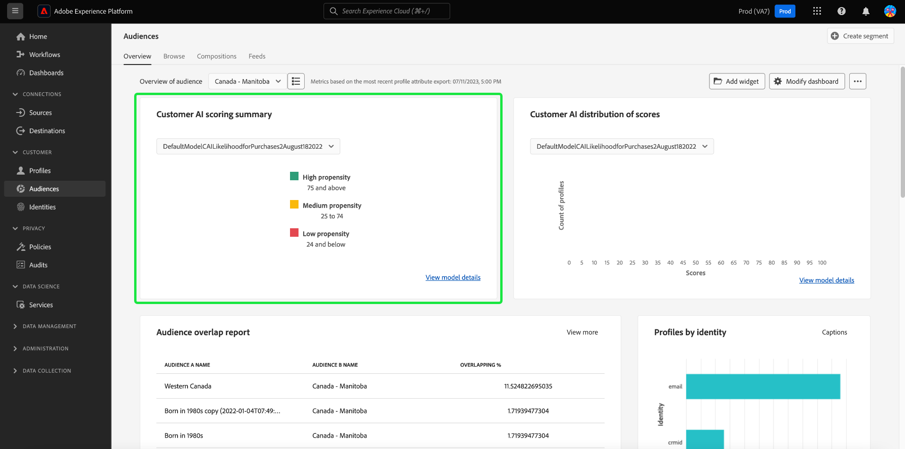

To navigate to the detailed insights page for the selected Customer AI model, select **[!UICONTROL View model details]**. More information on Customer AI can be found on the [discover insights UI guide](../../intelligent-services/customer-ai/user-guide/discover-insights.md).

## Standard widgets {#standard-widgets}

Adobe provides multiple standard widgets that you can use to visualize different metrics related to your Profile data. You can also create custom widgets to be shared with your organization using the [!UICONTROL Widget library]. To learn more about creating custom widgets, begin by reading the [Widget library overview](../customize/widget-library.md).

To learn more about each of the available standard widgets, select the name of a widget from the following list:

* [[!UICONTROL Profile count]](#profile-count)
* [[!UICONTROL Profile count trend]](#profile-count-trend)
* [[!UICONTROL Profile count change]](#profile-count-change)
* [[!UICONTROL Profiles count change trend]](#profiles-count-change-trend)
* [[!UICONTROL Profiles count change trend by identity]](#profiles-count-change-trend-by-identity)
* [[!UICONTROL Profiles by identity]](#profiles-by-identity)
* [[!UICONTROL Identity overlap]](#identity-overlap)
* [[!UICONTROL Single identity profiles]](#single-identity-profiles)
* [[!UICONTROL Single identity profiles by identity]](#single-identity-profiles-by-identity)
* [[!UICONTROL Unsegmented profiles]](#unsegmented-profiles)
* [[!UICONTROL Unsegmented profiles change trend]](#unsegmented-profiles-change-trend)
* [[!UICONTROL Unsegmented profiles by identity]](#unsegmented-profiles-by-identity)
* [[!UICONTROL Audiences]](#audiences)
* [[!UICONTROL Audiences mapped to destination status]](#audiences-mapped-to-destination-status)
* [[!UICONTROL Audiences size]](#audiences-size)
* [[!UICONTROL Audience overlap by merge policy]](#audience-overlap-by-merge-policy)
* [[!UICONTROL Audience overlap report]](#audience-overlap-report)

### [!UICONTROL Profile count] {#profile-count}

>[!CONTEXTUALHELP]
>id="platform_dashboards_profiles_profilecount"
>title="Profile count"
>abstract="This widget displays the total number of merged profiles within the Profile Store at the time the snapshot was taken. The number depends on the selected merge policy being applied to your Profile data."

The **[!UICONTROL Profile count]** widget displays the total number of merged profiles within the Profile Store at the time the snapshot was taken. This number is the result of the selected merge policy being applied to your Profile data in order to merge profile fragments together to form a single profile for each individual. 

See the [section on merge policies earlier in this document](#merge-policies) to learn more.

>[!NOTE]
>
>The [!UICONTROL Profile count] widget may show a different number than the profile count shown on the [!UICONTROL Browse] tab in the [!UICONTROL Profiles] section of the UI for multiple reasons. The most common reason for this difference is that the [!UICONTROL Browse] tab references the total number of merged profiles based on your organization's default merge policy, while the [!UICONTROL Profile count] widget references the total number of merged profiles based on the merge policy that you have selected to view in the dashboard. 
>
>Another common reason is due to the differences between the time when the dashboard snapshot is taken and the time when the sample job is run for the [!UICONTROL Browse] tab. You can see when the [!UICONTROL Profile count] widget was last updated by looking at the timestamp on the widget. To learn more about how the sample job is triggered on the [!UICONTROL Browse] tab, see the [profile count section in the Real-Time Customer Profile UI guide](../../profile/ui/user-guide.md#profile-count). 

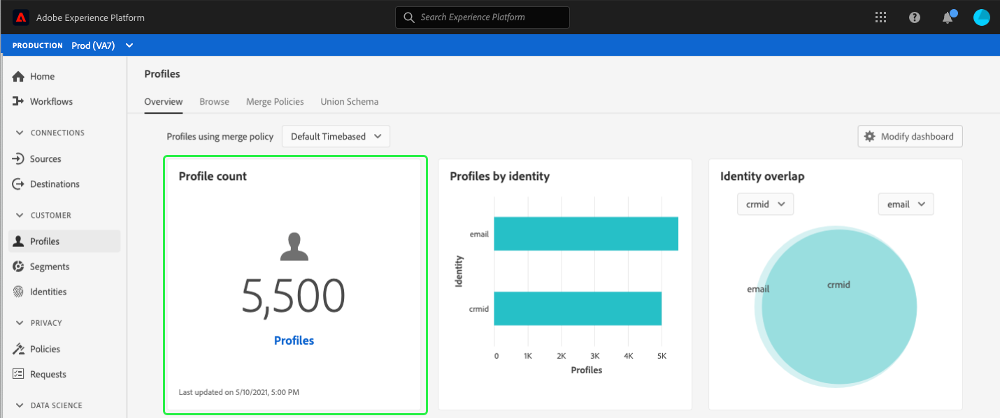

### [!UICONTROL Profile count trend] {#profile-count-trend}

The [!UICONTROL Profile count trend] widget uses a line graph to illustrate the trend in the total number of profiles contained in the system over time. This total number includes any profiles imported into the system since the last daily snapshot. The data can be visualized over 30 days, 90 days, and 12-month periods. The time period is chosen from a dropdown menu in the widget.

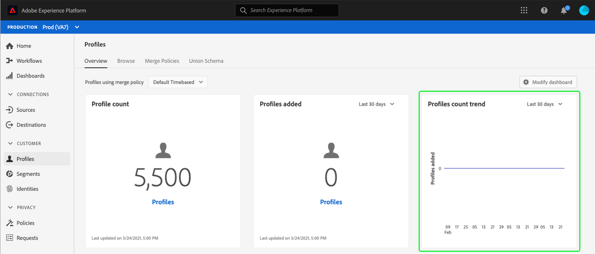

### [!UICONTROL Profile count change] {#profile-count-change}

>[!CONTEXTUALHELP]
>id="platform_dashboards_profiles_profilescountchange"
>title="Profile count change"
>abstract="This widget displays the total number of merged profiles **added** to the Profile Store at the time of the last snapshot. The number depends on the selected merge policy being applied to your Profile data."

The **[!UICONTROL Profile count change]** widget displays the number of merged profiles added to the Profile Store since the previous snapshot. This number is the result of the selected merge policy being applied to your Profile data in order to merge profile fragments together to form a single profile for each individual. You can use the dropdown selector to view the number of profiles added over the last 30 days, 90 days, or 12 months.

>[!NOTE]
>
>The [!UICONTROL Profile count change] widget reflects the number of profiles added **after** the initial profile ingestion and Profile Store set-up. In other words, if your organization set up the Profile Store and ingested 4,000,000 on Day 1, within 24 hours the dashboard would be available, however the [!UICONTROL Profile count change] widget would be set to 0. This counting method is done to avoid a spike associated with the initial ingestion of profiles into the system. Over the next 30 days, your organization ingests an additional 1,000,000 profiles into the Profile Store. After the next snapshot is taken, the [!UICONTROL Profile count change] widget would show a total of 1,000,000 profiles added, while the [!UICONTROL Profile count] widget would display 5,000,000 total profiles.

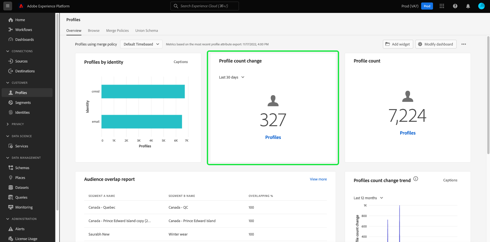

### [!UICONTROL Profiles count change trend] {#profiles-count-change-trend}

>[!CONTEXTUALHELP]
>id="platform_dashboards_profiles_profilesaddedtrend"
>title="Profiles count change trend"
>abstract="This widget displays the number of merged profiles that have been added to the Profile Store daily over the last 30 days, 90 days, or 12 months. The number also depends on the selected merge policy being applied to your Profile data."

The **[!UICONTROL Profiles count change trend]** widget displays the total number of merged profiles that have been added to the Profile Store daily over the last 30 days, 90 days, or 12 months. This number is updated each day when the snapshot is taken, therefore if you were to ingest profiles into Platform, the number of profiles would not be reflected until the next snapshot is taken. The count of profiles added is the result of the selected merge policy being applied to your Profile data in order to merge profile fragments together to form a single profile for each individual. 

To learn more, refer to the [section on merge policies earlier in this document](#merge-policies).

The **[!UICONTROL Profiles count change trend]** widget displays a 'captions' button in the top right of the widget. To open the automatic captions dialog, select **[!UICONTROL Captions]**.

A machine learning model automatically generates captions for describing the key trends and important events by analyzing the chart and the data. Annotations are added to the chart based on the captions. Select a caption to focus on its corresponding annotation.

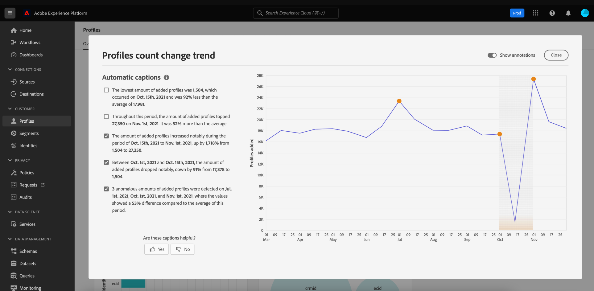

### [!UICONTROL Profiles count change trend by identity] {#profiles-count-change-trend-by-identity}

<!-- This widget uses a line graph to illustrate the change in number of profiles filtered by a chosen source identity and merge policy. -->

This widget filters the profile count based on a selected source identity and merges policy, then illustrates the change in number for various periods using a line graph. The merge policy is selected from the overview dropdown at the top of the page, the source identity, and time period are selected from the widget dropdown menus. The trend can be visualized over 30 days, 90 days, and 12-month periods.

This widget helps you to manage your destination activation needs by demonstrating the growth pattern of profiles filtered by a required identity.

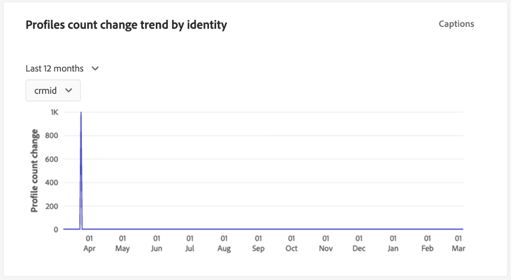

### [!UICONTROL Profiles by identity] {#profiles-by-identity}

>[!CONTEXTUALHELP]
>id="platform_dashboards_profiles_profilesbyidentity"
>title="Profiles by identity"
>abstract="This widget displays the breakdown of all the merged profiles in your Profile Store by identities."

The **[!UICONTROL Profiles by identity]** widget displays the breakdown of identities across all of the merged profiles in your Profile Store. The total number of profiles by identity (in other words, adding together the values shown for each namespace) may be higher than the total number of merged profiles because one profile could have multiple namespaces associated with it. For example, if a customer interacts with your brand on more than one channel, multiple namespaces would be associated with that individual customer.

To learn more, refer to the [section on merge policies earlier in this document](#merge-policies).

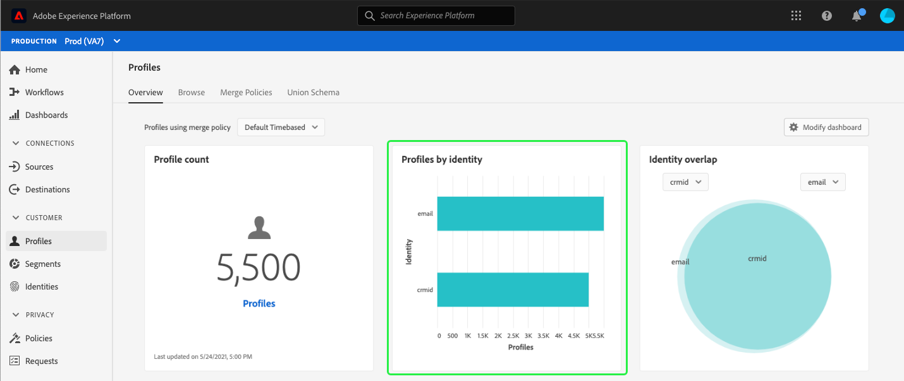

To open the automatic captions dialog, select **[!UICONTROL Captions]**.

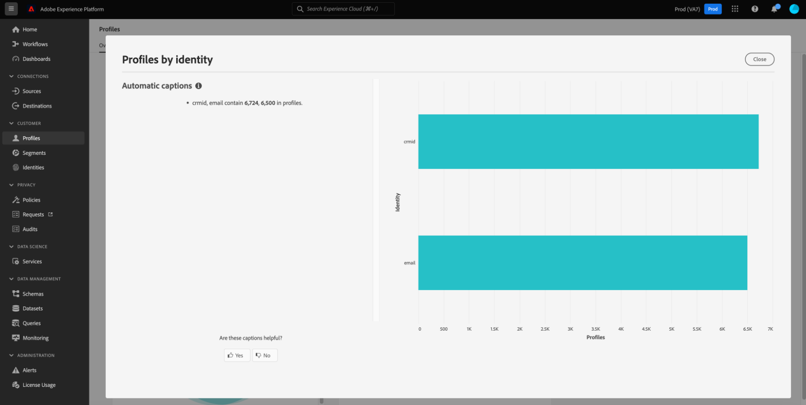

A machine learning model automatically generates data insights by analyzing the overall distribution and key dimensions of the data.

To learn more about identities, refer to the [Adobe Experience Platform Identity Service documentation](../../identity-service/home.md).

### [!UICONTROL Identity overlap] {#identity-overlap}

>[!CONTEXTUALHELP]
>id="platform_dashboards_profiles_identityoverlap"
>title="Identity overlap"
>abstract="This widget uses a Venn diagram to display the overlap of profiles in your Profile Store that contain the two selected identities."

The **[!UICONTROL Identity overlap]** widget uses a Venn diagram, or set diagram, to display the overlap of profiles in your Profile Store that contain the two selected identities.

Use the widget dropdown menus to select the identities that you wish to compare. Circles display the relative total count of profiles that contain each identity. The number of profiles containing both identities is represented by the size of the overlap between the circles. If a customer interacts with your brand on more than one channel, multiple identities would be associated with that individual customer. In this situation it is likely that your organization has multiple profiles containing fragments from more than one identity.

For more information on profile fragments, refer to the section on [profile fragments vs merged profiles](../../profile/home.md#profile-fragments-vs-merged-profiles) in the Real-Time Customer Profile overview.

To learn more about identities, refer to the [Adobe Experience Platform Identity Service documentation](../../identity-service/home.md).

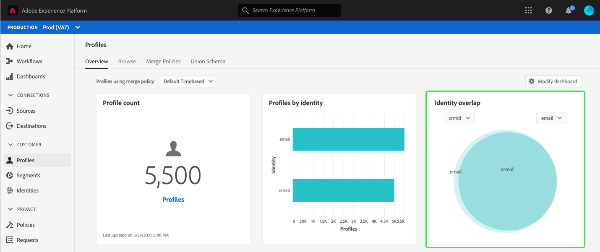

### [!UICONTROL Single identity profiles] {#single-identity-profiles}

>[!CONTEXTUALHELP]
>id="platform_dashboards_profiles_singleidentityprofiles"
>title="Single identity profiles"
>abstract="This widget provides a count of your organization's profiles that only have one type of ID type that creates their identity. This ID type can either be an email or ECID."

The [!UICONTROL Single Identity Profiles] widget provides a count of your organization's profiles that only have one type of ID type that creates their identity. This ID type can either be an email or ECID. The profile count is generated from the data contained in the most recent snapshot.

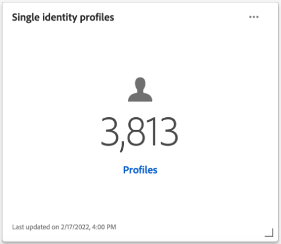

### [!UICONTROL Single identity profiles by identity] {#single-identity-profiles-by-identity}

This widget uses a bar chart to illustrate the total number of profiles that are identified with only a single unique identifier. The widget supports up to five of the most commonly occurring identities. 

To see a dialog detailing the total count of profiles for an identity, use the cursor to hover over individual bars.

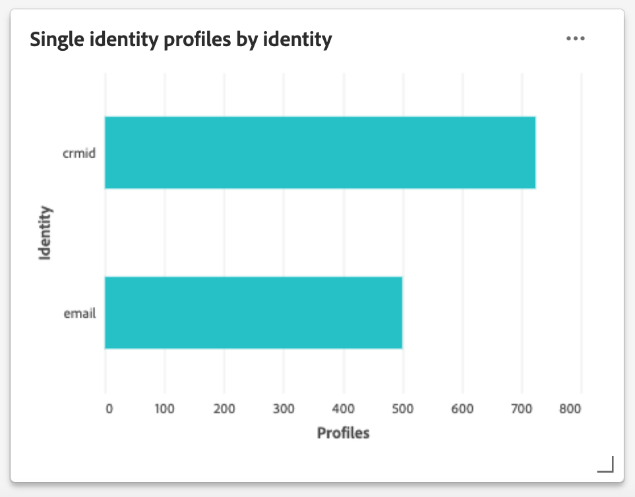

### [!UICONTROL Unsegmented profiles] {#unsegmented-profiles}

>[!CONTEXTUALHELP]
>id="platform_dashboards_profiles_unsegmentedprofiles"
>title="Unsegmented profiles"
>abstract="This widget provides the total number of all profiles not attached to any audience and represents the opportunity for profile activation across your organization."

The [!UICONTROL Unsegmented Profiles] widget provides the total number of all profiles not attached to any audience. The number generated is accurate as of the last snapshot and represents the opportunity for profile activation across your organization. It also indicates the opportunity to expunge profiles that do not provide adequate ROI.

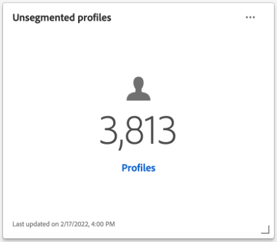

### [!UICONTROL Unsegmented profiles change trend] {#unsegmented-profiles-change-trend}

>[!CONTEXTUALHELP]
>id="platform_dashboards_profiles_unsegmentedprofilestrend"
>title="Unsegmented profiles trend"
>abstract="This widget provides a line graph illustration for the number of profiles that are not attached to any audience over a given period of time. The trend of profiles not attached to an audience can be visualized over 30 days, 90 days, and 12 month periods."

The [!UICONTROL Unsegmented profiles change trend] widget uses a line graph to illustrate the number of profiles added since the last daily snapshot that are not attached to any audience. The change-trend of profiles not attached to any audience can be visualized over 30 days, 90 days, and 12 month periods. The time period is chosen from a dropdown menu in the widget. The profile count is reflected on the y-axis and time on the x-axis.

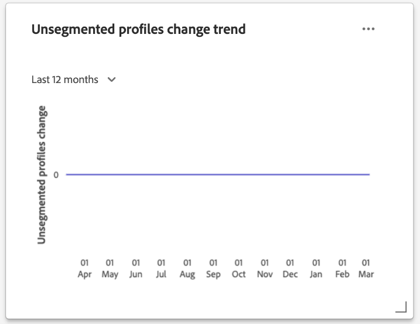

### [!UICONTROL Unsegmented profiles by identity] {#unsegmented-profiles-by-identity}

>[!NOTE]
>
>The Unsegmented profiles by identity widget have been deprecated as of October 2022 and is no longer available.

<!-- 

>[!CONTEXTUALHELP]
>id="platform_dashboards_profiles_unsegmentedprofilesbyidentity"
>title="Unsegmented profiles by identity"
>abstract="This widget categorizes the total number of unsegmented profiles by their unique identifier."

The [!UICONTROL Unsegmented Profiles by Identity] widget categorizes the total number of unsegmented profiles by their unique identifier. The data is visualized in a bar chart for ease of comparison. 

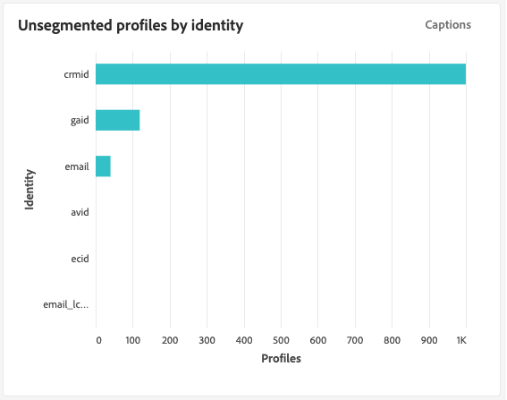 -->

### [!UICONTROL Audiences] {#audiences}

This widget provides the total number of audiences that are ready to be activated, according to the chosen merge policy applied to your profile data. 

Select **[!UICONTROL Audiences]** to navigate to the [!UICONTROL Audiences] dashboard [!UICONTROL Browse] tab. From there, you can see a list of all the segment definitions for your organization.

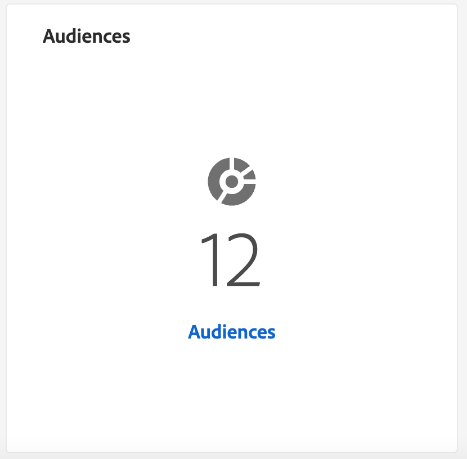

<!-- https://jira.corp.adobe.com/browse/PLAT-115291 -->

<!-- * [[!UICONTROL Audiences change trend]](#audiences-change-trend) -->
<!-- ### [!UICONTROL Audiences change trend] {#audiences-change-trend}

This line graph widget visualizes the change in the total number of audiences each day, trending over time. The change in the number of audiences is dependent on the selected merge policy being applied to your profile data. The period of analysis is selected from the widget dropdown menu. The bar chart can be visualized over 30 days, 90 days, and 12-month periods.

The visualization allows you to monitor the overall health of audiences within Adobe Experience Platform by understanding trends in the growth or decline of the total number of audiences. -->

<!--  -->

### [!UICONTROL Audience overlap report] {#audience-overlap-report}

This widget tabularizes the data overlap from all available audiences filtered by merge policy. A list of five audiences ranked from highest to lowest overlap percentages is provided for the merge policy chosen from the dropdown menu at the top of the screen. The two analyzed audiences are listed in the [!UICONTROL AUDIENCE A NAME] and [!UICONTROL AUDIENCE B NAME] columns. The percentage overlap is provided in the third column accurate to twelve decimal places.

The audience overlap report helps you to build new, high-performance audiences. Observing high percentage overlaps enables you to suppress audiences and prevent sending the same audience to different destinations. They also help you identify hidden insights that might help with better segmentation. Low percentage overlap helps to locate unique profiles to pursue.

Select **[!UICONTROL View more]** to open a full-screen dialog that contains more audience overlap data.

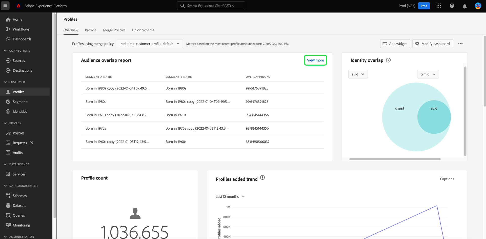

The [!UICONTROL Audience overlap report] dialog appears. This dialog can contain up to 50 rows of audience overlap analyses broken down into six columns. To remove or add columns from the table, select the settings icon ().

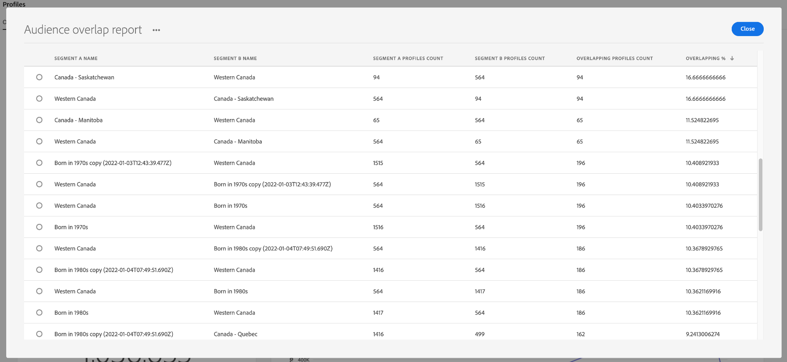

>[!NOTE]
>
>To change the ranking of results between highest to lowest or lowest to highest, select the **[!UICONTROL Overlapping]** column header.

To download the entire report in PDF format, select the options menu (**`...`**) followed by **[!UICONTROL Download]**.

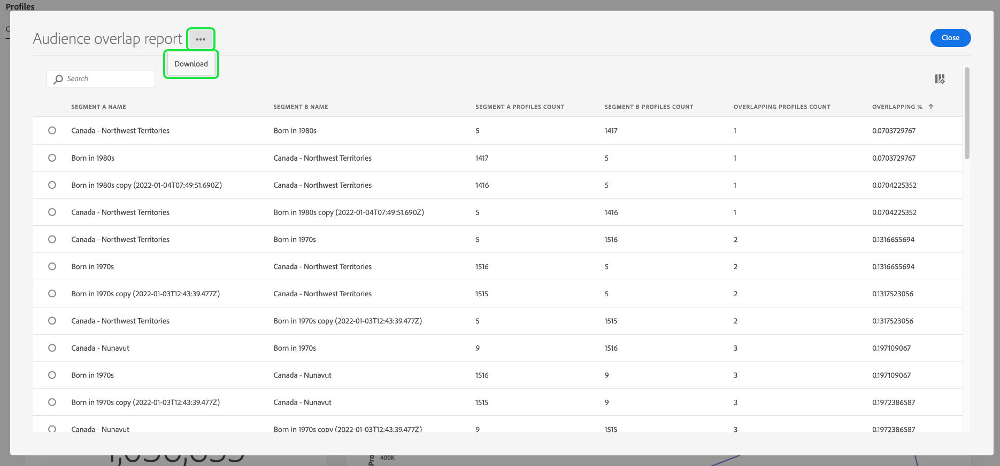

To open a Venn diagram of the overlap analysis, select a row from the report. To see the profile count in a dialog, hover over a section of the Venn diagram.

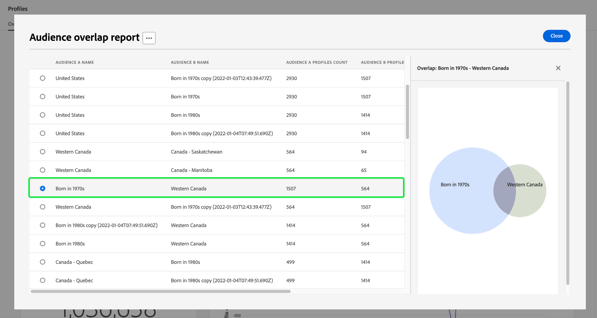

Select **[!UICONTROL Close]** to return to the [!UICONTROL Profiles] dashboard.

### [!UICONTROL Audiences mapped to destination status] {#audiences-mapped-to-destination-status}

The [!UICONTROL Audiences mapped to destination status] widget displays the total number of both mapped and unmapped audiences in a single metric and uses a donut chart to illustrate the proportional difference between their totals. The numbers calculated are dependent on the chosen merge policy. 

Individual counts for either mapped or unmapped audiences are displayed in a dialog when the cursor hovers over the respective section of the donut chart.

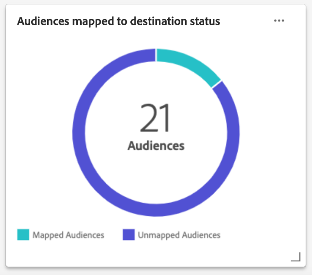

### [!UICONTROL Audiences size] {#audiences-size}

The [!UICONTROL Audiences size] widget provides a two-column table that lists the names of up to 20 audiences and the total number of profiles contained in each audience. The list is ordered from high to low according to the total number of profiles contained within the audience. The total audience size count is dependent on the merge policy applied.

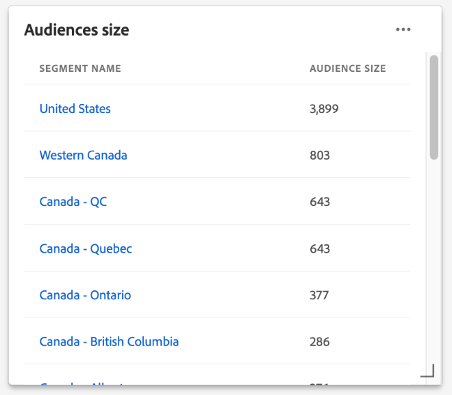

To see comprehensive information on an audience, select an audience name from the list provided to navigate to the [!UICONTROL Audiences] [!UICONTROL Detail] page. Also, by selecting **[!UICONTROL View all audiences]** from the end of the widget, you can navigate to the [!UICONTROL Audiences] [!UICONTROL Browse] tab to find any existing audience. 

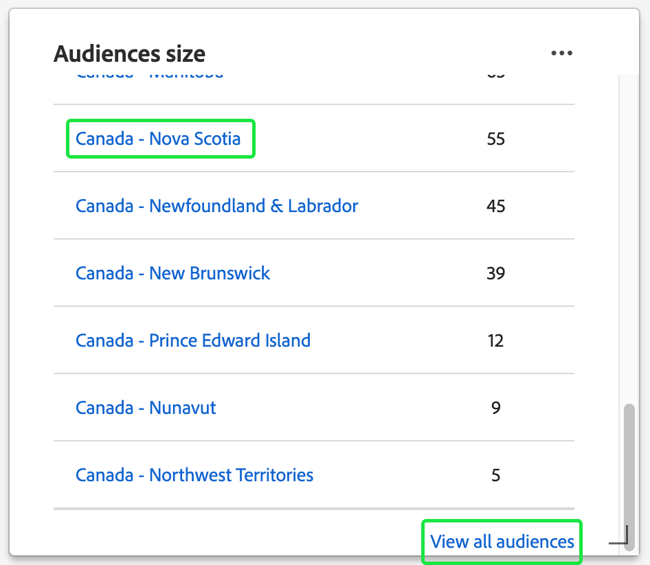

See the documentation for more information on the [[!UICONTROL Audiences] [!UICONTROL  Browse] tab](../../segmentation/ui/overview.md#browse).

### [!UICONTROL Audience overlap by merge policy] {#audience-overlap-by-merge-policy}

This widget uses a Venn diagram to display the overlap of two selected audiences. The merge policy is chosen from the overview dropdown at the top of the page and the audiences for analysis are selected from two dropdown menus within the widget. The total number of profiles contained within the relevant segment definition can be seen by hovering over a circle or the intersection.

As the widget displays the visual crossover of segment definitions, you can optimize your segmentation strategy by studying similarities between your segment definitions.

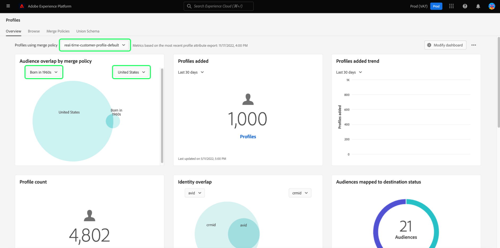

<!-- ## (Beta) Profile efficacy widgets {#profile-efficacy-widgets}

>[!IMPORTANT]
>
>The profile efficacy widgets are currently in Beta and are not available to all users. The documentation and the functionality are subject to change.

Adobe provides multiple widgets to assess the completeness of the ingested profiles available for your data analysis. Each of the profile efficacy widgets can be filtered by the merge policy. To change the merge policy filter, select the[!UICONTROL Profiles using merge policy] dropdown and choose the appropriate policy from the available list.

To learn more about each of the profile efficacy widgets, select the name of a widget from the following list:

* [[!UICONTROL Attribute quality assessment]](#attributes-quality-assessment)
* [[!UICONTROL Profiles by completeness]](#profiles-by-completeness)
* [[!UICONTROL Profiles completeness trend]](#profiles-completeness-trend)

### (Beta) [!UICONTROL Attributes quality assessment] {#attributes-quality-assessment}

>[!CONTEXTUALHELP]
>id="platform_dashboards_profiles_attributesqualityassessment"
>title="Attributes quality assessment"
>abstract="This widget shows the completeness and cardinality of all profiles according to their attributes. Each row describes one attribute. The **Profiles** column provides the number of profiles that have this attribute and are filled with non-null values. The **Completeness** percentage is determined by the total number of profiles that have this attribute and are filled with non-null values divided by the total number of non-empty values in the profiles for that attribute. **Cardinality** provides the total number of unique non-null values of this attribute across all attributes."

The [!UICONTROL Attribute quality assessment] widget shows the completeness and cardinality of all profiles according to their attributes. The data is accurate to the last processing date. This information is presented as a table with four columns where each row in the table represents a single attribute.

| Column  | Description  |
|---|---|
| Attribute  | The name of the attribute.  |
| Profiles  | The number of profiles that have this attribute and are filled with non-null values.  |
| Completeness  | This percentage is determined by the total number of profiles that have this attribute and are filled with non-null values. The number is calculated by dividing the total number of profiles by the total number of non-empty values in the profiles for that attribute.  |
| Cardinality  | The total number of **unique** non-null values of this attribute. It is measured across all profiles. |

### (Beta) [!UICONTROL Profiles by completeness] {#profiles-by-completeness}

>[!CONTEXTUALHELP]
>id="platform_dashboards_profiles_profilesbycompleteness"
>title="Profiles by completeness"
>abstract="The donut chart displays the percentage of profile attributes that are filled with non-null values among all observed attributes. It illustrates the proportion of profiles that are of high, medium, or low completeness. High completeness profiles have more than 70% of their attributes filled. Medium completeness profiles have between 30% and 70% of their attributes filled. Low completeness profiles have less than 30% of their attributes filled."

The [!UICONTROL Profiles by completeness] widget creates a donut chart of profile completeness since the last processing date. The completeness of a profile is measured by the percentage of attributes that are filled with non-null values among all observed attributes.

This widget shows the proportion of profiles that are of high, medium, or low completeness. By default, there are three levels of completeness configured: 

* High completeness: Profiles have more than 70% of their attributes filled. 
* Medium completeness: Profiles have between 30% and 70% of their attributes filled. 
* Low completeness: Profiles have less than 30% of their attributes filled. 

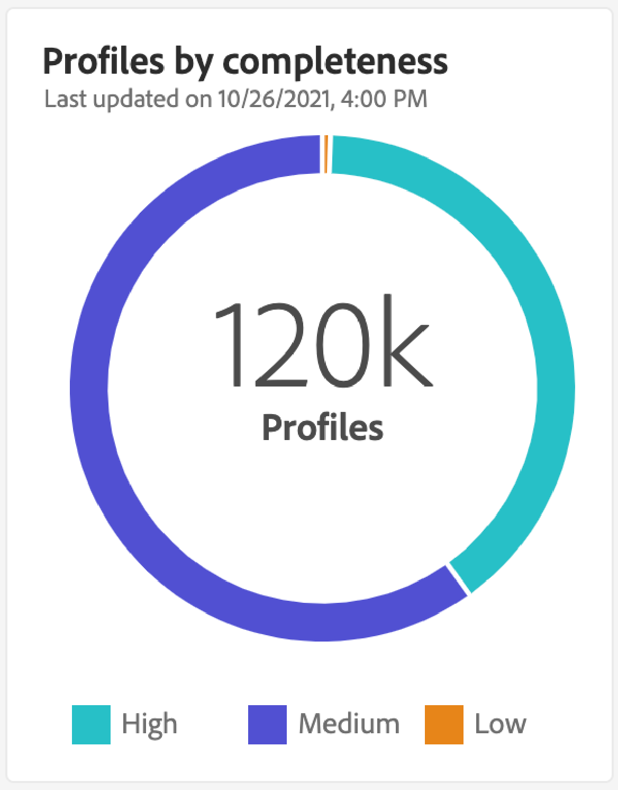

### (Beta) [!UICONTROL Profiles completeness trend] {#profiles-completeness-trend}

>[!CONTEXTUALHELP]
>id="platform_dashboards_profiles_profilescompletenesstrend"
>title="Profiles completeness trend"
>abstract="This widget creates a stacked area chart to depict the trend of profile completeness over time. Completeness is measured by the percentage of attributes that are filled with non-null values among all observed attributes."

This widget creates a stacked area chart to depict the trend of profile completeness over time. Completeness is measured by the percentage of attributes filled with non-null values among all observed attributes. It categorizes the profile completeness as high, medium, or low completeness since the last processing date.

The x-axis represents time, the y-axis represents the number of profiles, and the colors represent the three levels of profile completeness. 

The three levels of completeness are:

* High completeness: Profiles have more than 70% of attributes filled. 
* Medium completeness: Profiles have less than 70% and more than 30% of attributes filled. 
* Low completeness: Profiles have less than 30% of attributes filled.

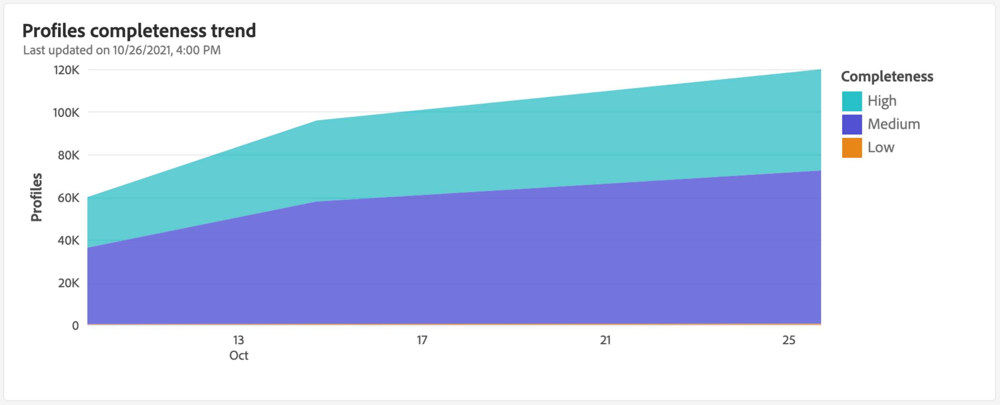 -->

## Next steps

By following this document, you should now be able to locate the profiles dashboard and understand the metrics displayed in the available widgets. To learn more about working with [!DNL Profile] data in the Experience Platform UI, refer to the [Real-Time Customer Profile UI guide](../../profile/ui/user-guide.md).
