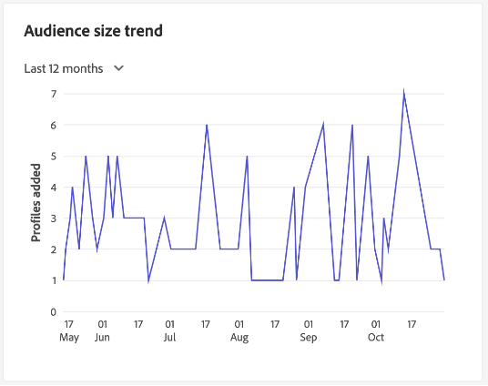

# [!UICONTROL Profiles] dashboard

The Adobe Experience Platform user interface (UI) provides a dashboard through which you can view important information about your [!DNL Real-time Customer Profile] data, as captured during a daily snapshot. This guide outlines how to access and work with the [!UICONTROL Profiles] dashboard in the UI and provides information regarding the metrics displayed in the dashboard.  

For an overview of all of the Profile features within the Experience Platform user interface, please visit the [Real-time Customer Profile UI guide](../../profile/ui/user-guide.md).

## Profile dashboard data

The [!UICONTROL Profiles] dashboard displays a snapshot of the attribute (record) data that your organization has within the Profile Store in Experience Platform. The snapshot does not include any event (time series) data. 

The attribute data in the snapshot shows the data exactly as it appears at the specific point in time when the snapshot was taken. In other words, the snapshot is not an approximation or sample of the data, and the Profile dashboard is not updating in real time.

>[!NOTE]
>
>Any changes or updates made to the data since the snapshot was taken will not be reflected in the dashboard until the next snapshot is taken.

## Exploring the [!UICONTROL Profiles] dashboard

To navigate to the [!UICONTROL Profiles] dashboard within the Platform UI, select **[!UICONTROL Profiles]** in the left rail, then select the **[!UICONTROL Overview]** tab to display the dashboard.

>[!NOTE]
>
>If your organization is new to Platform and does not yet have active Profile datasets or merge policies created, the [!UICONTROL Profiles] dashboard is not visible. Instead, the [!UICONTROL Overview] tab displays links and documentation to help you get started with Real-time Customer Profile.

### Modifying the [!UICONTROL Profiles] dashboard

You can modify the appearance of the [!UICONTROL Profiles] dashboard by selecting **[!UICONTROL Modify dashboard]**. This enables you to move, add, and remove widgets from the dashboard as well as to access the **[!UICONTROL Widget library]** to explore available widgets and create custom widgets for your organization. 

Please refer to the [modifying dashboards](../customize/modify.md) and [widget library overview](../customize/widget-library.md) documentation to learn more.

## Merge policies {#merge-policies}

The metrics displayed in the [!UICONTROL Profiles] dashboard are based on merge policies being applied to your Real-time Customer Profile data. When data is brought together from multiple sources to create the customer profile, it is possible for the data to contain conflicting values (for example, one dataset may list a customer as "single" while another dataset may list the customer as "married"). It is the job of the merge policy to determine which data to prioritize and display as part of the profile.

For more information on merge policies, including how to create, edit, and declare a default merge policy for your organization, please begin by reading the [merge policies overview](../../profile/merge-policies/overview.md).

The dashboard will automatically select a merge policy to display, but you can change the merge policy that is selected using the drop down menu. To choose a different merge policy, select the drop down next to the merge policy name and then select the merge policy that you wish to view.

>[!NOTE]
>
>The dropdown menu shows only merge policies related to the XDM Individual Profile Class, however if your organization has created multiple merge policies, it may mean that you will need to scroll in order to view the complete list of available merge policies.

## Widgets and metrics

The dashboard is composed of widgets, which are read-only metrics providing important information regarding your Profile data. 

The "last updated" date and time on a widget shows when the last snapshot of the data was taken. The date and time of the snapshot is provided in UTC; it is not in the timezone of the individual user or IMS Organization.

## Standard widgets

Adobe provides multiple standard widgets that you can use to visualize different metrics related to your Profile data. You can also create custom widgets to be shared with your organization using the [!UICONTROL Widget library]. To learn more about creating custom widgets, please begin by reading the [widget library overview](../customize/widget-library.md).

To learn more about each of the available standard widgets, select the name of a widget from the following list:

* [[!UICONTROL Profile count]](#profile-count)
* [[!UICONTROL Profiles added]](#profiles-added)
* [[!UICONTROL Profiles count trend]](#profiles-count-trend)
* [[!UICONTROL Profiles by identity]](#profiles-by-identity)
* [[!UICONTROL Identity overlap]](#identity-overlap)
* [[!UICONTROL Single Identity Profiles]](#single-identity-profiles)
* [[!UICONTROL Single Identity Profiles Trend]](#single-identity-profiles-trend)
* [[!UICONTROL Single Identity Profiles by Identity Type]](#single-identity-profiles-by-identity-type)
* [[!UICONTROL Unsegmented Profiles]](#unsegmented-profiles)
* [[!UICONTROL Unsegmented Profiles] Trend](#unsegmented-profiles-trend)
* [[!UICONTROL Unsegmented Profiles by Identity]](#unsegmented-profiles-by-identity)
* [[!UICONTROL Audience Size]](#audience-size)

### [!UICONTROL Profile count] {#profile-count}

The **[!UICONTROL Profile count]** widget displays the total number of merged profiles within the Profile Store at the time the snapshot was taken. This number is the result of the selected merge policy being applied to your Profile data in order to merge profile fragments together to form a single profile for each individual. 

See the [section on merge policies earlier in this document](#merge-policies) to learn more.

>[!NOTE]
>
>The [!UICONTROL Profile count] widget may show a different number than the profile count shown on the [!UICONTROL Browse] tab in the [!UICONTROL Profiles] section of the UI for multiple reasons. The most common reason is because the [!UICONTROL Browse] tab references the total number of merged profiles based on your organization's default merge policy, while the [!UICONTROL Profile count] widget references the total number of merged profiles based on the merge policy that you have selected to view in the dashboard. 
>
>Another common reason is due to the differences between the time when the dashboard snapshot is taken and the time when the sample job is run for the [!UICONTROL Browse] tab. You can see when the [!UICONTROL Profile count] widget was last updated by looking at the timestamp on the widget, and to learn more about how the sample job is triggered on the [!UICONTROL Browse] tab, see the [profile count section in the Real-time Customer Profile UI guide](https://experienceleague.adobe.com/docs/experience-platform/profile/ui/user-guide.html?lang=en#profile-count).

### [!UICONTROL Profiles added] {#profiles-added}

The **[!UICONTROL Profiles added]** widget displays the total number of merged profiles that have been added to the Profile Store as of the last snapshot that was taken. This number is the result of the selected merge policy being applied to your Profile data in order to merge profile fragments together to form a single profile for each individual. You can use the dropdown selector to view the profiles added over the last 30 days, 90 days, or 12 months.

>[!NOTE]
>
>The [!UICONTROL Profiles added] widget reflects the number of profiles added after the Profile Store is set-up and profiles are ingested. In other words, if your organization set up the Profile Store and ingested 4,000,000 on Day 1, within 24 hours the dashboard would be available, however the [!UICONTROL Profiles added] widget would be set to 0. This is done to avoid a spike associated with the initial ingestion of profiles into the system. Over the next 30 days, your organization ingests an additional 1,000,000 profiles into the Profile Store. After the next snapshot is taken, the [!UICONTROL Profiles added] widget would show a total of 1,000,000 profiles added, while the [!UICONTROL Profile count] widget would display 5,000,000 total profiles.

### [!UICONTROL Profiles count trend] {#profiles-count-trend}

The **[!UICONTROL Profiles count trend]** widget displays the total number of merged profiles that have been added to the Profile Store daily over the last 30 days, 90 days, or 12 months. This number is updated each day when the snapshot is taken, therefore if you were to ingest profiles into Platform, the number of profiles would not be reflected until the next snapshot is taken. The count of profiles added is the result of the selected merge policy being applied to your Profile data in order to merge profile fragments together to form a single profile for each individual. 

See the [section on merge policies earlier in this document](#merge-policies) to learn more.

The **[!UICONTROL Profile count trend]** widget displays a 'captions' button in the top right of the widget. Select **[!UICONTROL Captions]** to open the automatic captions dialog.

A machine learning model automatically generates captions for describing the key trends and important events by analyzing the chart and the data.

### [!UICONTROL Profiles by identity] {#profiles-by-identity}

The **[!UICONTROL Profiles by identity]** widget displays the breakdown of identities across all of the merged profiles in your Profile Store. The total number of profiles by identity (in other words, adding together the values shown for each namespace) may be higher than the total number of merged profiles because one profile could have multiple namespaces associated with it. For example, if a customer interacts with your brand on more than one channel, multiple namespaces will be associated with that individual customer.

See the [section on merge policies earlier in this document](#merge-policies) to learn more.

To learn more about identities, please visit the [Adobe Experience Platform Identity Service documentation](../../identity-service/home.md).

### [!UICONTROL Identity overlap] {#identity-overlap}

The **[!UICONTROL Identity overlap]** widget displays a Venn diagram, or set diagram, showing the overlap of profiles in your Profile Store containing multiple identities. 

After using the dropdown menus on the widget to select the identities that you wish to compare, circles appear displaying the relative size of each identity, with the number of profiles containing both namespaces being represented by the size of the overlap between the circles. If a customer interacts with your brand on more than one channel, multiple identities will be associated with that individual customer, therefore it is likely that your organization will have multiple profiles containing fragments from more than one identity.

For more information on profile fragments, begin by reading the section on [profile fragments vs merged profiles](https://experienceleague.adobe.com/docs/experience-platform/profile/home.html?lang=en#profile-fragments-vs-merged-profiles) in the Real-time Customer Profile overview.

To learn more about identities, please visit the [Adobe Experience Platform Identity Service documentation](../../identity-service/home.md).

### [!UICONTROL Single Identity Profiles] {#single-identity-profiles}

The [!UICONTROL Single Identity Profiles] widget provides a count of your organization's profiles that are unauthenticated and only have one type of ID type that creates their identity. This ID type can either be an email or ECID. The profile count is generated from the data contained in the most recent snapshot.

<!--  -->

### [!UICONTROL Single Identity Profiles Trend] {#single-identity-profiles-trend}

The [!UICONTROL Single Identity Profiles Trend] widget illustrates the count trend of profiles over a set period of time that only have one type of ID type in their identity map. The periods available are 30 days, six months, and one year which is chosen from a dropdown menu. The count is reflected in a line graph with profile count on the Y-axis and time on the X-axis.

<!--   -->

### [!UICONTROL Single Identity Profiles by Identity Type] {#single-identity-profiles-by-identity-type}

The [!UICONTROL Single Identity Profiles by Identity Type] widget provides a breakdown of all single identity profiles by their respective source namespace identifiers. The visualization uses a bar chart with the five most common namespace identifiers on the Y-axis, and the profile count on the X-axis. This widget helps you to understand which namespaces are dominating the single-channel behavior of the customer.

<!--  -->

### [!UICONTROL Unsegmented Profiles] {#unsegmented-profiles}

The [!UICONTROL Unsegmented Profiles] widget provides a total number of all profiles not attached to any segment. The number generated is accurate as of the last snapshot. This number represents an opportunity for profile activation across the organization, and can also indicate the opportunity to expunge profiles that do not provide adequate ROI.

<!-- Need to elaborate: Drilldown into efficacy for this set for deeper analysis, triage, and action.  -->

<!--  -->

### [!UICONTROL Unsegmented Profiles Trend] {#unsegmented-profiles-trend}

The [!UICONTROL Unsegmented Profiles Trend] widget provides a line graph illustration for the number of profiles that are not attached to any segment over a given period of time. The trend of profiles not attached to any segment can be visualized over 30 days, six months, and one-year periods. The time period is chosen from a dropdown menu in the widget. The profile count is reflected in the Y-axis and time on the X-axis.

### [!UICONTROL Unsegmented Profiles by Identity] (#unsegmented-profiles-by-identity)

The [!UICONTROL Unsegmented Profiles by Identity] widget categorizes the total number of unsegmented profiles by their unique identifier. The data is visualized in a bar chart for ease of comparison. 

### [!UICONTROL Audience Size] (#audience-size)

The [!UICONTROL Audience Size] widget lists the top 20 segments by audience size from largest to smallest. The widget contains two columns. The first column is the name of the segment and the second is the total number of profiles that meet the criteria for that segment definition.

## Next steps

By following this document you should now be able to locate the Profiles dashboard and understand the metrics displayed in the available widgets. To learn more about working with [!DNL Profile] data in the Experience Platform UI, please refer to the [Real-time Customer Profile UI guide](../../profile/ui/user-guide.md).
