# [!UICONTROL Segments] dashboard {#segment-dashboard} 

The Adobe Experience Platform user interface (UI) provides a dashboard through which you can view important information about your segments, as captured during a daily snapshot. This guide outlines how to access and work with the segments dashboard in the UI and provides more information regarding the visualizations displayed in the dashboard.  

For an overview of all of the Adobe Experience Platform Segmentation Service features within the Platform user interface, please visit the [Segmentation Service UI guide](../../segmentation/ui/overview.md).

## [!UICONTROL Segments] dashboard data

The segment dashboard displays a snapshot of the attribute (record) data that your organization has within the Profile store in Experience Platform. The snapshot does not include any event (time series) data. 

The attribute data in the snapshot shows the data exactly as it appears at the specific point in time when the snapshot was taken. In other words, the snapshot is not an approximation or sample of the data, and the segment dashboard is not updating in real-time.

>[!NOTE]
>
>Any changes or updates made to the data since the snapshot was taken will not be reflected in the dashboard until the next snapshot is taken.

## Explore the [!UICONTROL Segments] dashboard {#explore}

To navigate to the [!UICONTROL Segments] dashboard within the Platform UI, select **[!UICONTROL Segments]** in the left rail, then select the **[!UICONTROL Overview]** tab to display the dashboard.

>[!NOTE]
>
>If your organization is new to Platform and does not yet have active Profile datasets or merge policies created, the [!UICONTROL Segments] dashboard is not visible. Instead, the [!UICONTROL Overview] tab displays links and documentation to help you get started with segmentation.

### Modify the [!UICONTROL Segments] dashboard {#modify}

You can modify the appearance of the [!UICONTROL Segments] dashboard by selecting **[!UICONTROL Modify dashboard]**. This enables you to move, add, and remove widgets from the dashboard as well as to access the **[!UICONTROL Widget library]** to explore available widgets and create custom widgets for your organization. 

Please refer to the [modifying dashboards](../customize/modify.md) and [Widget library overview](../customize/widget-library.md) documentation to learn more.

### Add widgets {#add-widget}

Select **[!UICONTROL Add widget]** to navigate to the widget library and see a list of the available widgets to add to your dashboard.

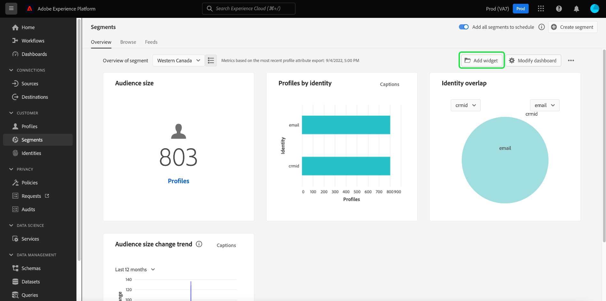

From the widget library, you can browse the selection of standard and custom segment widgets.For information on how to add widgets, please see the widget library documentation on how to [add a widget](../customize/widget-library.md#add-widgets). 

## Select a segment

The dashboard automatically selects a segment to display, however you can change the segment by using the dropdown menu or segment selector. 

To choose a different segment, select the dropdown next to the segment name or use the segment selector to open the segment selection dialog.

>[!IMPORTANT]
>
>Only segments with a profile count above zero are displayed in the list of selectable segments.

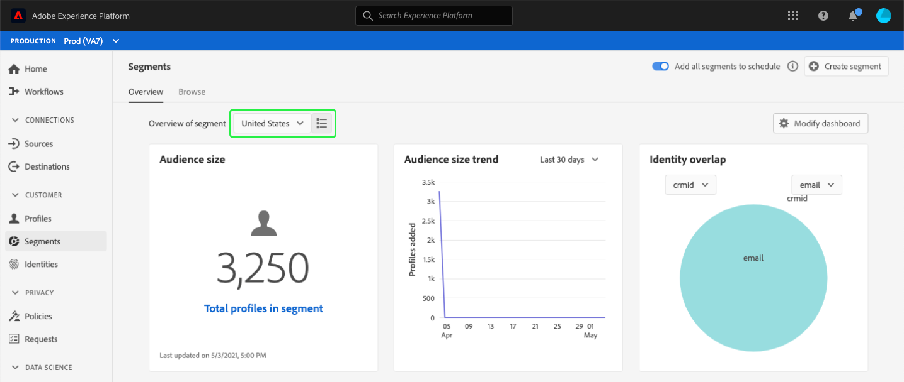

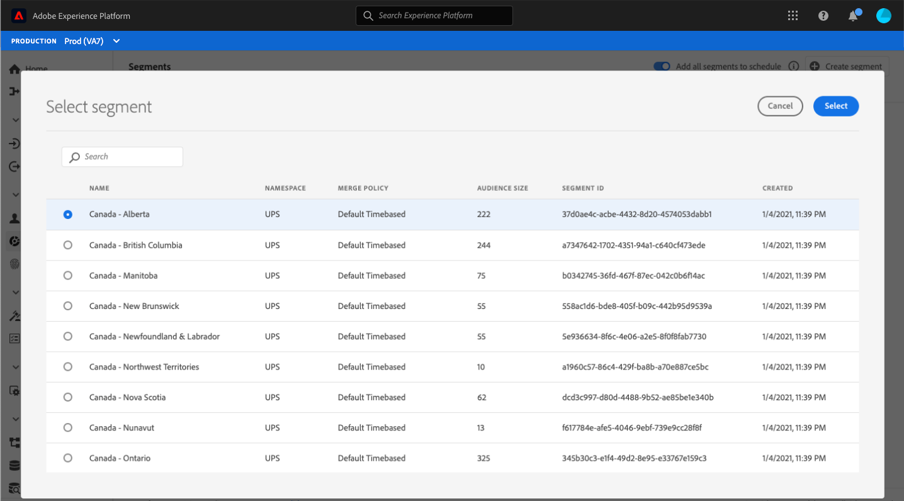

## Widgets and metrics

The segments dashboard is composed of widgets, which are read-only metrics providing important information regarding your selected segment. 

The date and time of the most recent snapshot are displayed at the top of the [!UICONTROL Overview] tab next to the segment dropdown. All widget data is accurate as of that date and time. The timestamp of the snapshot is provided in UTC; it is not in the timezone of the individual user or organization.

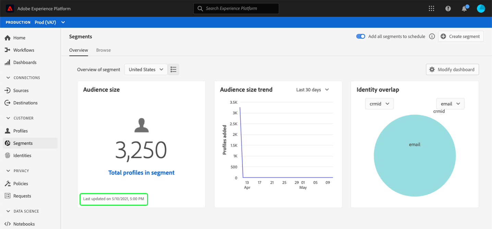

## Default widgets {#default-widgets}

A default widget load-out is provided for all new instances of Adobe Experience Platform that highlights the latest available insights from your data. The following widgets are pre-configured in your segments view from the outset. Full details on the purpose and function of the widgets can be found in their respective sections.

* [[!UICONTROL Audience size]](#audience-size)
* [[!UICONTROL Audience size change trend]](#audience-size-change-trend)
* [[!UICONTROL Identity overlap]](#identity-overlap)
* [[!UICONTROL Profiles by identity]](#profiles-by-identity)

>[!NOTE]
>
>As of July 26th 2023, the [!UICONTROL Profiles], [!UICONTROL Segments], and [!UICONTROL Destinations] Overview dashboards have been reset to a new default widget load-out for all users who did not modify their views in the previous 6 months. Please see the the documentation in the [Profiles](./profiles.md#default-widgets) and [Destinations](./destinations.md#default-widgets) default widget sections for details on which widgets are included as part of the default widget load-outs. You can continue to customize your dashboard widgets as before.

## Standard widgets {#standard-widgets}

Adobe provides multiple standard widgets that you can use to visualize different metrics related to your segments. You can also create custom widgets to be shared with your organization using the [!UICONTROL Widget library]. To learn more about creating custom widgets, please begin by reading the [Widget library overview](../customize/widget-library.md).

To learn more about each of the available standard widgets, select the name of a widget from the following list:

* [[!UICONTROL Audience size]](#audience-size)
* [[!UICONTROL Audience activation order]](#audience-activation-order)
* [[!UICONTROL Audience size trend]](#audience-size-trend)
* [[!UICONTROL Audience size change trend]](#audience-size-change-trend)
* [[!UICONTROL Audience size trend by identity]](#audience-size-trend-by-identity)
* [[!UICONTROL Audience overlap]](#audience-overlap)
* [[!UICONTROL Audience overlap report]](#audience-overlap-report)
* [[!UICONTROL Identity overlap]](#identity-overlap)
* [[!UICONTROL Profiles by identity]](#profiles-by-identity)
* [[!UICONTROL Scheduled activations]](#scheduled-activations)

### [!UICONTROL Audience size] {#audience-size}

>[!CONTEXTUALHELP]
>id="platform_dashboards_segments_audiencesize"
>title="Audience size"
>abstract="This widget displays the total number of merged profiles within the selected segment. This number depends on the merge policy applied to your data and is correct at the time of the most recent snapshot."

The **[!UICONTROL Audience size]** widget displays the total number of merged profiles within the selected segment at the time the snapshot was taken. This number is the result of applying the segment merge policy to your Profile data in order to merge profile fragments together to form a single profile for each individual in the segment. 

For more information on fragments and merged profiles, refer to the [Real-Time Customer Profile overview](../../profile/home.md).

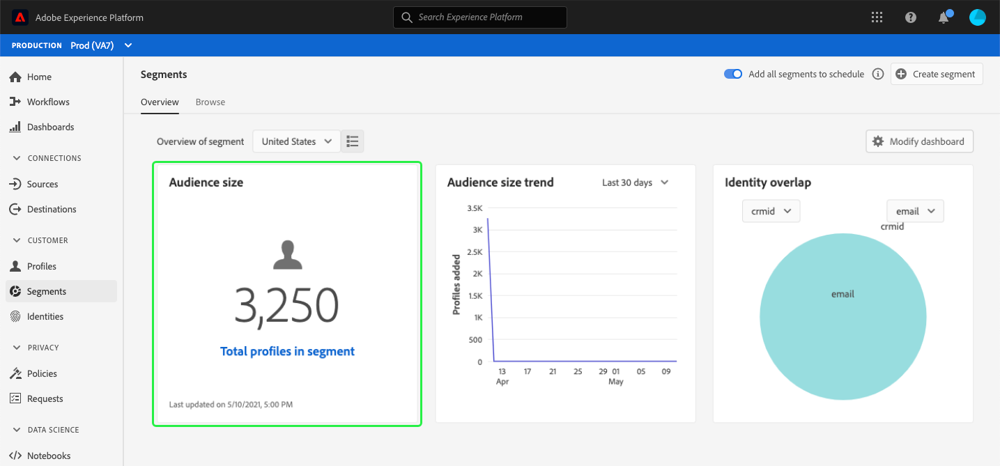

### [!UICONTROL Audience size trend] {#audience-size-trend}

>[!CONTEXTUALHELP]
>id="platform_dashboards_segments_audiencesizetrend"
>title="Audience size trend"
>abstract="This widget provides information regarding the total number of profiles that meet the criteria of **any** segment definition, as captured during the daily snapshot, for the last 30 days, 90 days, or 12 months."

The **[!UICONTROL Audience size trend]** widget provides a line graph illustration for the total number of profiles that meet the criteria of **any** segment definition over a given period of time. The audience size trend can be visualized over 30 days, 90 days, and 12 month periods. The time period is chosen from a dropdown menu in the widget. The audience size is reflected on the y-axis and time on the x-axis.

This widget also includes the automatic [!UICONTROL Captions] feature where a machine learning model analyzes the chart and segment data and automatically generates captions to describe the key trends and important events. Select **[!UICONTROL Captions]** to open the automatic captions dialog. 

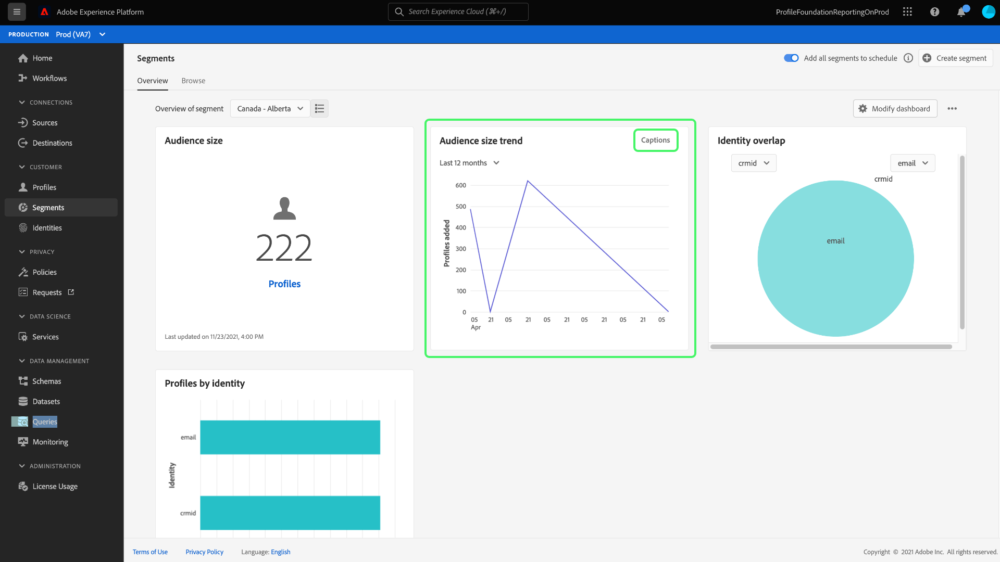

The automatic captions dialog opens providing insights on your data. 

 

To learn more about segment evaluation and how profiles qualify and exit from segments, please refer to the [Segmentation Service documentation](../../segmentation/home.md).

### [!UICONTROL Audience size change trend] {#audience-size-change-trend}

This widget provides a line graph illustration of the difference in the total number of profiles that qualified for a given segment between the most recent daily snapshots. The segment chosen for analysis is selected from the overview dropdown. The period of trend analysis can be visualized over 30 days, 90 days, and 12 month periods. The time period is chosen from a dropdown menu in the widget. The audience size is reflected on the y-axis and time on the x-axis.

### [!UICONTROL Audience size trend by identity] {#audience-size-trend-by-identity}

This widget illustrates the audience size trend for a particular segment based on the identity type chosen from the widget dropdown menu. The segment used for analysis is selected from the overview dropdown. The period of trend analysis can be visualized over 30 days, 90 days, and 12 month periods. The time period is chosen from a dropdown menu in the widget.

### [!UICONTROL Audience activation order] {#audience-activation-order}

The [!UICONTROL Audience activation order] widget provides a three-column table that lists the [!UICONTROL destination name], the [!UICONTROL platform], and the activation [!UICONTROL date] of the audience. The list is ordered from high to low according to recency and can accommodate up to 10 rows.

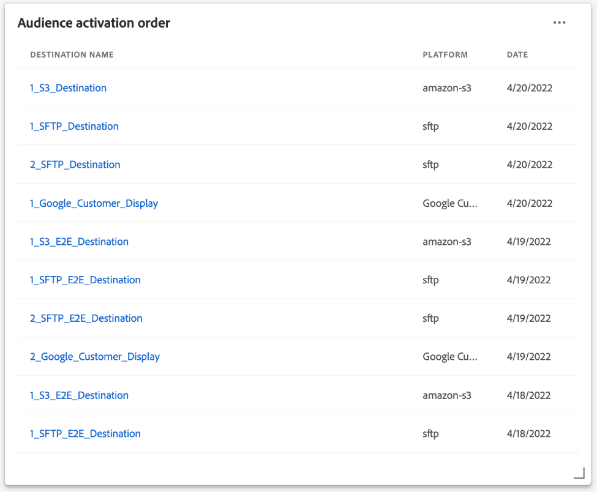

### [!UICONTROL Audience overlap] {#audience-overlap}

This widget represents the number of profiles from two segments that meet the criteria for both segment definitions. The segments used for comparison are selected from the widget dropdown menus. The total number of profiles contained within the the relevant segment definition can be seen by hovering over a circle or the intersection of the Venn diagram.

This widget enables you to optimize your segmentation strategy by visualizing the similarities in the results of your segment definitions.

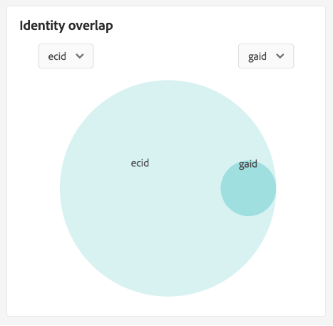

### [!UICONTROL Audience overlap report] {#audience-overlap-report}

This widget tabularizes the audience overlap data for a specific segment. A list of five audiences ranked from highest to lowest overlap percentages is provided for the segment chosen from the dropdown menu at the top of the screen. For clarity, your chosen segment is listed in the [!UICONTROL SEGMENT A NAME] column. Audience overlap analysis is provided for the second segment listed in the [!UICONTROL SEGMENT B NAME] column. The percentage overlap is provided in the third column accurate to twelve decimal places.

The audience overlap report helps you to build new, high-performance segments. Observing high percentage overlaps enables you to suppress audiences and prevent sending the same audience to different destinations. They also help you identify hidden insights that might help with better segmentation. Low percentage overlap helps to locate unique profiles to pursue.

Select **[!UICONTROL View more]** to open a full-screen dialog that contains more segment overlap data.

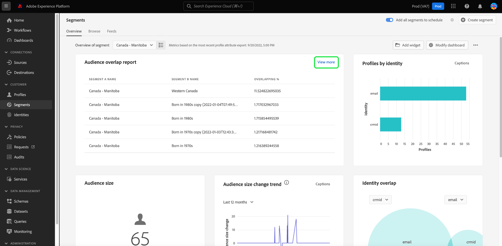

The [!UICONTROL Audience overlap report] dialog appears. This dialog can contain up to 50 rows of audience overlap analyses broken down into six columns. Select the settings icon () to remove or add columns from the table.

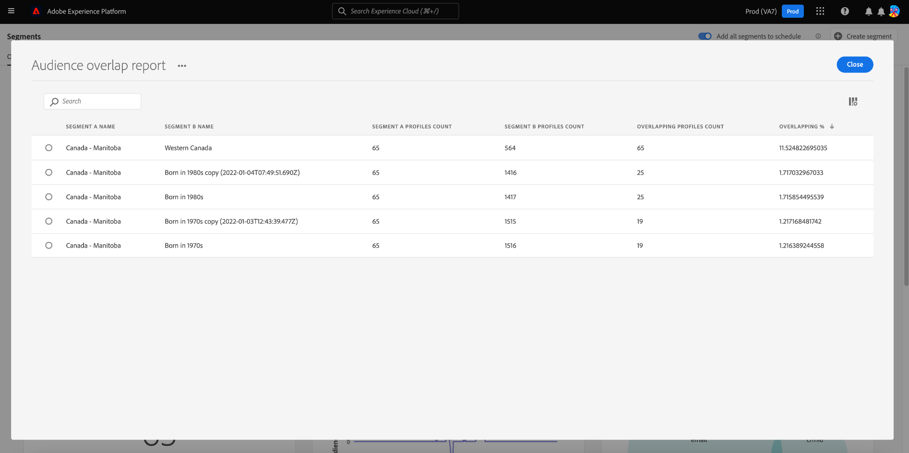

>[!NOTE]
>
>Select the **[!UICONTROL Overlapping]** column header to change the ranking of results between highest to lowest or lowest to highest.

To download the entire report in PDF format, select the options menu (**`...`**) followed by **[!UICONTROL Download]**.

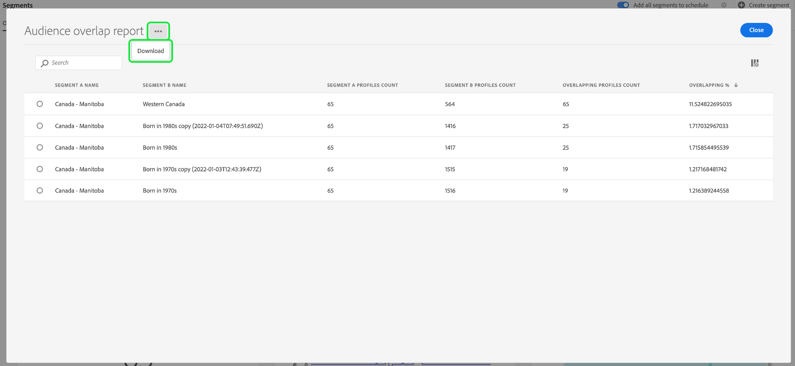

Select a row from the report to open a Venn diagram of the overlap analysis. Hover over a section of the Venn diagram to see the profile count in a dialog.

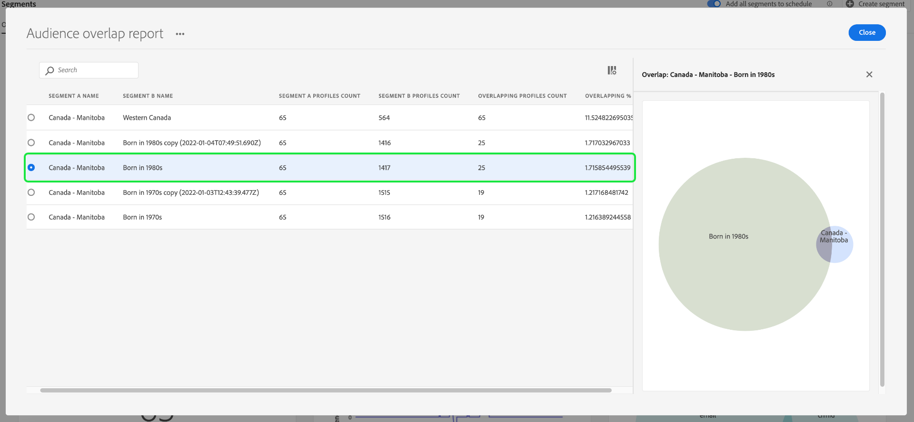

Select **[!UICONTROL Close]** to return to the [!UICONTROL Segments] dashboard.

### [!UICONTROL Identity overlap] {#identity-overlap}

>[!CONTEXTUALHELP]
>id="platform_dashboards_segments_identityoverlap"
>title="Identity overlap"
>abstract="This widget shows the overlap of profiles in your segment containing both chosen identities. The circles display the relative size of each identity. The number of profiles containing both namespaces are represented by the overlap between the circles."

The **[!UICONTROL Identity overlap]** widget displays a Venn diagram, or set diagram, showing the overlap of profiles in your segment containing multiple identities. 

Use the dropdown menus on the widget to select the identities that you wish to compare. The circles display the relative size of each chosen identity, with the number of profiles containing both namespaces being represented by the size of the overlap between the circles.

If a customer interacts with your brand on more than one channel, multiple identities will be associated with that individual customer, therefore it is likely that your organization will have multiple profiles containing fragments from more than one identity.

To learn more about identities, please visit the [Adobe Experience Platform Identity Service documentation](../../identity-service/home.md).

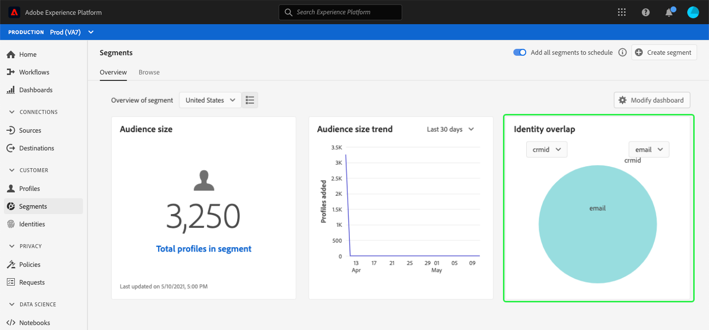

### [!UICONTROL Profiles by identity] {#profiles-by-identity}

>[!CONTEXTUALHELP]
>id="platform_dashboards_segments_profilesbyidentity"
>title="Profiles by identity"
>abstract="This widget displays the breakdown of identities across every merged profile in your selected segment."

The **[!UICONTROL Profiles by identity]** widget displays the breakdown of identities across every merged profile in your selected segment. The total number of profiles by identity may be higher than the total number of profiles in the segment because one profile could have multiple identities associated with it. In other words, adding together the values shown for each identity may total more than the total audience size in the segment because if a customer interacts with your brand on more than one channel, multiple identities may be associated with that individual customer.

Select **[!UICONTROL Captions]** to open the automatic captions dialog.

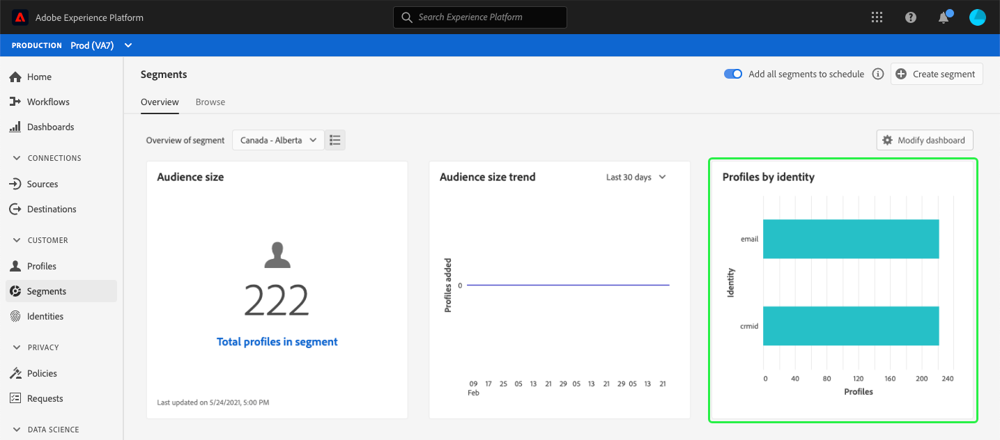

A machine learning model automatically generates data insights by analyzing the overall distribution and key dimensions of the data.

To learn more about identities, please visit the [Adobe Experience Platform Identity Service documentation](../../identity-service/home.md).

### Scheduled activations {#scheduled-activations}

The [!UICONTROL Scheduled activations] widget provides a tabularized view of the most recently activated destinations. The table includes the destination platform, the name of your activation flow to this destination, and the activation start and end date for the selected segment. If there is no end date provided for the activation then it displays as [!UICONTROL Ongoing]. The segment for analysis is selected from the dropdown at the top of the page. 

The widget allows you to discover at a glance where and when the audience is being activated and makes duplicate or unnecessary activations more transparent. This accumulated information also highlights where any activations have been left out.

## Next steps

By following this document you should now be able to locate the segment dashboard and select a segment to view. You should also understand the metrics displayed in the available widgets. To learn more about working with segments in the Experience Platform UI, please refer to the [Segmentation Service UI guide](../../segmentation/ui/overview.md).
