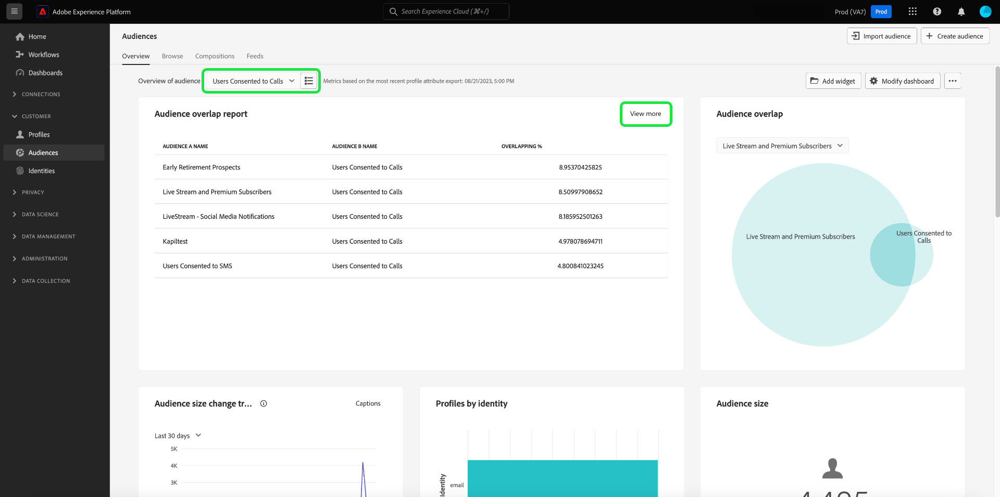

# Consent analysis and tracking

In today's marketing landscape, you need to understand and respect customer consent preferences. Adobe Real-Time Customer Data Platform provides the ability for marketers to analyze customer consent to build trust, comply with privacy regulations, and deliver more personalized experiences.

This document details how to build a consent dashboard for various marketing use cases for Real-Time CDP data. Specifically, it focuses on how to create an audience with the appropriate attributes for your business needs, and then consume the insights through the use of pre-configured widgets in the Adobe Experience Platform UI. An alternative method of building your own custom widget with the user-defined dashboards feature is also presented.

## Use cases {#use-cases}

The use cases covered in this guide are consent trending and consent overlap.

- **Consent trending** tracks how user consent has trended over time. Analyzing consent preference changes helps marketers plan and executing campaigns that adapt to those user preference changes. For example, you may want to run targeted educational campaigns, transparency and trust campaigns, or incentive campaigns to drive consent choices. You could also correlate campaigns that might have been negatively impacting consent to proactively reduce the frequency of those campaigns.
- **Consent overlap** uses the overlap among consent channels to deliver consistent personalized messaging on multiple channels for your customers who have consented to multiple channels. Marketers can prioritize and allocate resources to certain channels where a higher degree of consent and personalized messaging might resonate with customers and generating higher response rates.

## Create consented audiences {#create-consent-audiences}

To build a consent dashboard, you must first create an audience of all the profiles that have consented to contact. To navigate to the Real-Time Customer Data Platform Segment Builder, select **[!UICONTROL Audiences]** in the left navigation of the Platform UI. From the the [!UICONTROL Customer] tab of the [!UICONTROL Audiences] dashboard, select **[!UICONTROL Create audience]** in the top right of the view, then **[!UICONTROL Build rules]**.

![The [!UICONTROL Audiences] dashboard with [!UICONTROL Customer], [!UICONTROL Audiences], and [!UICONTROL Create segment] highlighted.](../images/insights-use-cases/consent-analysis/create-audience.png)

The Segment Builder appears. Next, select **[!UICONTROL XDM Individual Profile]** from the available options. See the documentation for more information on the [rule builder canvas](../../segmentation/ui/segment-builder.md#rule-builder-canvas). 

![The Segment Builder with the [!UICONTROL XDM Individual Profile] attribute folder highlighted.](../images/insights-use-cases/consent-analysis/xdm-individual-profile.png)

Locate your consent attributes from the options available. Select **[!UICONTROL Consents and Preferences]**. 

>[!NOTE]
>
>If you have maintained your user consent in an attribute different to the Adobe recommended field group, then you must select those attributes instead of the ones shown below.

More information can be found on the [handling of consent in segmentation](../../segmentation/consents.md#handling-consent-in-segmentation) documentation.

![The Segment Builder with the [!UICONTROL Consent and Preferences] attribute folder highlighted.](../images/insights-use-cases/consent-analysis/consent-and-preferences.png)

The various consent and preference options are displayed. As this demonstration focuses on consent to contact over various marketing channels, select **[!UICONTROL Marketing Preferences]**.

![The Segment Builder with the [!UICONTROL Marketing Preferences] folder highlighted.](../images/insights-use-cases/consent-analysis/marketing-preferences.png)

The list of marketing preferences are displayed. Although this example use case focuses on email, SMS, and calls, you can build insights for any other combination or the entirety of options as well. For each of the channels, perform the below steps to create an audience.

To begin configuring an audience, select **[!UICONTROL Receive SMS]** / **[!UICONTROL Receive email]** / **[!UICONTROL Receive calls]**.

The [!UICONTROL Subscriptions] folder appears. From the options available, select and drag the **[!UICONTROL Choice Value]** attribute to the center pane, then select the desired value from the drop-down. In this case, select **Yes (opt in)**. Next, name the audience according to your business needs and provide a user-friendly description.

>[!NOTE]
>
>There is a soft limit on the number of audiences that you are recommended to create. More information can be found in the [segmentation guardrails documentation](../../profile/guardrails.md#segmentation-guardrails).

![The [!UICONTROL Choice Value] attribute with the [!UICONTROL Yes (opt-in)] value highlighted in the segment builder. The name and description of the audience are also highlighted.](../images/insights-use-cases/consent-analysis/choice-value.png)

After you have created the necessary audiences, they are listed in the [!UICONTROL Audiences] [!UICONTROL Browse] tab. 

>[!NOTE]
>
>When creating an audience, you have to wait for the batch segmentation job to complete before the data is available to start building your consent dashboard. Batch segmentation describes the process of moving all your profile data at once through your segment definitions to produce the corresponding audiences. Once created, this audience is saved and stored for you to export and use. Batch segments are automatically evaluated every 24 hours.

## Consume insights {#consume-insights}

Adobe had created various insights that are automatically available for you in the Profiles, Audiences, and Destinations dashboards. Any audience that you create is then automatically usable with these preconfigured insights. See the standard widget documentation for a list of the insights available in the [Profiles](../guides/profiles.md#standard-widgets), [Audiences](../guides/audiences.md#standard-widgets), and [Destinations](../guides/destinations.md) dashboards.

## Audience overlap {#audience-overlap}

To review the overlap between any two consent audiences, add the [!UICONTROL Audience overlap by merge policy] to your Profiles dashboard and select the desired audiences in the dropdown menus. See the documentation for instructions on how to add a widget to your dashboard the [*Audience overlap by merge policy*](../guides/profiles.md#audience-overlap-by-merge-policy) for more information on the insight.

<!-- Image needs updating to night mode -->

 
You can view the overlap of all audiences where users have consented to receive calls across all other audiences, with the Audience overlap report in the Audiences dashboard. To view the overlap of consent audiences, first navigate to the [!UICONTROL Audiences] [!UICONTROL Overview] tab. From there, you can add the [!UICONTROL Audience overlap report] widget to the Audiences dashboard. After the widget has been created, select the **[!UICONTROL User consented to calls]** audience from the overview of audience dropdown menu at the top of the page. Next, select **[!UICONTROL View more]** in the Audience overlap report widget to see up to 50 of the top overlaps, and up to 50 of the least overlaps regarding the selected segment.

<!-- Image needs updating to night mode -->

The Audience overlap report dialog expands to show additional audience overlap data.

<!-- Image needs updating to night mode -->

## Audience size trends {#audience-size-trends}

When you create a consent-based audience, it automatically trends up to 12 months from the date you created the audience. To have a fully functional trend of your customer consent, add the following widgets to the [!UICONTROL Segments] [!UICONTROL Overview] page. These insights offer a powerful means of tracking how your consent is changing over time. They even correlate with any campaigns that you run in parallel that might positively or negatively impact consent. The descriptions offered for these widgets apply to a consent use case.

- [Audience size trend](../guides/audiences.md#audience-size-trend): This widget offers a way to track how your respective consent has changed over time.
- [Audience size change trend](../guides/audiences.md#audience-size-change-trend): This widget tracks how your customer consent has changed on a daily basis. For example, if the count of your customer consent dropped by 100,000, then you can see how that change occurred over a daily basis.
- [Audience size trend by identity](../guides/audiences.md#audience-size-trend-by-identity): With this widget you can track how your respective consent has changed over time, but further filtered by a specific identity such as an email.

<!-- Image needs updating to night mode -->

## Audiences Overview dashboard {#audiences-overview-dashboard}

After you have created a consent-related audience such as "Users Consented to SMS", you can view key personalized consent information about your audience by adding the appropriate widgets to your Audiences Overview dashboard. Navigate to the [!UICONTROL Audiences] [!UICONTROL Overview] and add your chosen widgets from the widget library. Any widget added to your view of the dashboard can be resized and moved using the [!UICONTROL Modify dashboard] feature. Your personalized view can contain insights such as the trend over time (up to 12 months), the overlaps with other audiences, and the identity composition of the audience. An example view is shown below.

## User-defined dashboards {#usr-defined-dashboards}

You can also build out your own widgets with user-defined dashboards. Building your own widget gives you complete control over the type of widget, along with flexibility to add filters and much more, directly within Adobe Real-Time CDP. 

For example, if you want to trend multiple consent audiences in the same chart so that you can see over time how each of your consent preferences has changed. This type of visualization is possible with user-defined dashboards in minimal steps and a one time setup. First, select **[!UICONTROL Dashboards]** in the left navigation. The [!UICONTROL Dashboards] workspace appears. Then select **[!UICONTROL Create dashboard]**. Full instructions on how to [create a dashboard and custom widget](../user-defined-dashboards.md) can be found in the user-defined dashboards guide. 

When you [select your data model](../user-defined-dashboards.md#select-data-model) in the widget composer, select `CDPInsights` followed by **[!UICONTROL Next]**. The [!UICONTROL Select table] dialog appears.

The next view displays a list of the available tables in the left rail. Select the `adwh_fact_profile_by_segment_and_namespace_trendlines`.

After the widget composer is populated with data from your chosen table, perform the steps below:

- [Search [!UICONTROL Attributes]](../user-defined-dashboards.md#add-filter-attributes) for `[!UICONTROL date]`, then use the + icon to add the `[!UICONTROL date]` attribute to the X-axis from the dropdown menu.

- Search [!UICONTROL Attributes] for `[!UICONTROL count_of_profiles]`, then use the + icon to add the `[!UICONTROL count_of_profiles]` attribute to the Y-axis from the dropdown menu.
- Select the `...` (ellipses) icon in the [!UICONTROL Y-axis] field, then select the [!UICONTROL SUM] aggregate function from the dropdown menu.

- Select the [!UICONTROL Marks] dropdown menu, and change the chart type to [!UICONTROL Line]. 
- Search [!UICONTROL Attributes] for the `[!UICONTROL segment_name]`, then use the + icon to add the `segment_name` as a [!UICONTROL Filter] from the dropdown menu. The [!UICONTROL Filter: Segment_name] dialog appears. Select the audiences created earlier that relate to consent. For this example, select **[!UICONTROL Users Consented to Calls]**, **[!UICONTROL Users Consented to SMS]**, and **[!UICONTROL Users Consented to Email]**, followed by **[!UICONTROL Apply]**.
- Search [!UICONTROL Attributes] for `[!UICONTROL segment_name]`, then select the + icon to add `segment_name` as a [!UICONTROL Color] from the dropdown menu. 
- Open [the [!UICONTROL Properties] panel](../user-defined-dashboards.md#widget-properties) and provide an appropriate [!UICONTROL Widget title] and [!UICONTROL Axis label].

- Select **[!UICONTROL Save and close]** to confirm your settings.

>[!TIP]
>
>You can now resize or move the widget to the desired size and position before you save the dashboard.

The image below demonstrates how your finished widget appears and other potential custom insights. For more details on the types of widgets that can be created, refer to the [data model documentation](../cdp-insights-data-model.md).

<!-- The diagram shows straight lines due to a lack of data, however in your environment the trends will reflect the actual changes over time. -->

## Tracking consent policies {#consent-policies}

The consent dashboards that you create capture the **distribution of consent and preference attributes only**.

>[!NOTE]
>
>For customers of **Adobe Healthcare Shield** or **Adobe Privacy & Security Shield**, these dashboards **do not** reflect any tracking of consent policies. Available tracking includes the number of policies created, enabled, and the impact on audience membership. 

## Next steps 

By reading this document, you have learned how to build dashboards for a comprehensive view of your customer consent preferences by using Real-Time CDP insights. This document demonstrates how Real-Time CDP provides a robust solution to today's privacy-focused landscape where collection, segmentation, analysis, and personalized marketing campaigns based on consent data are crucial for marketers.
