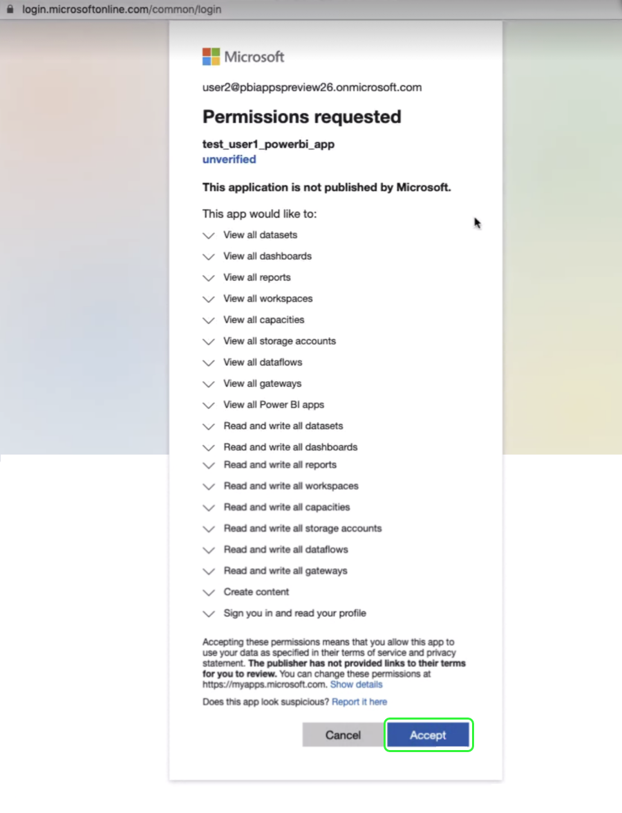

# Power BI Report Templates for Platform Dashboards

{Intro blurb}

{The Power BI report template feature allows you to create COMPELLING reports populated with data from your Adobe Experience Platform Profile, Segment, and Destination insights. These reports can be shared across your entire organization without the recipients needing credentials for your Platform IMS ORG. }

{Experience Platform provides the Power BI application integration through a streamlined installation process. The automated installation process installs all the standard widgets for displaying key metrics and connects to the data model so that you can easily customize and extend the report.  }

{Power BI report templates are comprised of the a variety of elements. They include visual representations of the report data,report pages, the data model definition (including schema and relationships), and all query definitions.}

## Getting started

{prerequisits, links to other requirements}

{ To access the Power BI tab users must first have acquire the following permissions: }

- Query Service Manage
- Manage sandboxes permission

See the [documentaiton]() for more information on acquiring these permissions.

## Install the Power BI application integration

Select **[!UICONTROL Dashboards]** is the left navigation. The Dashboards workspace appears. The [!UICONTROL Browse] tab displays a list of currently available dashboard views. Each link will requires the appropriate RBAC permissions. These are all inherited permissions. If selected will navigate you to the appropriate dashboard view. 

Next, select the **[!UICONTROL Integrations]** tab. The Power BI application integration page appears. Then select **[!UICONTROL Install]** to begin the installation.

>[!NOTE]
>
> If you do not have both Query Service Manage and Manage Sandboxes permissions then [!UICONTROL Install] will be grayed out.

### Credentials

The first step is to generate credentials. There are two options available, [!UICONTROL  Create  new credentials] or [!UICONTROL  Use existing credentials]. Select the appropriate toggle.

#### Create New credentials

There are three required fields when generating new credentials, [!UICONTROL Name], [!UICONTROL Assigned to], and [!UICONTROL Password]. The [!UICONTROL Assigned to] field relates to the email address associated with...XXXXX

<!-- Question what does the 'Assigned to' field relate to specifically? Email linked to the IMS Org perhaps?-->

To learn more about generating non-expiring Query Service credentials, please refer to the [Query Service non-expiring credentials guide](../../query-service/ui/credentials.md#non-expiring-credentials).

>[!NOTE]
>
>When creating non-expiring credentials you must have the following three permissions and two roles. The power BI installation workflow will allow you to progress with the installation but will return an error unless you have the required permissions and roles. The necessary permissions are Query Service Manage, Manage Sandboxes, and Query Service Integration permission. The required roles are Adobe Experience Platform admin and developer roles. To learn how to assign these permissions, please read the [Access Control](../../access-control/home.md) documentation.

#### Use Existing credentials

A JSON credential file can be uploaded. This can also be taken from the Query Service non-expiring credentials.  

Select **[!UICONTROL Upload credential file]**. A file browser dialog appears. Select the appropriate JSON file to upload.

## Review consent

After selecting either **[!UICONTROL Generate Credentials]** or **[!UICONTROL Upload credential file]** Platform automatically validates the credentials. Assuming you have the correct credentials, a confirmation popover appears.

Next you must provide consent to Microsoft for the permissions requested by Power BI. A window appears requesting permissions. 

These permissions allow Power BI to use your data according to their terms of service and privacy statement. Select **[!UICONTROL Accept].

>[!NOTE]
>
>If you exit the installation process at any point before providing consent, the Power BI application integration will not be installed to the Dashboards inventory.

After providing consent, the dashboard is installed in the Power BI environment. As part of the installation process, the Power BI report template is automatically installed in the Power BI environment which then uses the non-expiring credentials to log into Adobe Experience Platform. Power BI then executes all the SQL queries in sequence to access the data that is held within Experience Platform and populates the report template.

The Power BI view is now added to the list of available Dashboards under the [!UICONTROL Browse] tab. Select **[!UICONTROL Power BI]** from the list.

## Power BI workspace

Navigate to the [Power BI login page](https://dxt.powerbi.com). After logging into the Power BI workspace, report templates are available for each of the services that have role-based access control (RBAC) permissions. These include Profiles, Segments, and Destinations.

>[!NOTE]
>
>You must have edit permissions to allow that dashboard to be installed in the Power BI environment.

