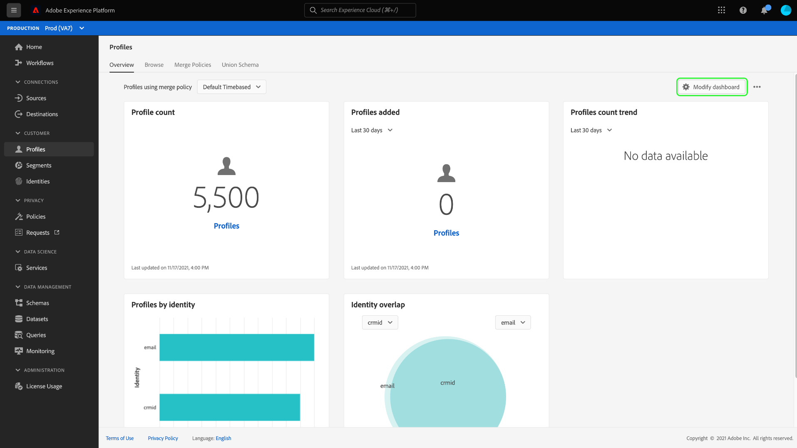
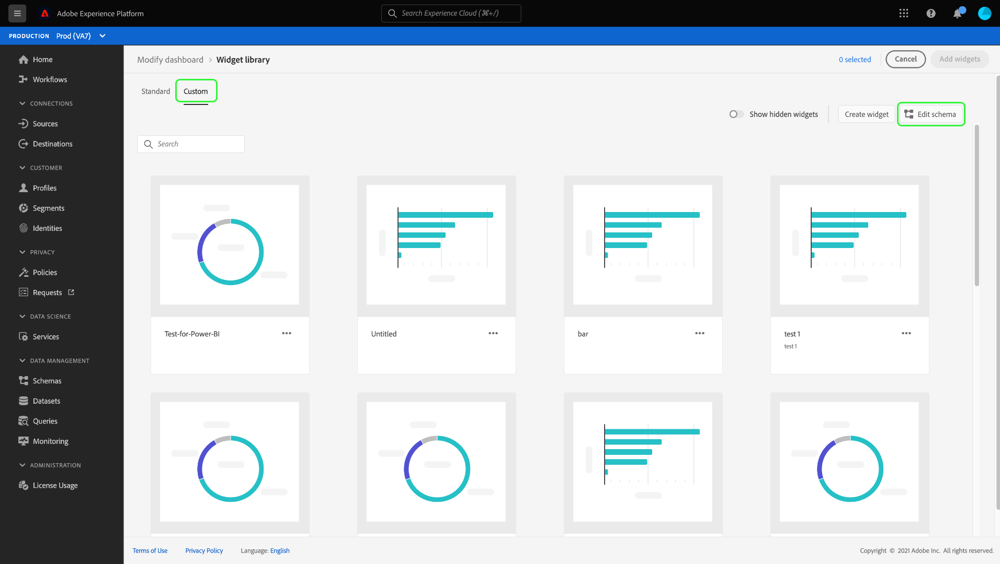

# Power BI report templates for Platform Dashboards

The Power BI report template feature allows you to create compelling reports populated with data from Adobe Experience Platform. The streamlined installation process automatically installs standard widgets for Real-time Customer Profile, Segmentation, and destinations, and connects to your data models so you can easily customize and extend your report templates. These reports can be shared across your entire organization without the recipients needing credentials for your IMS Organization on Platform.

This document provides instructions on how to connect Adobe Experience Platform with the Power BI application and use report templates to share key Platform data insights with external users.

## Getting started

Before continuing with this tutorial it is recommended to have a good understanding of [schema composition](../../xdm/schema/composition.md) in Experience Platform, and how attributes are included in Real-time Customer Profile through the [union schema](../../xdm/schema/composition.md#union).

To install the Power BI application integration, users must first have acquired the following Platform permissions:

- Manage Query Service Integration
- Manage Sandboxes

To learn how to assign these permissions, please read the [access control](../../access-control/home.md) documentation.

You must also have a Power BI account to follow this tutorial. To create an account, navigate to the [Power BI homepage](https://powerbi.microsoft.com/en-us/) and follow the sign-up process. Users for this Power BI account must also have the **Create workspace** setting enabled within Power BI settings. The **Create workspace** setting is found within Tenant settings of the Power BI admin portal. If your account is provided by your Tenant or employer, contact your respective admin to enable this setting. 

## Install the Power BI application integration

Within the Platform UI, select **[!UICONTROL Dashboards]** in the left navigation to open the [!UICONTROL Dashboards] workspace. The Dashboards workspace appears. The [!UICONTROL Browse] tab displays a list of currently available dashboard views. To learn more about available dashboards, see the [inventory documentation](../inventory.md). 

Next, select the **[!UICONTROL Integrations]** tab. The Power BI application integration page appears. From here, select **[!UICONTROL Install]** to begin the installation.

>[!NOTE]
>
>The [!UICONTROL Install] button is grayed out unless you have both Query Service Manage and Manage Sandboxes permissions.

### Credentials

The first step in the installation process is to provide non-expiring credentials for the Power BI application integration. There are two options available to provide these: [!UICONTROL  Create  new credentials] or [!UICONTROL  Use existing credentials]. Select the appropriate toggle.

#### Create New credentials

There are three required fields when generating new credentials, [!UICONTROL Name], [!UICONTROL Assigned to], and [!UICONTROL Password]. The [!UICONTROL Assigned to] field relates to the email address associated with your Power BI account. 

To learn more about generating non-expiring Query Service credentials, please refer to the [Query Service non-expiring credentials guide](../../query-service/ui/credentials.md#non-expiring-credentials).

>[!IMPORTANT]
>
>Creating non-expiring credentials requires you to have certain permissions and roles assigned. The necessary permissions are Manage Sandboxes, Manage Queries, and Manage Query Service Integration. The required roles are Adobe Experience Platform admin and developer roles. To learn how to assign these permissions, please read the [access control](../../access-control/home.md) documentation.

After generating non-expiring credentials for the first time, a JSON file is downloaded that can be shared with other users who can then use these credentials to complete the installation process.

#### Use Existing credentials

A JSON credential file can also be uploaded to pass validation. These JSON files holding the non-expiring credential values are downloaded to the local machine when a non-expiring credential is created.

>[!IMPORTANT]
>
>To use an existing non-expiring credential, the user must already have been assigned a credential. If the user does not have a credential assigned and cannot create a new one using the Adobe Admin Console, then the user cannot proceed with the installation process.

Select **[!UICONTROL Upload credential file]**, then select the appropriate JSON file to upload in the dialog that appears.

### Review consent

After you provide the non-expiring credentials, they are automatically validated by Platform. A confirmation message appears once validation is successful.

A new window appears where you must provide consent to allow Power BI to access and use your data according their terms of service and privacy statement. Select **[!UICONTROL Accept]** to grant Power BI permission to access and use your Platform data.

>[!NOTE]
>
>If you exit the installation process at any point before providing consent, the Power BI application integration will not be installed to the Dashboards inventory.

After providing consent, the report template is automatically installed in the Power BI environment as part of the installation process. Power BI then uses the non-expiring credentials access Platform, sequentially execute all the SQL queries, and populate the report template with the returned data.

>[!NOTE]
>
>Only the user who installs the Power BI dashboard can delete it. Deleting the Power BI dashboard from the Platform UI does NOT delete the report templates available in your Power BI environment. If you want to completely delete the information held in the Power BI report templates, you need to log into your Power BI account and delete the report templates from that environment. Once deleted, a user can reinstall the Power BI dashboard by following the same installation instructions as outlined above.

Now that the Power BI report template is installed, its link is added to the list of available Dashboards under the [!UICONTROL Browse] tab. Select **[!UICONTROL Power BI]** from the list to navigate to the Power BI environment. 

>[!IMPORTANT]
>
>Power BI admins need to make sure that the users have the appropriate access permissions to view these dashboards in the Power BI environment. 

## Power BI workspace

After logging into [the Power BI workspace](https://dxt.powerbi.com), report templates are available for each of the services for which you have access to. The report templates include profiles, segments, and destinations dashboards **only** if they have the corresponding view permissions.

The standard widgets from profiles, segments, and destinations are available within the Power BI template reports by default.

>[!NOTE]
>
>You must have edit permissions enabled for a given dashboard to allow that dashboard to be installed in the Power BI environment.

After a dashboard is installed in Power BI, report templates are displayed to all users by default. If you want to restrict access to any report templates, make sure that you disable access for the users in question from within the Power BI environment.  

## Customize your Power BI report template

>[!IMPORTANT]
>
>Newly created custom widgets are NOT automatically synchronized between Adobe Experience Platform dashboards and the Power BI report templates. Any custom widgets created in the Platform UI have to be manually recreated inside the Power BI environment.

You can add custom attributes to your data model to enrich the report templates provided by Power BI. Platform provides two methods to add custom attributes, either through the UI or by using the Schema Registry API. 

Any attribute that you choose to add to the XDM Individual Profile class is added to the union schema as a custom attribute. See the documentation on [how to add field groups](../../xdm/tutorials/create-schema-ui.md#field-group) through the UI Schema Editor or [creating and editing schemas in the UI](../../xdm/ui/resources/schemas.md) for more information.

### Create a custom widget

Different attributes from the union schema of a particular class can be added to a custom widget. A custom widget is created or modified through the Widget Library in the Platform UI. See the [Widget Library overview](../customize/widget-library.md) for more information. To access the Widget Library, select the **[!UICONTROL Modify dashboard]** button from either the [!UICONTROL Profiles], [!UICONTROL Segments], or [!UICONTROL Destinations] overview tab. 

From the Widget Library you must then select the **[!UICONTROL Custom]** tab followed by **[!UICONTROL Edit schema]**.

See the documentation for complete instructions on how to [edit a schema to create custom widgets](../customize/edit-schema.md#edit-schema). Newly selected attributes become available following the next daily snapshot when the data is refreshed.

## Next steps

By reading this document you have a better understanding of how Power BI report templates can be integrated into Platform to share compelling data insights from your profiles, segments, or destinations dashboards. See the [Dashboard customization overview](../customize/overview.md) document to learn more about customizing your dashboards, or documentation on creating custom widgets.
