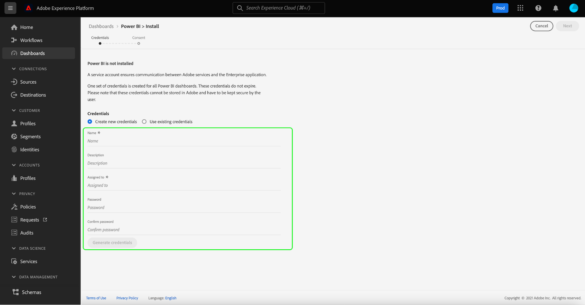

# Power BI report templates for dashboards

The Power BI report template feature allows you to create compelling reports populated with data from Adobe Experience Platform. The streamlined installation process automatically installs standard widgets for Real-Time Customer Profile, segmentation, and destinations. The installation also connects Power BI to your data models so you can easily customize and extend your report templates. These reports can be shared across your entire organization without the recipients needing credentials for your IMS Organization on Platform.

This document provides instructions on how to connect Adobe Experience Platform with the Power BI application and use report templates to share key Platform data insights with external users.

## Getting started

Before continuing with this tutorial it is recommended to have a good understanding of [schema composition](../../xdm/schema/composition.md) in Experience Platform, and how attributes are included in Real-Time Customer Profile through the [union schema](../../xdm/schema/composition.md#union).

To install the Power BI application integration, users must first have acquired the following Platform permissions:

- Manage Queries
- Manage Sandboxes

To learn how to assign these permissions, please read the [access control](../../access-control/home.md) documentation.

You must also have a Power BI account to follow this tutorial. To create an account, navigate to the [Power BI homepage](https://powerbi.microsoft.com/en-us/) and follow the sign-up process. Users for this Power BI account must also enable the **Create workspace** setting within their Power BI settings. This setting is found within the tenant settings of the Power BI admin portal. If your account is provided by your tenant or employer, contact your respective admin to enable this setting. 

>[!NOTE]
>
>In order for the Dashboards tab to appear in the left navigation of the Platform UI, and the Dashboard Inventory view to be visible, you must have access to any one of the Profile, Segmentaiton or Destination dashboards as part of your Platform license. 

## Install the Power BI application integration

Within the Platform UI, select **[!UICONTROL Dashboards]** in the left navigation to open the [!UICONTROL Dashboards] workspace. The [!UICONTROL Browse] tab displays a list of currently available dashboard views. To learn more about viewing available dashboards, see the [inventory documentation](../inventory.md). 

Next, select the **[!UICONTROL Integrations]** tab. The Power BI application integration page appears. From here, select **[!UICONTROL Install]** to begin the installation.

>[!NOTE]
>
>The [!UICONTROL Install] button is disabled unless you have both Query Service Manage and Manage Sandboxes permissions.

### Provide credentials

The first step in the installation process is to provide non-expiring credentials for the Power BI application integration. There are two options available to provide these: [[!UICONTROL Create new credentials]](#create-new-credentials) or [[!UICONTROL Use existing credentials]](#use-existing-credentials). Select the appropriate toggle to continue.

#### Create new credentials {#create-new-credentials}

There are two required fields when generating new credentials: [!UICONTROL Name] and [!UICONTROL Assigned to]. The [!UICONTROL Assigned to] field relates to the email address associated with your Power BI account. 

>[!IMPORTANT]
>
>Creating non-expiring credentials requires you to have certain permissions and roles assigned. The necessary permissions are Manage Sandboxes and Manage Query Service Integration. The required roles are Adobe Experience Platform admin and developer roles. To learn how to assign these permissions, please read the [access control](../../access-control/home.md) documentation.

To learn more about generating non-expiring Query Service credentials, please refer to the [non-expiring credentials guide](../../query-service/ui/credentials.md#non-expiring-credentials).

After generating non-expiring credentials for the first time, a JSON file is downloaded to that machine. This JSON file can then be shared with other users as credentials to complete the installation process.

#### Use existing credentials {#use-existing-credentials}

A JSON credential file can also be uploaded to pass validation. These JSON files holding the non-expiring credential values are downloaded to the local machine being used when a non-expiring credential is created.

>[!IMPORTANT]
>
>To use an existing non-expiring credential, the user must already have been assigned a credential. If the user does not have a credential assigned and cannot create a new one using the Adobe Admin Console, then the user cannot proceed with the installation process.

Select **[!UICONTROL Upload credential file]**, then select the appropriate JSON file to upload in the dialog that appears.

After you provide the non-expiring credentials, they are automatically validated by Platform. A confirmation message appears once validation is successful. Select **[!UICONTROL Next]** to review the consent agreement for the Power BI application.

### Provide consent

The consent display appears. Select **[!UICONTROL Review consent]** to open a new window detailing the required permissions for Power BI to access and use your data according to their terms of service and privacy statement. 

Select **[!UICONTROL Accept]** to grant Power BI permission to access and use your Platform data.

>[!NOTE]
>
>If you exit the installation process at any point before providing consent, the Power BI application integration will not be installed to the dashboards inventory.

After providing consent, the report template is automatically installed in the Power BI environment as part of the installation process. Power BI then uses the non-expiring credentials to access Platform, sequentially execute all the SQL queries, and populate the report template with the returned data.

Select **[!UICONTROL Finish]** to return to the dashboard inventory.

Now that the Power BI report template is installed, it appears in the list of available dashboards under the [!UICONTROL Browse] tab. Select **[!UICONTROL Power BI]** from the list to navigate to the Power BI environment. 

>[!IMPORTANT]
>
>Power BI admins need to make sure that the users have the appropriate access permissions to view these dashboards in the Power BI environment. 

## Power BI workspace

After logging into [the Power BI workspace](https://dxt.powerbi.com), report templates are available for each of the services to which you have access. The report templates include profiles, segments, and destinations dashboards **only** if they have the corresponding view permissions.

The standard widgets from profiles, segments, and destinations are available within the Power BI template reports by default.

>[!NOTE]
>
>You must have edit permissions enabled for a given dashboard to allow that dashboard to be installed in the Power BI environment.

After a dashboard is installed in Power BI, report templates are displayed to all users by default. If you want to restrict access to any report templates, make sure that you disable access for the users in question from within the Power BI environment.

## Customize your Power BI report template

Through the use of custom widgets, you can add custom attributes to your data model to enrich the report templates provided by Power BI.

>[!NOTE]
>
>The attributes that you can use for custom widgets depend on what is available in the union schema. To learn how to view and explore union schemas to the benefit of your custom widgets, see the [union schema UI guide](../../profile/ui/union-schema.md).

### Create a custom widget

Custom widgets are created through the Widget Library. See the [Widget Library overview](../customize/widget-library.md) for an introduction to the feature and the [tutorial for creating a custom widget](../customize/custom-widgets.md) for specific instructions.

>[!IMPORTANT]
>
>Newly created custom widgets are **not** automatically synchronized between Adobe Experience Platform dashboards and the Power BI report templates. Any custom widgets created in the Platform UI have to be manually re-created inside the Power BI environment.

### Recreate your custom widget in the Power BI environment

Once your dashboard has the appropriate metrics and attributes contained within custom widgets, you are ready to modify the report template displayed from within the Power BI environment. See the [Power BI documentation](https://docs.microsoft.com/en-us/power-bi/) for information on how to edit a report through its user interface.

## Delete the Power BI application integration

To delete the dashboard, navigate to the dashboard inventory and select the delete icon () next to the dashboard name. 

>[!NOTE]
>
>Only the user who installed the Power BI dashboard can delete the integration from the Platform UI. 

A confirmation popover appears. Select **[!UICONTROL Delete]** to confirm the process.

>[!IMPORTANT]
>
>Deleting the Power BI dashboard from the Platform UI does **not** delete the report templates available in your Power BI environment. If you want to completely delete the information held in the Power BI report templates, you need to log into your Power BI account and delete the report templates from that environment. Once deleted, a user can reinstall the Power BI dashboard by following the same installation instructions as outlined above.

## Next steps

By reading this document, you have a better understanding of how Power BI report templates can be integrated into Platform to share compelling data insights from your profiles, segments, or destinations dashboards. See the [dashboard customization overview](../customize/overview.md) to learn more about customizing your dashboards.
