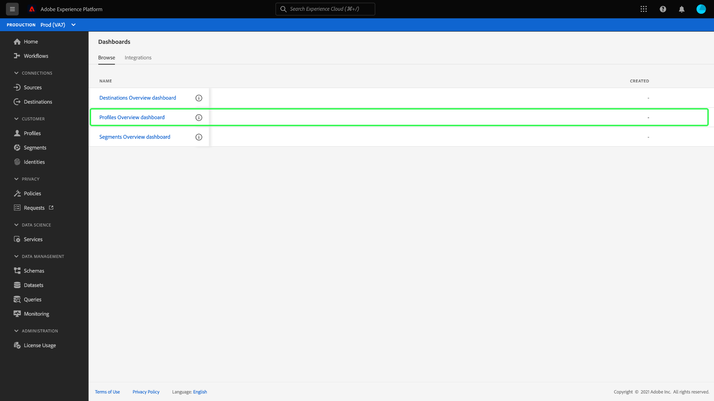

# View configured dashboards

If your organization has multiple dashboards available within Adobe Experience Platform, you can review the dashboard inventory within the user interface (UI).

To view the dashboards that your organization has configured, select **[!UICONTROL Dashboards]** in the left navigation and then select the **[!UICONTROL Browse]** tab.

A list of all dashboards available on your Platform instance is displayed under the [!UICONTROL Browse] tab. This includes integrated dashboards created by your organization that have been configured through third-party applications.

You can view an individual dashboard by selecting the name of the dashboard from the list.

When selected, the dashboard opens either in the Platform UI or in a fully integrated application workspace that requires you to log in using the necessary credentials.

## Create custom dashboards

Adobe Experience Platform Dashboards enables you to build and manage custom dashboards where you can create, add, and edit bespoke widgets to visualize key metrics relevant to your organization. See the [user defined dashboards guide](./user-defined-dashboards.md) for complete instructions on creating and configuring custom dashboards.
