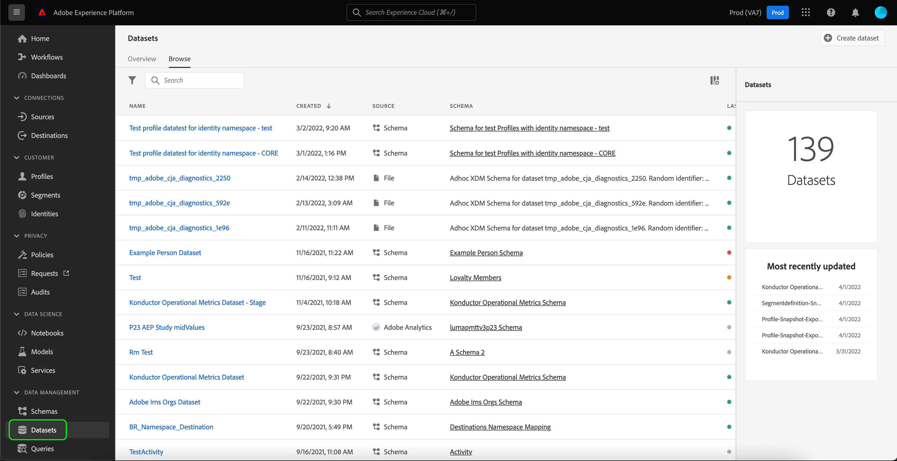
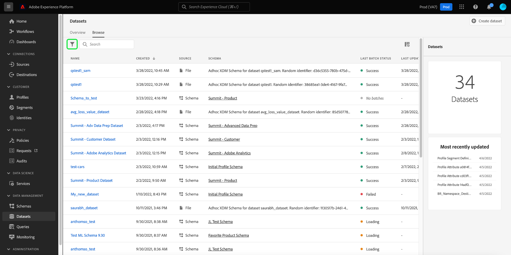
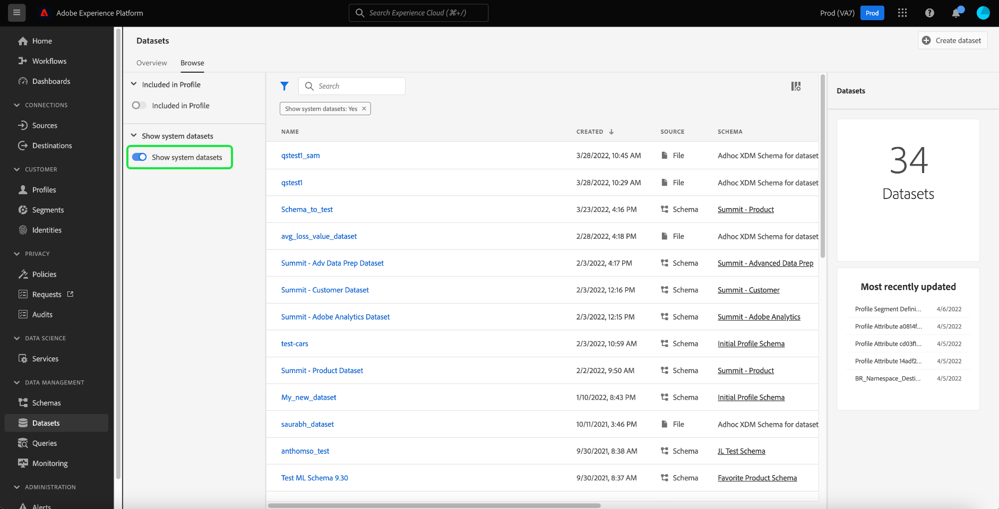
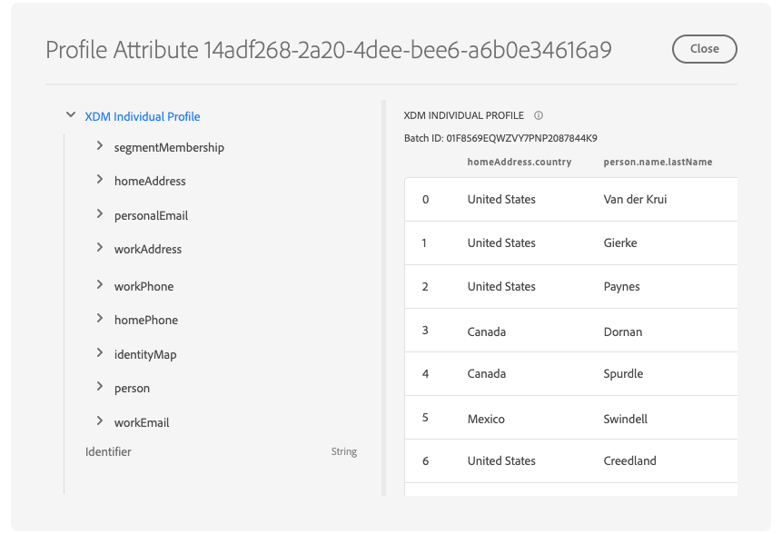
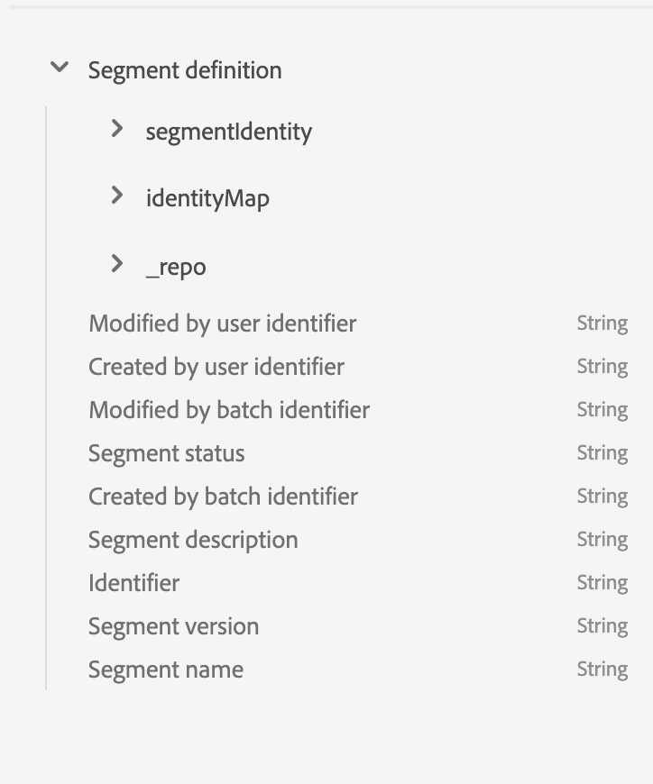
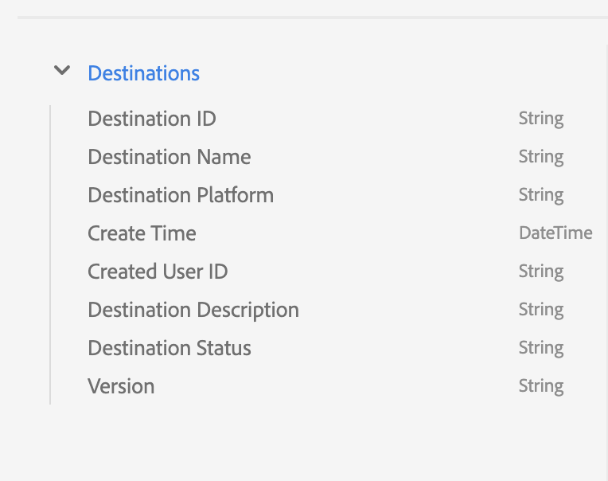

# Explore, verify, and process dashboard datasets using [!DNL Query Service]

Adobe Experience Platform provides important information about your organization's profile, segment, and destinations data through dashboards available within the Experience Platform UI. You can then use Adobe Experience Platform [!DNL Query Service] to explore, verify, and process the raw datasets powering these dashboards in the data lake.

## Getting started with [!DNL Query Service] 

Adobe Experience Platform [!DNL Query Service] supports marketers in gaining insights from their data by enabling the use of standard SQL to query data in the data lake. [!DNL Query Service] offers a user interface and an API that can be used to join any dataset in the data lake and capture the query results as new datasets for use in reporting, machine learning, or for ingestion into Real-time Customer Profile. 

To learn more about [!DNL Query Service] and its role within Experience Platform, please begin by reading the [[!DNL Query Service] overview](../query-service/home.md).

## Accessing available datasets

You can use [!DNL Query Service] to query raw datasets for profile, segment, and destinations dashboards. To view your available datasets, in the Experience Platform UI, select **Datasets** in the left-navigation to open the Datasets dashboard. The dashboard lists all available datasets for your organization. Details are displayed for each listed dataset, including its name, the schema the dataset adheres to, and the status of the most recent ingestion run.



### System-generated datasets

>[!IMPORTANT]
>
>System-generated datasets are hidden by default. By default, the [!UICONTROL Browse] tab only shows datasets that you have ingested data into.

To view system-generated datasets, select the filter icon () located to the left of the search bar.



A sidebar appears containing two toggles, [!UICONTROL Included in Profile] and [!UICONTROL Show system datasets]. Select the toggle for [!UICONTROL Show system datasets] to include system-generated datasets within the browsable list of datasets.



### Profile attribute datasets

Profile dashboard insights are tied to merge policies that have been defined by your organization. For every active merge policy, there is a profile attribute dataset available in the data lake. 

The naming convention of these datasets is **Profile-Snapshot-Export** followed by a system-generated, random alpha numeric value. For example: `Profile-Snapshot-Export-abbc7093-80f4-4b49-b96e-e743397d763f`.

To understand the full schema of each profile snapshot export dataset, you can preview and explore the datasets [using the dataset viewer](../catalog/datasets/user-guide.md) in the Experience Platform UI.



#### Mapping profile attribute datasets to merge policy IDs

The alphanumeric value assigned to each system-generated profile attribute dataset is a random string that maps to a merge policy ID of one of the merge policies created by your organization. The mapping of each merge policy ID to its related profile attribute dataset string is maintained in the `adwh_dim_merge_policies` dataset. 

The `adwh_dim_merge_policies` dataset contains the following fields:

* `merge_policy_name`
* `merge_policy_id`
* `merge_policy`
* `dataset_id`

This dataset can be explored using the Query Editor UI in Experience Platform. To learn more about using the Query Editor, refer to the [Query Editor UI guide](../query-service/ui/user-guide.md).

### Segment metadata dataset

There is a segment metadata dataset available in the data lake containing metadata for each of your organization's segments.

The naming convention of this dataset is **Segmentdefinition-Snapshot-Export** followed by an alpha numeric value. For example: `Segmentdefinition-Snapshot-Export-acf28952-2b6c-47ed-8f7f-016ac3c6b4e7`

To understand the full schema of each segment definition snapshot export dataset, you can preview and explore the datasets [using the dataset viewer](../catalog/datasets/user-guide.md) in the Experience Platform UI.



### Destination metadata dataset

The metadata for all of your organization's activated destinations is available as a raw dataset in the data lake.

The naming convention of this dataset is **DIM_Destination**.

To understand the full schema of the DIM destination dataset, you can preview and explore the dataset [using the dataset viewer](../catalog/datasets/user-guide.md) in the Experience Platform UI.



## (Beta) Customer Data Platform (CDP) insights reports

>[!IMPORTANT]
>
>The CDP Insights Data Models feature is in beta. Its features and documentation are subject to change.
 
The CDP Insights Data Models feature exposes the SQL that powers the insights for various profile, destination and segmentation widgets. You can customize these SQl query templates to create CDP reports for your marketing and KPI use cases.

CDP reporting provides insights into your profile data and its relationship with segments and destinations. See the CDP Insights Data Model documentation for detailed information on how to [apply the he CDP Insights Data Models to your particular KPI use cases](./cdp-insights-data-model.md). 

## Example queries

The following example queries include sample SQL that can be used in [!DNL Query Service] to explore, verify, and process the raw datasets that power your dashboards.

### Count of Profiles by Identity

This profile insight provides a breakdown of identities across all of the merged profiles in the dataset. 

>[!NOTE]
>
>The total number of profiles by identity (in other words, adding together the values shown for each namespace) may be higher than the total number of merged profiles because one profile could have multiple namespaces associated with it. For example, if a customer interacts with your brand on more than one channel, multiple namespaces will be associated with that individual customer.

**Query**

```sql
Select
        Key namespace,
        count(1) count_of_profiles
     from
        (
           Select
               explode(identitymap)
           from
              Profile-Snapshot-Export-abbc7093-80f4-4b49-b96e-e743397d763f
        )
     group by
        namespace;
```

### Count of Profiles by Segment

This audience insight provides the total number of merged profiles within each segment in the dataset. This number is the result of applying the segment merge policy to your Profile data in order to merge profile fragments together to form a single profile for each individual in the segment. 

```sql
Select          
        concat_ws('-', key, source_namespace) segment_id,
        count(1) count_of_profiles
      from
        (
            Select
              Upper(key) as source_namespace,
              explode(value)
            from
              (
                  Select
                    explode(Segmentmembership)
                  from
                    Profile-Snapshot-Export-abbc7093-80f4-4b49-b96e-e743397d763f
              )
        )
      group by
      segment_id
```

## Next steps

By reading this guide, you can now use [!DNL Query Service] to perform several queries to explore and process the raw datasets powering your profile, segment, and destinations dashboards. 

To learn more about each dashboard and its metrics, please select a dashboard from the list of available dashboards in the documentation navigation.
