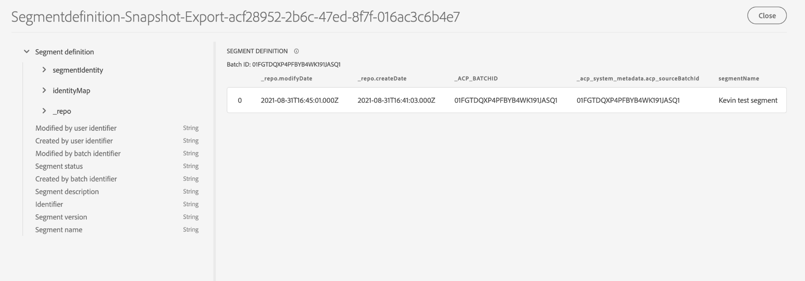

# Explore, verify, and process dashboard datasets using Query Service

Adobe Experience Platform provides important information about your organization's profile, segment, and destinations data through dashboards available within the Experience Platform UI. You can then use Adobe Experience Platform Query Service to explore, verify, and process the raw datasets powering these dashboards in the data lake.

## Getting started with Query Service 

Adobe Experience Platform Query Service supports marketers in gaining insights from their data by enabling the use of standard SQL to query data in the data lake. Query Service offers a user interface and and an API that can be used to join any dataset in the data lake and capture the query results as new datasets for use in reporting, machine learning, or for ingestion into Real-time Customer Profile. 

To learn more about Query Service and its role within Experience Platform, please begin by reading the [Query Service overview](../query-service/home.md).

## Available datasets

You can use Query Service to query raw datasets for profile, segment, and destinations dashboards. The following sections describe the raw datasets that you can find in the data lake.

### Profile attribute datasets

For every active merge policy in Real-time Customer Profile, there is a profile attribute dataset available in the data lake. 

The naming convention of these datasets is **Profile Attribute** followed by an alpha numeric value. For example: `Profile Attribute 14adf268-2a20-4dee-bee6-a6b0e34616a9`

To understand the full schema of each dataset, you can preview and explore the datasets using the dataset viewer in the Experience Platform UI.

### Segment metadata dataset

There is a segment metadata dataset available in the data lake containing metadata for each of your organization's segments.

The naming convention of this dataset is **Profile Segment Definition** followed by an alpha numeric value. For example: `Profile Segment Definition 6591ba8f-1422-499d-822a-543b2f7613a3`

To understand the full schema of the dataset, you can preview and explore the schema using the dataset viewer in the Experience Platform UI.



### Destination metadata dataset

The metadata for all of your organization's activated destinations is available as a raw dataset in the data lake.

The naming convention of this dataset is **DIM_Destination**.

To understand the full schema of the dataset, you can preview and explore the schema using the dataset viewer in the Experience Platform UI.


## Example queries

The following example queries include sample SQL that can be used in Query Service to explore, verify, and process the raw datasets that power your dashboards.

### Count of Profiles by Identity

This profile insight provides a breakdown of identities across all of the merged profiles in the dataset. The total number of profiles by identity (in other words, adding together the values shown for each namespace) may be higher than the total number of merged profiles because one profile could have multiple namespaces associated with it. For example, if a customer interacts with your brand on more than one channel, multiple namespaces will be associated with that individual customer.

**Query**

```sql
Select
        Key namespace,
        count(1) count_of_profiles
     from
        (
           Select
               explode(identitymap)
           from
              profile_attribute_14adf268-2a20-4dee-bee6-a6b0e34616a9
        )
     group by
        namespace;
```

### Count of Profiles by Segment

This audience insight provides the total number of merged profiles within each segment in the dataset. This number is the result of applying the segment merge policy to your Profile data in order to merge profile fragments together to form a single profile for each individual in the segment. 

```sql
Select          
        concat_ws('-', key, source_namespace) segment_id,
        count(1) count_of_profiles
      from
        (
            Select
              Upper(key) as source_namespace,
              explode(value)
            from
              (
                  Select
                    explode(Segmentmembership)
                  from
                    profile_attribute_14adf268-2a20-4dee-bee6-a6b0e34616a9
              )
        )
      group by
      segment_id
```

## Next steps

By reading this guide, you can now use Query Service to perform several queries to explore and process the raw datasets powering your profile, segment, and destinations dashboards. 

To learn more about each dashboard and its metrics, please select a dashboard from the list of available dashboards in the documentation navigation.
