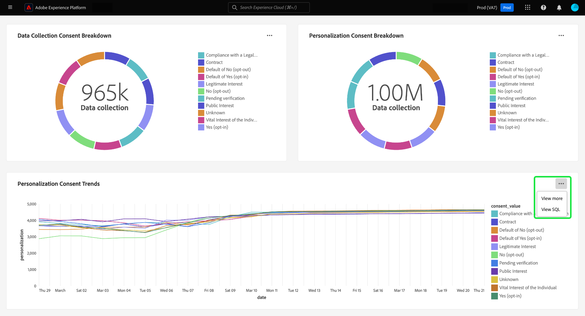
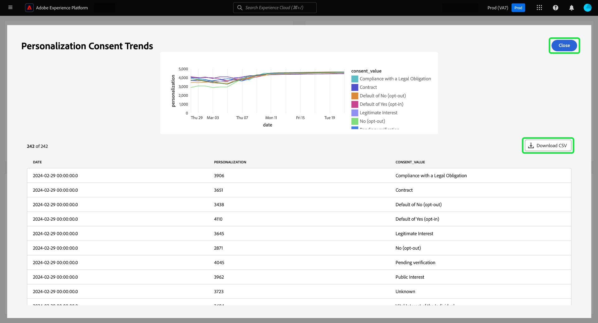
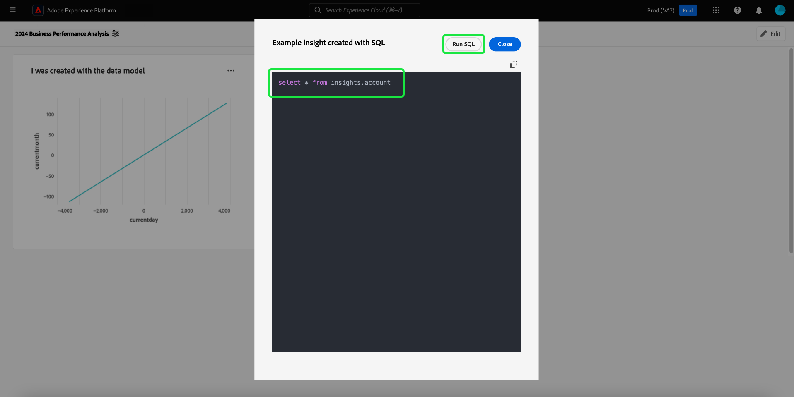
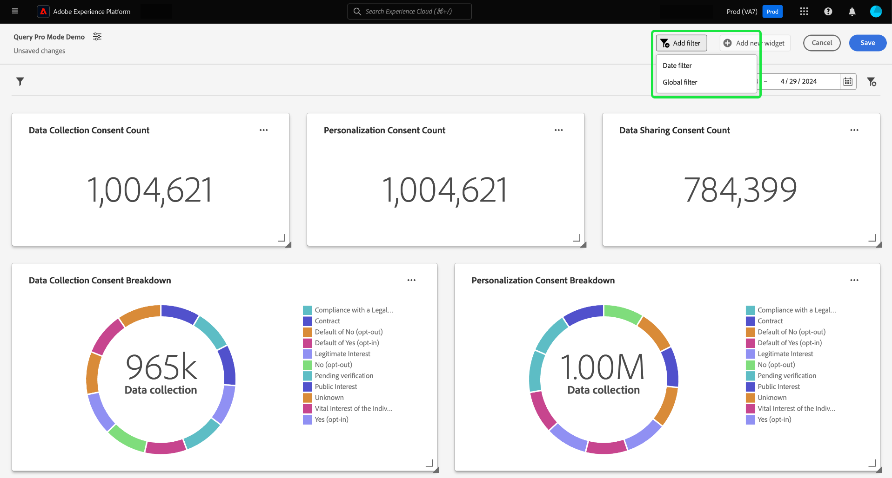
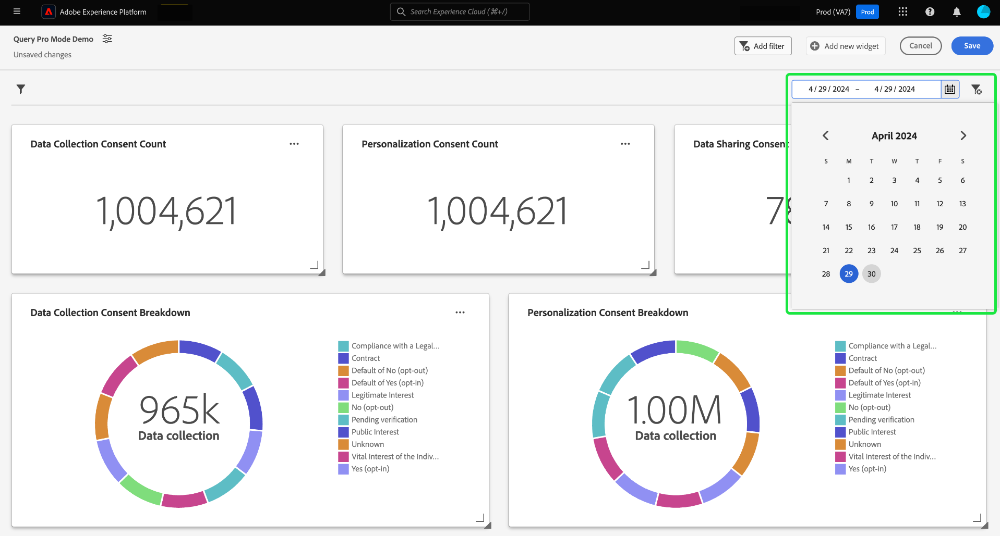

# SQL generated insights

You can use custom SQL queries to effectively extract insights from diverse structured datasets. This method of insight creation is well-suited for tables with clear relationships. It allows for a greater degree of customization within your insights and filters that can suit niche use cases. You can also do complex analysis in SQL and then retain the output of that analysis as a chart for non-technical users.

<!-- 
Technical people can use 'query pro-mode' to perform complex analysis on SQL and then share this analysis with non-technical users through this dashboard capability.
 -->

>[!IMPORTANT]
>
>Query pro-mode is only available to users who have purchased the Data Distiller SKU.

To generate insights from SQL, you must first create a dashboard.

## Create a custom dashboard {#create-custom-dashboard}

To create a custom dashboard, select **[!UICONTROL Dashboards]** from the left navigation panel to open the Dashboards workspace. Next, select **[!UICONTROL Create dashboard]**.


The **[!UICONTROL Create dashboard]** dialog appears. There are two options from which to choose your dashboard creation method. To create your insights you can either use an existing data model with the [[!UICONTROL Guided design mode]](./user-defined-dashboards.md) or your own SQL with the [!UICONTROL Query pro mode]. 

<!-- Maybe reference Guided design mode in other places on UDD doc. -->

Using an existing data model has the benefits of providing a structured, efficient, and scalable framework tailored to your specific business needs. To learn how to [create insights from an existing data model](./user-defined-dashboards.md#create-widget), refer to the custom dashboard guide.

Insights generated from SQL queries offer far greater flexibility and customization. Technical people can use 'query pro-mode' to perform complex analysis on SQL and then share this analysis with non-technical users through this dashboard capability. Select **[!UICONTROL Query pro mode]** followed by **[!UICONTROL Save]**.

>[!NOTE]
>
>Once you make a selection, you cannot change this selection within that dashboard. Instead, create a new dashboard that uses a different insight creation method.

![The [!UICONTROL Create dashboard] dialog with Query pro mode and Save highlighted.](./images/user-defined-dashboards/sql-workflow/query-pro-mode.png)

<!-- Above is overview -->
<!-- Seperate below into a new doc -->

## Query pro-mode {#query-pro-mode}

>[!NOTE]
>
>Query pro-mode is only available to users who have purchased the Data Distiller SKU. The [[!UICONTROL Guided design mode]](./user-defined-dashboards.md) is available to all users to create insights from an existing data model.

The **[!UICONTROL Enter SQL]** dialog appears. Select a database (insights data model) to query from the dropdown menu, and input a suitable query for your dataset in the Query Editor.

See the [Query Editor user guide](../query-service/ui/user-guide.md#query-authoring) for information on its UI elements.

>[!TIP]
>
>If your query uses query parameters, run the query once to pre-populate all the query parameter keys used. The UI automatically displays the Query parameters tab. Add the appropriate values for your keys.

![The [!UICONTROL Enter SQL] dialog with the dataset dropdown menu and run icon highlighted, The dialog has a populated SQL query and the query parameters tab displayed.](./images/user-defined-dashboards/sql-workflow/enter-sql-database-dropdown.png)

To execute your query, select the run icon (). The Query Editor displays the results tab. Next, to confirm your configuration and open the widget composer, select **[!UICONTROL Select]**. 

<!-- Screenshot below was taken from a screengrab -->

![The [!UICONTROL Enter SQL] dialog with SQL input, the results tab displayed, and Select highlighted.](./images/user-defined-dashboards/sql-workflow/enter-sql-select.png)

## Populate widget {#populate-widget}
 
The widget composer is now populated with the columns from the executed SQL. The type of dashboard is indicated in the top left, in this case it is [!UICONTROL Manual SQL Entry]. Select the pencil icon () to edit the SQL at any point. 

>[!TIP]
>
>The available attributes are columns taken from the executed SQL.

To create your widget, use the attributes listed in the [!UICONTROL Attributes] column. You can use the search bar to look for attributes or scroll the list.


### Add attributes {#add-attributes}

To add an attribute to your widget, select the plus icon () next to an attribute name. The dropdown menu that appears allows you to add an attribute to the chart from the options determined by your SQL. Different chart types have different options, such as an X and Y axis dropdown.

In this donut chart example, the options are size and color. Color breaks down the donut chart results, and the size is the actual metric used. Add an attribute to the [!UICONTROL Color] field to split the results into different colors based on their composition of that attribute.

>[!TIP]
>
>Select the up and down arrow icon () to switch the arrangement of the X and Y axis on bar or line charts.


To change the type of graph or chart of your widget, select from the available options of the [!UICONTROL Marks] dropdown. The options include [!UICONTROL Line], [!UICONTROL Donut], [!UICONTROL Big number], and [!UICONTROL Bar]. Once selected, a preview visualization of your widget's current settings is generated.


## Widget properties {#properties}

Select the properties icon () in the right rail to open the properties panel. In the [!UICONTROL Properties] panel, enter a name for the widget in the **[!UICONTROL Widget title]** text field. You can also rename various aspects of your chart. 

>[!NOTE]
>
>The specific fields available in the properties sidebar vary depending on the chart type you are editing.


## Save your widget {#save-widget}

Saving in the widget composer saves the widget locally to your dashboard. If you wish to save your work and resume later, select **[!UICONTROL Save]**. A tick icon underneath the widget name indicates that the widget has been saved. Alternatively, when you are satisfied with your widget, select **[!UICONTROL Save and close]** to make the widget available to all other users with access to your dashboard. Select Cancel to abandon your work and return to your custom dashboard.


<!-- Split these into new docs. Seperate View more and View SQL  -->

### View more {#view-more}

For every chart authored using the query Pro mode through SQL, you can compare the chart with the tabular version of the same chart. You can also download the table version as a CSV file. 

>[!NOTE]
>
>The CSV download is limited ot the first 500 records.

From your custom dashboard, select the ellipses (`...`) on any widget to access the [!UICONTROL View more] and [!UICONTROL View SQL] options.



The [!UICONTROL View more] feature displays the specific data points for the chart in tabular form. From this dialog, you can download the processed data in CSV format. Select **[!UICONTROL Download CSV]** to download your data.



### View SQL {#view-sql}

From your custom dashboard, select the ellipses (`...`) on any widget to access the [!UICONTROL View more] and [!UICONTROL View SQL] options.


To view the SQL behind your customized insights, select the **[!UICONTROL View SQL]** option. The dialog is titled with the name of the insight. From this view, you can copy the SQL to your clipboard to use as a base in a future query, or open the SQL directly in the query pro mode editor. Select **[!UICONTROL Run SQL]** to open the query pro mode. 



Select **[!UICONTROL Close]** to close the dialog.


<!-- Split above into two docs -->

## Edit your dashboard and insights {#edit}

Select **[!UICONTROL Edit]** to edit your entire dashboard or any of your insights. From the edit mode, you can resize widgets, edit your SQL, or create and apply global and temporal filters. These filters constrain the data displayed in your dashboard widgets. It is a convenient way to quickly update and fine-tune your insights for different use cases.


Select **[!UICONTROL Add filter]** to create either a [[!UICONTROL Date filter]](#create-date-filter) or a [[!UICONTROL Global filter]](#create-global-filter). Once created, all global and date filters are available from [the filter icon](#select-global-filter) () of your dashboard.



### Create a date filter {#create-date-filter}

To filter your insights by date, you must add parameters to your SQL queries that can accept time constraints. This is done as part of the query pro-mode insight creation workflow. See the [query pro-mode documentation](#query-pro-mode) to learn how to enter SQL for your insights.

Query parameters allow you to work with dynamic data as they act as placeholders for the values you add at execution time. These placeholder values can be updated through the UI and enable less technical users to update the insights based on date ranges.   

If you are unfamiliar with query parameters, see the documentation for [guidance on how to implement parameterized queries](../query-service/ui/parameterized-queries.md).

#### Apply a global date filter to your dashboard {#apply-global-date-filter}

To apply a global date filter, first select **[!UICONTROL Add filter]** from your dashboard view, then **[!UICONTROL Date Filter]** from the dropdown menu. 


The calander view appears. Next, select a start date and an end date to create a custom date filter.

>[!IMPORTANT]
>
>Simply adding a date filter will not make the charts change. You must edit each of your insights to include your chosen start and end date.



Once you have selected a date range from your dashboard, insights that have date parameters in their SQL will see the date filter options in the widget composer. 

>[!NOTE]
>
>Selecting a date range on your dashboard displays the toggles for date filters as part of the insight creation workflow. 

### Edit your SQL to include date parameters {#include-date-parameters} 

If you have not yet incorporated date parameters in your SQL, edit you insights to include these parameters. See the documentation for instructions on how to [edit an insight](#edit).

>[!TIP]
>
>You are reccommended to add `$START_DATE` and `$END_DATE` parameters to your SQL statement in each of the charts that you want to enable date filters.

The example SQL statement below demonstrates how to incorporate `$START_DATE` and `$END_DATE` parameters.

```sql
SELECT Sum(personalization_consent_count) AS Personalization,
       Sum(datacollection_consent_count)  AS Datacollection,
       Sum(datasharing_consent_count)     AS Datasharing
FROM   fact_daily_consent_aggregates f
       INNER JOIN dim_consent_valued
               ON f.consent_value_id = d.consent_value_id
WHERE  f.date BETWEEN Upper(Coalesce(Cast('$START_DATE' AS date), '')) AND Upper
                      (
                             Coalesce(Cast('$END_DATE' AS date), ''))
       AND ( ( Upper(Coalesce($consent_value_filter, '')) IN ( '', 'NULL' ) )
              OR ( f.consent_value_id IN ( $consent_value_filter ) ) )
LIMIT  0; 
```

The screenshot below highlights the time constraints incorporated in the SQL statement and the query parameter key value pairs.

>[!NOTE]
>
>A value must be included for each parameter on the first run of a query that uses parameters. The value can be NULL.

![The [!UICONTROL Enter SQL] dialog with the date parameters highlighted in the SQL.](./images/user-defined-dashboards/sql-workflow/sql-date-parameters.png)

#### Enable date parameters in each insight {#enable-date-parameters}

Once you have incorporated the appropriate parameters to your insights' SQL, the `Start_date` and `End_date` variables are now available as a toggles in the widget composer. See the [query pro-mode widget population section](#populate-widget) for info on how to edit an insight. 
<!-- ... -->
From the widget composer, select toggles to enable the `Start_date` and `End_date` parameters.


Next, select the appropriate parameters from the dropdown menus.


Finally, select **[!UICONTROL Save and close]** to return to your dashboard. Date filters are now enabled for all insights that have start and end date parameters.

#### Delete a date filter {#delete-date-filter}

To remove your date filter select the delete filter icon (). 

>[!NOTE]
>
>If no date filter is applied to your insight, the default system behaviour analyzes your data over the past year up to the current calendar day.


### Create a global filter {#create-global-filter}

To apply a global filter, first select **[!UICONTROL Add filter]** from your dashboard view, then **[!UICONTROL Global filter]** from the dropdown menu. 


Global filters affect the data of all widgets in your dashboard. You can quickly change the insights provided by your SQL with customized global filters.

The [!UICONTROL Create a global filter] dialog opens. Creating a global filter follows the same process as creating an insight with SQL. First, select a database (insights data model) to query, then input your custom SQL in the Query Editor, and finally select the run icon (). 

>[IMPORTANT]
>
>You must include an ID and a value when you create a global filter.

After successfully running the query, the results tab displays the results. Select **[!UICONTROL Next]**.

![The [!UICONTROL Create a global filter dialog] with the dataset dropdown menu, the run icon and Next highlighted.](./images/user-defined-dashboards/sql-workflow/global-filter.png)

The final step of the global filter creation workflow requires you to add a label for your filter. Add a label to the **[!UICONTROL Filter label]** text field and select a filter type from the dropdown box. 

>[!NOTE]
>
>The options available are dependent on the dataset and SQL that you use. 

Finally, select **[!UICONTROL Select]** to return to your dashboard view.

![The [!UICONTROL Create a global filter dialog] with Select and the Filter label text input highlighted.](./images/user-defined-dashboards/sql-workflow/global-filter-label.png)

### Enable the global filter for each insight {#Enable-global-filter}

After creating your global filter for your dashboard, the toggle for that global filter becomes available as part of the widget composer.


>[!IMPORTANT]
>
>Ensure that the global filter parameter is included in the SQL of each insight.

### Select a global filter {#select-global-filter}

To open the [!UICONTROL Filters] dialog that lists all of your custom filters, select the filter icon () on the left of your dashboard. Next, to apply the effects on your dashboard insights, choose an option from the dropdown menu of your global filter then select **[!UICONTROL Apply]**.


## Edit, duplicate, or delete an insight

See the Custom Dashboard guide for instructions on how to [edit, duplicate, or delete an existing widget](./user-defined-dashboards.md#duplicate).

