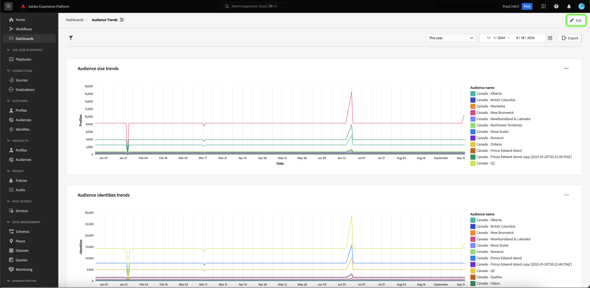
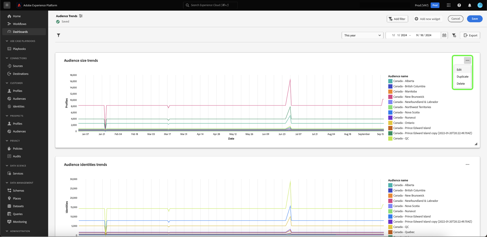
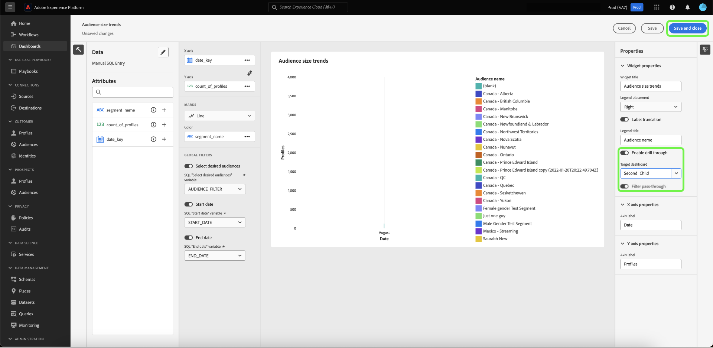
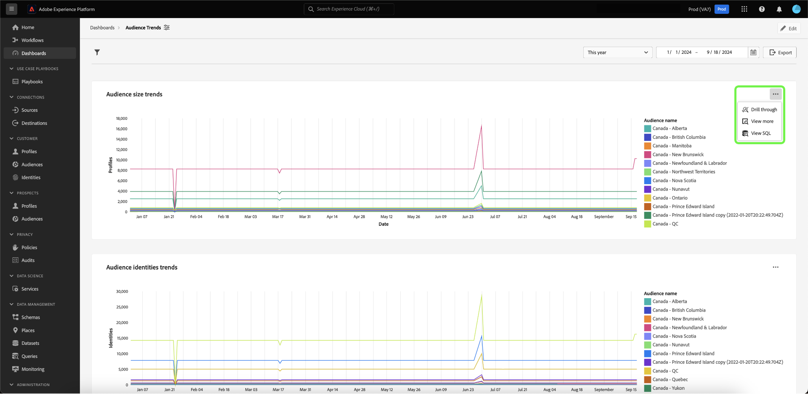
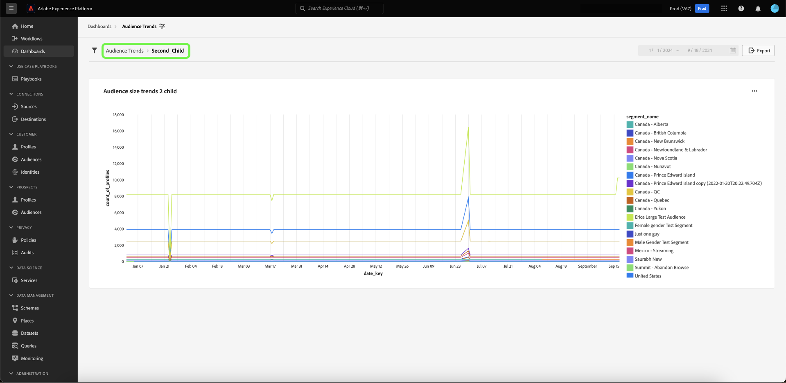

# Drill through {#drill-through}

Drill throughs facilitate multi-layered data analysis by making it simple to navigate from any chart to a new dashboard. This feature makes it easy to transition from high-level overviews to in-depth reports when studying trends, customer behavior, operational indicators, and more, ensuring that you always have the context you need.

The system ensures that the analysis you begin is seamlessly continued throughout the full drill through experience by automatically passing global filters and date range filters from the source dashboards to the target dashboards. For ease of navigation between various layers of the study, the system allows multi-level drill throughs.

## Create a drill through {#create-drill-through}

To create a drill through, first select **[!UICONTROL Edit]** from your dashboard view.

Select the ellipsis in the chart that you want to drill through, then select **[!UICONTROL Edit]**.

In the [!UICONTROL Properties] panel use the toggle to enable **[!UICONTROL Enable drill through]**, then use the drop down to select the **[!UICONTROL Target dashboard]**. Ensure the toggle for **[!UICONTROL Filter pass-through]** is enabled, then select **[!UICONTROL Save and close]**.

>[!INFO]
>
>Repeat the steps highlighted above for the target dashboard to set up a multi-level drill through.

## View a drill through {#view-drill-through}

To view a drill through, select ellipsis in the chart from your dashboard view, then select **[!UICONTROL Drill through]**.

The drill through target dashboard is displayed. You can repeat this step if you have multi-level drill throughs.

>[!NOTE]
>
>Any filters applied in the source dashboard are passed to the target dashboard. However, date filters and global filters are disabled on child dashboards.

## Remove a drill through {#remove-drill-through}

To remove a drill through, first select **[!UICONTROL Edit]** from your dashboard view.

Select the ellipsis in the chart that you want to remove a drill through, then select **[!UICONTROL Edit]**.

In the [!UICONTROL Properties] panel, select the toggle to disable **[!UICONTROL Enable drill through]**, then select **[!UICONTROL Save and close]**.

![Chart properties panel with the toggle disabled for [!UICONTROL Enable drill through] highlighted.](../images/sql-insights-query-pro-mode/drill-through-disable.png)

## Next steps

After reading this document, you now know how to create a drill through for your dashboard. You can also learn how to generate charts from existing data models in the Adobe Experience Platform UI with the [guided design mode guide](../standard-dashboards.md).
