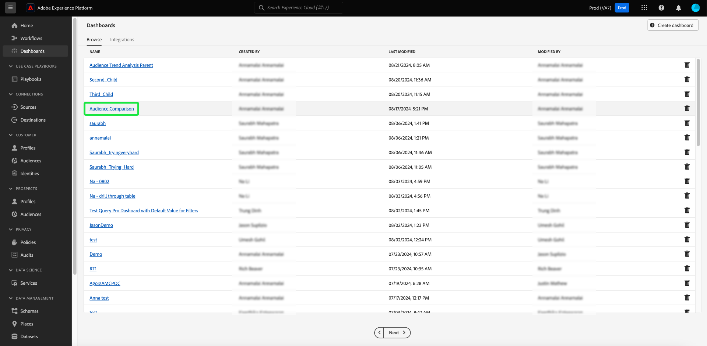
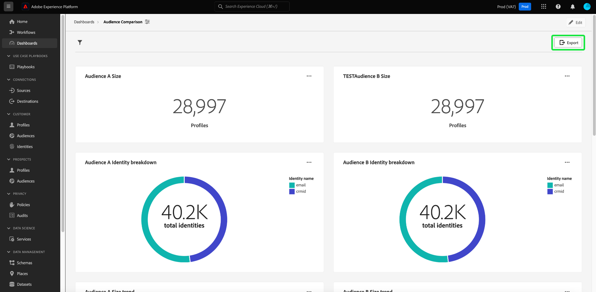
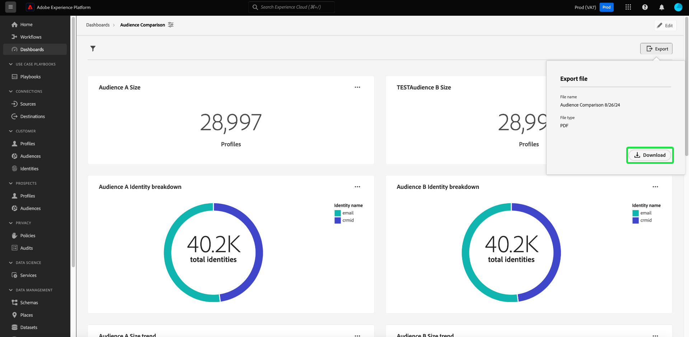
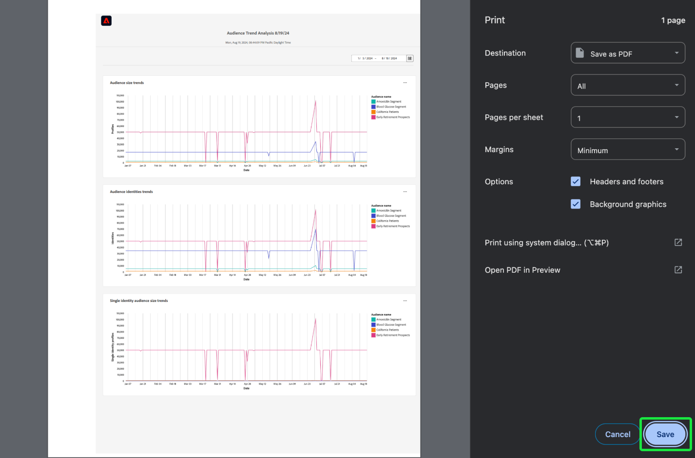

# Export PDF {#export-pdf}

Once you have created a [custom insight](./overview.md) with [query pro mode](./overview.md#query-pro-mode), you can export your chart data in PDF format. This action is taken from your custom dashboard overview. 

From the dashboards workspace, select a custom dashboard from the inventory listed in the [!UICONTROL Browse] tab.

You custom dashboard appears. Next, select **[!UICONTROL Export]** from the top right of the UI.

>[!NOTE]
>
>Visualization-only exports do not require the [!UICONTROL Export Dashboard Data] permission. See the [[!UICONTROL View more] documentation](./view-more.md#export) for more details.

The **[!UICONTROL Export file]** dialog appears. Finally, select **[!UICONTROL Download]**

The PDF preview appears. Select **[!UICONTROL Save]** to complete the process.

