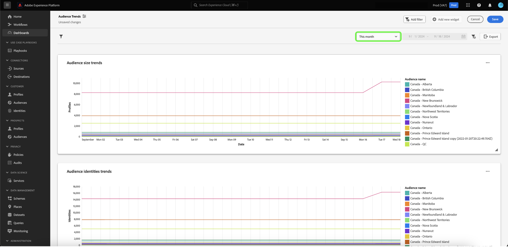
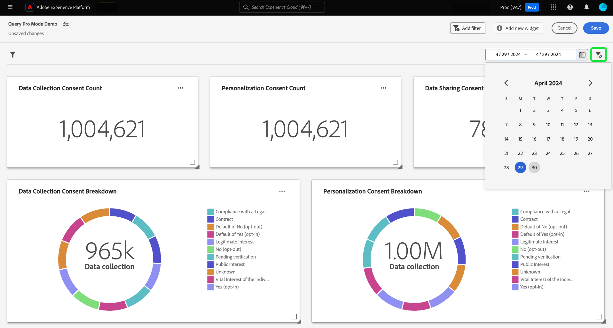

# Create a date filter {#create-date-filter}

To filter your insights by date, you must add parameters to your SQL queries that can accept date constraints. This is done as part of the query pro mode insight creation workflow. See the [query pro mode documentation](../overview.md#query-pro-mode) to learn how to enter SQL for your insights.

Query parameters allow you to work with dynamic data as they act as placeholders for the values you add at execution time. These placeholder values can be updated through the UI and enable less technical users to update the insights based on date ranges.   

If you are unfamiliar with query parameters, see the documentation for [guidance on how to implement parameterized queries](../../../query-service/ui/parameterized-queries.md).

## Apply a date filter to your dashboard {#apply-date-filter}

To apply a date filter, select **[!UICONTROL Add filter]**, then **[!UICONTROL Date Filter]** from the dropdown menu of your dashboard view. 


You are presented with the following date filtering options.

| Filter | Description |
| --- | --- |
| No custom date | Select one or more custom dates from multiple preset values. |
| Custom date range | Select one or more custom dates from multiple preset values, or specify a custom date range. |
| Custom date | Select from the prest values or specify the start date for your dashboard.|


### Create a no custom date filter

To apply a predefined date filter, select **[!UICONTROL No custom date]**, then select the predefined date options you want to include. Finally, use the dropdown to select the default date range, then select **[!UICONTROL Save]**.


You are returned to the dashboard, which shows the default date range you previously selected. Use the dropdown menu to select another preset date range.



### Create a custom date range filter

To apply a custom date range filter, select **[!UICONTROL Custom date range]**, then select the predefined date options you want to include. Finally, select **[!UICONTROL Custom]** to set the default date range. Use the calendar to specify a date range, then select **[!UICONTROL Save]**.

>[!NOTE]
>
>It is not necessary to select predefined date options.


You are returned to the dashboard, which shows the custom data range you previously specified. Use the dropdown menu to select another preset date range.


### Create a custom date filter

To apply a custom date filter, select **[!UICONTROL Custom date]**, and select the predefined date options you want to include. Finally, select **[!UICONTROL Custom]**, then use the calendar to select a start date. Finally, select **[!UICONTROL Save]**.

>[!NOTE]
>
>It is not necessary to select predefined date options.


You are returned to the dashboard, which shows the custom data you previously specified. Use the dropdown menu to select another date.


## Delete a date filter {#delete-date-filter}

To remove your date filter select the delete filter icon (). 



## Edit your SQL to include date query parameters {#include-date-parameters} 

Next, ensure your SQL includes query parameters to allow for a date range. If you have not yet incorporated query parameters in your SQL, edit your insights to include these parameters. See the documentation for instructions on how to [edit an insight](../overview.md#edit).

>[!TIP]
>
>You are reccommended to add `$START_DATE` and `$END_DATE` parameters to your SQL statement in each of the charts that you want to enable date filters for.

>[!NOTE]
>
>Date filters do not support time constraints. The filter only applies to date ranges. This means that if you have multiple reports within a 24-hour period, you cannot distinguish between different hours within the same day. For this reason, you are reccommended to cast the time component as a date. 

If the data model or tables you are analyzing have a time component, you can group your data by date and then apply these date filters.

The example SQL statement below demonstrates how to incorporate `$START_DATE` and `$END_DATE` parameters and uses `cast` to frame the time component as a date.

```sql
SELECT Sum(personalization_consent_count) AS Personalization,
       Sum(datacollection_consent_count)  AS Datacollection,
       Sum(datasharing_consent_count)     AS Datasharing
FROM   fact_daily_consent_aggregates f
       INNER JOIN dim_consent_valued
               ON f.consent_value_id = d.consent_value_id
WHERE  f.date BETWEEN Upper(Coalesce(Cast('$START_DATE' AS date), '')) AND Upper
                      (
                             Coalesce(Cast('$END_DATE' AS date), ''))
       AND ( ( Upper(Coalesce($consent_value_filter, '')) IN ( '', 'NULL' ) )
              OR ( f.consent_value_id IN ( $consent_value_filter ) ) )
LIMIT  0; 
```

The screenshot below highlights the date constraints incorporated in the SQL statement and the query parameter key value pairs.

>[!NOTE]
>
>When composing your statement in query pro mode, you must provide sample values for each parameter in order to execute the SQL statement and build the chart. The sample values you provide when composing your statement are replaced by the actual values you select for the date (or global) filter at runtime.

![The [!UICONTROL Enter SQL] dialog with the date parameters highlighted in the SQL.](../../images/sql-insights-query-pro-mode/sql-date-parameters.png)

## Enable date parameters in each insight {#enable-date-parameters}

Once you have incorporated the appropriate parameters to your insights' SQL, the `Start_date` and `End_date` variables are now available as a toggles in the widget composer. See the [query pro mode widget population section](../overview.md#populate-widget) for info on how to edit an insight. 

From the widget composer, select toggles to enable the `Start_date` and `End_date` parameters.


Next, select the appropriate query parameters from the dropdown menus.


Finally, select **[!UICONTROL Save and close]** to return to your dashboard. Date filters are now enabled for all insights that have start and end date parameters.
