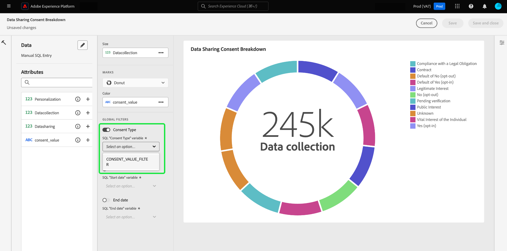
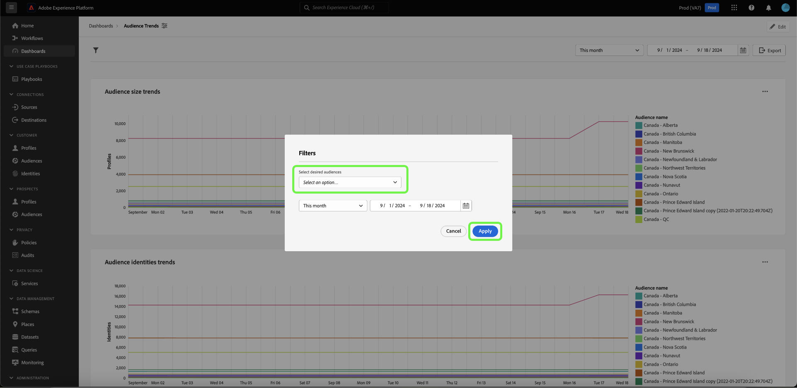
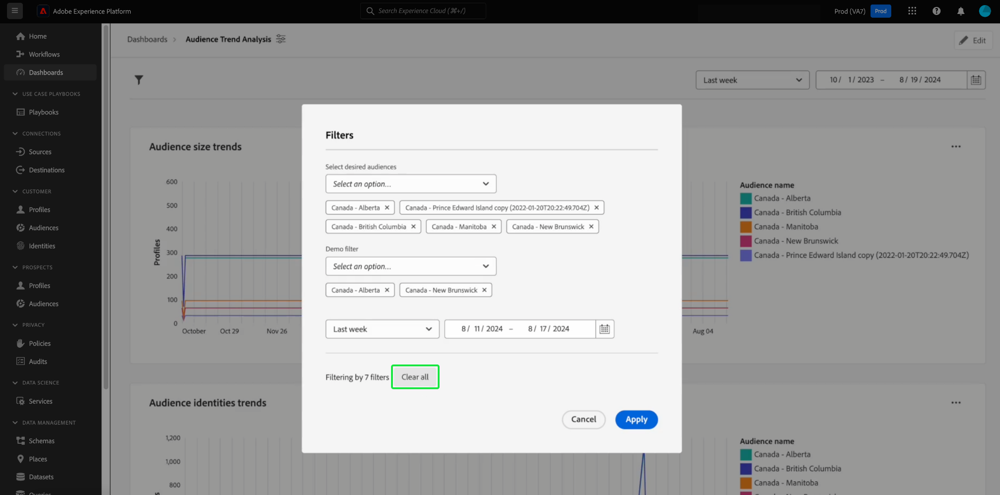

# Create a global filter {#create-global-filter}

To create a global filter, first select **[!UICONTROL Add filter]** from your dashboard view, then **[!UICONTROL Global filter]** from the dropdown menu. 

>[!IMPORTANT]
>
>Ensure you map your global filters to all your charts. This is not an automatic process. To use a global filter, you must include a [query parameter](../../../query-service/ui/parameterized-queries.md) in the SQL of your chart, [enable the global filter](#enable-global-filter) in the widget composer, and [select a runtime value](#select-global-filter) for the parameter in the global filter dialog. See the query pro guide to learn how to edit your SQL if you need to incorporate a query parameter.

You can quickly change the insights provided by your SQL with customized global filters.

The [!UICONTROL Create a global filter] dialog opens. Creating a global filter follows the same process as creating an insight with SQL. First, select a database (insights data model) to query, then input your custom SQL in the Query Editor, and finally select the run icon (). 

>[!IMPORTANT]
>
>You must include an ID and a value when you create a global filter. The sample values allow you to execute the SQL statement and build the chart. Note that the sample values you provide when composing your statement are replaced by the actual values you select for the date or global filter at runtime. 

After successfully running the query, the results tab displays the results. Select **[!UICONTROL Next]**.

![The [!UICONTROL Create a global filter dialog] with the dataset dropdown menu, the run icon and Next highlighted.](../../images/sql-insights-query-pro-mode/global-filter.png)

The final step of the global filter creation workflow requires you to add a label for your filter. Add a label to the **[!UICONTROL Filter label]** text field and select a filter type from the dropdown box. 

>[!NOTE]
>
>Only the [!UICONTROL Combo box] filter type option is currently supported. 

Finally, select **[!UICONTROL Select]** to return to your dashboard view.

![The [!UICONTROL Create a global filter dialog] with Select and the Filter label text input highlighted.](../../images/sql-insights-query-pro-mode/global-filter-label.png)

## Enable the global filter for each insight {#enable-global-filter}

>[!TIP]
>
>Enable the global filters in every chart you create. This ensures that the values you choose as a global filter to reflect in all of your charts.

After creating your global filter for your dashboard, the toggle for that global filter becomes available as part of the widget composer.

>[!IMPORTANT]
>
>Ensure that the global filter parameter is included in the SQL of each insight.

## Select a global filter {#select-global-filter}

To open the [!UICONTROL Filters] dialog that lists all of your custom filters, select the filter icon () on the left of your dashboard. Next, to apply the effects on your dashboard insights, choose an option from the dropdown menu of your global filter then select **[!UICONTROL Apply]**.

## Clear global filter {#clear-global-filter}

To clear all of your custom global filters, select **[!UICONTROL Clear all]** from the [!UICONTROL Filters] dialog.

