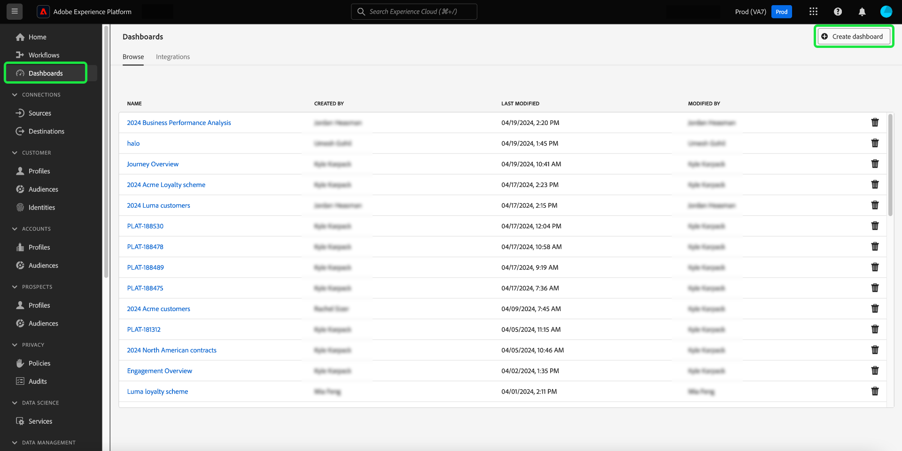
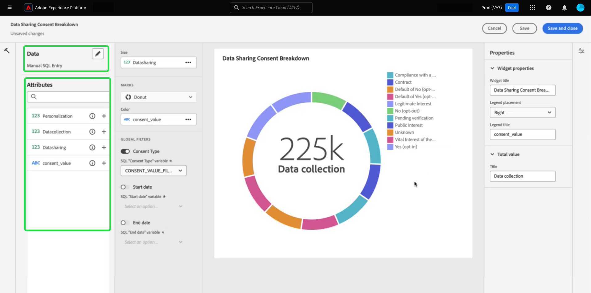
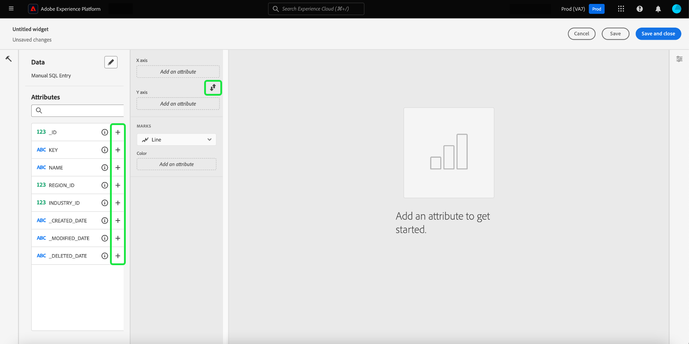
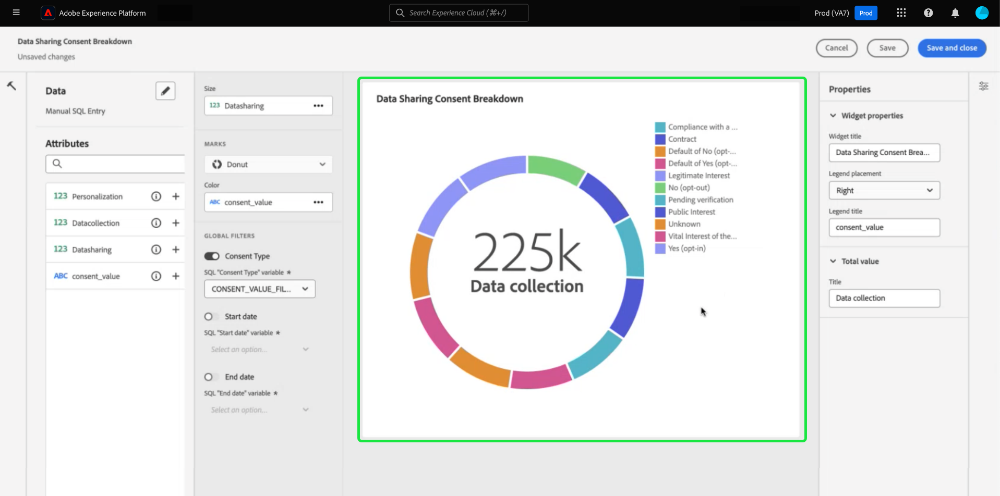
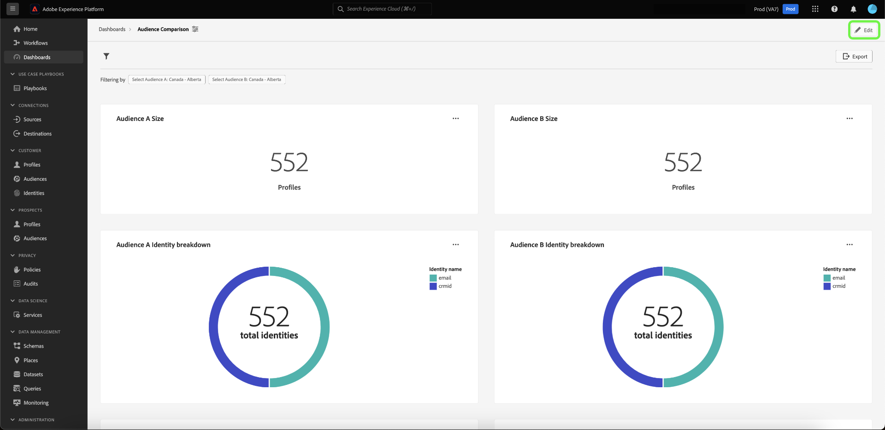
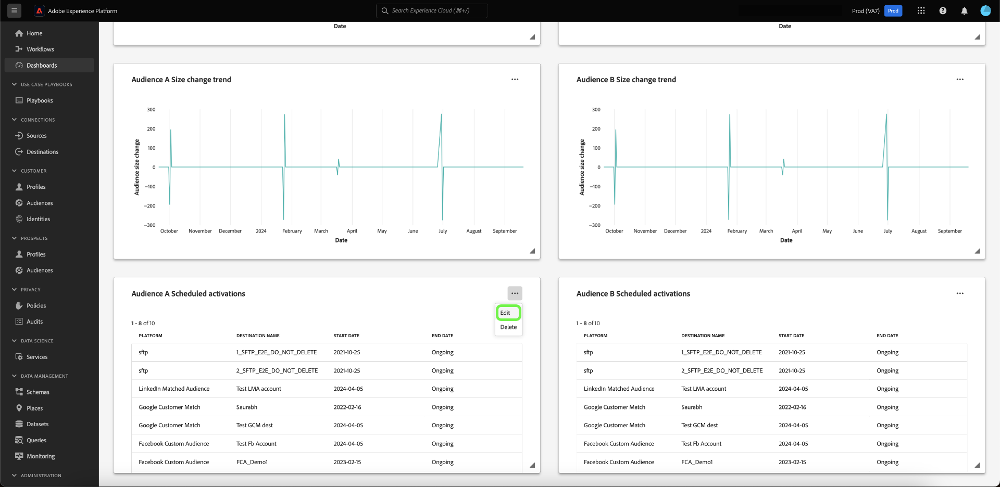
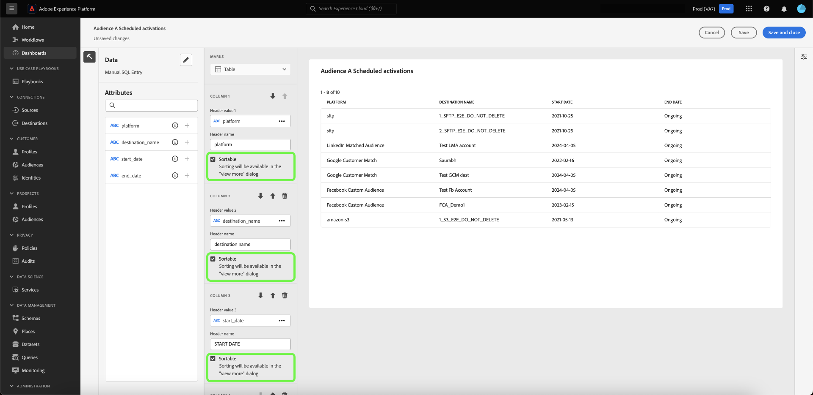
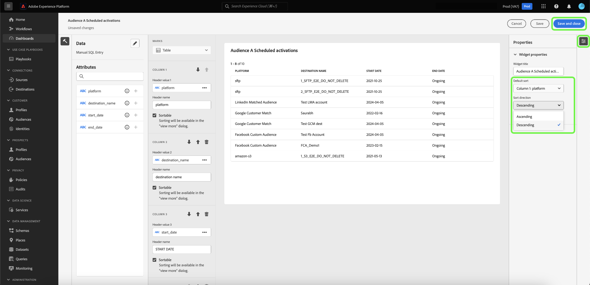
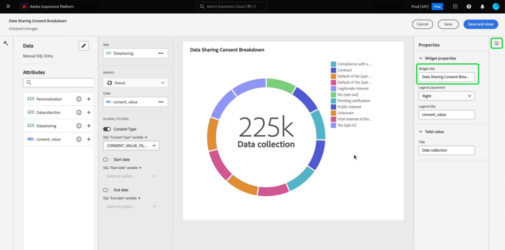

# SQL Insights for extended app reporting

Use custom SQL queries to effectively extract insights from diverse structured datasets. Technical people can use query pro mode to perform complex analysis with SQL and then share this analysis with non-technical users through charts on your custom dashboard or export them in CSV files. This method of insight creation is well-suited for tables with clear relationships and allows for a greater degree of customization within your insights and filters that can suit niche use cases. 

>[!IMPORTANT]
>
>Query pro mode is only available to users who have purchased the [Data Distiller SKU](../../query-service/data-distiller/overview.md).

To generate insights from SQL, you must first create a dashboard.

## Create a custom dashboard {#create-custom-dashboard}

To create a custom dashboard, select **[!UICONTROL Dashboards]** from the left navigation panel to open the Dashboards workspace. Next, select **[!UICONTROL Create dashboard]**.

The **[!UICONTROL Create dashboard]** dialog appears. There are two options from which to choose your dashboard creation method. To create your insights you can either use an existing data model with the [[!UICONTROL Guided design mode]](../standard-dashboards.md) or your own SQL with the [!UICONTROL Query pro mode]. 

<!-- Maybe reference Guided design mode in other places on UDD doc. -->

Using an existing data model has the benefits of providing a structured, efficient, and scalable framework tailored to your specific business needs. To learn how to [create insights from an existing data model](../standard-dashboards.md#create-widget), refer to the custom dashboard guide.

Insights generated from SQL queries offer far greater flexibility and customization. Technical people can use query pro mode to perform complex analysis on SQL and then share this analysis with non-technical users through this dashboard capability. Select **[!UICONTROL Query pro mode]** followed by **[!UICONTROL Save]**.

>[!NOTE]
>
>Once you make a selection, you cannot change this selection within that dashboard. Instead, you must create a new dashboard with a different dashboard creation method.

![The [!UICONTROL Create dashboard] dialog with Query pro mode and Save highlighted.](../images/sql-insights-query-pro-mode/query-pro-mode.png)

## Query pro mode overview {#query-pro-mode}

Query pro mode is an SQL editor-based workflow that guides you through the process of generating insights with custom SQL queries in the Adobe Experience Platform UI. Before you can generate insights with custom SQL queries, you must first create a dashboard. 

## Compose SQL {#compose-sql}

Once you have chosen to create a dashboard with query pro mode, the **[!UICONTROL Enter SQL]** dialog appears. Select a database (insights data model) to query from the dropdown menu, and input a suitable query for your dataset in the query pro editor.

>[!NOTE]
>
>Query pro mode is only available to users who have purchased the Data Distiller SKU. The [[!UICONTROL Guided design mode]](../standard-dashboards.md) is available to all users to create insights from an existing data model.

See the [Query Editor user guide](../../query-service/ui/user-guide.md#query-authoring) for information on its UI elements.

![The [!UICONTROL Enter SQL] dialog with the dataset dropdown menu and run icon highlighted, The dialog has a populated SQL query and the query parameters tab displayed.](../images/sql-insights-query-pro-mode/enter-sql-database-dropdown.png)

### Query parameters {#query-parameters}

To include [global](./filters/global-filter.md) or [date filters](./filters/date-filter.md) your query **must** use query parameters. When composing your statement in query pro mode, you must provide sample values if your query uses query parameters. The sample values allow you to execute the SQL statement and build the chart. Note that the sample values you provide when composing your statement are replaced by the actual values you select for the date or global filter at runtime. 

>[!IMPORTANT]
>
>If you want to use a global filter, you must place a query parameter in your SQL and then link that query parameter to the global filter in the widget composer. In the screenshot below, `CONSENT_VALUE_FILTER` is used in the SQL as a query parameter for a global filter. See the [global filter documentation](./filters/global-filter.md#enable-global-filter) for more information on how to do this. 

To execute your query, select the run icon (). The Query Editor displays the results tab. Next, to confirm your configuration and open the widget composer, select **[!UICONTROL Select]**. 

>[!TIP]
>
>If your query uses query parameters, run the query once to pre-populate all the query parameter keys used. The query will fail but the UI automatically displays the Query parameters tab and lists all included keys. Add the appropriate values for your keys.

![The [!UICONTROL Enter SQL] dialog with SQL input, the results tab displayed, and Select highlighted.](../images/sql-insights-query-pro-mode/enter-sql-select.png)

## Populate widget {#populate-widget}
 
The widget composer is now populated with the columns from the executed SQL. The type of dashboard is indicated in the top left, in this case it is [!UICONTROL Manual SQL Entry]. Select the pencil icon () to edit the SQL at any point. 

>[!TIP]
>
>The available attributes are columns taken from the executed SQL.

To create your widget, use the attributes listed in the [!UICONTROL Attributes] column. You can use the search bar to look for attributes or scroll the list.

### Add attributes {#add-attributes}

To add an attribute to your widget, select the plus icon () next to an attribute name. The dropdown menu that appears allows you to add an attribute to the chart from the options determined by your SQL. Different chart types have different options, such as an X and Y axis dropdown.

In this donut chart example, the options are size and color. Color breaks down the donut chart results, and the size is the actual metric used. Add an attribute to the [!UICONTROL Color] field to split the results into different colors based on their composition of that attribute.

>[!TIP]
>
>Select the up and down arrow icon () to switch the arrangement of the X and Y axis on bar or line charts.

To change the type of graph or chart of your widget, select from the available options of the [!UICONTROL Marks] dropdown. The options include [!UICONTROL Line], [!UICONTROL Donut], [!UICONTROL Big number], and [!UICONTROL Bar]. Once selected, a preview visualization of your widget's current settings is generated.

## Advanced table attributes {#advanced-attributes}

To apply automatic sorting capabilities for any or all columns in your tables, select **[!UICONTROL Edit]** to edit your entire dashboard.

Select the ellipsis (`...`) in the table chart where you want to add column sorting, then select **[!UICONTROL Edit]**.

To enable sorting for any column, check the **[!UICONTROL Sortable]** boxes.

Select the properties icon () in the right rail to open the [!UICONTROL Properties] panel. In the **[!UICONTROL Properties]** panel, use the drop down to select the **[!UICONTROL Default sort]** column, then use the drop down to select the **[!UICONTROL Sort direction]**. Finally, select **[!UICONTROL Save and close]**.

To learn more about using the sort, resizing columns, and pagination features, refer to [View more](./view-more.md).

## Widget properties {#properties}

Select the properties icon () in the right rail to open the properties panel. In the [!UICONTROL Properties] panel, enter a name for the widget in the **[!UICONTROL Widget title]** text field. You can also rename various aspects of your chart. 

>[!NOTE]
>
>The specific fields available in the properties sidebar vary depending on the chart type you are editing.

## Save your widget {#save-widget}

Saving in the widget composer saves the widget locally to your dashboard. If you wish to save your work and resume later, select **[!UICONTROL Save]**. A tick icon underneath the widget name indicates that the widget has been saved. Alternatively, when you are satisfied with your widget, select **[!UICONTROL Save and close]** to make the widget available to all other users with access to your dashboard. Select Cancel to abandon your work and return to your custom dashboard.

## Edit your dashboard and charts {#edit}

Select **[!UICONTROL Edit]** to edit your entire dashboard or any of your insights. From the edit mode, you can resize widgets, edit your SQL, or create and apply global and temporal filters. These filters constrain the data displayed in your dashboard widgets. It is a convenient way to quickly update and fine-tune your insights for different use cases.

Select **[!UICONTROL Add filter]** to create either a [[!UICONTROL Date filter]](#create-date-filter) or a [[!UICONTROL Global filter]](#create-global-filter). Once created, all global and date filters are available from [the filter icon](#select-global-filter) () of your dashboard.

## Edit, duplicate, or delete an insight

See the Custom Dashboard guide for instructions on how to [edit, duplicate, or delete an existing widget](../standard-dashboards.md#duplicate).

## Next steps

After reading this document, you now know how write SQL queries in the Adobe Experience Platform UI to generate charts for your custom dashboards. Next, you should learn how to further enrich yourt data by [creating a date filter](./filters/date-filter.md), or [creating a global filter](./filters/global-filter.md).

You can also learn more about other Customized Insights features including [the different viewing options for you SQL analysed data](./view-more.md) or how to [view the SQL behind your custom insights](./view-sql.md).
